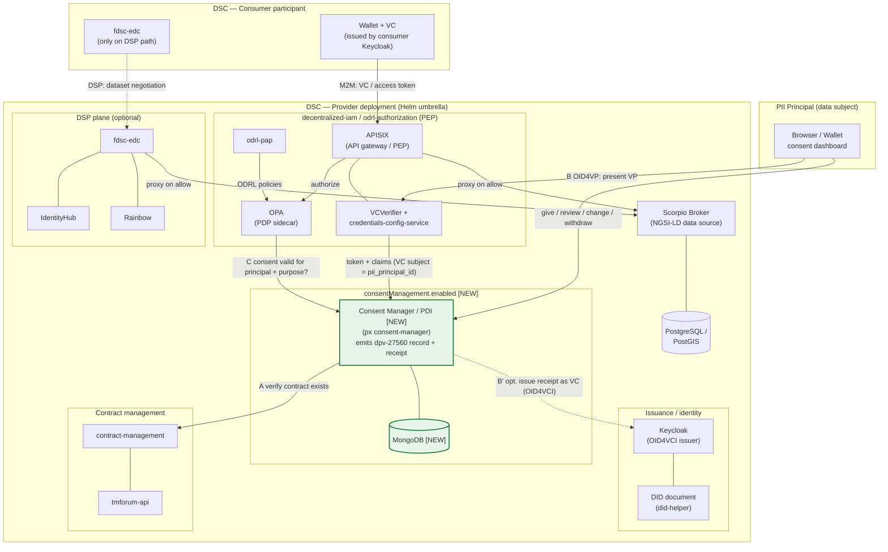
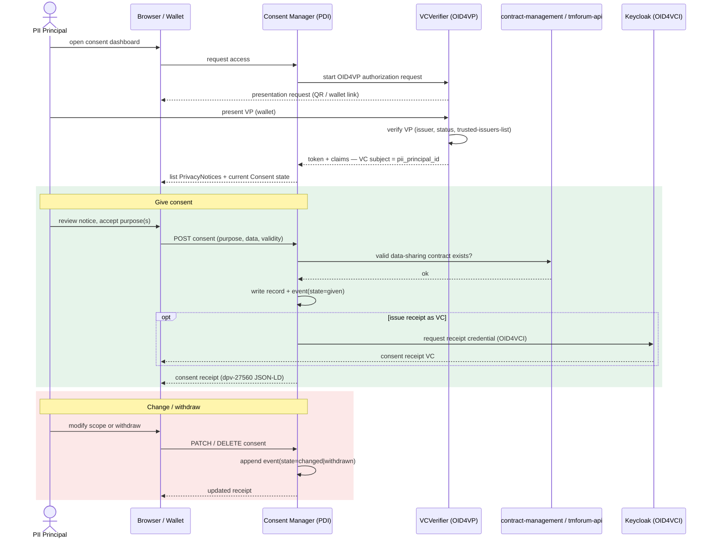
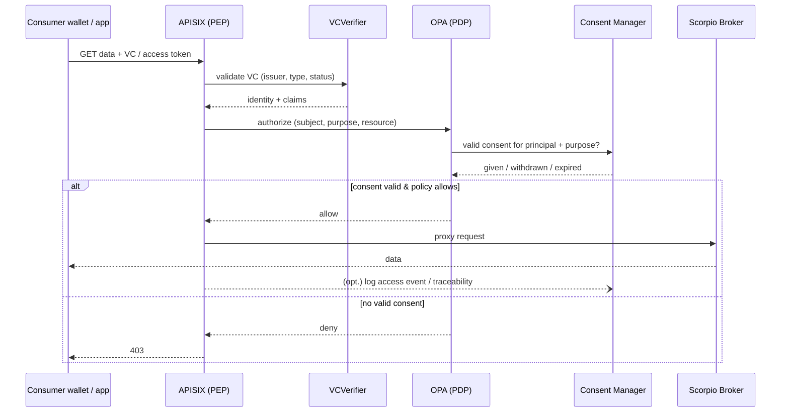
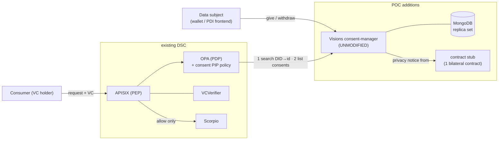

# Consent Management Plan — ISO/IEC TS 27560:2023 via Prometheus-X

> **Status:** First overview / feasibility scoping. This document maps the
> features required by **ISO/IEC TS 27560:2023** ("Privacy technologies —
> Consent record information structure") onto **Prometheus-X** building blocks
> and sketches how they could be integrated into the FIWARE Data Space
> Connector (DSC). It is deliberately a *plan*, not an implementation — every
> "gap" and "open question" below is something to verify before committing to a
> design.

## 1. Motivation and Goal

The FIWARE DSC today covers **identity/trust** (decentralized-iam, Verifiable
Credentials), **contract management** (TMForum APIs), and **data/service
exchange** (DSP: EDC IdentityHub / fdsc-edc / Rainbow). What it does *not* have
is a **person-centric consent layer**: a way for a data subject (PII principal)
to grant, review, change and withdraw consent for the processing of their
personal data, and to produce a portable, machine-readable, auditable **record
of that consent** that can be exchanged between participants.

> Note: the only "consent" in the chart today is the **Keycloak OIDC consent
> screen** (`consentRequired`, `consent.screen.text` in `values.yaml`). That is
> login-time authorization UX, *not* an ISO 27560 consent record. This plan
> introduces a genuinely new capability.

**Goal:** add ISO/IEC TS 27560:2023-conformant consent management to the DSC,
reusing Prometheus-X's **Consent Manager (Personal Data Intermediary, PDI)** and
associated building blocks rather than building a consent service from scratch.

## 2. What ISO/IEC TS 27560:2023 Requires

ISO/IEC TS 27560:2023 specifies an **interoperable, extensible information
structure for recording a PII principal's consent**. It is the machine-readable
counterpart to **ISO/IEC 29184** (how a privacy notice requests consent) and
uses the terminology of **ISO/IEC 29100** (PII principal / controller /
processor). It generalizes the older **Kantara Consent Receipt (2018)** by
splitting the internal *record* from the communicated *receipt* and making the
structure schema-extensible.

> **Source caveat:** the normative TS text is paywalled. The feature set below is
> reconstructed from the peer-reviewed implementation paper (Pandit et al., APF
> 2024, arXiv:2405.04528) and the **W3C DPV `dpv-27560`** profiles, which are the
> authoritative *free* implementations. A few mandatory-field details differ
> between these sources and are flagged as open questions in §6.

### 2.1 Core feature areas (the "what we must support")

| # | Feature area | What the standard requires |
|---|---|---|
| F1 | **Record / Receipt split** | Maintain a comprehensive internal **consent record**; be able to emit a **consent receipt** (a communicable subset). A receipt minimally needs `receipt_id` + `schema_version`. Either party may issue a receipt. |
| F2 | **Record header / metadata** | `schema_version`, unique `record_id`, `pii_principal_id`, and a creation timestamp — the identity and versioning of the record. |
| F3 | **Processing description** | Per processing activity: **purpose** (mandatory), **PII controller(s)** (mandatory), **retention/storage condition** (mandatory), **privacy-notice reference** (mandatory), plus optional PII categories, recipients/third parties, collection method, processing method/locations, geographic restrictions, jurisdiction, lawful basis, service, privacy rights, codes of conduct, impact assessment. |
| F4 | **Party / entity sub-structure** | Reusable entity block (name, contact/address, id, role: controller / processor / third-party recipient / authority). Enables representing controller→processor delegation and onward sharing in one record. |
| F5 | **Personal-data (PII) sub-structure** | PII type/category, attribute id, optional-vs-required flag, sensitive / special-category flags. |
| F6 | **Consent lifecycle events** | Append-only **event log**: `event_time`, `event_type` (expressed / explicit / implied…), `event_state` (given, refused, changed, withdrawn, expired, terminated…), validity duration, expressing entity. Lifecycle is modelled as **events**, not by mutating one record. |
| F7 | **Withdrawal & change** | A `withdrawal_method` on the processing plus withdrawal/change events; consent must be revocable and modifiable at any time. |
| F8 | **Expiry** | Driven by `validity_duration`; expired consent must stop being a lawful basis. |
| F9 | **Interoperable serialization** | Machine-readable, schema-versioned records (**JSON-LD** + DPV `dpv-27560` profiles: `record`, `record-eu-gdpr`, `receipt`, `receipt-eu-gdpr`). This is what makes records exchangeable across participants. |
| F10 | **Exchange between systems** | Receipts are the exchange vehicle; records are multi-entity so consent state is portable between controllers/processors across a data space. |
| F11 | **Profiles / extensibility** | Support domain-specific profiles (e.g. an EU-GDPR profile adds mandatory fields; a data-space profile can add fields) without breaking 27560 conformance. |
| F12 | **Notification** *(inferred)* | The lifecycle-management objective implies notifying principals/stakeholders of changes/expiry. No dedicated field was verifiable — treat as an application-level obligation. |

### 2.2 Record vs. Receipt (the central concept)

- **Consent Record** — the controller/intermediary's internal, comprehensive
  documentation of the processing *and* of every consent interaction. Used to
  prove validity and decide whether processing may continue.
- **Consent Receipt** — an authoritative artifact that *communicates* the
  existence of, or information from, a record. Minimal mandatory content is just
  `receipt_id` + `schema_version`; any record-mandatory field stays mandatory
  *if included*.

Designing these as two views over one schema (F1) is the backbone of the whole
integration.

## 3. Prometheus-X Building Blocks That Can Help

Prometheus-X builds GAIA-X / IDSA / DSSC-aligned "data space building blocks."
Its defining principle — **separation of powers**: the **Personal Data
Intermediary (PDI)** manages *consent* but never stores the personal data or runs
services on it; data flows peer-to-peer between participants' connectors — maps
cleanly onto the DSC's existing split between IAM, contracts, and data planes.

### 3.1 Relevant components

| Prometheus-X component | Role | Tech / License | Repo |
|---|---|---|---|
| **Consent Manager (PDI)** | Person-centric consent lifecycle (give / review / modify / revoke) + **per-transaction consent verification**. Data model: `PrivacyNotice`, `Consent`, `User`, `UserIdentifier`, `Participant`. JSON-LD + ODRL. Ships **Helm + Terraform**. | Node.js/TS, MongoDB, MIT | `Prometheus-X-association/consent-manager` |
| **Dataspace Connector (PDC)** | Executes consent-driven data exchange; mints/relays access tokens; carries consent by id on the wire (`x-ptx-consent-id`, `consentId`). | Node.js/TS, MongoDB, MIT | `Prometheus-X-association/dataspace-connector` |
| **Contract Manager** | Data-sharing agreements (ODRL policy verify, contract generation, signatures). A PX consent is **derived from a contract**. | Node.js/TS, MongoDB, MIT | `Prometheus-X-association/contract-manager` |
| **Catalog (API + Registry)** | Participant / offering / dataset registration & discovery; supplies endpoint + reference-model metadata for exchanges. | Node.js/TS, MongoDB, MIT | `Prometheus-X-association/catalog-api`, `.../catalog-registry` |
| **Consent/Contract Negotiating Agent** | Auto-matches individual preferences to service T&Cs (reduces consent fatigue); explicitly uses **Kantara consent receipts** + ODRL. Least mature (not yet developed at doc time). | Node.js/TS, MIT | `Prometheus-X-association/contract-consent-agent` |
| **Traceability / Monitoring** | Storage/certification of consent + contract data; compliance oversight. | — | Prometheus-X org |

### 3.2 The PDI is the natural ISO 27560 anchor

The Consent Manager already:

- **separates `PrivacyNotice` (the notice, ISO 29184) from `Consent` (the
  record)** — mirroring F1/F3;
- carries **user identity across providers** (`User` / `UserIdentifier`) —
  mirroring F2's `pii_principal_id`;
- exposes config params that echo 27560 field names: `PRIVACY_RIGHTS`,
  `WITHDRAWAL_METHOD`, `CODE_OF_CONDUCT`, `IMPACT_ASSESSMENT`;
- exposes API operations for **give / modify consent**, **verify validity**,
  **notify stakeholders of changes**, and **preference management** — mirroring
  F6/F7/F12;
- serializes in **JSON-LD** — mirroring F9.

### 3.3 Consent-driven exchange flow (from the PDC `DATA_EXCHANGE.md`)

1. Individual → PDI: grants consent for a specific sharing.
2. PDI → Contract service: verify a valid data-sharing contract exists.
3. PDI → Provider connector: notify + pass consent.
4. Provider connector → PDI: mint access token, return it.
5. PDI → Consumer connector: send consent + provider endpoint.
6. Consumer → Provider connector: data request carrying consent.
7. Provider → Contract service: re-verify contract, fetch ODRL policies.
8–10. Provider fetches data, POSTs to consumer, consumer app ingests.

This is the sequence the DSC would hook into — with **FIWARE's** contract and
identity components substituted where appropriate (§5).

## 4. Requirement → Component Mapping

| ISO 27560 feature | Covered by | Confidence |
|---|---|---|
| F1 Record/receipt split | PDI `PrivacyNotice` + `Consent` models | Medium — verify serialization is 27560-shaped |
| F2 Header/metadata | PDI `Consent` + `User`/`UserIdentifier` | Medium |
| F3 Processing description | PDI consent-config params (`PRIVACY_RIGHTS`, `WITHDRAWAL_METHOD`, `IMPACT_ASSESSMENT`, `CODE_OF_CONDUCT`) + ODRL | Medium — field completeness unverified |
| F4 Party sub-structure | PDI `Participant` | Medium |
| F5 PII sub-structure | PDI data model (unconfirmed granularity) | **Low — verify** |
| F6 Lifecycle events | PDI give/modify/verify + notify APIs | Medium |
| F7 Withdrawal/change | PDI `WITHDRAWAL_METHOD` + modify/revoke API | Medium |
| F8 Expiry | Validity duration in consent | **Low — verify** |
| F9 JSON-LD serialization | PDI JSON-LD output | Medium |
| F10 Exchange between systems | PDI ↔ PDC consent-by-id; contract re-verify | High (mechanism exists) |
| F11 Profiles / extensibility | DPV `dpv-27560` profiles (external) + PDI schema | **Low — likely custom work** |
| F12 Notification | PDI "notify stakeholders" API | Medium |

**Headline finding:** Prometheus-X provides a strong *architectural* fit and the
right *anchor component* (the PDI). What is **not yet verified** is whether the
shipped `Consent` / `PrivacyNotice` schema actually **serializes as an ISO 27560
record/receipt** (with DPV `dpv-27560` field names). The PX docs claim "Kantara +
ISO + JSON-LD" alignment as *design intent*, and PX/Visions people are directly
involved in 27560 research — but the shipping consent-manager README does **not**
confirm 27560 field coverage. **Bridging that schema gap is the core technical
risk of this plan.**

## 5. Integration Approach for the FIWARE DSC

The DSC is a Helm umbrella chart; every component is a subchart with an
`<component>.enabled` toggle. Prometheus-X services are all **Node.js/TS +
MongoDB + MIT**, and the consent-manager already ships a Helm chart — so
packaging fit is easy. Two strategic options:

**Option A — Adopt the PX Consent Manager as a subchart (recommended first
step).** Add `consent-manager` (and its Mongo) as an optional subchart gated by
`consentManagement.enabled`, wired to the existing DSC ingress/observability/pod-
security conventions. Reuse the PDI as the PDI. Main friction: the PX consent is
**derived from a PX Contract Manager contract**, whereas the DSC uses **TMForum**
contract management — so we must either (a) also run the PX Contract Manager, or
(b) adapt the PDI's contract dependency to the DSC's TMForum/DSP contracts. Also
reconcile identity: the DSC is VC/OID4VCI-centric (Keycloak + decentralized-iam),
while the PDI uses its own `User`/`UserIdentifier` — the `pii_principal_id`
should map to the DSC's VC subject / DID.

**Option B — Build a thin 27560 consent service against DSC-native components.**
Use the DPV `dpv-27560` profiles as the schema and implement record/receipt
storage + lifecycle directly against TMForum contracts and decentralized-iam,
borrowing PX's API shape but not its code. More control, more work; only worth it
if Option A's schema/contract gaps prove too large.

**Recommendation:** start with **Option A** as a spike to validate the PDI's real
schema against §2, then decide. Regardless of option, the deliverable schema
should be the **DPV `dpv-27560` JSON-LD profiles** so records are interoperable
beyond Prometheus-X.

### 5.1 DSC-specific integration points

- **Contracts:** bridge PDI ↔ TMForum contract management (the "valid contract
  exists" check in flow step 2).
- **Authentication (OID4VP):** the PDI does **not** resolve the user against an
  identity store — the identity is carried in the credential. The Consent Manager
  integrates with **VCVerifier** as a relying party: the person's wallet presents
  a Verifiable Presentation (OID4VP), VCVerifier validates it (issuer, status,
  `trusted-issuers-list`) and returns a token + verified claims. **`pii_principal_id`
  is the VC subject / holder DID** from that presentation. This is the same
  OID4VP verifier the M2M service path already uses — the Consent Manager just
  becomes another relying party of it.
- **Receipt issuance (OID4VCI):** Keycloak's role is issuance only. Optionally
  issue the consent **receipt** itself as a Verifiable Credential via Keycloak's
  OID4VCI issuer — a strong tamper-evidence story native to decentralized-iam
  that avoids PX's unverified "blockchain" option.
- **Data plane:** relate consent verification to the DSP (EDC/Rainbow) exchange
  and policy enforcement, not only to PX's PDC.
- **Chart conventions:** `<component>.enabled` gate, strict pod security
  (runAsNonRoot, readOnlyRootFilesystem, drop ALL caps), `# --` helm-docs
  comments on every new value, OTEL tracing wiring like other subcharts.

### 5.2 Where consent plugs into the DSC — the concrete components

Before the diagram, the important architectural fact: the DSC has **two
different data-access styles**, and consent enforcement attaches differently to
each.

1. **FIWARE M2M service access (primary).** The consumer presents a Verifiable
   Credential (issued by *its own* Keycloak/OID4VCI) directly to the provider's
   **APISIX** API-gateway. APISIX calls **VCVerifier** (via
   `credentials-config-service` + `trusted-issuers-list`) to validate the VC,
   then **OPA** — configured by **odrl-pap** — makes the authorization decision,
   and APISIX proxies the call to the data service, **Scorpio Broker** (NGSI-LD),
   backed by **PostgreSQL/PostGIS**. There is **no separate "consumer connector"
   service** on this path — the consumer is a wallet + HTTP client. This whole PEP
   stack (APISIX + OPA + odrl-pap + VCVerifier) is the `decentralized-iam` /
   `odrl-authorization` subchart.
2. **Dataspace-Protocol (DSP) interop (optional).** *Only here* does an "EDC
   connector" exist: it is **`fdsc-edc`** (SEAMWARE's Eclipse Dataspace
   Components), paired with **IdentityHub** and **Rainbow** for DSP dataset
   negotiation/transfer. A remote consumer runs its own `fdsc-edc` as the
   counterpart.

**So the natural consent-enforcement point is the PDP: `OPA` queries the Consent
Manager as an extra decision input**, at exactly the place it already evaluates
ODRL policy. That keeps consent orthogonal to *how* the data is accessed (M2M or
DSP) — both paths route their authorization through OPA.

New components introduced by this plan are marked **`[NEW]`**; everything else
already exists in the DSC umbrella chart (subchart/image names in parentheses).

**Net-new bridges** (the labelled arrows touching the `[NEW]` box):

- **A. PDI → contract-management/tmforum-api** — replaces the PX Consent
  Manager's built-in dependency on the *PX* Contract Manager with the DSC's own
  TMForum contract stack. Main adaptation effort in Option A.
- **B. PDI ↔ VCVerifier (OID4VP)** — the PDI authenticates the person as a
  relying party of the existing OID4VP verifier; the presented VP *is* the
  identity, so `pii_principal_id` = VC subject / holder DID (no identity-store
  lookup). Replacing the PX Consent Manager's own `User`/`UserIdentifier` login
  with OID4VP is the identity-integration effort. **B'** optionally issues the
  consent receipt as a VC via Keycloak's OID4VCI issuer (tamper-evidence via
  decentralized-iam instead of PX's unverified "blockchain").
- **C. OPA → PDI** — the enforcement hook: OPA queries the Consent Manager for a
  valid-consent decision alongside its ODRL evaluation. This is what makes
  *both* the M2M (APISIX→Scorpio) and DSP (fdsc-edc→Scorpio) paths consent-gated
  without touching either data path directly.

### 5.3 User interaction points

Two distinct user-facing moments: a **consent-management** interaction (the
person manages consent directly with the PDI) and a **consent-gated access**
(their stored consent is verified when a consumer actually requests the data).
ISO 27560 lifecycle events (given / changed / withdrawn / expired) are recorded
on the first; the second verifies those events at the PEP on every request.

**A. Managing consent (give / review / change / withdraw)**

**B. Consent-gated data access — FIWARE M2M path (consent already given)**

> On the **optional DSP path**, the consumer's `fdsc-edc` negotiates a dataset
> with the provider's `fdsc-edc`/Rainbow instead of calling APISIX directly, but
> the authorization still routes through **OPA → Consent Manager** — so the
> consent check (step `OPA→PDI` above) is identical; only the transport differs.

Key UX principle (Prometheus-X *separation of powers*): the **PDI is the single
place the person interacts with** to see and control consent across providers,
while **data never flows through the PDI** — it moves over the existing DSC data
path (APISIX→Scorpio, or fdsc-edc/Rainbow), gated by the consent OPA verifies.

## 6. Open Questions / To Verify Before Design

1. ~~**Does the PX `Consent` / `PrivacyNotice` schema serialize as ISO 27560?**~~
   **RESOLVED by the Phase 0 spike (§7): No — it targets Kantara Consent Receipt
   v1.1, not ISO 27560 / DPV. But the stored data model is a rich 27560-aligned
   superset, so a dpv-27560 emit layer is a tractable addition.** See §7 for
   evidence and the field mapping.
2. **Mandatory-field conflicts in the TS itself** (flagged by the research): the
   free sources disagree on which *processing* and *party* fields are mandatory
   in base 27560 vs. the EU-GDPR profile, and on whether a header creation
   timestamp is a distinct field. Resolve against the actual TS text (procure the
   standard) before freezing a schema.
3. **Expiry & PII-granularity (F5/F8):** confirmed only weakly in PX — verify.
4. **Contract coupling:** run PX Contract Manager alongside, or adapt PDI to
   TMForum? Sizing this drives Option A vs. B.
5. **OID4VP authentication (identity, bridge B):** can the PX Consent Manager's
   login be replaced by acting as a relying party of **VCVerifier** (OID4VP),
   with `pii_principal_id` bound to the VC subject / holder DID? The PDI ships its
   own `User`/`UserIdentifier` login — confirm how invasive swapping it for
   OID4VP is, and that the presented VP carries a stable subject identifier.
   - **Pairwise / rotating DID risk:** OID4VP holders may present a *pairwise* or
     per-session DID (a different subject identifier per relying party or per
     presentation, for unlinkability). If so, the VC subject is **not** a durable
     anchor for a long-lived consent record, and consent given in one session
     could not be correlated to the same principal later. Decide on a stable
     anchor — e.g. a specific credential claim used as `pii_principal_id`, a
     dedicated identifier credential, or an account binding at first login — and
     confirm what subject identifier the DSC's wallets actually present.
6. **Consent enforcement hook (bridge C):** how does **OPA** obtain the consent
   decision — a Rego `http.send` to the PDI, or APISIX enriching the OPA input
   with a consent lookup? Verify against the current `odrl-authorization` wiring
   and confirm the same hook covers the DSP (`fdsc-edc`) path.
7. **Receipt-as-VC:** should receipts be issued through decentralized-iam as VCs
   (via Keycloak OID4VCI) for tamper evidence (instead of PX's unverified
   blockchain feature)?
8. **Maturity:** the PDI README self-describes as "a work in progress"; the
   Consent Agent was not yet developed. Confirm current state before depending on
   either.

## 7. Phase 0 Spike — Findings (2026-08-03)

Source inspected: `github.com/Prometheus-X-association/consent-manager` @ `main`
(shallow clone) — `src/models/`, `src/libs/`, `src/utils/{contracts,consentReceipt,consentEvent}.ts`,
`src/controllers/consentsController.ts` (1973 lines), `src/routes/`.

### 7.1 Verdict

**Qualified GO for Option A.** The PDI already implements a **27560-*structured*
consent record/receipt** (record header / processing / events / parties) and the
full give→verify→withdraw→re-confirm→terminate lifecycle over a documented REST
API. What is missing is the **DPV `dpv-27560` JSON-LD serialization** (the shipped
receipt is plain camelCase JSON, no `@context`/`dct:conformsTo`/`dpv:` terms) and
DSC-native wiring. So "adopt" = **reuse the model + lifecycle + API + the existing
`consentToConsentReceipt` mapper**, then (a) reshape that mapper's output into
dpv-27560 JSON-LD, and (b) add the TMForum / OID4VP / PEP bridges from §5. The
27560 layer is a **reshape of an existing mapper**, not a greenfield build —
lower effort than the initial read suggested.

**But the deep dive relocated the real cost.** The 27560 serialization is the
*easy* part; the bulk of Option-A effort is two DSC-native bridges the deep dive
exposed: (1) a **contract adapter** presenting the PDI's 3-endpoint ODRL contract
API over TMForum (§7.8), and (2) **replacing email-keyed user reconciliation with
a DID join key** under OID4VP (§7.7). If those two prove larger than expected,
Option B (a thin DSC-native 27560 service) becomes competitive again — so treat
Phase 2 as the real go/no-go gate, not this spike.

### 7.2 What the code actually does (evidence)

- **A wired-in, 27560-*structured* receipt exists** — `utils/consentReceipt.ts`
  `consentToConsentReceipt()` is called from every lifecycle endpoint (give,
  revoke, trigger, get). It emits `{ record: {schemaVersion, recordId,
  piiPrincipalId}, piiProcessing: {privacyNotice, purposes[…]}, event,
  partyIdentification[] }` — the ISO 27560 information-structure groupings — with
  `lawfulBasis: "consent"` and the `WITHDRAWAL_METHOD` / `PRIVACY_RIGHTS` /
  `CODE_OF_CONDUCT` / `IMPACT_ASSESSMENT` / `AUTHORITY_PARTY` env params filled
  in. **This, not the Kantara generator, is the real receipt path.**
- **…but it is not DPV JSON-LD.** No `@context`, no `dct:conformsTo`, no `dpv:`
  vocabulary — plain camelCase keys loosely following the *paper's* field
  groupings, not the machine-readable DPV `dpv-27560` profile. Interop across
  data spaces (F9/F10) needs this reshaped to JSON-LD + `dct:conformsTo:
  dpv-27560#record`.
- **The Kantara path is dead code.** `libs/consent-generator/ConsentGenerator.ts`
  (`version: "KI-CR-v1.1.0"`) is exported but **never imported** by any
  controller/route; a parallel hand-built Kantara object in `utils/contracts.ts`
  carries a literal typo (`"KI-CR-v1.1.O"`) and `// Unsure` TODOs; the model's
  `toReceipt()` reads an **undefined** `this.json`. Ignore all of this — the live
  path is `consentToConsentReceipt`.
- **Weak spots in the current receipt mapper** (things the reshape must fix):
  `piiPrincipalId = consent.user.toString()` is a **Mongo ObjectId, not a
  DID/VC subject** (ties to bridge B); `piiControllers` lists *both* provider and
  consumer self-description URLs (controller vs processor/recipient not
  distinguished — F4); `language` is hard-coded `"en"`.
- **The Mongoose `Consent` model is a rich 27560-aligned superset** —
  it already stores `schema_version`, an `event[]` lifecycle log, purposes with
  `piiInformation` (incl. sensitive/special category), `withdrawalMethod`,
  `retentionPeriod`, `jurisdiction`, `recipientThirdParties`,
  `processing/storageLocations`, `piiPrincipalRights`. The raw data for a
  dpv-27560 record largely exists; only the serialization is missing.
- **`PrivacyNotice` model** maps well to the ISO 29184 notice (controllerDetails
  + DPO, purposes, categoriesOfData, retention, withdrawal, international
  transfers, automated decision-making) — a good source for the record's notice
  reference.
- **Consent is derived from an ODRL contract** (the simulated contract uses
  `@context: http://www.w3.org/ns/odrl.jsonld`), confirming §6.4: the PDI expects
  a contract source, which for the DSC must become TMForum/contract-management.

### 7.3 Field mapping — PX `Consent` model → DPV `dpv-27560`

Legend: ✅ present & usable · ⚠️ present but needs transform/verification · ➕ to add.

| ISO 27560 / DPV concept | PX `Consent` field | Status |
|---|---|---|
| `dct:identifier` (record id) | `identifier` | ✅ |
| `dct:conformsTo` (schema/profile) | `schema_version` (`"0.2.0"`, PX-custom) | ➕ set to `dpv-27560#record` |
| `dpv:hasDataSubject` (`pii_principal_id`) | `user` / `providerUserIdentifier` | ⚠️ map to VC subject/DID (bridge B, §6.5) |
| `dpv:hasProcess` → purpose | `purposes[].purpose`, `purposeType` | ✅ |
| PII categories | `purposes[].piiInformation[]` (type, attribute, sensitive, special) | ✅ |
| collection / processing method | `purposes[].collectionMethod`, `processingMethod` | ✅ |
| storage / retention condition | `retentionPeriod`, `storageLocations`, `processingLocations` | ✅ |
| recipients / third parties | `recipients`, `recipientThirdParties` | ✅ |
| controller / processor (party) | `dataProvider`, `dataConsumer` (`Participant`) | ⚠️ expand to full party sub-structure (name/contact/role) |
| privacy-notice reference | `privacyNotice` + `PrivacyNotice` model | ✅ |
| `withdrawal_method` | `withdrawalMethod` | ✅ |
| jurisdiction / geo | `jurisdiction`, `geographicRestrictions` | ✅ |
| privacy rights | `piiPrincipalRights` | ✅ |
| consent status | `status` (pending/granted/revoked/expired/terminated/refused) | ✅ maps to DPV ConsentStatus |
| lifecycle events | `event[]` (eventTime, eventType, eventState, validityDuration) | ⚠️ maps to DPV event model — but see defects (§7.6) |
| lawful basis | receipt mapper hard-codes `"consent"` | ✅ |
| codes of conduct / impact assessment / privacy rights / withdrawal method / authority | `CODE_OF_CONDUCT` / `IMPACT_ASSESSMENT` / `PRIVACY_RIGHTS` / `WITHDRAWAL_METHOD` / `AUTHORITY_PARTY` env params | ✅ (deployment-level config) |

**Conclusion:** the great majority of the 27560 record is already produced by
`consentToConsentReceipt()`; the outstanding work is a **JSON-LD reshape**
(camelCase → DPV `dpv-27560` terms + `@context`/`dct:conformsTo`), the
`piiPrincipalId` → DID fix, and the controller-vs-processor party split — not a
rewrite. This confirms the §7.1 verdict.

### 7.4 API surface (for Phase 2/4 integration)

The consent lifecycle is a documented REST API under `/consents` (Swagger at
`/docs`). Three auth schemes gate it: `verifyUserJWT` (end-user session — the
login to be replaced by **OID4VP**, §6.5), `verifyParticipantJWT` (a connector),
and `verifyUserKey`.

| Purpose | Endpoint | Auth | 27560 lifecycle |
|---|---|---|---|
| List privacy notices for a contract | `GET /consents/:userId/:providerURI/:consumerURI/:contractURI` | user | notice presented |
| Give consent | `POST /consents/` · `POST /consents/user` | user | **given** |
| Refuse | `POST /consents/:id/refuse` | user | **refused** |
| Revoke / withdraw | `DELETE /consents/:id` | user | **withdrawn** |
| Re-confirm | `POST /consents/:id/re-confirm` | user | **re-affirmed** |
| Terminate | `POST /consents/:id/terminate` | user | **terminated** |
| List a user's consents (as receipts) | `GET /consents/me` | user | — |
| Trigger data exchange | `POST /consents/:consentId/data-exchange` | user | (exchange) |
| Provider attaches access token | `POST /consents/:consentId/token` | participant | (exchange) |
| Validate token | `POST /consents/:consentId/validate` | participant | (verify) |
| Consent UI hand-off | `GET /consents/pdi/iframe` → `PDI_ENDPOINT` | participant | — |

Notes: the user-facing consent **UI is external** — `/pdi/iframe` just redirects
to a separate `PDI_ENDPOINT` web app (the connector embeds it as an iframe); the
consent manager itself only renders a minimal server-side OAuth consent page. The
**Consent Agent** (`contract-agent` npm package) is mounted as extra routes — the
negotiating-agent dependency, out of scope for a first integration.

### 7.5 Data-exchange model — coupled to PX connector endpoints

This is the biggest DSC-integration finding. The PDI does **not** talk to a PEP or
an EDC; it drives exchange by calling **bespoke HTTP endpoints on the
`Participant`** record: `endpoints.{consentExport, consentImport, dataExport,
dataImport}`. The flow (`triggerDataExchangeByConsentId` → `attachTokenToConsent`):

1. `POST …/data-exchange` checks `status === "granted"`, AES-encrypts + RSA-signs
   the whole consent (`encryptPayloadAndKey`), and POSTs it to the **provider's**
   `endpoints.consentExport`.
2. The provider connector mints a token and calls `POST …/:id/token`; the PDI
   stores it and forwards the signed consent to the **consumer's**
   `endpoints.consentImport` (with `dataProviderEndpoint = endpoints.dataExport`).
3. `POST …/:id/validate` verifies a consent token by **plain string equality**
   (`token === consent.token`) — no JWT/crypto verification.

**Implication for the DSC:** this push-to-connector-endpoints model is *not* how
the FIWARE M2M (APISIX→Scorpio) or DSP (EDC/Rainbow) paths work. Two choices for
Phase 4:
- **(i) Adapter shim** — implement `consentExport` / `consentImport` /
  `dataExport` endpoints in front of the DSC data plane so the PDI's existing
  flow works unmodified; or
- **(ii) Verify-only** — ignore PX's exchange orchestration and use the PDI purely
  as the record/verify authority, with **OPA → PDI** (bridge C) querying a
  *new* "is consent valid for principal+purpose+contract?" check (the model's
  `isValid()` = `status===granted && consented`) rather than the token-equality
  `validate`. **(ii) fits the DSC's existing enforcement far better.**

### 7.6 Concrete defects to account for

- **Expiry is not implemented (F8).** `event.validityDuration` is hard-coded
  `"0"` everywhere and no TTL is computed; `status: "expired"` exists in the enum
  but nothing transitions to it. Expiry must be built.
- **Event timestamps are static.** `consentEvent` is a module-level object literal
  with `eventTime: new Date().toISOString()` evaluated **once at import** — every
  event of a given type shares the process's load time, not the actual event
  time. Needs to become per-event.
- **`eventState` values are prose** (`"consent given"`, `"consent revoked"`…),
  not a controlled DPV `ConsentStatus` taxonomy — part of the JSON-LD reshape.
- **`validate` is token-equality**, not cryptographic (§7.5.3).

These are all in the **reshape/verify layer we already plan to own**, so they
don't change the verdict — but they scope Phase 3/4 realistically.

### 7.7 Identity model — email-keyed, not DID-based (impacts bridge B)

This is the most consequential Phase 2 finding, and it makes the OID4VP swap
bigger than "replace an auth middleware":

- **`User`** = a classic account: `firstName`, `lastName`, `email`, bcrypt
  `password`, `oauth.scopes/refreshToken`, and `identifiers[]` → `UserIdentifier`.
- **`UserIdentifier`** = a *per-participant* identity (`attachedParticipant`,
  `email`, `identifier`, `url`, `user`). A person has one identifier per
  participant (provider-side, consumer-side).
- **Cross-participant correlation is done by EMAIL.** `user-reconcilation` is
  literally `User.findOne({ email })`; `giveConsent` finds the consumer-side
  identifier via `{ attachedParticipant, email: providerUserIdentifier.email }`,
  and falls back to an **email-validation flow** (`giveConsentOnEmailValidation`,
  `emailReattached`, Mandrill/nodemailer) when emails don't line up. This is why
  the email stack is core, not optional.

**Implication:** binding `pii_principal_id` to a **VC subject / DID** (bridge B,
§6.5) means replacing the email join key that links a person's provider-side and
consumer-side identifiers. Either the same holder DID must be presented on both
sides (and stored on `UserIdentifier.identifier`, which already exists but is
unused as a join key), or a DID→account binding is established at first OID4VP
login. **This is a data-model change to user reconciliation, not just an auth
swap** — size it explicitly in Phase 2. (The user is handling the subject-
identifier question per §6.5; this note records why it matters here.)

### 7.8 Contract-service integration — a specific 3-endpoint API

`utils/contracts.ts` couples the PDI to a contract service via
`CONTRACT_SERVICE_BASE_URL` with exactly three call shapes:

| Call | Purpose |
|---|---|
| `GET /bilaterals/for/:participantId?hasSigned=true` | signed bilateral contracts |
| `GET /contracts/for/:participantId?hasSigned=true` | signed ecosystem contracts |
| `GET /verify/:dataProviderId/:dataConsumerId` | assert a contract exists between two parties |

Returned objects are PX `BilateralContract` / `EcosystemContract` shapes carrying
**ODRL** policies, purposes, and service-offering URLs. Crucially, **privacy
notices are *derived* from these signed contracts** (`getPrivacyNoticesFromContractsBetweenParties`,
`buildConsentsFromContracts`) — the PDI reads contracts and synthesizes the
notice + a `pending` consent from them.

**Implication for Phase 2:** "repoint to TMForum" understates it — the DSC needs
a small **adapter service exposing these three endpoints (and the ODRL contract
shape) backed by TMForum/contract-management data**, or a fork of `contracts.ts`
that speaks TMForum natively. This is the single largest Option-A integration
component and should be its own work item.

### 7.9 Packaging reality (impacts Phase 1)

The repo ships a Helm chart (`Chart.yaml` `0.1.0`, `templates/{deployment,
service,namespace,secret}.yaml`), `docker-compose.yml`, Dockerfiles, and a
`terraform/` dir — but it is **not DSC-ready**:

- **No published image** — `image.repository: consent-manager`, `tag: latest`,
  no registry. An image must be built and published (e.g. to quay/seamware)
  before the umbrella can consume it.
- **No pod security context** — the deployment sets none; the DSC requires
  `runAsNonRoot`, `readOnlyRootFilesystem`, drop-ALL capabilities. `service.type`
  is `LoadBalancer` and secrets (`JWT_SECRET_KEY`, `OAUTH_SECRET_KEY`,
  `SESSION_SECRET`) are plaintext in `values.yaml`.
- **Given that immaturity**, the cleaner path is likely to **template the
  consent-manager deployment in-chart** (as the DSC already does for
  `identityhub`/`rainbow`) rather than depend on the upstream chart — reusing the
  DSC's security-context, OTEL and `# --`-documented-values conventions.
- **Positives:** `jsonld@^8.2.0` is already a dependency (usable for the
  dpv-27560 reshape), and MongoDB is a plain external `MONGO_URI` (fits the DSC's
  existing Mongo patterns). **Caveat:** `contract-agent` is pulled from a
  `gitpkg.now.sh` URL, not a registry — a build/supply-chain dependency to pin or
  vendor.

### 7.10 Authentication model — must be replaced wholesale (security)

`middleware/auth.ts` has three schemes, and they are too weak to expose in the
DSC — reinforcing that Phase 2 **replaces** auth rather than adapting it:

- **`verifyUserKey` / `x-user-key`** — the "credential" is a **`UserIdentifier`
  Mongo `_id`**: possession of a database ObjectId authenticates the user. No
  secret, no signature. This gates `POST /consents/` and privacy-notice reads. An
  insecure-direct-object-reference by design.
- **`verifyParticipantJWT`** — base64-decodes the JWT payload **before verifying
  it** to choose a verification branch, and accepts the bearer token from a
  **URL query param** (`?participant=…`). The non-serviceKey branch trusts a
  single shared `JWT_SECRET_KEY`.
- **`verifyUserJWT`** — session, or the same `x-user-key` ObjectId scheme, or an
  `OAUTH_SECRET_KEY`-signed JWT; it also **mutates `User.identifiers` as a side
  effect** during auth (email-based auto-linking).

**Implication:** front the PDI so none of these are externally reachable, and
replace the user path with **OID4VP via VCVerifier** and the participant path with
the DSC's existing service auth. This is a security prerequisite, not just an
integration nicety — and another argument for templating our own deployment and
not exposing the upstream service directly (§7.9).

### 7.11 The "EDC" data-exchange path is a stub (confirms verify-only)

There are **two** parallel exchange paths, and the EDC-labelled one is not real:

- `POST /consents/:id/data-exchange` → posts encrypted consent to
  `Participant.endpoints.consentExport` (the PX PDC push model, §7.5) — real-ish.
- `POST /data-exchange/push{,/user}` (`dataExchangeController`) validates the
  contract then calls `sendConsent(consent.jsonData)` under a *"Communicate with
  EDC to trigger data exchange"* comment — but `sendConsent` is literally
  `axios.get("/")`, a **stub**. It also queries `Participant.findOne({ assignerID })`
  on a field the `Participant` model doesn't have, so the lookup is simulated too.

**There is no EDC / DSP integration in the code** — the "EDC" is aspirational.
This is decisive for Phase 4: **do not try to reuse PX's data-exchange
orchestration; go verify-only (OPA → PDI `isValid()`, §7.5)** and drive the actual
transfer through the DSC's own APISIX/EDC paths.

### 7.12 Open questions this resolves / raises

- **Resolves §6.1:** the PDI emits a 27560-*structured* receipt but **not** DPV
  JSON-LD → we own a JSON-LD reshape of the existing `consentToConsentReceipt`.
- **Corroborates §6.4** (ODRL/TMForum contract coupling; `CONTRACT_SERVICE_BASE_URL`
  is the contract dependency to repoint) and refines **§6.3**: PII granularity is
  present, but **expiry is not implemented** (§7.6) — build it.
- **Sharpens §6.6 (enforcement):** PX's own exchange is push-to-connector-endpoints
  with token-equality validation (§7.5). Prefer the **verify-only OPA → PDI**
  integration over reusing PX's data-plane orchestration.
- **Maturity (§6.8):** lifecycle API is real and reasonably complete; the receipt
  serialization, expiry, and token verification are the immature parts — all
  inside the layer we already plan to own.

## 8. Can we use the Prometheus-X consent-manager directly?

Short answer: **not as a drop-in, unmodified component** — but the reasons are
specific and worth separating from a blanket "no". This chapter consolidates the
spike evidence (§7) around that one question so the adopt-vs-build decision can be
made on facts. It deliberately states both what blocks reuse **and** what is
genuinely reusable.

### 8.1 Three different meanings of "use it"

The answer depends on what "use" means:

| Interpretation | Feasible? | Why |
|---|---|---|
| **(a) Deploy the PX service unmodified** in the DSC and rely on it | **No** | Wrong contract source, wrong identity model, insecure auth, no DSC data-plane integration, not-DSC-ready packaging (§8.2). |
| **(b) Adopt/fork it**, keep the core, replace the edges | **Possible** | The data model + lifecycle + receipt mapper are sound; but contracts, auth, identity and exchange must all be replaced — most of the surface (§8.3). |
| **(c) Reuse its *shapes* + frontend natively** (Option B) | **Yes** | Keep the PX data shapes, DPV profiles and the HTTP API/frontend; reimplement the backend on DSC components. |

So "can't use it" is only strictly true for **(a)**. The real decision is between
**(b)** and **(c)** — and most of *this chapter's blockers apply equally to both*,
because both must replace the same edges. That is the key point: **the blockers
are not an argument for (c) over (b); they are the cost either path pays.**

### 8.2 Why it cannot be deployed as-is (hard blockers)

Each of these is a concrete, code-level reason the unmodified service does not fit
the DSC. Severity = impact if shipped as-is.

1. **Contract source mismatch — Blocker (High), but workaround-able — see §10.6.**
   The PDI derives privacy notices
   and consents from a **PX contract service** returning ODRL
   `BilateralContract`/`EcosystemContract` objects, and then **dereferences a
   Gaia-X/PX catalog graph** (serviceOffering → `dataResources`, purpose →
   `softwareResources`). The DSC has neither that service nor that catalog; it
   models contracts as **TMForum** Product Orders/Agreements. Without a contract
   source in the exact expected shape, the core "notice/consent from contract"
   flow does not run (§7.8, §10.1).

2. **Identity model mismatch — Blocker (High), but workaround-able — see §10.7.**
   `User` is an email + bcrypt
   account; cross-participant linkage is **by email** (`user-reconcilation` =
   `User.findOne({email})`), with an email-validation fallback (Mandrill/
   nodemailer). The DSC is DID/VC-centric. `pii_principal_id` is even stored as a
   **Mongo ObjectId**, not a subject/DID. Using it as-is means running a parallel
   email-account directory beside the DSC's VC identity (§7.7).

3. **Insecure authentication — Blocker (Security/High).** `middleware/auth.ts`:
   - `x-user-key` accepts a **`UserIdentifier` Mongo `_id` as the credential** —
     possession of a database id authenticates you; this gates *giving consent*.
   - `verifyParticipantJWT` **base64-decodes the JWT payload before verifying it**
     to choose a branch, and accepts the **bearer token from a URL query param**.
   - `verifyUserJWT` mutates `User.identifiers` as a side effect during auth.
   These are not hardening nits; they are disqualifying for an internet-facing
   consent authority and must be replaced, not adapted (§7.10).
   - **Is there an intended production mitigation?** Checked — **no**. Neither repo
     documents a security topology: the Visions repo has **no `SECURITY.md`**, no
     threat model, no gateway/network-isolation guidance, and its README ships
     `secret123` example secrets while self-describing as "a work in progress".
     The only *implied* model is a trusted server-to-server one: a
     participant-authenticated connector mints a `UserIdentifier` via
     `POST /users/register`, and `/consents/pdi/iframe` hands that id to the
     embedded PDI frontend (`?userIdentifier=…`) to send back as `x-user-key`. Even
     granting that intent it stays weak — the token is an **unrotating, partially
     predictable Mongo ObjectId** used as a bearer credential with **no signature/
     session binding** (a plain IDOR: `findById(key)` then trust). Security
     collapses entirely to an **undocumented "endpoints are network-internal"**
     assumption. A proper OAuth2/JWT path already exists in parallel
     (`/oauth/*`, `OAUTH_SECRET_KEY`), so `x-user-key` looks like a legacy/dev
     shortcut left accepted on the give-consent endpoint.

4. **No real data-plane integration — Blocker (High), but workaround-able via a
   PIP — see §10.8.** Two exchange paths exist;
   the DSC-relevant "EDC" one is a **stub**: `sendConsent()` is literally
   `axios.get("/")`, and it queries a `Participant.assignerID` field that doesn't
   exist. The other path posts encrypted consent to bespoke
   `Participant.endpoints.consentExport/consentImport`, which the DSC's APISIX/EDC
   plane does not expose. Consent verification is **string equality** on a token,
   not cryptographic. There is no working bridge to how the DSC actually moves
   data (§7.5, §7.11).

5. **Not DSC-ready packaging — Blocker (Medium).** The bundled Helm chart has
   **no published image** (`consent-manager:latest`, no registry), **no pod
   security context** (DSC requires runAsNonRoot / readOnlyRootFilesystem /
   drop-ALL), `LoadBalancer` service, and **plaintext secrets** in `values.yaml`.
   It cannot be pulled into the umbrella chart without repackaging (§7.9).

6. **Standard/serialization gap — Blocker for the goal (Medium); deferrable for
   the first POC — see §10.9.** The wired
   receipt (`consentToConsentReceipt`) is **27560-*structured* but not DPV
   JSON-LD** (no `@context`/`dct:conformsTo`/`dpv:` terms); a second, **dead**
   Kantara path (`ConsentGenerator`, `KI-CR-v1.1.0`) and a broken `toReceipt()`
   (`this.json` undefined) also exist. Meeting the *stated* ISO/IEC TS 27560
   interoperability goal requires adding the DPV serialization regardless (§7.2).

7. **Correctness/data-quality defects — Blocker (Medium).** Expiry is **not
   implemented** (`validityDuration` hard-coded `"0"`; nothing transitions to
   `expired`). Event timestamps are a **module-load-time static** (every event
   shares one time). `eventState` values are prose, not a controlled taxonomy.
   For a legal audit artifact these are substantive, not cosmetic (§7.6).

8. **Maintenance/supply-chain — Concern (Low/Medium).** The Consent Agent is
   pulled from a `gitpkg.now.sh` URL (not a registry); the README self-describes
   as "a work in progress, evolving alongside the Contract and Catalog
   components"; the sibling Consent Agent was undeveloped at doc time (§7.9).

### 8.3 What *is* reusable (the honest other side)

Reuse is real; it is just concentrated in the core, not the edges:

- **The `Consent` data model** — a rich, 27560-aligned superset (schema_version,
  `event[]`, `piiInformation` with sensitive/special categories, withdrawal,
  retention, jurisdiction, recipients). Good raw material (§7.3).
- **The lifecycle state machine** — give / refuse / revoke / re-confirm /
  terminate is modelled and wired through a documented REST API (§7.4).
- **`consentToConsentReceipt`** — already emits the 27560 record/receipt
  *groupings*; needs reshaping to DPV JSON-LD, not rewriting (§7.2).
- **The external frontend** — the Visions PDI UI couples over HTTP only, so it is
  reusable by **either** path as long as the REST contract is held (§10.5).
- **The API shape itself** — a sensible consent API worth staying compatible with.

### 8.4 Conclusion for the decision

- **"Use unmodified" (a): ruled out** — items 1–5 are each independently
  disqualifying for the DSC.
- **"Adopt/fork" (b) vs "native, API-compatible" (c): still open.** Both must
  replace contracts + auth + identity + exchange and add DPV serialization. The
  difference is narrow and is about *where the reused core lives*:
  - **(b) fork** keeps the PX model/mapper **as code we now own and must
    maintain**, inheriting its defects (§8.2 items 6–7) and its idioms until
    refactored;
  - **(c) native** keeps the PX model/mapper **as a reference to reimplement
    cleanly**, paying an up-front reimplementation cost to avoid inheriting the
    defects and email/auth idioms.
- **This chapter does not, by itself, force (c).** A reasonable case for (b)
  remains: it maximizes literal reuse of Prometheus-X code, tracks upstream, and
  most directly satisfies the original "integrate Prometheus-X components" intent.
  The trade is inheriting §8.2's baggage. The choice is a maintainer judgement on
  *own-and-refactor* vs *reimplement-clean*, not a technical impossibility.

### 8.5 Cross-check against the Visions upstream (`VisionsOfficial/consent-manager`)

The `Prometheus-X-association/consent-manager` analyzed above and
`VisionsOfficial/consent-manager` are the **same codebase lineage** — Visions
Trust is the named reference implementer. The Visions repo is slightly ahead
(`main` @ `a548925`, 2025-11-10, "feature/tech-space"). We re-ran the §8.2 / §7.6
checks against it to see whether the blockers are already resolved upstream.

**Result: only one (cosmetic) defect is fixed; every hard blocker remains.**

| # | Defect (§8.2 / §7.6) | Visions `main` @ a548925 | Evidence |
|---|---|---|---|
| D1 | Contract source = ODRL + Gaia-X catalog (not TMForum) | ❌ not fixed | `CONTRACT_SERVICE_BASE_URL` `/bilaterals\|contracts/for`, `/verify`; still dereferences `dataResources`/`softwareResources`. New `utils/exchanges.ts` adds *more* catalog dereferencing. |
| D2 | Identity email-keyed | ❌ not fixed | `user-reconcilation` still `User.findOne({ email })`. |
| D3 | Insecure auth (`x-user-key` ObjectId, pre-verify base64, query-param token) | ❌ not fixed | `middleware/auth.ts` lines 20–21, 45, 102, 136 identical. |
| D4 | "EDC" data exchange is a stub | ❌ not fixed | `sendConsent` still `axios.get("/")` (now with a mocked `res.data`). |
| D5 | Not DSC-ready packaging | ❌ not fixed | No `securityContext`; `image: consent-manager:latest` (no registry); `LoadBalancer`. |
| D6 | Not DPV JSON-LD; dead Kantara path + `KI-CR-v1.1.O` typo | ❌ not fixed | No `dpv`/`27560`/`w3id`; `contracts.ts:476` still `"KI-CR-v1.1.O"`; `consentReceipt.ts` still camelCase 27560 structure. |
| D7b | `toReceipt()` reads undefined `this.json` | ❌ not fixed | `Consent.model.ts:121` still `JSON.parse(this.json)`. |
| D7c | Consent expiry not implemented | ❌ not fixed | No transition to `expired`; `validityDuration` still an unused `String`. (The new `exchanges.ts` `ttl` is a 1-min HTTP cache, unrelated.) |
| D8 | `contract-agent` from `gitpkg.now.sh` | ❌ not fixed | `package.json:96` unchanged. |
| D7a | Event timestamps static (module-load time) | ✅ **fixed** | `consentEvent` now uses `get eventTime() { return now(); }` getters. |

**What the "tech-space" feature actually added:** `utils/exchanges.ts`
(`contractToExchange`) — a contract→exchange transformer with `axios-cache-interceptor`
HTTP caching. That is *more* PX/Gaia-X catalog machinery, not a DSC-relevant fix
or a real data-plane integration.

**Conclusion:** switching to the Visions upstream does **not** change §8's verdict.
The blockers are inherent to this codebase's design (PX/Gaia-X contract+catalog
model, email identity, session/`x-user-key` auth, non-DPV receipts), not artifacts
of the particular fork — so adopting either repo still requires replacing the same
edges. Tracking upstream buys the timestamp fix and caching, nothing load-bearing.

## 9. Proposed Next Steps (Phased)

1. **Phase 0 — Verify (spike).** ✅ **Done — see §7.** Inspected the PX
   `Consent`/`PrivacyNotice` models and JSON-LD path; produced the field mapping;
   verdict = qualified go for Option A with a self-owned dpv-27560 emit layer.
   *Remaining Phase 0 items:* procure the actual TS text to resolve the
   mandatory-field conflicts (§6.2) and confirm the DSC wallet's OID4VP subject
   identifier (§6.5).
2. **Phase 1 — Package.** Build & publish a `consent-manager` image, then
   **template its deployment in-chart** (security context, OTEL, `# --` values)
   rather than depend on the immature upstream chart (§7.9); add Mongo behind
   `consentManagement.enabled`. Deploy in the local k3s/quick-start data space.
3. **Phase 2 — Wire contracts & identity** *(largest phase)*. Build the
   **contract adapter** exposing `/bilaterals/for`, `/contracts/for`, `/verify`
   over TMForum/contract-management (§7.8), or fork `contracts.ts` to speak
   TMForum. **Replace the whole auth layer** (§7.10 — `x-user-key`-as-ObjectId,
   pre-verify base64 parsing and query-param tokens are all unacceptable) with
   OID4VP (VCVerifier) for users + DSC service auth for participants, **and rework
   email-keyed user reconciliation to a DID join key** (§7.7), binding
   `pii_principal_id` to the VC subject/DID (fixing the `piiPrincipalId = ObjectId`
   defect, §7.2). Until done, keep the PDI's weak auth **not externally
   reachable**.
4. **Phase 3 — Records & receipts.** **Reshape** the existing
   `consentToConsentReceipt` output into **`dpv-27560` JSON-LD** (`@context` +
   `dct:conformsTo`, DPV `ConsentStatus` taxonomy, controller/processor party
   split); **implement expiry** and per-event timestamps (§7.6); optionally issue
   receipts as VCs via Keycloak OID4VCI.
5. **Phase 4 — Exchange integration.** Prefer the **verify-only** model (§7.5):
   add an "is consent valid for principal+purpose+contract?" check and wire
   **OPA → Consent Manager** so both the M2M (APISIX→Scorpio) and DSP
   (EDC/Rainbow) paths are consent-gated — rather than reusing PX's
   push-to-`consentExport`/`consentImport` orchestration. Cover give/change/
   withdraw/expire end-to-end.
6. **Phase 5 — Tests & docs.** helm-unittest for the new subchart + values, an
   `it/` integration scenario, and a `doc/deployment-integration/` consent guide;
   release note + Chart version bump.

## 10. Phase 2 — Contract & Identity Design (in progress)

Phase 2 is the go/no-go gate (§7.1). This section captures the concrete design
work done against both codebases before committing to a build.

### 10.1 Contract model — the two sides don't line up

| Aspect | PX Consent Manager expects | FIWARE DSC provides |
|---|---|---|
| Contract object | ODRL `BilateralContract` / `EcosystemContract` (policy[] with permission/prohibition, purpose[], dataProcessings, signatures, negotiators`{did}`) | TMForum **Product Order / Agreement** between provider & consumer orgs |
| Party identity | Gaia-X **self-description URLs** + DIDs | TMForum **organization IDs** (Party API) |
| "Contract exists?" | `GET /verify/:providerId/:consumerId` → 200 | Signed product order + consumer added to **Trusted Issuers List** by `contract-management` |
| Data/purpose discovery | **Dereferences catalog URLs**: serviceOffering → `.dataResources[]`, purpose → `.softwareResources[].name` | TMForum **Product Offering → Product Specification** + characteristics |
| Enforcement | (none real — §7.11) | VC presented to **APISIX/OPA**, trusted-issuer + ODRL policy |

**Key realization:** the PDI doesn't just call three endpoints — it walks a whole
**PX/Gaia-X catalog graph** hanging off those contracts. A faithful adapter must
therefore emulate not only `/bilaterals|contracts|verify` but also the catalog
self-descriptions the PDI then GETs (service-offerings returning `dataResources`,
purposes returning `softwareResources`). That is a large fake-ecosystem surface.

### 10.2 Consequence: fork `contracts.ts`, don't build a faithful adapter

Because the adapter would have to reproduce the PX catalog graph, the cleaner path
is to **fork `utils/contracts.ts`** so it reads TMForum directly and builds
`PrivacyNotice` + `Consent` from TMForum Product Offerings/Specifications — cutting
the catalog-dereference chain entirely. This trades "adapter service" for
"maintained fork of the PDI," and the fork surface is already large once auth
(§7.10), identity (§7.7) and exchange (§7.11) are added.

### 10.3 This re-opens Option A vs Option B

The spike set out to validate Option A (adopt the PX Consent Manager). Phase-2
design shows that to fit the DSC we must **replace or fork**: the contract layer
(§10.1), the entire auth layer (§7.10), the identity/reconciliation model (§7.7),
and the data-exchange path (§7.11). What remains genuinely reusable is the
**Mongoose `Consent` model, the lifecycle state machine, and the
`consentToConsentReceipt` mapper** (§7.2–7.4). At that point the honest question is
whether forking the PX codebase still beats **Option B** — a thin DSC-native
27560 service that reuses only PX's *data shapes* + the DPV `dpv-27560` profiles,
built natively on TMForum + VCVerifier + OPA.

**Recommendation:** this is a real decision for the maintainer, not something to
default. It also gates repo creation (a fork or a new service both need a new
repo). Pausing here for that call before generating code.

### 10.4 Identity binding design (applies to either option)

Independent of the above, the OID4VP identity binding is: at first login the
holder presents a VP via VCVerifier; take a **stable subject identifier** (the
user is deciding which claim, §6.5) as `pii_principal_id`; persist it as the join
key that replaces email on `UserIdentifier.identifier` (currently unused as a
key). Provider-side and consumer-side identifiers for the same person link when
they carry the same subject identifier — removing the email-matching +
email-validation fallback machinery (§7.7).

### 10.5 Frontend reuse is independent of the backend choice

The PX consent **UI is not in the consent-manager repo** — the only in-repo view
is a 23-line `consent.ejs` OAuth page. The real UI is the **external Visions
"PDI" web app** (`PDI_ENDPOINT`, default `:3331`), integrated by an **iframe
redirect** (`/consents/pdi/iframe` with `userIdentifier` / `participant` /
`privacyNoticeId`) and driven over the documented **REST API** (`Give Consent`,
`Get privacy notice`, `Get my consents`, `Revoke`/`Refuse`/`Terminate`/
`re-confirm`, `Register user identifier`).

Because the frontend couples to the backend **only over HTTP**, reusing it is
**orthogonal to fork-vs-native**:

- **Option B can reuse the PX frontend** iff the native service holds the same
  **API contract** — the `/consents/*` endpoints, the `/pdi/iframe` handshake
  params, and the privacy-notice / consent-receipt response shapes. Treat
  "PX-API-compatible" as an explicit requirement.
- **Fork (A) gains nothing extra** on the frontend axis; both reuse the same
  external UI.
- **Caveats (either option):** the iframe/login handshake currently rides the
  weak `x-user-key`/session auth (§7.10) → reconcile with OID4VP at that boundary;
  and the **Visions PDI app's license/availability must be confirmed** — if it is
  not openly reusable, a thin UI is needed regardless.

**Effect on the decision:** frontend reuse no longer favors Option A. Option B
(native backend, **PX-API-compatible**) keeps the frontend *and* sheds PX's weak
auth / email-identity / gitpkg baggage — currently the strongest-balance path.

### 10.6 Contract mapping is workable — the contract is org↔org, and we define the format

This refines §10.2 (which leaned "fork, don't adapt"). Two facts make a
TMForum-fed contract **facade** tractable enough to reconsider:

**(1) The contract is between organizations, not the user.** In the `Consent`
model, `contract` (a URI) sits alongside separate `dataProvider` / `dataConsumer`
participants **and** `user`. So the contract is the **data-provider ↔ data-consumer
org agreement**; the **user↔provider** relationship is the *consent + privacy
notice* that reference it. The DSC already has the org↔org analog: a **TMForum
Product Order / Agreement** (consumer org orders a provider data product) plus the
`contract-management` trusted-issuer registration. There is no *user-level*
contract to invent — that layer is the consent.

**(2) We control both the expected format and the deployment.** The PDI does not
need a real PX/Gaia-X ecosystem — only the specific responses its code paths
dereference. That set is bounded and synthesizable from TMForum:

| PDI expects | Synthesize from TMForum |
|---|---|
| `GET /bilaterals/for/:providerId?hasSigned=true`, `/contracts/for/:id` | this org's Product Orders/Agreements → ODRL contract objects |
| `GET /verify/:provider/:consumer` → 200 | a signed order exists (or consumer ∈ Trusted Issuers List) |
| serviceOffering URL → `{ dataResources: [...] }` | Product Specification data characteristics |
| purpose URL → `{ softwareResources: [...] }`, each → `{ name }` | offering/spec purpose characteristics |
| participants resolvable at `selfDescriptionURL` | Party (Organization) records |

Because we define the shapes, the catalog indirection can be **collapsed** — the
facade can return contracts whose serviceOffering/purpose URLs point back at its
own inlined self-descriptions, so there is no separate catalog to run.

**Revised stance:** a **minimal contract facade** (adapter) is a legitimate
alternative to forking `contracts.ts` — it keeps the consent-manager unmodified
(better upstream tracking) at the cost of a small synthesis service emulating ~5
response shapes. Fork = cleaner data path but a maintained fork. Both are viable;
this is now a genuine sub-choice, not a foregone "must fork".

**Scope:** this resolves **only D1** (contract source). D2 (email identity), D3
(auth), D4 (data-plane), D6 (DPV serialization) still stand. Note the same
"we control creation" logic also eases **D2** — detailed in §10.7.

### 10.7 Identity reconciliation is workable — key the DID into what it already matches on

The same principle as §10.6 applies to the identity blocker (D2): **we control how
`UserIdentifier`s are created**, so we can feed the DID into what the
consent-manager already reconciles on. Two levels, cheapest first.

**Level 1 — zero code change (direct analog of the D1 facade).** All
cross-participant linkage keys on the `email` string
(`user-reconcilation` = `User.findOne({email})`, the `registerUserIdentifier` dedup
`findOne({attachedParticipant,email})`, `checkUserIdentifier(email,…)`, and the
`giveConsent` matches at consentsController `436 / 775 / 1670 / 1790`).
`UserIdentifier.email` is a **plain `String` with no format validation**. So
populate `email` with the **holder DID** when the connector registers the user
(`POST /users/register`, participant-authenticated). The same person's
provider-side and consumer-side identifiers then carry the same DID and link
through the *existing* logic; the email-validation fallback stays dormant because
the values always match. No fork required.
- *Caveats:* semantically abuses `email` (the DID surfaces wherever "email" is
  shown); real email notifications become inapplicable (fine — the DSC/OID4VP model
  doesn't want them).

**Level 2 — small patch (clean, semantically correct).** `registerUserIdentifier`
**already accepts an `identifier` field** (purpose-built for a decentralized id),
but nothing reconciles on it. Relax `UserIdentifier.email` from `required` to
optional (the controller already allows `identifier`-without-`email`, but the model
schema contradicts it — a latent bug), store the DID in `identifier`, and switch
the ~6 reconciliation sites from `email` to `identifier`. Small, contained change;
requires the fork.

| Reconciliation site | Level-1 (no change) | Level-2 (patch) |
|---|---|---|
| `user-reconcilation` `findOne({email})` | DID in `email` | → `findOne({identifier})` |
| `registerUserIdentifier` dedup + `checkUserIdentifier` | DID in `email` | key on `identifier` |
| `giveConsent` party match (×4) | DID in `email` | key on `identifier` |
| `UserIdentifier.email: required` | keep (put DID there) | relax to optional |

**Scope:** this resolves the **reconciliation** half of D2. The receipt's
`piiPrincipalId = consent.user.toString()` (a Mongo ObjectId) is a **separate**
item fixed in the DPV receipt reshape (§7.3 / Phase 3), where it is mapped to the
DID. Auth (D3) remains independent — OID4VP is what actually *proves* the DID that
these identifiers then carry.

**Net effect on the decision.** With §10.6 (contracts) + §10.7 (identity) +
§10.8 (data-plane PIP), three of the four "High" as-is blockers become **bounded
additions rather than structural rewrites**. That materially strengthens the
"adopt/fork" (Option A) case: the still-hard replacements shrink to **D3 (auth,
must replace)** and **D6 (DPV serialization, must add)**, with **D4 reduced to a
small PIP endpoint**.

### 10.8 Data-plane: don't fix the push — add a pull PIP for OPA

D4 does not need PX's push-exchange to work at all; the DSC should **bypass it**
and hook consent into policy evaluation as a **Policy Information Point (PIP)**.

**What the code offers today:**
- **Reporting is push-to-connector, not a queryable service.** Consent is POSTed
  (AES+RSA) to participant-registered URLs — provider `endpoints.consentExport`
  (`consentsController.ts:1201/1319/1574`) and consumer `endpoints.consentImport`
  (`:1396`, carrying `dataProviderEndpoint = endpoints.dataExport`). No canonical
  endpoint; the "EDC" `sendConsent` is the stub.
- **No events to subscribe to.** No emitter / webhook / pub-sub / broker anywhere
  (`package.json` has no kafka/amqp/mqtt/rabbit/nats/redis/bull). A **push/event
  PIP is not possible** without adding one.
- **So: pull-based PIP.** At decision time **OPA** asks the consent-manager
  *"valid consent for (principal DID, purpose/resource, provider→consumer)?"* —
  via Rego `http.send`, or APISIX enriching the OPA input pre-evaluation. The
  principal DID comes from **VCVerifier** (matching the DID keyed per §10.7);
  purpose/resource from the request + policy.

**What to build (small):** a read endpoint, e.g.
`GET /consents/verify?principal=<did>&purpose=<x>&provider=
&consumer=<c>` →
`{ valid, consentId, status }`, backed by the existing predicate
`consent.isValid()` (`status === "granted" && consented`) plus one Mongo query on
`status` + `contract` + identifiers.

**No-new-endpoint fallback:** a PIP can instead call the existing
`GET /consents/participants/:userId` (participant-auth) and filter client-side —
but it returns full receipts, paginates, and offers **no server-side
purpose/contract/status filter** (it does not even restrict to `granted`), so a
purpose-built verify endpoint is strongly preferred.

**Scope:** this makes consent *enforceable* in the DSC without PX's data-plane.
It does **not** move data — the DSC's existing APISIX→Scorpio / EDC paths do that,
now gated by the PIP result. This is the concrete form of the "verify-only
OPA → PDI" model (§7.5, §7.11).

### 10.9 D6: where the serialization lives, and who consumes the receipt

**Fix location — one mapper.** The receipt has a single producer,
`utils/consentReceipt.ts` `consentToConsentReceipt(consent)`, called from **12
sites in `consentsController.ts`, all `res.json(...)`**. Reshaping that one
function to **`dpv-27560` JSON-LD** is the core of D6:
- `utils/consentReceipt.ts` — add `@context` + `dct:conformsTo`, map to `dpv:`
  terms, split controller vs processor/recipient party, and set `piiPrincipalId`
  to the **DID** (built here as `consent.user.toString()`, so the §10.7 ObjectId→DID
  fix lands in this same file);
- `utils/consentEvent.ts` — `eventState` prose → DPV `ConsentStatus` taxonomy;
- `types/models.ts` — redefine `IConsentReceipt` for the JSON-LD shape;
- `Consent` model — `schema_version` → the `dct:conformsTo` profile URI.
- **Ignore the dead paths:** `ConsentGenerator` (Kantara, unused), the
  `KI-CR-v1.1.O` object in `contracts.ts` (stored as `consent.jsonld`, legacy),
  and the broken `toReceipt()` (`this.json`).

**Receipt audience — the data subject, not the data-plane.** The receipt is only
ever an **HTTP JSON response**: to the **PII principal via the PDI frontend**
(`GET /consents/me`, and give/revoke/etc. responses) and to **participants** via
the participant-scoped reads (`GET /consents/participants/:userId`). It is **never
pushed to a connector** — the exchange pushes the **AES+RSA-encrypted whole
`consent`** to `consentExport`/`consentImport`, not the receipt (even the
`data-exchange` trigger returns the receipt only to the calling user). So in the
DSC the receipt consumers are the **data subject + audit/traceability**; connectors
use the **PIP** (§10.8), not receipts.

**Consequences:** (1) reshaping one function yields a compliant subject-facing
receipt; (2) confirm the reused **PDI frontend accepts the JSON-LD shape**
(content-negotiation / compat field — the open item in the project's
`API_CONTRACT.md`); (3) optionally deliver the receipt to the holder wallet as a
**VC** (receipt-as-VC), the same data-subject audience over a second channel.

**POC scope — D6 is deferrable.** For the **first proof of concept**, D6 can be
**left as-is**: the existing 27560-*structured* camelCase receipt is enough to
demonstrate the end-to-end flow (give consent → receipt returned → **PIP-gated**
access via OPA, §10.8). The DPV JSON-LD serialization delivers **cross-dataspace
interoperability and formal ISO/IEC TS 27560 conformance (F9/F10)**, which the POC
does not need to prove the integration works. Because the fix is centralized in one
mapper (above), deferring it carries no architectural debt — it can be slotted in
after the POC without touching the contract, identity, auth, or PIP work.
**Treat D6 as required for production, out-of-scope for the POC.**

## 11. POC Implementation Plan (using `VisionsOfficial/consent-manager`)

A concrete, minimal proof of concept that adopts the **Visions consent-manager**
(`github.com/VisionsOfficial/consent-manager`, `main` — the more current of the
lineage, §8.5) and integrates it into the FIWARE DSC using the workarounds from
§10.6–10.9. It deliberately maximizes reuse and defers everything non-essential.

> **Status (2026-08-03): validated end-to-end.** The unmodified Visions
> consent-manager + MongoDB were brought up via `docker compose`, and the
> `demo.sh` run passed **3/3 — no consent → DENY, after grant → ALLOW, after
> withdraw → DENY** (the §11.1 criterion), with the consent decision made by the
> OPA/`pip-check` PIP against the real service. The OPA policy has unit tests
> (7/7). Artifacts + reproduction: `wistefan/consent-manager` branch
> `poc/adopt-visions-rego-pip`, `poc/`.
>
> **Two live findings** (both in §12): (a) **UF-12 confirmed** — the upstream
> `contract-agent` gitpkg dependency now returns HTTP 402 (paywalled); building
> requires repointing it at the real `VisionsOfficial/contract-consent-agent`
> package (prebuilt `dist/`). (b) **UF-2 reinforced** — the list endpoint
> `GET /consents/participants/:id` *always* builds a receipt, which HTTP-fetches
> each participant's `selfDescriptionURL`; the POC needs a self-description stub
> and real provider+consumer participants just to read consent state. A dedicated
> `verify` endpoint would remove that coupling.
>
> **Update — Milestone 2 + gateway wired (also 2026-08-03):**
> - **UF-10 TMForum facade built** (`contract-facade/`) → consent is produced
>   through the **real `POST /consents/` give-consent API**, and the privacy
>   notice is **derived from TMForum** (ProductOrder/Offering/Specification →
>   bilateral contract + catalog; purpose = offering name, data = spec
>   characteristic). Mapping is pure & unit-tested (5/5); only the *data source*
>   is a mock tmforum-api (point `TMF_API_URL` at the real one to finish UF-10).
>   PIP → ALLOW. Note: `giveConsent` requires a non-empty `data[]` and
>   `event:"given"` in the body.
> - **Wired into a real APISIX gateway**: `APISIX (opa plugin) → OPA (consent PIP)
>   → consent-manager` gating a protected data service. `demo-apisix.sh` passes
>   **HTTP 403 → 200 → 403** across grant/withdraw. Provider-SD / contract /
>   subject-DID are passed as request headers for the POC (subject-DID stands in
>   for the VCVerifier-provided identity — production must bind these server-side,
>   UF-1).

### 11.1 Goal & success criterion

Demonstrate **consent-gated access end-to-end**: a data subject grants consent in
the consent-manager, and the DSC's **APISIX + OPA** enforce it as a **Policy
Information Point (PIP)**.

**Success = the same protected request behaves as:** no consent → **403**; after
the subject grants consent → **200**; after the subject withdraws → **403** again.

### 11.2 Scope — how each blocker is treated in the POC

| Blocker | POC treatment | Ref |
|---|---|---|
| D1 contracts | **Stub** contract source (one hard-coded bilateral contract + the few self-descriptions), *or* seed one `PrivacyNotice`. No TMForum facade yet. | §10.6 |
| D2 identity | **Level 1 — DID in the `email` field**; no code change to reconciliation. | §10.7 |
| D3 auth | **Kept as-is but network-internal** (ClusterIP, no ingress; reached only by the connector/PIP). OID4VP explicitly **deferred**. | §7.10 |
| D4 data-plane | **PIP entirely in OPA Rego** — reuse existing endpoints, **no consent-manager code**. No PX push-exchange. | §10.8, §11.4 |
| D5 packaging | Deploy the Visions image as published; **minimal** subchart, relaxed security context acceptable for a POC. | §7.9 |
| D6 serialization | **Deferred** — keep the camelCase 27560-structured receipt. | §10.9 |

**Net POC build surface: ZERO code changes to the consent-manager.** The Visions
service runs **unmodified**; all work is **deployment + config + external glue** —
an OPA Rego policy, a stub contract source, and DID-based user registration. Every
change we *would* have made is deferred to the upstream backlog (§12).

### 11.3 Target architecture

The consent-manager never sees the data path; it answers the PIP query. Data flows
the DSC's existing APISIX→Scorpio route, gated by OPA.

### 11.4 Enforcement in OPA Rego — no consent-manager changes

The PIP is implemented **entirely in the OPA policy** by chaining two **existing**
consent-manager endpoints (verified against the Visions `main` source). OPA, during
evaluation of a request to a protected resource, already has the subject **DID**
(from VCVerifier); it then:

1. **Resolve DID → UserIdentifier id.** `POST /users/identifier/search`
   (auth: header `x-visionstrust-consent-key`) with body
   `{ selfDescription: <provider SD>, email: <DID> }` → `{ userIdentifier: <id> }`.
   Works because the DID is stored in the `email` field (§10.7 Level 1).
2. **List that user's consents (raw).** `GET /consents/participants/<id>?receipt=true`
   (auth: provider participant JWT) → `{ consents: [...] }`. **`receipt=true`
   returns raw `Consent` docs** — including `status`, `contract`, `dataProvider`,
   `dataConsumer`, `purposes`.
3. **Decide in Rego.** `allow` iff some consent has **`status == "granted"`** and
   matches the expected `contract` / `dataConsumer` / requested `purpose`.

This satisfies the success criterion directly: `revoke`/`refuse`/`terminate`
**set `status`** to `revoked`/`refused`/`terminated` (consentsController
`1266 / 2052 / 2105`), so a withdrawn consent stops matching → **403**.

**Cost of staying zero-fork:** two `http.send` round-trips from OPA per request
(search + list) and reliance on the consent-manager's static
`x-visionstrust-consent-key` + participant JWT. Both are acceptable for a POC and
are logged as upstream fixes (§12 — a single `verify?principal=<did>` endpoint
collapses this to one authenticated call).

### 11.5 Step-by-step

1. **POC-0 — Deploy (unmodified).** Deploy the Visions `consent-manager` image
   **as published** via a minimal `consent-manager` subchart behind
   `consentManagement.enabled` (Deployment + Service **ClusterIP** + env/secret,
   including `X_VISIONSTRUST_CONSENT_KEY`); deploy **MongoDB as a replica set**
   (the README requires it). Point `CONTRACT_SERVICE_BASE_URL` at the stub (POC-1).
2. **POC-1 — Contract/notice source.** Stand up a tiny stub service returning one
   signed `BilateralContract` between the provider and consumer participants for
   one purpose/resource, plus the handful of self-descriptions the PDI dereferences
   (`{dataResources}`, `{softwareResources}`→`{name}`) — or seed one `PrivacyNotice`
   directly in Mongo. Register both participants (`POST /participants`).
3. **POC-2 — Identity (DID-in-email).** After the subject authenticates via OID4VP
   at the connector/APISIX, script `POST /users/register` (participant-auth) on
   **both** provider and consumer sides with the **holder DID** in `email` (and
   `identifier`). Existing reconciliation links them into one `User` (§10.7).
4. **POC-3 — Grant consent.** Fetch the privacy notice
   (`GET /consents/:userId/:provider/:consumer/:contract`), then `POST /consents/`
   → consent `granted`, `event: [given]`. Receipt returned (camelCase, fine).
5. **POC-4 — Enforce via Rego PIP.** Add the OPA policy for the protected Scorpio
   resource that runs the two-call chain of §11.4 (`identifier/search` →
   `consents/participants/:id?receipt=true`) and **allows only if a `granted`
   consent matches**. Wire the APISIX route / OPA plugin. **No consent-manager
   change.**
6. **POC-5 — Demonstrate.** Consumer requests the resource with a valid VC:
   **before grant → 403; after POC-3 grant → 200; after `DELETE /consents/:id`
   (withdraw) → 403.** That is the success criterion (§11.1).

### 11.6 Components

| Component | Role in POC | Notes |
|---|---|---|
| Visions consent-manager | consent lifecycle + read endpoints for the PIP | **UNMODIFIED**; ClusterIP, internal only |
| MongoDB (replica set) | consent store | required by CM |
| contract stub | one contract → privacy notice | throwaway glue |
| APISIX | PEP | existing DSC |
| OPA | PDP running the consent PIP policy | **new Rego policy** (`http.send` ×2) |
| VCVerifier | supplies the subject DID at the PEP | existing DSC |
| Scorpio | protected data service | existing DSC |

### 11.7 Known limitations (explicitly deferred past the POC)

All limitations here are consolidated as actionable upstream items in **§12**.

- **Auth (D3)** is the consent-manager's weak model (`x-visionstrust-consent-key`
  static key + participant JWT), mitigated only by keeping the service
  **network-internal**. Not production-safe; replace with OID4VP + real auth.
- **PIP is two round-trips** (search + list) instead of one verify call — latency
  and coupling to the static consent key.
- **D6**: the receipt is not DPV JSON-LD (no cross-dataspace interop / formal
  conformance) — §10.9.
- **Contract source** is a stub, not the TMForum facade (§10.6); **identity** uses
  the `email`-field hack (§10.7 Level 1).
- No data-plane consent *exchange* between participants — enforcement is
  verify-only (by design, §10.8).

### 11.8 Deliverables & acceptance

- The Visions consent-manager deployed **unmodified** as an optional DSC subchart;
  MongoDB; contract stub; **an OPA Rego policy** implementing the PIP; a
  registration script (DID-in-email).
- A runnable demo (script/Postman) showing the **403 → 200 → 403** grant/withdraw
  sequence against a protected Scorpio resource.
- Acceptance = that sequence passes, proving consent gates access via the Rego PIP
  with **no changes to the consent-manager or the DSC data path**.

> The Option-B native scaffold started in `wistefan/consent-manager` (§9) is
> **superseded for the POC** by this adopt-Visions approach. The POC glue (OPA
> policy, stub, scripts, chart values) can live there or in a `poc/` area; the
> consent-manager image itself is used as published (no fork).

## 12. Delayed Fixes — Upstream Backlog

The POC (§11) deliberately makes **zero changes** to the Visions consent-manager
by using config-level workarounds. Each workaround has a proper fix that should be
contributed **upstream** (`VisionsOfficial/consent-manager`) — or carried in a
maintained fork — before this moves beyond a demo. This section is the single
place to track them.

Legend — **Priority:** P0 = must fix before any exposure/production · P1 = needed
for real integration/conformance · P2 = cleanup / nice-to-have.

| ID | Area (blocker) | POC workaround (what we did instead) | Proper upstream fix | Priority |
|---|---|---|---|---|
| UF-1 | **Authentication (D3)** | Kept `x-user-key` / `x-visionstrust-consent-key` / participant-JWT; service ClusterIP-only | Replace user auth with **OID4VP**; real participant auth; remove `x-user-key`-as-ObjectId, query-param bearer, and the pre-verify base64 payload parse in `middleware/auth.ts` | **P0** |
| UF-2 | **PIP shape (D4)** | Two OPA `http.send` calls: `POST /users/identifier/search` → `GET /consents/participants/:id?receipt=true`, filter in Rego | Add one endpoint `GET /consents/verify?principal=<did>&purpose&provider&consumer` → `{valid,consentId,status}` backed by `consent.isValid()`; single authenticated call | P1 |
| UF-3 | **Identity reconciliation (D2)** | Store the **DID in the `email` field**; existing email-keyed reconciliation links identities | Reconcile on `identifier` (DID); relax `UserIdentifier.email` from `required` to optional (fixes the model-vs-controller contradiction) | P1 |
| UF-4 | **DPV serialization (D6)** | Return the camelCase 27560-structured receipt as-is | Reshape `utils/consentReceipt.ts` to **`dpv-27560` JSON-LD** (`@context`, `dct:conformsTo`, `dpv:` terms); redefine `IConsentReceipt` | P1 |
| UF-5 | **`piiPrincipalId` = Mongo ObjectId** | Left as ObjectId | Set to the **VC subject / DID** in `consentReceipt.ts` (part of UF-4) | P1 |
| UF-6 | **Consent expiry not implemented** | Not exercised; PIP checks only `status==granted` | Honor `validityDuration`, compute expiry, transition `status → expired`; PIP then also rejects expired | P1 |
| UF-7 | **`eventState` is prose, not a taxonomy** | Left as `"consent given"` etc. | Map to the DPV **`ConsentStatus`** taxonomy in `utils/consentEvent.ts` | P2 |
| UF-8 | **Dead Kantara code + `KI-CR-v1.1.O` typo** | Ignored (not on the live path) | Remove `libs/consent-generator` and the `KI-CR-v1.1.O` object in `utils/contracts.ts` | P2 |
| UF-9 | **Broken `toReceipt()`** reads undefined `this.json` | Unused; ignored | Fix to `this.jsonld` or delete the method | P2 |
| UF-10 | **Contract source coupling (D1)** | **TMForum facade built & proven** — `contract-facade/` maps TMForum ProductOrder/Offering/Spec → bilateral contract + catalog (pure mapping, unit-tested); real give-consent API works against it. Only the *data source* is a mock tmforum-api | **Point the facade's `TMF_API_URL` at the real DSC `tmforum-api`** (drop the mock); harden per §10.6 | P1 |
| UF-11 | **Packaging (D5)** | Deploy published image, minimal chart, relaxed security | Publish an official image to a registry; add pod `securityContext` (runAsNonRoot / readOnlyRootFilesystem / drop-ALL); secrets via `Secret`; DSC helm conventions | P1 |
| UF-12 | **`contract-agent` from `gitpkg.now.sh`** | Accepted as-is | Pin/vendor the dependency from a real registry | P2 |
| UF-13 | **`getUserConsents` `receipt=true` returns *raw* consents** | Exploited (Rego needs raw `status`) | Clarify/rename the flag; the semantics are inverted and confusing | P2 |
| UF-14 | **MongoDB replica-set required** | Deploy a replica set | Optionally support standalone Mongo for dev/POC | P2 |

**Already fixed upstream (no action):** event timestamps — Visions `main` replaced
the module-load-time static with `get eventTime()` getters (§8.5), so per-event
times are correct.

**How the POC maps to this backlog:** the POC relies directly on **UF-1, UF-2,
UF-3, UF-10** (its four active workarounds) and defers **UF-4, UF-5, UF-6** (receipt
quality) as out-of-scope. Closing **UF-2** later lets the OPA policy drop from two
calls to one; closing **UF-3** removes the `email` hack; closing **UF-1** is the
prerequisite to ever exposing the service.

## 13. Integrating into the DSC umbrella chart + local deployment (design)

Design for making consent management a real, optional part of the FIWARE DSC
umbrella chart and the **local deployment** (`mvn clean deploy -Plocal`, LOCAL.MD).
Decisions taken for this increment: **plan first** (no chart changes yet), and the
consent-manager **image is built from the Visions source and imported into k3s as
part of the Maven flow** (not pulled from a registry). The validated POC in
`wistefan/consent-manager` (`poc/`) is the reference implementation this
productionizes.

### 13.1 Components (in-chart templates, gated by `consentManagement.enabled`)

Template in-chart (like `identityhub`/`rainbow`, per §7.9) rather than a subchart;
default `enabled: false`. Follow DSC conventions: `dsc.labels`, strict
`securityContext` (runAsNonRoot / readOnlyRootFilesystem / drop ALL), `# --`
documented values.

| Component | Kind | Image | Key config |
|---|---|---|---|
| **consent-manager** | Deployment + Service (ClusterIP) | `consent-manager:local` (built+imported, §13.2) | `MONGO_URI` (replica set), `X_VISIONSTRUST_CONSENT_KEY` (Secret), `CONTRACT_SERVICE_BASE_URL=http://contract-facade`, `API_PREFIX=/v1` |
| **MongoDB (consent)** | reuse the **`managedMongo`** operator already enabled in `provider.yaml` (add a `consent` DB + user) | operator image | ReplicaSet (the CM requires one, §7.9) |
| **contract-facade** | Deployment + Service | `node:lts` + **ConfigMap-mounted** `facade.js`/`mapping.js` (no custom image) | `TMF_API_URL` → the DSC **`tm-forum-api`** service (real TMForum), `SELF_URL`, `PROVIDER_SD`/`CONSUMER_SD` |
| **consent PIP policy** | — | — | **deferred** — enforcement wiring is §13.4 |

### 13.2 Image: build the Visions consent-manager and import into k3s

Per the decision, the local flow builds the image itself (no registry). Two pieces:

1. **A proper build context in the DSC repo** — e.g. `docker/consent-manager/`
   with a Dockerfile that: clones `VisionsOfficial/consent-manager` at a **pinned
   ref**, applies the **UF-12** fix (repoint `contract-agent` →
   `VisionsOfficial/contract-consent-agent` via `file:`), and builds cleanly
   (`tsc --skipLibCheck`, drop the vendored agent's nested `node_modules`).
   This *productionizes* `poc/patch-visions.sh` + the compose start-command
   workarounds into a real Dockerfile (so no `tsc` at container start).
2. **Maven wiring (`-Plocal`)** — build `consent-manager:local` with
   `exec-maven-plugin` (or `docker-maven-plugin`) in an early `deploy`-phase step,
   then import it with the **`k3s-maven-plugin` `image` goal** (`dockerImages`)
   before `apply-participants`. Chart uses `imagePullPolicy: IfNotPresent`,
   `image: consent-manager:local`.

> Trade-off: couples the local build to the Visions fork (pinned ref). Fine for
> local dev; production still needs a **published, security-hardened image**
> (backlog UF-11).

### 13.3 Values, provider enablement, LOCAL.MD

- **`values.yaml`** — new `consentManagement:` block (`enabled: false` default):
  `image.{repository,tag,pullPolicy}`, `mongo.{db,user,existingSecret}`,
  `consentKey.existingSecret`, `contractFacade.{tmfApiUrl,providerSd,consumerSd}`,
  and the standard `env`/`envValueFrom`/`envFrom` extension points. `# --` on each.
- **`k3s/provider.yaml`** — `consentManagement.enabled: true`; point
  `contractFacade.tmfApiUrl` at the provider's `tm-forum-api` service; add the
  `consent` user to `managedMongo`.
- **LOCAL.MD** — a "Consent Management" section: what it deploys, how to exercise
  it (the POC `WALKTHROUGH.md` curls, retargeted to in-cluster service names /
  ingress), identity seeding (DID-in-email), and the enforcement caveat (§13.4).

### 13.4 Enforcement — via `odrl-pap`'s `PATHS_REGO` (recommended, DSC-native)

The DSC's OPA is an **APISIX sidecar that pulls bundles from `odrl-pap`**
(`opa.resourceUrl: .../bundles/service/v1`; three bundles: `policies`, `methods`,
`data`). It does **not** load standalone Rego — but `odrl-pap` has a supported
mechanism to inject custom Rego:

> **`paths.rego` / `PATHS_REGO`** — odrl-pap "scans the configured folder for
> `.rego` files and includes them in the policies-bundle." Full Rego is available
> (nothing restricts `http.send`); same-named packages override defaults. There is
> also **`paths.mapping` / `PATHS_MAPPING`** to add ODRL→Rego mappings (custom
> constraints). Wireable through existing chart values:
> `decentralizedIam.odrl-pap.additionalEnvVars` (set `PATHS_REGO`) +
> `additionalVolumes`/mounts (mount a ConfigMap holding the consent Rego).

So **no separate OPA is needed** — this is the unified-PDP path. Design points:

1. **Scope it per service (not `main`).** odrl-pap manages policies **per service**
   (`POST /service/{service-id}/policy`; OPA pulls each service's bundle at
   `/bundles/service/…`), separate from the global `main`. So consent is enforced
   **only on the protected service(s) that require it, opt-in** — no change to
   `main`. Model consent as a custom ODRL **constraint** (`hasValidConsent`,
   defined once via `PATHS_MAPPING` + a `PATHS_REGO` method) used inside the
   **service-scoped ODRL policy** for that data service. Register that policy via
   the pap's service API — naturally an extension of how the DSC already registers
   service policies on a product order (`contract-management`) — **but for the
   first iteration a small registration job** attaches the consent policy;
   `contract-management` takes it over later. `PATHS_REGO`/`PATHS_MAPPING` provide
   the constraint implementation; the service API attaches it where it's needed.
2. **Input = the verified credential, not a header.** OPA input is the APISIX
   request `{method, path, headers.authorization: Bearer <VC/JWT>}` (utils
   `apisix.rego`). The consent Rego must derive the **subject DID from the
   credential** the ODRL flow already extracts, and resource/purpose from `path` —
   *not* the POC's `X-Subject-Did` header (adapt the POC `consent_pip.rego`).
3. **Verify like the POC — reuse the two-call chain (no new endpoint).** The
   constraint's Rego does the **same two calls as the POC `consent_pip.rego`**
   (`POST /users/identifier/search` → `GET /consents/participants/:id?receipt=true`,
   filter for a `granted` consent), against the stable in-cluster
   `http://consent-manager:3000/v1`. So the consent-manager stays **unmodified** —
   no UF-2 verify endpoint for this iteration. Config the POC held in
   `data.consent_pip.config` (consent key, participant token) is baked into the
   **mounted Rego** (it's our ConfigMap) since odrl-pap has no `paths.data`; the
   token/key are POC-grade and tie to the UF-1 auth gap.

4. **Policy shape (resolved).** The service-scoped policy is a **JSON-LD ODRL
   policy** in the exact shape `odrl-pap`'s `OdrlMapper` parses — verified against
   the pap source and the working DSC policies in `it/src/test/resources/policies`
   (`allowCatalogRead.json`). Requirements the mapper enforces:
   - a permission **must** have a `target` **and** an `odrl:assignee` — use
     `{"@id": "vc:any"}` ("any credential holder"), otherwise the pap rejects the
     policy (`The permission does not contain an assignee.`, HTTP 500);
   - a custom-namespace `leftOperand` is a **plain string** (`"consent:hasValidConsent"`)
     that the pap splits on `:` (namespace `consent` → the PIP `mapping.json`
     `leftOperand.consent.hasValidConsent`); it needs **no prefix in `@context`**
     (mirrors `"ngsi-ld:entityType"`/`"http:path"` in the shipped examples);
   - the consent check sits in the **target `AssetCollection` refinement** and is
     AND-ed into the permission; `operator` is `{"@id": "odrl:eq"}`, `rightOperand`
     is the boolean `true` (the pap emits it verbatim, matching the rego's
     `has_valid_consent(...) → true|false`).

   The chart ships this as `consentManagement.enforcement.policy` (default in
   `values.yaml`); the registration job `POST`s it to
   `POST /service/{serviceId}/policy` and logs the pap response.

5. **OPEN BLOCKER — the custom `consent` leftOperand does not resolve in
   odrl-pap `1.4.10`** (found by testing the live local deployment; the
   consent-record side works, this is the gateway-enforcement side). Registering a
   policy that uses `consent:hasValidConsent` returns **HTTP 200** but the
   **generated rego is invalid**: the constraint compiles to the literal
   `odrl_operator.eq_operator(consent:hasValidConsent, true)` (a colon is not valid
   rego and there is no `import ... consent.leftOperand as consent_lo`), instead of
   `consent_lo.has_valid_consent(helper.verifiable_credential)`. Built-in namespaces
   (`ngsi-ld`, `vc`, `http`, `tmf`, …) map correctly, so the mapper works — the
   `consent` namespace supplied via `PATHS_MAPPING` is simply **absent from the
   pap's active mapping**. Two odrl-pap-side issues underlie this:
   - **`PATHS_MAPPING` is not taking effect.** The additional mapping file is
     mounted and readable (`/mappings/mapping.json`, contains `leftOperand.consent`)
     and `PATHS_MAPPING` is set in the pod env, yet the `consent` namespace never
     appears in the active mapping and no "Was not able to load the additional
     mappings" warning is logged — i.e. `AppConfig.mappingConfiguration()`'s
     `pathsConfiguration.mapping().isPresent()` branch does not merge it at runtime.
   - **`MappingConfiguration.putAll` replaces, it does not deep-merge** (it is a
     plain `HashMap<OdrlAttribute, NamespacedMap>`). So even once loading works, a
     partial `PATHS_MAPPING` of `{leftOperand:{consent:…}}` would **wipe all
     built-in `leftOperand` namespaces** (breaking every existing DSC policy). The
     additional mapping must therefore contain the **full** `leftOperand` map
     (all defaults + consent), or odrl-pap must merge per-namespace.

   Both are fixes in **odrl-pap** (SEAMWARE/wistefan), not the chart. Until then the
   enforcement half is inert; the consent-record grant/verify/revoke path
   (`doc/scripts/consent_grant.sh` / `consent_revoke.sh`) is fully functional.

**Note:** the odrl-pap "run `create-rego-resource-list.sh` when adding a
rego-resource" step is **only for Rego embedded at image build time — not for a
runtime-mounted ConfigMap**, so it does not apply here. OPA does need network
egress to the consent-manager.

**Fallbacks** if `PATHS_REGO` proves impractical: **(B)** a dedicated consent OPA +
APISIX route (isolated, mirrors the POC exactly), or **(C)** APISIX `forward-auth`.
Still a **separate increment** from the deployable components (§13.1–13.3), but no
longer a research gap — the `PATHS_REGO` + service-policy path is the concrete
target.

### 13.5 Config carried from the POC

`CONTRACT_SERVICE_BASE_URL` → `http://contract-facade`; `TMF_API_URL` → the DSC
`tm-forum-api` (real, not the mock); identity = **DID-in-email** (UF-3); the
give-consent API needs `data[]` + `event:"given"`; Mongo must be a replica set;
consent key via Secret (UF-1: keep the service internal / ClusterIP).

### 13.6 Validatable now vs needs the k3s run

- **Now:** `helm lint`, `helm template` (with `consentManagement.enabled`), a
  `helm-unittest` suite for the new templates.
- **Needs `-Plocal` on k3s:** the image build+import, the components coming up, and
  the give-consent API working in-cluster (adapt WALKTHROUGH). Full 403/200/403
  additionally needs §13.4.

### 13.7 Phased steps

1. **[DONE]** **Chart components + values** (§13.1, §13.3) behind the toggle.
   `consent-manager-*` / `contract-facade-*` templates, `consentManagement` values,
   `helm lint`/`template`, helm-unittest — all green.
2. **[DONE]** **Dockerfile + Maven build/import** (§13.2). `docker/consent-manager`
   (non-root 10100, no tsc-at-startup) builds + boots (`/health` 200); pom builds
   in the root module (`inherited=false`) + k3s `image` import. Image validated
   through the full give-consent flow.
3. **[DONE (chart) / runtime pending]** **Enable in `provider.yaml`** + managed-Mongo
   `consent` user. Full provider render validated. Actual `mvn -Plocal` bring-up is
   for a 24 GB+ machine.
4. **[DONE (chart) / runtime pending]** **Enforcement** (§13.4). `hasValidConsent`
   constraint (Rego reuses the POC two-call chain, reads the DID from
   `helper.verifiable_credential`) + `mapping.json` in `files/consent-pip/`
   (`opa test` 3/3); a `consent-pip-rego` ConfigMap; odrl-pap `PATHS_REGO`/
   `PATHS_MAPPING` + volume mounts wired in `provider.yaml`; a **registration job**
   posts the service-scoped policy. Renders correctly (needs fresh chart deps) +
   unittests. The service-scoped ODRL policy shape is **resolved** (§13.4 point 4:
   `vc:any` assignee + a plain-string `consent:hasValidConsent` refinement,
   matching the pap's mapper and the working `it/.../allowCatalogRead.json`); the
   registration job posts it and logs the response. **Runtime behaviour (the live
   403/200/403 via odrl-pap/APISIX) is validated on `mvn -Plocal`.** Consent key is
   a shared value (POC-grade, UF-1); only the participant token is finalized at
   deploy.
5. **[DONE]** **LOCAL.MD docs.** A "Consent Management" section in
   `doc/deployment-integration/local-deployment/LOCAL.MD` (after "Holder
   Verification"): components (consent-manager/contract-facade/secret), how to
   enable it, how to verify the enforcement wiring (registration-job log +
   querying odrl-pap), how to reach the cluster-internal consent-manager
   (port-forward) and work with consent records via the DID-in-email two-call
   chain, and the opt-in-per-service enforcement behaviour (`403 -> 200 -> 403`).
   Honest about POC-grade caveats and the &ge;24 GB runtime requirement. Includes
   a **runnable end-to-end demo** ("Demo: consent-gated access to personal data"):
   subject publishes a `PersonalProfile` in scorpio -> consumer denied -> subject
   grants consent -> consumer allowed. The demo attaches the `consent:hasValidConsent`
   constraint to the provider **main** policy (scoped to a personal-data entity
   type) so it enforces on the existing `mp-data-service` route -- because odrl-pap
   assigns a **random package name** per service (`generatePolicyId()`), a
   service-scoped policy cannot be wired to a static APISIX route up front (that is
   `contract-management`'s job per order). The reusable constraint is identical
   either way.

### 13.8 Open decisions (for review before coding)

- **Mongo:** reuse `managedMongo` (recommended) vs a dedicated consent Mongo.
- **Image:** bake a proper Dockerfile (recommended) vs reuse the POC's start-time
  `tsc` command.
- **Enforcement (resolved, §13.4):** `odrl-pap` `PATHS_REGO`/`PATHS_MAPPING`
  `hasValidConsent` constraint on a **service-scoped policy**, registered by a
  **job** for the first iteration (contract-management later); the constraint Rego
  **reuses the POC two-call chain** (no UF-2 endpoint, consent-manager unmodified);
  `create-rego-resource-list.sh` does **not** apply to a runtime-mounted folder.
- **Roles:** provider-only for the first run, or also the consumer connector?

## 14. References

**ISO / standards**
- ISO/IEC TS 27560:2023 — https://www.iso.org/standard/80392.html
- Pandit et al., "Implementing ISO/IEC TS 27560:2023 Consent Records and Receipts
  for GDPR and DGA" (APF 2024) — https://arxiv.org/abs/2405.04528
- W3C DPV — Consent Records & Receipts (27560) guide —
  https://w3c-cg.github.io/dpv/guides/consent-27560
- W3C DPV — `dpv-27560` schema — https://w3c-cg.github.io/dpv/schema/dpv-27560
- ISO/IEC 29184:2020 (notices & consent), ISO/IEC 29100:2011 (privacy framework)

**Prometheus-X**
- Docs — https://github.com/Prometheus-X-association/docs
- Consent building block — https://dataspace.prometheus-x.org/building-blocks/consent
- Consent Manager (PDI) — https://github.com/Prometheus-X-association/consent-manager
- Dataspace Connector (PDC) + `DATA_EXCHANGE.md` —
  https://github.com/Prometheus-X-association/dataspace-connector
- Contract Manager — https://github.com/Prometheus-X-association/contract-manager
- Catalog API / Registry — https://github.com/Prometheus-X-association/catalog-api
- Consent/Contract Negotiating Agent —
  https://github.com/Prometheus-X-association/contract-consent-agent
