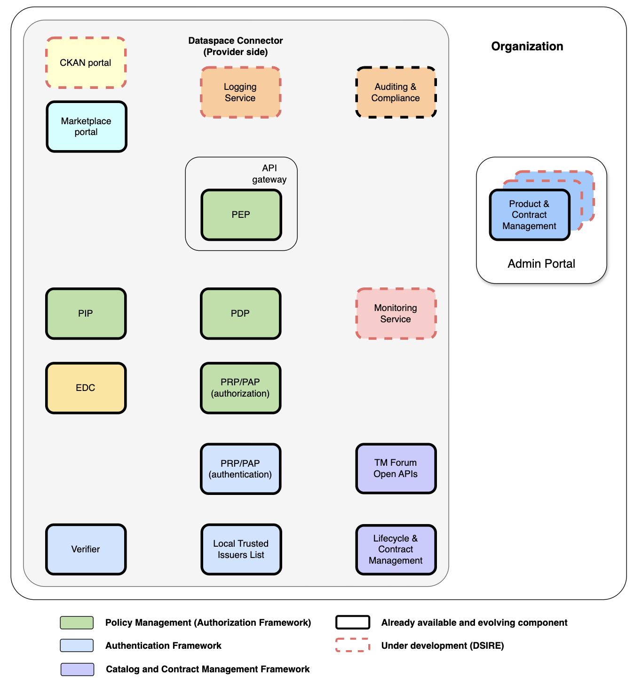
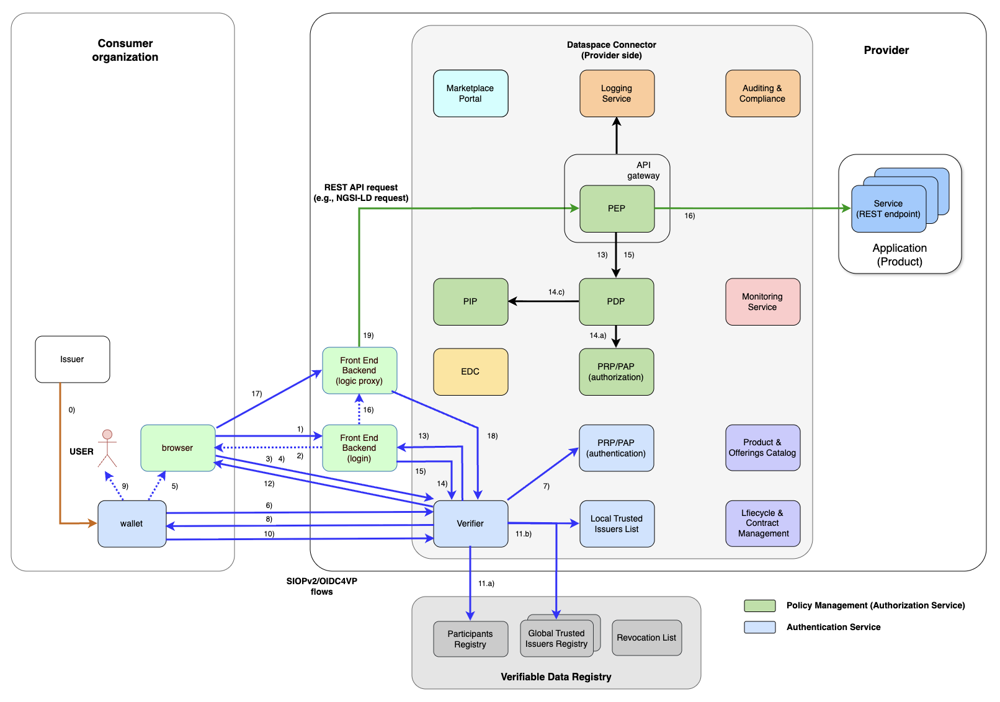
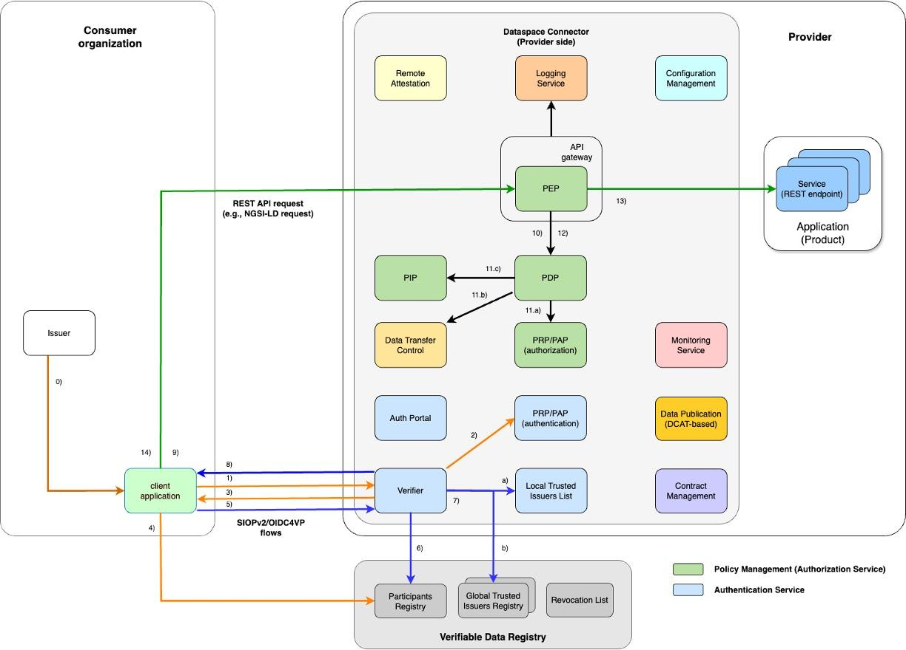
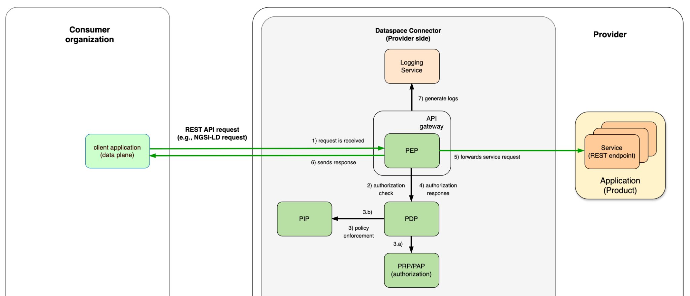
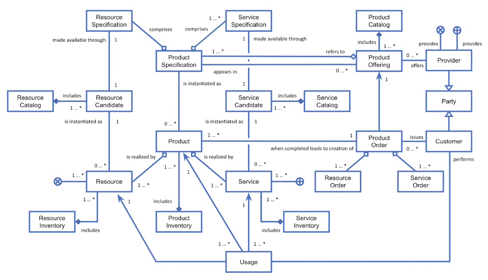
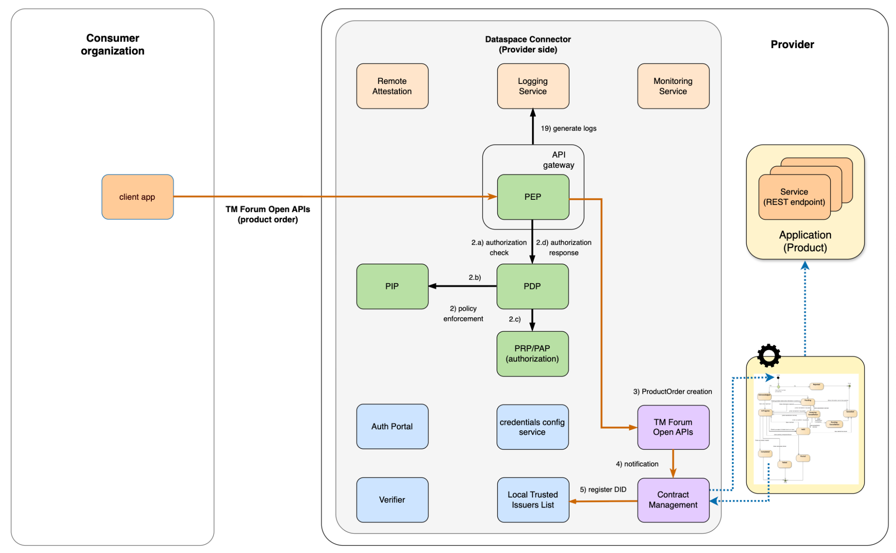
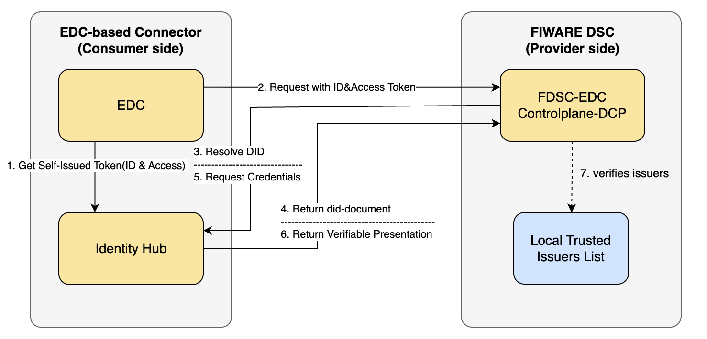
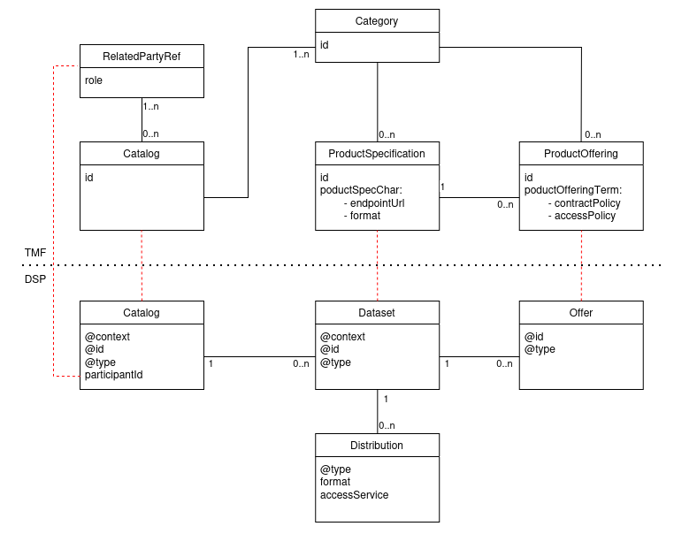
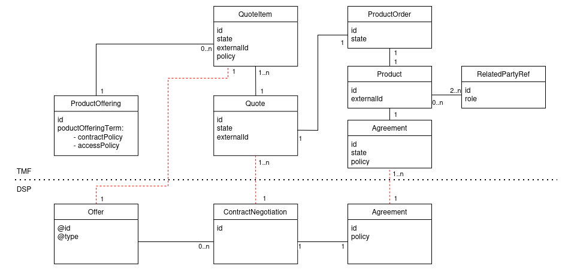

# FIWARE Data Space Connector

The FIWARE Data Space Connector (FIWARE DSC) is a data space connector resulting from the integration of open-source
software components that are part of the [FIWARE Dataspace Components (FDC)](https://github.com/FIWARE) and the
[Eclipse Dataspace Components (EDC)](https://eclipse-edc.github.io/docs/). Every organization participating
in a data space can deploy it to "connect" to a data space, acting as data (processing) service provider,
consumer of data (processing) services, or both.

This repository provides a description of the FIWARE Data Space Connector, its technical implementation and deployment
recipes.


<!-- ToC created with: https://github.com/thlorenz/doctoc -->
<!-- Update with: doctoc README.md -->

<details>
<summary><strong>Table of Contents</strong></summary>

<!-- START doctoc generated TOC please keep comment here to allow auto update -->
<!-- DON'T EDIT THIS SECTION, INSTEAD RE-RUN doctoc TO UPDATE -->
<!-- param::isNotitle::true:: -->

- [Overview](#overview)
- [Release Information](#release-information)
- [Components](#components)
- [Description of modules and interaction flows](#description-of-modules-and-interaction-flows)
  - [OID4VC-based Authentication Framework](#oid4vc-based-authentication-framework)
    - [Service invocation (H2M)](#service-invocation-h2m)
    - [Service invocation (M2M)](#service-invocation-m2m)
  - [Authorization Framework](#authorization-framework)
  - [Product Catalog and Contracting Management Framework](#product-catalog-and-contracting-management-framework)
  - [EDC Framework (Dataspace Protocol)](#edc-framework-dataspace-protocol)
    - [Authentication via DCP](#authentication-via-dcp)
    - [Catalog Protocol](#catalog-protocol)
    - [Contract Negotiation](#contract-negotiation)
    - [Transfer Process](#transfer-process)
  - [Marketplace Portal](#marketplace-portal)
  - [Integration with the Gaia-X Trust Framework](#integration-with-the-gaia-x-trust-framework)
- [Deployment](#deployment)
  - [Local Deployment](#local-deployment)
  - [Deployment with Helm](#deployment-with-helm)
- [Testing](#testing)
- [Additional documentation and resources](#additional-documentation-and-resources)

<!-- END doctoc generated TOC please keep comment here to allow auto update -->


</details>


## Overview

The FIWARE DSC currently integrates the following frameworks:

* **Authentication Framework** (Identity and trust management) based on [OID4VC](https://openid.net/sg/openid4vc/):
  facilitates the authentication of participating organizations and their users (end users, devices, software agents
  including AI agents) using [W3C DIDs](https://www.w3.org/TR/did-core/) and
  [Verifiable Credentials](https://www.w3.org/TR/vc-data-model/), relying on trust mechanisms compatible with
  [EBSI specifications](https://api-pilot.ebsi.eu/docs/apis) and
  [Gaia-X recommendations](https://gaia-x.gitlab.io/policy-rules-committee/trust-framework/).
  Because it is based on the OIDC family of protocols, the authentication module supports H2M (Human-to-Machine) and M2M (Machine-to-Machine) interaction schemes and has been adopted as a mandatory protocol within the EU Digital Identity initiative (see section 4.2.1 "Interfaces and protocols" in the [EUDI Wallet Architecture and Reference Framework](https://eudi.dev/1.1.0/arf/) specifications).
* **Authorization Framework** (Policy enforcement): determines, based on policies defined following the
  [W3C ODRL standard](https://www.w3.org/TR/odrl-model/), whether a given authenticated consumer may access a given
  service, by evaluating consumer credentials, the requested service, data properties, and environment parameters
* **Product Catalog and Contracting Management Framework**: manages, based on standards defined by
  [TM Forum](https://www.tmforum.org/oda/open-apis/), the catalog of product specifications and offers, product
  negotiation and ordering processes, and product inventory
* **EDC Framework**: implements the [Eclipse/IDSA Data Space Protocol (DSP)](https://eclipse-dataspace-protocol-base.github.io/DataspaceProtocol/2025-1-err1/)
  to manage catalog access, product contracting, and transfer process control, with either
  [OID4VC](https://openid.net/sg/openid4vc/) or
  [Eclipse DCP](https://eclipse-dataspace-dcp.github.io/decentralized-claims-protocol/v1.0.1/) configurable as
  authentication protocols
* **Marketplace Portal**: provides a graphical web interface for managing product specifications, offers,
  contracting, and inventory, based on the [FIWARE BAE Marketplace](https://github.com/FIWARE-TMForum/Business-API-Ecosystem)

At the data exchange and service invocation layer, the FIWARE DSC is prepared to manage access to any HTTP-based
interface. While it provides built-in compatibility with [ETSI NGSI-LD](https://www.etsi.org/committee/cim) as data
exchange API, it can also mediate access to services using S3, NGSIv2, web portal interfaces,
[A2A or MCP](https://google.github.io/A2A/) for AI agent functionalities, and any other REST API.

Technically, the FIWARE Data Space Connector is a
[Helm Umbrella-Chart](https://helm.sh/docs/howto/charts_tips_and_tricks/#complex-charts-with-many-dependencies),
containing all the sub-charts and their dependencies for deployment via Helm. It can be deployed using configurable
Helm Charts in different environments that support [Kubernetes](https://kubernetes.io/).




## Release Information

The FIWARE Data Space Connector uses a continuous integration flow, where every merge to the main branch triggers a
new release. Versioning follows [Semantic Versioning 2.0.0](https://semver.org/), therefore only major changes will
contain breaking changes. Important releases will be listed below, with additional information linked:

* [8.x.x](doc/release-notes/8-x.md) - Update the FIWARE Data Space Connector from 7.x.x to 8.x.x


## Components

The following table lists the components bundled in the connector:

| Component | Role | Link |
|-----------|------|------|
| VCVerifier | Validates VCs and exchanges them for JWT tokens (Verifier) | https://github.com/FIWARE/VCVerifier |
| credentials-config-service | Configures which VCs are required for accessing a service (PRP/PAP authentication) | https://github.com/FIWARE/credentials-config-service |
| trusted-issuers-list | EBSI Trusted Issuers Registry API (Local Trusted Issuers List) | https://github.com/FIWARE/trusted-issuers-list |
| Keycloak | OIDC-based VC issuer | https://www.keycloak.org |
| APISIX | API Gateway with OPA plugin (PEP) | https://apisix.apache.org/ |
| OPA | Open Policy Agent (PDP) | https://www.openpolicyagent.org/ |
| odrl-pap | ODRL policy administration (PRP/PAP authorization) | https://github.com/SEAMWARE/odrl-pap |
| tmforum-api | TM Forum Open APIs for catalog and contract management | https://github.com/FIWARE/tmforum-api |
| contract-management | Event listener for contract management lifecycle | https://github.com/FIWARE/contract-management |
| FDSC-EDC | Eclipse Dataspace Components connector (DSP Catalog, Contract Negotiation, Transfer Process) | https://github.com/SEAMWARE/fdsc-edc |
| Scorpio | NGSI-LD Context Broker | https://github.com/ScorpioBroker/ScorpioBroker |
| BAE Marketplace | Marketplace portal for product catalog and contracting | https://github.com/FIWARE-TMForum/Business-API-Ecosystem |
| did-helper | DID management helper | https://github.com/SEAMWARE/did-helper |
| Vault | Secret management | https://www.vaultproject.io/ |
| PostgreSQL / PostGIS | Databases | https://www.postgresql.org / https://postgis.net/ |
| MySQL | Database | https://www.mysql.com |


## Description of modules and interaction flows

This section provides a detailed description of each of the modules that make up the FIWARE DSC and their interaction flows.


### OID4VC-based Authentication Framework

This framework supports authentication mechanisms based on decentralized identity management built on W3C standards
(DID, Verifiable Credentials). It implements the OID4VC family of protocols defined by the OpenID Foundation for the
exchange of VCs ([SIOPv2](https://openid.net/specs/openid-connect-self-issued-v2-1_0.html#name-cross-device-self-issued-op),
[OID4VP](https://openid.net/specs/openid-4-verifiable-presentations-1_0.html#request_scope)).
This module allows organizations or users within those organizations that hold the required VCs to authenticate against
the connector and obtain a valid JWT token with which they can invoke either the connector's own services
(e.g., TM Forum APIs, DSP-based control plane) or services linked to products exposed through the connector.

The framework consists of the following components:

* **[VCVerifier](https://github.com/FIWARE/VCVerifier)**: implements credential verification functions using the
  OID4VP protocol with the user-side system that stores credentials (a digital wallet in the case of end users,
  another storage system in the case of software agents such as AI agents, devices, robots, etc.)
* **[credentials-config-service](https://github.com/FIWARE/credentials-config-service)**: maintains the configuration
  of which VCs, containing which roles/claims, the VCVerifier must request for each product/service
* **[trusted-issuers-list](https://github.com/FIWARE/trusted-issuers-list)**: maintains a registry of organizations
  (identified by their DID) that are considered trusted issuers of certain classes of VCs containing certain
  roles/claims. Provides an [EBSI Trusted Issuers Registry](https://api-pilot.ebsi.eu/docs/apis/trusted-issuers-registry)
  compatible API


#### Service invocation (H2M)

The following figure illustrates the sequence of steps followed when a user authenticates using OID4VC against a web
application/portal through which the user accesses services implemented by a given product exposed through the
connector, and how the backend-for-frontend (BFE) components invoke the backend system's REST APIs using JWTs
containing information from verifiable credentials linked to the user:



**Steps**

1. The user tries to access a page linked to a protected service of the web application or clicks the login button when there is not yet an authenticated session.
2. The login/session BFE component detects the absence of a session, determines the resource to be accessed (scope), and starts the login process. The BFE creates a pre-authentication context (state, nonce) and redirects (302) the browser to the Verifier's start page, passing the client_id, state, nonce, scope, and response_type (code).
3. The browser navigates to the Verifier's start page. The Verifier validates the input parameters, creates a transaction identifier (tx_id), and generates the protocol correlation artifacts (state, nonce, expiration).
4. The Verifier responds by serving its own HTML page showing a QR code. The QR encodes a minimal request that includes the verifier's client_id and a request_uri. The Verifier page starts a status polling loop to detect when authentication has been completed.
5. The user scans the QR code with their mobile wallet. The wallet extracts the request_uri and knows against which verifier it is operating.
6. The wallet invokes the Verifier's request_uri.
7. The Verifier consults the credentials_config_service, which establishes which VCs and which claims/roles to require when someone attempts to authenticate against the service identified by the client id (BFE id) and scope.
8. The Verifier generates a Request Object that it returns to the wallet. This includes the client_id, response_type, response_mode=direct_post, response_uri, state, nonce, and the dcql_query specifying which VCs and claims/roles must be requested.
9. The wallet shows the user which organization requests which data and for what purpose. If the user consents, the wallet selects the required credentials and generates the OID4VP response.
10. The wallet sends the OID4VP response to the Verifier's response_uri using direct_post, including the vp_token and, where applicable, the SIOPv2 id_token.
11. The Verifier cryptographically validates the presentation (signature, holder binding, expiration, revocation) and verifies that all requested VCs are included, including the specified claims/roles, and whether those VCs have been signed (a) by an organization that is a participant in the data space and (b) is a trusted issuer of those VCs in the global or local trusted_issuers_list.
12. If verification is successful, the Verifier generates the JWT and creates an authorization code associated with the transaction. The status endpoint returns the completed condition to the QR page.
13. Upon detecting completion, the Verifier page redirects to the BFE callback with the authorization code and state.
14. The BFE validates the state and invokes the Verifier's token endpoint to obtain the JWT, passing the authorization code.
15. The Verifier verifies the transaction is completed and that the authorization code is valid, then returns the JWT access token.
16. The BFE creates the user's web session (e.g., a server-side session referenced by an HttpOnly cookie) and associates with that session the JWT access token.
17. From that point on, the browser operates only against BFE endpoints, sending the HttpOnly cookie with each request. The browser does not see or manage JWTs.
18. When a page needs business data, the browser calls the business BFE components. These retrieve the JWT access token associated with the session.
19. The business BFE components invoke the APIs by providing the JWT in the Authorization header: `Bearer <JWT>`. If the JWT expires, the BFE obtains a new JWT from the Verifier or restarts the verification flow if the policy requires a step-up.


#### Service invocation (M2M)

The following figure illustrates the authentication process in the M2M scenario:



**Steps**

1. An application to which a given organization has assigned the VCs necessary to access the services offered by a given provider requests authentication by sending a request to a connection point offered by the Verifier component.
2. In its response, the Verifier component returns a request to the application for it to send (a) the VCs proving that the application has the VCs required by the services it intends to access and (b) any other VCs deemed necessary (steps 2-3).
3. The application checks whether the Verifier is linked to an organization that is a trusted participant in the data space (step 4, necessary to prevent any agent from attempting to impersonate the Verifier) and, if so, sends the requested VCs by making a request to an access point specified by the Verifier (step 5).
4. According to its configuration, the Verifier component verifies whether the organization that issued the VCs linked to the requested services is a trusted organization in the data space (step 6) and, moreover, whether it is a trusted issuer of those VCs (step 7.a). It also checks whether the rest of the VCs sent are signed by issuers trusted at the global data-space level (step 7.b).
5. If verification is completed successfully, the Verifier component generates a JWT token that is transmitted to the application (step 8).
6. Using the token it has been given, the application invokes a service (step 9).

It is important to emphasize that the authentication process (steps 1 to 19 in the H2M scenario and steps 1 to 8 in the M2M scenario) only needs to be carried out once. Once the access token has been obtained, the services can be invoked multiple times. The authentication process only needs to be repeated when the access token expires.

A detailed description of the steps to be performed by client applications and service providers can be found
in the [Service Interaction (M2M)](./doc/flows/service-interaction-m2m) documentation.


### Authorization Framework

This framework implements an ABAC (Attribute Based Access Control) authorization architecture based on policies
defined on:

- claims linked to users' VCs (applications or natural persons) within JWTs obtained in the authentication process required prior to service invocation,
- the operation being invoked,
- specific fields of the data to be accessed or processed (referenced in the path included in the operation request or carried in the payload),
- environment/context conditions.

The framework integrates components performing PEP, PDP, PIP, and PAP/PRP functions:

* **[Apache APISIX](https://apisix.apache.org/)**: essentially implements the PEP (Policy Enforcement Point) functions
  and can easily be configured to integrate elements implementing the PIP functions.
  Uses the [OPA plugin](https://apisix.apache.org/docs/apisix/plugins/opa/) for policy decisions.
* **[OPA](https://www.openpolicyagent.org/)** (Open Policy Agent): capable of interpreting and applying policies
  expressed in the [ODRL](https://www.w3.org/TR/odrl-model/) language defined by W3C, implementing the PDP
  (Policy Decision Point) functions. The authorization module is capable of processing policies based on the
  Gaia-X ODRL VC profile defined by Gaia-X.
* **[ODRL-PAP](https://github.com/wistefan/odrl-pap)**: allows the configuration of ODRL policies interpretable
  by the OPA engine (implementing the PAP/PRP functions), making it possible to define ODRL-based authorization
  policies in a simplified manner.

The following figure illustrates the steps implemented by the Authorization Framework when a request directed to a
REST API exposed through the connector is received. The scheme is the same for both H2M and M2M scenarios:



**Steps**

Once the authentication phase has been completed and an access token has been obtained:

1. The PEP component (APISIX) receives a request for a service whose access is subject to policy enforcement.
2. The PEP component (APISIX) extracts verifies the JWT and invokes the OPA component, passing this JWT as well as information about the received request such as the type of operation, path, and input payload.
3. The PDP component (OPA) checks, based on the information delivered by the PEP component (APISIX) and contextual information obtained from a PIP service, whether the request can be authorized, taking into account the policies defined by the product provider and configured through the ODRL-PAP component.
4. The PDP component (OPA) returns to the PEP component (APISIX) the decision on whether to authorize the request.
5. If the request is determined to be authorizable, the PEP component (APISIX) forwards the request to the service.
6. The PEP component (APISIX) forwards the response to the request to whoever originally invoked it.
7. Depending on the configuration, the PEP component (APISIX) can record in the logging system the information carried with the request, whether or not that request was rejected, the policies governing that decision, and the returned value.


### Product Catalog and Contracting Management Framework

This framework relies on two components:

* **[TMForum-API](https://github.com/FIWARE/tmforum-api)**: implements access, using standard
  [TM Forum Open APIs](https://www.tmforum.org/oda/open-apis/), to the Catalog of Product Specifications and Offers,
  the Product negotiation and contracting (ordering) processes, and the Product Inventory.
* **[Contract-Management](https://github.com/FIWARE/contract-management)**: subscribes to certain notifications
  generated by the tmforum-api component in order to implement integration actions with other frameworks/components
  of the connector.

TM Forum maintains and evolves a set of API specifications (TM Forum Open APIs) on which to base the development of systems that support the business and operational processes of any provider of digital products and services. These specifications have been adopted within the [DOME project](https://dome-marketplace.eu/) (Distributed Open Marketplace for Europe), a strategic EU project under the Digital Europe programme.



Using the TM Forum Open APIs, a participant playing the provider role can manage Catalogs of ProductOfferings around ProductSpecifications. The specification of a Product comprises a set of ServiceSpecifications as well as ResourceSpecifications that need to be deployed to support the execution of the specified services. Among the characteristics of a ProductOffering defined around a ProductSpecification are the terms and conditions (productOfferingTerm) or pricing models (productOfferingPrice) that the Provider making the offer wishes to apply.

Using the TM Forum Open APIs, customers can place orders for the acquisition of products (ProductOrders). When a Customer places a ProductOrder, it may do so by accepting the characteristics established by default in the ProductOffering published by a Provider, but the Customer may also negotiate new terms and conditions by creating a "term proposal" (Quote) that it submits as an input argument in its ProductOrder, thus entering into a negotiation until they reach a Quote that both parties accept. When a ProductOrder reaches completed status, a Product entity is created that represents the product effectively provisioned for the Customer. The Products, Services, and Resources contracted by a Customer will be recorded in corresponding inventories that the Customer can consult and manage.

It is important to note that the TM Forum Open APIs implemented by the TMForum-API component are protected through the connector's authentication and authorization mechanisms when they are accessed from outside.

The Contract-Management component subscribes to notifications issued by the TMForum-API component when a given ProductOrder has been completed. When this happens, it registers the DID of the participant that requested that ProductOrder in the connector's local trusted_issuers_list as a trusted issuer of the VCs and claims/roles specified for the product. At the same time, it provisions in the ODRL-PAP the policies that must be applied for the product.



**Steps**

1. The PEP component (APISIX) receives a ProductOrder request.
2. The PEP component (APISIX) verifies the JWT accompanying the request and, based on the information in the JWT together with information about the requested operation (ProductOrder), determines whether the request should be handled, relying on the PDP component (OPA), which applies the ODRL policies governing access to the TM Forum APIs.
3. Upon receiving the ProductOrder request, a ProductOrder object is created and the process of provisioning and activating the associated services and resources begins. The product provider may manage this process manually or the process may be automatic.
4. Once those provisioning and activation processes are completed, the status of the ProductOrder object changes to "Completed" and the contract-management component receives a notification with the ProductOrder information, which, among other things, contains the DID of the organization (Customer) that created the ProductOrder.
5. The Contract-Management component registers the DID of the Customer organization in the local trusted-issuers-list and the necessary policies are provisioned in the ODRL-PAP component.


### EDC Framework (Dataspace Protocol)

The EDC framework integrated as part of the FIWARE DSC enables it to support access to the catalog of product specifications, the product contracting process, as well as control over the start, suspension, resumption, and termination of exchange processes between consumers and services of contracted products using the [Eclipse/IDSA Data Space Protocol (DSP)](https://eclipse-dataspace-protocol-base.github.io/DataspaceProtocol/2025-1-err1/). DSP prescribes a set of operations, message types, and HTTPS APIs (bindings) aimed at interoperability. In practice, DSP organizes the interaction between Consumer and Provider as a "publish -> negotiate -> access" sequence, structured into three protocols: Catalog, Contract Negotiation, and Transfer Process. Given the asynchronous nature of the operations, the use of the DSP protocol requires that a connector be deployed on both sides, consumer and provider.

The [FDSC-EDC](https://github.com/SEAMWARE/fdsc-edc) component provides:
* [Catalog Protocol](https://eclipse-dataspace-protocol-base.github.io/DataspaceProtocol/2025-1-err1/#catalog-protocol)
  — discovery of products in the catalog via DCAT
* [Contract Negotiation Protocol](https://eclipse-dataspace-protocol-base.github.io/DataspaceProtocol/2025-1-err1/#negotiation-protocol)
  — stateful negotiation of usage contracts for datasets
* [Transfer Process Protocol](https://eclipse-dataspace-protocol-base.github.io/DataspaceProtocol/2025-1-err1/#transfer-protocol)
  — orchestration of data access (pull/push) once a valid agreement exists
* Uses the TMForum API as storage backend
* Two authentication flavors: [OID4VC](https://openid.net/sg/openid4vc/) and [Eclipse DCP](https://eclipse-dataspace-dcp.github.io/decentralized-claims-protocol/v1.0.1/)

The exchange of HTTP messages linked to DSP operations requires an access token. In the FIWARE DSC, both the family of OID4VC protocols and the Eclipse DCP (Decentralized Claims Protocol) are supported.


#### Authentication via DCP



**Steps**

1. The connector on the consumer side obtains a Self-Issued Token from its Identity Hub (STS-Service), which includes an ID-Token and an Access Token.
2. The connector on the consumer side sends a request to the DSP endpoint (EDC Framework) of the FIWARE DSC including both tokens.
3. The FIWARE DSC's EDC implementation obtains the DID carried in the ID-Token and requests the corresponding did-document by accessing the Consumer's IdentityHub.
4. The connector on the consumer side returns the did-document, which contains the endpoint (address) of the Credential Service implemented in the Identity Hub on the consumer side.
5. The FIWARE DSC's EDC implementation on the provider side requests the credentials required to access the DSP operation invoked in step 2 by sending a request to the Credential Service implemented in the consumer's Identity Hub, using the Access Token that the consumer sent in step 1.
6. The Credential Service returns a Verifiable Presentation containing the requested credentials.
7. The FIWARE DSC's EDC implementation on the provider side verifies that all the credentials requested in step 5 have been presented within the Verifiable Presentation sent in step 6, confirming that the issuers of those credentials are trusted issuers and, therefore, that their DIDs are registered in the local trusted-issuer-list.

The integration of the EDC framework into the FIWARE DSC entails mapping concepts linked to the DSP protocol to concepts implemented following the TM Forum information model in the Product Catalog and Contracting Management Framework. In this way, a product whose specifications have been registered through that framework can also be contracted through the DSP protocol.


#### Catalog Protocol

The Catalog protocol covers the discovery of products in the catalog. A Provider exposes a Catalog Service that publishes metadata about its assets (Datasets) and the conditions under which they are available. The Consumer uses that service to obtain a complete catalog or consult a specific dataset and, with that information, decides whether to start a contractual negotiation.

DSP reuses existing RDF vocabularies. In particular, the catalog is expressed with DCAT, and the terms of use (offer) are expressed as ODRL Offers associated with the Dataset.

The following figure shows the correspondence between the entities handled in the TM Forum model and in the DSP Catalog subprotocol:

- the DCAT:Catalog entity maps directly to the TMForum:Catalog entity
- the "participantId" attribute in a DCAT:Catalog maps to the id of a TMForum:RelatedParty entity with the role "Provider"
- the DCAT:Dataset entity maps directly to the TMForum:ProductSpecification entity, and the linked details (metadata) map to values in that entity's "productSpecCharacteristics" field
- the DCAT:Offer entity maps directly to the TMForum:ProductOffering entity, which contains fields with the policies




#### Contract Negotiation

The Contract Negotiation protocol allows Consumer and Provider to agree, in a traceable and controlled manner, on a usage contract for a Dataset. In DSP, a negotiation is a stateful process identified by an IRI, and both participants must maintain a coherent view of that state.

The following figure shows the correspondence between the entities handled in the TM Forum model and in the DSP Contract Negotiation subprotocol:

- a ContractNegotiation entity corresponds to a TMForum:Quote object
- an Offer under negotiation (proposed by the consumer or counter-proposed by the provider) corresponds to a TMForum:QuoteItem object
- a TMForum:ProductOrder entity is created when a ContractNegotiation reaches verified status
- the Product and Agreement entities are created when the ContractNegotiation reaches finalization status



**Steps**

1. **Offer selection**: the Consumer consults the Provider's catalog, chooses a Dataset, and selects an Offer (ODRL) that expresses the terms of use. In addition, it identifies in the DataService the URL of the Contract Negotiation endpoint.
2. **Negotiation initiation**: the Consumer creates a new negotiation (IRI) and sends the Provider a Contract Request Message with the reference to the Dataset and the proposed Offer. The Provider responds with an ACK.
3. **Proposal and counteroffer**: the Provider evaluates the request against its internal policies. If it accepts the Offer as is, it can move toward agreement; if it requires changes, it sends a Contract Offer Message with the counteroffer. This phase can iterate until convergence or termination.
4. **Acceptance by the Consumer**: when the Consumer accepts the last Offer sent by the Provider, a point is reached at which the Provider can materialize a formal Agreement (contract), normally as an instance of an ODRL Agreement derived from the agreed Offer.
5. **Issuance of the agreement**: the Provider sends the Consumer a Contract Agreement Message with the resulting Agreement. The Consumer responds with an ACK and proceeds to verify the consistency of the agreement.
6. **Verification and finalization**: DSP contemplates Agreement verification messages. The Consumer sends a verification to the Provider; the Provider responds with ACK and may issue a final completion message. After this closure, the Agreement is "finalized" and the Dataset is considered available to the Consumer under the agreed conditions.
7. **Result**: the main output of Contract Negotiation is an identified Agreement (contract agreement id). That identifier will be the reference that the Consumer uses next to initiate a Transfer Process associated with the agreed Dataset/Distribution.


#### Transfer Process

The Transfer protocol orchestrates effective access to the Dataset once there is a valid Agreement. It is important to distinguish two planes: the control plane (where DSP messages are exchanged and states are managed) and the data plane (where the actual transport of data takes place through a specific wire protocol, typically outside DSP's scope).

The Consumer should not initiate a Transfer Process without having the finalized Agreement available. In practice, the Transfer Request includes a reference to the `contractAgreementId` obtained in the previous step, so that the Provider can validate that the transfer request is authorized and subject to the agreed policy.

**Steps**

1. **Preparation**: the Consumer selects the Dataset Distribution and obtains from the catalog the Provider's Transfer Process endpoint. It also retrieves the `contractAgreementId` resulting from Contract Negotiation.
2. **Transfer request**: the Consumer creates a new Transfer Process (IRI) and sends a Transfer Request Message to the Provider, including the reference to the `contractAgreementId`, the reference to the Dataset/Distribution, and parameters describing the type of transfer. In a 'pull transfer', the Provider must return to the Consumer the information necessary for it to obtain the data. In a 'push transfer', the Consumer provides a destination endpoint/location and the Provider initiates the sending.
3. **ACK and state synchronization**: the Provider responds with an ACK, confirming that it has accepted to process the request and that both participants share the identifier of the Transfer Process.
4. **Startup of the data plane**: once the agreement and the usage policy have been validated, the Provider sends a Transfer Start Message. The actual transfer is executed on the data plane using a wire protocol (HTTP, S3, Kafka, etc.) agreed by profile or by the Distribution.
5. **Execution and monitoring**: during the life of the process, suspension/resumption messages or operational events may be exchanged.
6. **Finalization**: when the Provider considers the transfer completed (in finite transfers) or the connection/streaming established (in non-finite transfers), it issues a Transfer Completion Message and the Consumer responds with ACK. Alternatively, either party may terminate the process by means of a Transfer Termination Message.
7. **Result**: the Consumer obtains effective access to the data (by download, stream, or push reception), maintaining the traceability of the Transfer Process and the reference to the Agreement that authorizes it.

From an architectural standpoint, the value of the Transfer Process lies in the explicit separation between coordination and transport: the control plane provides interoperability in state negotiation and access authorization, while the data plane can be optimized by domain provided that it respects the conditions of the Agreement.

Find out more in the [Dataspace Protocol Integration Documentation](./doc/DSP_INTEGRATION.md).


### Marketplace Portal

The FIWARE DSC connector incorporates a marketplace portal based on the [FIWARE BAE Marketplace](https://github.com/FIWARE-TMForum/Business-API-Ecosystem) that allows administrator users of participating organizations acting as providers to create catalogs of product specifications and offers around them. Likewise, through the portal, users linked to consumer organizations with the appropriate credentials can consult the specifications of products offered through the connector and the associated offers and, when they find a product of interest, contract it. They can also consult the inventory of products they have contracted.

Basically, the Marketplace Portal encapsulates access to the Product Catalog and Contracting Management Framework based on the TM Forum Open APIs, and enables end users, through a graphical web interface, to perform the operations that a system could perform by invoking the TM Forum APIs directly.

Find more information in the dedicated [Marketplace Integration Section](./doc/MARKETPLACE_INTEGRATION.md).


### Integration with the [Gaia-X Trust Framework](https://gaia-x.gitlab.io/policy-rules-committee/trust-framework/)

In order to be compatible with common european frameworks for Dataspaces, the FIWARE Data Space Connector provides integrations with the [Gaia-X Trustframework](https://gaia-x.gitlab.io/policy-rules-committee/trust-framework/). [Gaia-X Digital Clearing House's](https://gaia-x.eu/services-deliverables/digital-clearing-house/) can be used as Trust Anchors for the FIWARE Data Space Connector.

Find out more in the dedicated [Gaia-X Integration Documentation](./doc/GAIA_X.MD).


## Deployment

### Local Deployment

The FIWARE Data Space Connector provides a local deployment of a Minimal Viable Dataspace.
* Find a detailed documentation here: [Local Deployment](./doc/deployment-integration/local-deployment/LOCAL.MD)

This deployment allows to easily spin up a minimal data space on a local machine using
[Maven](https://maven.apache.org/) and [Docker](https://www.docker.com/) (with [k3s](https://k3s.io/)), and
can be used to try out the connector, to get familiar with the different components and flows within the data space,
or to perform tests with the different APIs provided.

Additional deployment profiles are available for specific trust frameworks:

```shell
    # Default local deployment
    mvn clean deploy -Plocal
    # With Gaia-X trust framework integration
    mvn clean deploy -Plocal,gaia-x
    # With support for the Data Space Protocol
    mvn clean deploy -Plocal,dsp
```


### Deployment with Helm

The Data-Space-Connector is a [Helm Umbrella-Chart](https://helm.sh/docs/howto/charts_tips_and_tricks/#complex-charts-with-many-dependencies), containing all the sub-charts of the different components and their dependencies. Its sources can be found
[here](./charts/data-space-connector).

The chart is available at the repository `https://fiware.github.io/data-space-connector/`. You can install it via:

```shell
    # add the repo
    helm repo add dsc https://fiware.github.io/data-space-connector/
    # install the chart
    helm install <DeploymentName> dsc/data-space-connector -n <Namespace> -f values.yaml
```
**Note,** that due to the app-of-apps structure of the connector and the different dependencies between the components, a deployment without providing any configuration values will not work. Make sure to provide a
`values.yaml` file for the deployment, specifying all necessary parameters. This includes setting parameters of the connected data space (e.g., trust anchor endpoints), DNS information (providing Ingress or OpenShift Route parameters),
structure and type of the required VCs, internal hostnames of the different connector components and providing the configuration of the DID and keys/certs.

Configurations for all sub-charts (and sub-dependencies) can be managed through the top-level [values.yaml](./charts/data-space-connector/values.yaml) of the chart. It contains the default values of each component and additional parameters shared between the components. The configuration of the applications can be changed under the key `<APPLICATION_NAME>`, please see the individual applications and their sub-charts for the available options.

Example — changing the image tag of Keycloak:
```yaml
keycloak:
    image:
        tag: LATEST_GREATEST
```


## Testing

In order to test the [helm-charts](./charts/) provided for the FIWARE Data Space Connector, an integration-test
framework based on [Cucumber](https://cucumber.io/) and [JUnit 5](https://junit.org/junit5/) is provided: [it](./it).

The tests can be executed via:
```shell
    mvn clean integration-test -Ptest
```
They will spin up the [Local Data Space](./doc/deployment-integration/local-deployment/LOCAL.MD) and run
the [test-scenarios](./it/src/test/resources/it/mvds_basic.feature) against it.


## Additional documentation and resources

Additional and more detailed documentation about the FIWARE Data Space Connector,
specific flows and its deployment and integration with other frameworks:

* [Dataspace Protocol Integration](./doc/DSP_INTEGRATION.md)
* [Gaia-X Integration](./doc/GAIA_X.MD)
* [Marketplace Integration](./doc/MARKETPLACE_INTEGRATION.md)
* [Central Marketplace](./doc/CENTRAL_MARKETPLACE.md)
* [Contract Negotiation](./doc/CONTRACT_NEGOTIATION.md)
* [Service Interaction (M2M)](./doc/flows/service-interaction-m2m)
* [Contract Management flows](./doc/flows/contract-management)
* [Local Deployment](./doc/deployment-integration/local-deployment/LOCAL.MD)
* [Additional documentation](./doc)
* [Ongoing Work](./doc/ONGOING_WORK.md)

Additional resources about the FIWARE Data Space Connector and Data Spaces in general:
* [FIWARE Data Spaces](https://github.com/fiwARE/data-spaces)
* [FIWARE Webinar about Data Spaces, its roles and components (by Stefan Wiedemann)](https://www.youtube.com/watch?v=hm5qMlhpK0g)
