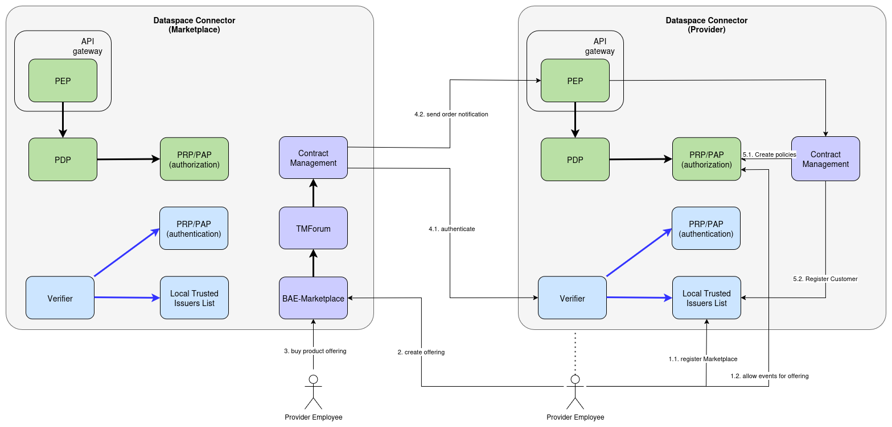

# Support for a Central Marketplace

Various Data Space Use-Cases require a solution for offering services through a central Marketplace, in order to lower requirements for participants and improve visibility of their offerings.

## Architecture




Integration of Participants into a Central Marketplace happens through the same mechanisms and components as the normal [marketplace integration](MARKETPLACE_INTEGRATION.md).
Particpants offering their services on the Central Marketplace are required to provide an instance of the [ContractManagement](https://github.com/FIWARE/contract-management). The Central Marketplace also runs the Contract Management Component and manages Organizations, Products and Offerings through the TMForum API. 

The basic flow of integration is as following:

1. The Data Provider has to prepare its integration by:

    1.1. Register the Marketplace as a trusted-issuer of credentials used by the Contract Management
    1.2. Register policies that allow the marketplace to send order notifications to the Contract-Management(see [allowContractManagement.json](../it/src/test/resources/policies/allowContractManagement.json) as an example) 
    1.3 Provider has to register itself at the Central Marketplace as an Oranization, containing access information to the Contract Management

2. Create Product Offering

3. Customer buys access at the Marketplace

4. Contract Management sends notifcation to the Providers Contract-Management

    4.1. Authenticates with the Verifiable Credential configured in 1.1 at the verifier
    4.2. Send order notifications to the Contract-Management(through PEP)

5. Contract-Management activates the service:
    
    5.1. Adds the customer to the trusted-issuers-list(according to the order)
    5.2. Creates the policies from the order

## Demo

In order to run the Demo flows, the [Local Deployment](./deployment-integration/local-deployment/LOCAL.MD) has to be prepared.
In the Demo-Scenario, the Consumer-Organization("fancy-marketplace.biz") also acts as the provider of the centralized marketplace, while the Provider-Organization("mp-operations.org") offers its services through that market. 

### Prepare the marketplace

Register the policies required to restrict access to the TMForum. Only Users in the Role "REPRESENTATIVE" should be allowed to interact with it.

```shell
  ./doc/scripts/prepare-central-market-policies.sh
```

### Prepare the provider [(Step 1)](#architecture)

Create a policy, restricting access to the Contract Management to requests authenticated with a "MarketplaceCredential"

```shell
# Allow contract management access at the provider side
curl -X 'POST' http://pap-provider.127.0.0.1.nip.io:8080/policy \
    -H 'Content-Type: application/json' \
    -d "$(cat ./it/src/test/resources/policies/allowContractManagement.json)"
```

Get a "LegalPersonCredential" for the Provider, containing the role "REPRESENTATIVE".(see [Provider` ClientScopes config](../k3s/provider.yaml#957))

```shell
export PROVIDER_USER_CREDENTIAL=$(./doc/scripts/get_credential.sh https://keycloak-provider.127.0.0.1.nip.io user-credential employee); echo ${PROVIDER_USER_CREDENTIAL}
```

Register the Provider at the Marketplace, containing the address of the Contract Management and the required clientId/scope for authentication:

```shell
  # set the Providers DID
  export PROVIDER_DID="did:web:mp-operations.org"
  # get an AccessToken for the Credential
  export ACCESS_TOKEN=$(./doc/scripts/get_access_token_oid4vp.sh http://fancy-marketplace.127.0.0.1.nip.io:8080 $PROVIDER_USER_CREDENTIAL default); echo $ACCESS_TOKEN
  # create the organization at the providers TMForum
  export MP_OPERATIONS_ID=$(curl -X POST http://fancy-marketplace.127.0.0.1.nip.io:8080/tmf-api/party/v4/organization \
    -H 'Accept: */*' \
    -H 'Content-Type: application/json' \
    -H "Authorization: Bearer ${ACCESS_TOKEN}" \
    -d "{
      \"name\": \"M&P Operations Org.\",
      \"partyCharacteristic\": [
        {
            \"name\": \"did\",
            \"value\": \"${PROVIDER_DID}\" 
        },
        {
            \"name\": \"contractManagement\",
            \"value\": {
                \"address\": \"http://contract-management.127.0.0.1.nip.io:8080\",
                \"clientId\":\"contract-management\",
                \"scope\": [\"external-marketplace\"]  
            }
        }
      ]
    }" | jq '.id' -r); echo ${MP_OPERATIONS_ID} 
```

### Create the Offering [(Step 2)](#architecture)

Create product specification, referencing the provider:

```shell
  export ACCESS_TOKEN=$(./doc/scripts/get_access_token_oid4vp.sh http://fancy-marketplace.127.0.0.1.nip.io:8080 $PROVIDER_USER_CREDENTIAL default); echo $ACCESS_TOKEN
  export PRODUCT_SPEC=$(curl -X 'POST' http://fancy-marketplace.127.0.0.1.nip.io:8080/tmf-api/productCatalogManagement/v4/productSpecification \
  -H 'Accept: */*' \
  -H 'Content-Type: application/json;charset=utf-8' \
  -H "Authorization: Bearer ${ACCESS_TOKEN}" \
  -d "{
    \"brand\": \"M&P Operations\",
    \"version\": \"1.0.0\",
    \"lifecycleStatus\": \"ACTIVE\",
    \"name\": \"M&P K8S\",
    \"relatedParty\": [
        {
            \"id\": \"${MP_OPERATIONS_ID}\",
            \"role\": \"provider\"
        }
    ],
    \"productSpecCharacteristic\": [
      {
        \"id\": \"credentialsConfig\",
        \"name\": \"Credentials Config\",
        \"@schemaLocation\": \"https://raw.githubusercontent.com/FIWARE/contract-management/refs/heads/main/schemas/credentials/credentialConfigCharacteristic.json\",
        \"valueType\": \"credentialsConfiguration\",
        \"productSpecCharacteristicValue\": [
          {
            \"isDefault\": true,
            \"value\": {
              \"credentialsType\": \"OperatorCredential\",
              \"claims\": [
                {
                  \"name\": \"roles\",
                  \"path\": \"$.roles[?(@.target==\\\"${PROVIDER_DID}\\\")].names[*]\",
                  \"allowedValues\": [
                    \"OPERATOR\"
                  ]
                }
              ]
            }
          }
        ]
      },
      {
        \"id\": \"policyConfig\",
        \"name\": \"Policy for creation of K8S clusters.\",
        \"@schemaLocation\": \"https://raw.githubusercontent.com/FIWARE/contract-management/refs/heads/policy-support/schemas/odrl/policyCharacteristic.json\",
        \"valueType\": \"authorizationPolicy\",
        \"productSpecCharacteristicValue\": [
          {
            \"isDefault\": true,
            \"value\": {
              \"@context\": {
                \"odrl\": \"http://www.w3.org/ns/odrl/2/\"
              },
              \"@id\": \"https://mp-operation.org/policy/common/k8s-full\",
              \"odrl:uid\": \"https://mp-operation.org/policy/common/k8s-full\",
              \"@type\": \"odrl:Policy\",
              \"odrl:permission\": {
                \"odrl:assigner\": \"https://www.mp-operation.org/\",
                \"odrl:target\": {
                  \"@type\": \"odrl:AssetCollection\",
                  \"odrl:source\": \"urn:asset\",
                  \"odrl:refinement\": [
                    {
                      \"@type\": \"odrl:Constraint\",
                      \"odrl:leftOperand\": \"ngsi-ld:entityType\",
                      \"odrl:operator\": \"odrl:eq\",
                      \"odrl:rightOperand\": \"K8SCluster\"
                    }
                  ]
                },
                \"odrl:assignee\": {
                  \"@type\": \"odrl:PartyCollection\",
                  \"odrl:source\": \"urn:user\",
                  \"odrl:refinement\": {
                    \"@type\": \"odrl:LogicalConstraint\",
                    \"odrl:and\": [
                      {
                        \"@type\": \"odrl:Constraint\",
                        \"odrl:leftOperand\": \"vc:role\",
                        \"odrl:operator\": \"odrl:hasPart\",
                        \"odrl:rightOperand\": {
                          \"@value\": \"OPERATOR\",
                          \"@type\": \"xsd:string\"
                        }
                      },
                      {
                        \"@type\": \"odrl:Constraint\",
                        \"odrl:leftOperand\": \"vc:type\",
                        \"odrl:operator\": \"odrl:hasPart\",
                        \"odrl:rightOperand\": {
                          \"@value\": \"OperatorCredential\",
                          \"@type\": \"xsd:string\"
                        }
                      }
                    ]
                  }
                },
                \"odrl:action\": \"odrl:use\"
              }
            }
          }
        ]
      }
    ]
  }" | jq '.id' -r ); echo ${PRODUCT_SPEC}
```

Create product offering, referencing the product spec:

```shell
  export ACCESS_TOKEN=$(./doc/scripts/get_access_token_oid4vp.sh http://fancy-marketplace.127.0.0.1.nip.io:8080 $PROVIDER_USER_CREDENTIAL default); echo $ACCESS_TOKEN
  export PRODUCT_OFFERING_ID=$(curl -X 'POST' http://fancy-marketplace.127.0.0.1.nip.io:8080/tmf-api/productCatalogManagement/v4/productOffering \
    -H 'Accept: */*' \
    -H 'Content-Type: application/json;charset=utf-8' \
    -H "Authorization: Bearer ${ACCESS_TOKEN}" \
    -d "{
      \"version\": \"1.0.0\",
      \"lifecycleStatus\": \"ACTIVE\",
      \"name\": \"M&P K8S Offering\",
      \"productSpecification\": {
        \"id\": \"${PRODUCT_SPEC}\"
      }
    }" | jq '.id' -r ); echo ${PRODUCT_OFFERING_ID}
```


### Buy access to the offering [(Step 2)](#architecture)

In order to keep the demo environment manageable, the Consumer-Organization will buy access to the Providers offering: 

Create a UserCredential for the consumer:

```shell
export CONSUMER_USER_CREDENTIAL=$(./doc/scripts/get_credential.sh https://keycloak-consumer.127.0.0.1.nip.io user-sd employee vc+sd-jwt); echo ${CONSUMER_USER_CREDENTIAL}
```
Create an OperatorCredential for the consumer: 

```shell
export CONSUMER_OPERATOR_CREDENTIAL=$(./doc/scripts/get_credential.sh https://keycloak-consumer.127.0.0.1.nip.io operator-credential operator); echo ${CONSUMER_OPERATOR_CREDENTIAL}
```

Assert that access is not yet possible(e.g. the Consumer cannot get an AccessToken for the OperatorCredential):

```shell
  export ACCESS_TOKEN=$(./doc/scripts/get_access_token_oid4vp.sh http://mp-data-service.127.0.0.1.nip.io:8080 $CONSUMER_OPERATOR_CREDENTIAL operator); echo ${ACCESS_TOKEN}
```

Now register "fancy-marketplace.biz" as a Consumer at the Marketplace:

Register Fancy Marketplace as a Consumer
```shell
  # set the Consumer DID
  export CONSUMER_DID="did:web:fancy-marketplace.biz"
  # get an access token for the UserCredential
  export ACCESS_TOKEN=$(./doc/scripts/get_access_token_oid4vp.sh http://fancy-marketplace.127.0.0.1.nip.io:8080 $CONSUMER_USER_CREDENTIAL default); echo ${ACCESS_TOKEN}
  # register fancy-marketplace.biz as an organization(no need for a contract-management address in the consumer)
  export FANCY_MARKETPLACE_ID=$(curl -X POST http://fancy-marketplace.127.0.0.1.nip.io:8080/tmf-api/party/v4/organization \
    -H 'Accept: */*' \
    -H 'Content-Type: application/json' \
    -H "Authorization: Bearer ${ACCESS_TOKEN}" \
    -d "{
      \"name\": \"Fancy Marketplace Inc.\",
      \"partyCharacteristic\": [
        {
          \"name\": \"did\",
          \"value\": \"${CONSUMER_DID}\" 
        }
      ]
    }" | jq '.id' -r); echo ${FANCY_MARKETPLACE_ID} 
```

List the offerings of the marketplace, only one should be registered at the moment:

```shell
  export ACCESS_TOKEN=$(./doc/scripts/get_access_token_oid4vp.sh http://fancy-marketplace.127.0.0.1.nip.io:8080 $CONSUMER_USER_CREDENTIAL default); echo $ACCESS_TOKEN
  curl -X GET http://fancy-marketplace.127.0.0.1.nip.io:8080/tmf-api/productCatalogManagement/v4/productOffering -H "Authorization: Bearer ${ACCESS_TOKEN}" | jq .
```


Extract the OfferId from the TMForum API:
```shell
  export ACCESS_TOKEN=$(./doc/scripts/get_access_token_oid4vp.sh http://fancy-marketplace.127.0.0.1.nip.io:8080 $CONSUMER_USER_CREDENTIAL default); echo $ACCESS_TOKEN
  export OFFER_ID=$(curl -X GET http://fancy-marketplace.127.0.0.1.nip.io:8080/tmf-api/productCatalogManagement/v4/productOffering -H "Authorization: Bearer ${ACCESS_TOKEN}" | jq '.[0].id' -r); echo ${OFFER_ID}
```

Create an order for the offering:
```shell
  export ACCESS_TOKEN=$(./doc/scripts/get_access_token_oid4vp.sh http://fancy-marketplace.127.0.0.1.nip.io:8080 $CONSUMER_USER_CREDENTIAL default); echo $ACCESS_TOKEN
  export ORDER_ID=$(curl -X POST http://fancy-marketplace.127.0.0.1.nip.io:8080/tmf-api/productOrderingManagement/v4/productOrder \
  -H 'Accept: */*' \
  -H 'Content-Type: application/json' \
  -H "Authorization: Bearer ${ACCESS_TOKEN}" \
  -d "{
      \"productOrderItem\": [
        {
          \"id\": \"random-order-id\",
          \"action\": \"add\",
          \"productOffering\": {
            \"id\" :  \"${OFFER_ID}\"
          }
        }  
      ],
      \"relatedParty\": [
        {
          \"id\": \"${FANCY_MARKETPLACE_ID}\"
        }
      ]}" | jq '.id' -r); echo ${ORDER_ID}
```

Complete the order:
```shell
  export ACCESS_TOKEN=$(./doc/scripts/get_access_token_oid4vp.sh http://fancy-marketplace.127.0.0.1.nip.io:8080 $CONSUMER_USER_CREDENTIAL default); echo $ACCESS_TOKEN
  curl -X 'PATCH' \
      -H "Authorization: Bearer ${ACCESS_TOKEN}" \
      http://fancy-marketplace.127.0.0.1.nip.io:8080/tmf-api/productOrderingManagement/v4/productOrder/${ORDER_ID} \
      -H 'accept: application/json;charset=utf-8' \
      -H 'Content-Type: application/json;charset=utf-8' \
      -d "{
              \"state\": \"completed\"
          }" | jq .
```

Once the order is completed, the Contract Management of the Marketplace will send a notification to the Providers Contract Management, where the credential configuration and policies from the product will be applied to the Trusted Issuers List and the PAP. 

Now it should be possible to get an AccessToken for the Consumer's OperatorCredential:

```shell
  export ACCESS_TOKEN=$(./doc/scripts/get_access_token_oid4vp.sh http://mp-data-service.127.0.0.1.nip.io:8080 $CONSUMER_OPERATOR_CREDENTIAL operator); echo ${ACCESS_TOKEN}
```
