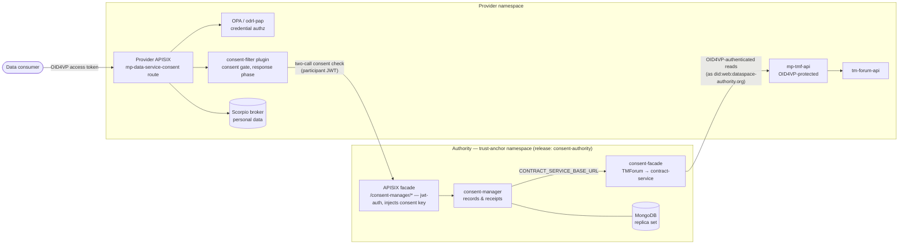
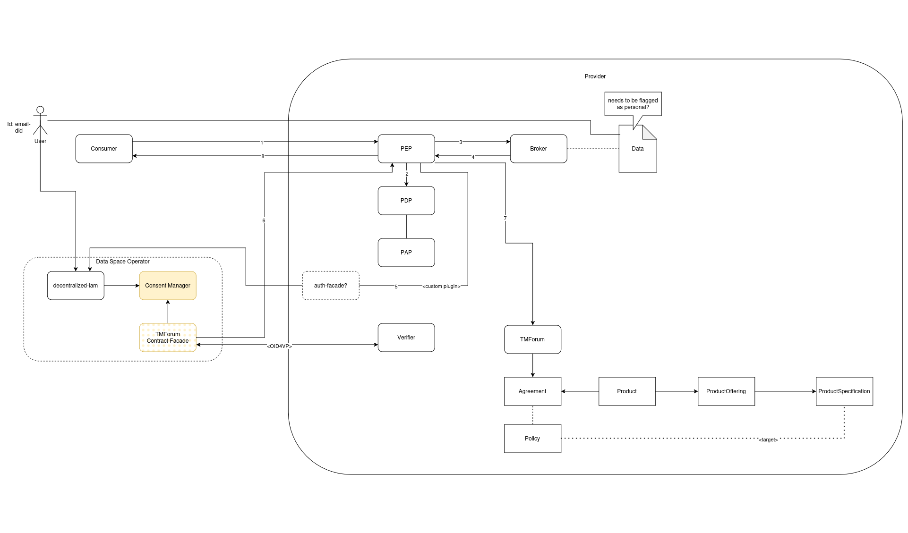
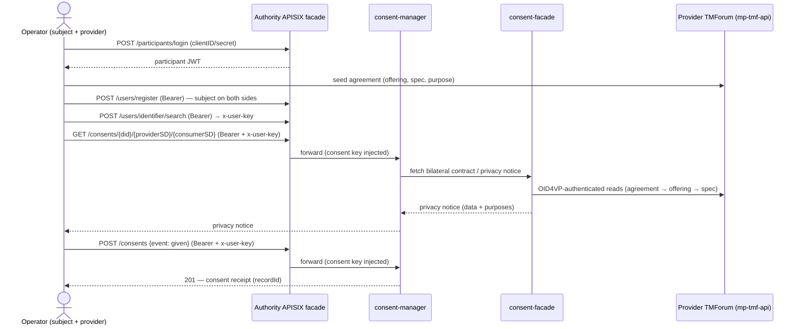
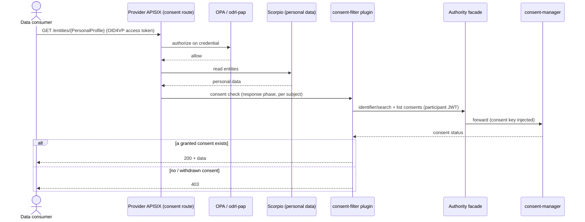
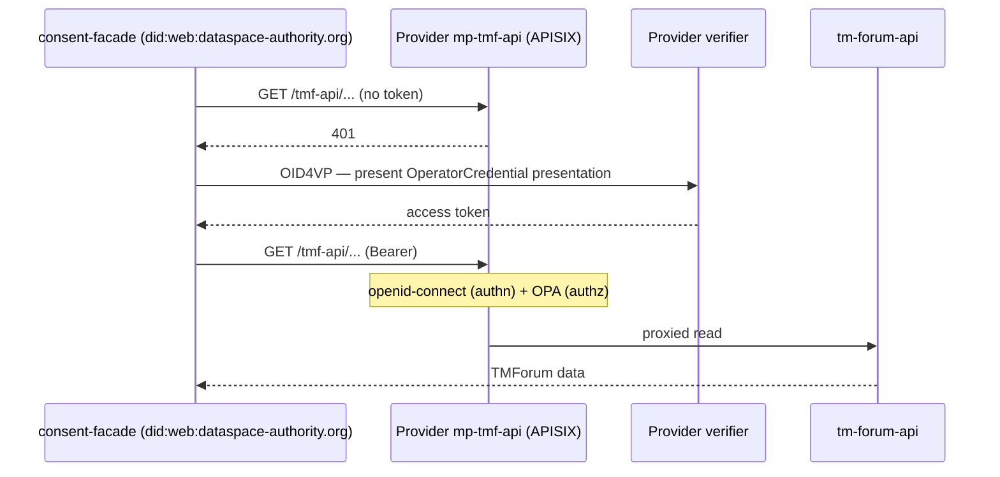

## Consent Management

Some data spaces require that access to personal data is backed by the **explicit consent** of the data subject, recorded in an auditable way. The Data Space Connector can deploy an optional consent-management layer based on the [Prometheus-X / Visions consent-manager](https://github.com/VisionsOfficial/consent-manager), producing [ISO/IEC TS 27560](https://www.iso.org/standard/80392.html) consent records, and enforce them at the gateway through the existing ODRL/OPA authorization stack.

> :warning: This is a **reference integration**: the consent-manager runs **unmodified** and is kept cluster-internal (no ingress), and the demo uses example credentials. Before production use, harden the credentials, expose the data-subject consent UI over ingress + TLS + auth, and run the authority in its own environment.

## Architecture

Consent management spans **two namespaces**: a central **authority** (the trust-anchor - it knows all participants; in real deployments the consent-manager is operated by such a central authority, typically in its own environment) and the **provider** that serves the personal data.



### Components

**Authority** (trust-anchor namespace). The authority is deployed as **two releases** in the same namespace, split along the chart boundary:

* the **`trust-anchor` release** (the [`charts/trust-anchor`](../charts/trust-anchor) chart) carries the consent **data plane** - the consent-manager, the consent-facade and their managed MongoDB - turned on for the consent scenario by [`k3s/consent-trust-anchor-components.yaml`](../k3s/consent-trust-anchor-components.yaml);
* the **`consent-authority` release** (the [`charts/data-space-connector`](../charts/data-space-connector) umbrella chart, via [`k3s/consent-trust-anchor.yaml`](../k3s/consent-trust-anchor.yaml)) carries the **IAM** that backs consent - the keycloak issuer, the `did:web:dataspace-authority.org` helper (which provisions the `dataspace-authority.org-tls` secret the facade mounts), the vc-operator (which mints the `vc-operator-credential` the facade presents) and the APISIX facade route.

The two releases share the namespace and reference each other by well-known name (the facade route reads `consent-manager-secret` and targets the `consent-manager` service; the facade pod mounts the did/credential secrets), so no cross-release value plumbing is needed.

* **consent-manager** (`consent-manager:3000`, *trust-anchor release*) - stores and serves the consent records/receipts (Node/MongoDB) on a managed MongoDB replica set. It derives its privacy notices from the contract-service API the consent-facade serves (`CONTRACT_SERVICE_BASE_URL` → `consent-facade.trust-anchor.svc.cluster.local`). Run **unmodified**.
* **APISIX facade route** (*consent-authority release*) - an internal APISIX in front of the consent-manager (route `/consent-manager/*`). It authenticates callers **per participant** (`jwt-auth`, keyed on the token's `participant_name`) and **injects** the shared consent key server-side (read from `consent-manager-secret`), so callers present only their own participant JWT and never hold the consent key. Not exposed via ingress.
* **consent-facade** (`consent-facade:8080`, *trust-anchor release*) - a Micronaut service ([wistefan/consent-facade](https://github.com/wistefan/consent-facade)) that projects a provider's TMForum APIs (agreements, catalog, party) into the contract-service API the consent-manager consumes: bilateral contracts, catalog self-descriptions, and participant self-descriptions at `/participants/{tmforum-org-id}`. It runs at the authority so it can front **multiple providers**, authenticating its outbound TMForum reads to each provider's OID4VP-protected `mp-tmf-api` as `did:web:dataspace-authority.org`.
* **consent secret** (`consent-manager-secret`, *trust-anchor release*) - the session/JWT/OAuth secrets and the shared consent key; read by the consent-manager and, cross-release, by the APISIX facade route.

**Provider** (the [`k3s/consent-provider.yaml`](../k3s/consent-provider.yaml) overlay):

* **consent-filter plugin** - an APISIX external plugin on the `mp-data-service-consent` route. It is the **canonical (and only) consent-enforcement path**: OPA/odrl-pap authorizes each request on the presented *credential*, and the plugin then gates on the data subject's *consent* by calling the authority's consent-manager (through the facade).

### Trust & authentication

* **Callers → consent-manager**: every `/consent-manager/*` call goes through the authority facade, which validates a **per-participant JWT** (`jwt-auth`; one APISIX consumer per participant, keyed on `participant_name`, signed with the consent-manager's `JWT_SECRET_KEY`) and injects the shared consent key downstream. `/participants/login` is exempt (it issues the token). Participants obtain their token by logging in with their `clientID`/`clientSecret`.
* **consent-facade → provider TMForum**: the facade authenticates its reads to the provider's OID4VP-protected `mp-tmf-api` by presenting a verifiable credential (holder `did:web:dataspace-authority.org`, an `OperatorCredential`) over OID4VP; the provider's verifier issues an access token, and the request passes the route's `openid-connect` (authn) and OPA (authz) checks.
* **Consumer → personal data**: two gates on the `mp-data-service-consent` route - OPA authorizes the credential, then the consent-filter plugin (in the response phase) gates on consent.

The detailed component diagram (drawio source [`consent.drawio`](img/consent/consent.drawio)):



## Flows

The [Demo](#demo-consent-gated-access-to-personal-data) below walks these through as executable steps.

### Granting consent

A participant (acting for the data subject) records a granted consent. Every consent-manager call goes through the authority facade with a participant JWT; the privacy notice is projected by the consent-facade from a TM Forum agreement.



### Consent-gated data access

A consumer reads personal data through the `mp-data-service-consent` route. OPA authorizes the credential; the consent-filter plugin then decides on consent in the response phase, so the decision can be made per data subject in the body.



### Authenticated projection (consent-facade → provider)

When the consent-facade reads a provider's TMForum data (to serve self-descriptions and project privacy notices) it authenticates with a verifiable credential over OID4VP - the same protection any cross-organisation data access uses.



### Enabling

Consent management is **opt-in** via the dedicated `consent` maven profile. It is
spread across three overlays:

* [`k3s/consent-provider.yaml`](../k3s/consent-provider.yaml) (layered on `provider.yaml`) - the provider's **consent-filter plugin** only.
* [`k3s/consent-trust-anchor-components.yaml`](../k3s/consent-trust-anchor-components.yaml) (layered on `trust-anchor.yaml`) - the consent **data plane** (consent-manager + consent-facade + managed MongoDB), added to the **`trust-anchor` release** (`charts/trust-anchor`).
* [`k3s/consent-trust-anchor.yaml`](../k3s/consent-trust-anchor.yaml) - the **`consent-authority` release** (`charts/data-space-connector`) with the **IAM** that backs consent (keycloak issuer, `did:web` helper, APISIX facade route, vc-operator).

The provider overlay disables both the consent-manager and the consent-facade (they run
at the authority) and keeps the plugin:

```yaml
consentManagement:
  enabled: true
  consentManager:
    enabled: false   # the consent-manager runs at the trust-anchor, not the provider
  consentFacade:
    enabled: false   # the consent-facade also runs at the trust-anchor (it fronts multiple providers)
```

The shared `consentKey` (`X_VISIONSTRUST_CONSENT_KEY`) is set on the data-plane side in [`k3s/consent-trust-anchor-components.yaml`](../k3s/consent-trust-anchor-components.yaml) (`consentManagement.consentKey`), seeded into `consent-manager-secret`; the consent-manager validates it and the `consent-authority` release's facade route injects it (reading it from that same secret by name), so callers never hold it.

Deploy the consent scenario with `mvn clean deploy -Pconsent`. That profile builds
and imports the `consent-manager:local` image, layers the consent data plane onto the
`trust-anchor` release (consent-manager + consent-facade + MongoDB) and the IAM onto the
`consent-authority` release, plus the provider's consent-filter plugin. A plain
`mvn clean deploy -Plocal` brings up the connector **without** consent management.

> :bulb: The consent-manager, its APISIX facade, the **consent-facade** and MongoDB all run in the `trust-anchor` namespace; the provider runs only the consent-filter plugin (inside its own APISIX). Check with `kubectl -n trust-anchor get pods` (consent-manager, consent-facade, `consent-authority-apisix`, `mongodb`).

### Working with consent records

The consent-manager is intentionally **not exposed via an ingress**; reach it through its authority
**APISIX facade** - the front door that authenticates callers per-participant (`jwt-auth`) and injects
the shared consent key server-side, so you present a participant token (`Authorization: Bearer`) and
never hold the consent key. Port-forward the facade and set the same `$CM` base the
[Demo](#demo-consent-gated-access-to-personal-data) uses:

```shell
  kubectl -n trust-anchor port-forward svc/consent-authority-apisix-gateway 3001:80
  export CM=http://localhost:3001/consent-manager/v1
```

> :key: **Reproducing the plugin's two calls by hand.** The plugin obtains these itself (it logs in with the participant client credentials and reads `/participants/me`), but to run the two calls manually you need the same two values tied to the provider participant: a *participant token* - a JWT signed with the consent-manager's `JWT_SECRET_KEY` (secret `consent-manager-secret`, key `jwtSecret`) whose `sub` is the provider participant's `_id` - and the *provider self-description* URL, which the consent-facade serves at `http://consent-facade.trust-anchor.svc.cluster.local:8080/participants/{tmforum-org-id}` (the facade runs in the trust-anchor namespace, alongside the consent-manager). Mint the token inside the pod (the participant must already exist):
>
> ```shell
>   kubectl -n trust-anchor exec deploy/consent-manager -- node -e '
>     const jwt = require("jsonwebtoken");
>     const mongoose = require("mongoose");
>     const Participant = require("/usr/src/app/dist/src/models/Participant/Participant.model").default;
>     (async () => {
>       await mongoose.connect(process.env.MONGO_URI);
>       const p = await Participant.findOne({ clientID: "consent-demo-provider" });
>       console.log("token:", jwt.sign({ sub: String(p._id) }, process.env.JWT_SECRET_KEY));
>       console.log("providerSd:", p.selfDescriptionURL);
>       await mongoose.disconnect();
>     })();'
> ```

An identity in the consent-manager is a **`UserIdentifier`** - a record that binds an **e-mail** to a **participant** (`attachedParticipant`). The consent-manager keys its lookup and cross-participant matching on that `email` field, so the DSC uses the **access-token `sub` as-is** as the value (it may be a `did:key:…` or a real e-mail; either is stored verbatim). A consent record is thus tied to whatever `sub` appears in the presented credential's access token.

#### Registering a user identity (must happen before it can be resolved)

```shell
  mkdir cert
  chmod o+rw cert
  docker run -v $(pwd)/cert:/cert quay.io/wi_stefan/did-helper:0.1.1
  # unsecure, only do that for demo
  sudo chmod -R o+rw cert/private-key.pem
```

The `identifier/search` call below only finds a `UserIdentifier` that has been **registered first**. In the consent-manager's own model a participant registers one of its users' identifiers itself, authenticated with a **participant JWT** (`sub` = the participant's id in the consent-manager):

```shell
  curl -s -X POST $CM/users/register \
    -H 'Content-Type: application/json' \
    -H "Authorization: Bearer <participantToken>" \
    -d '{ "email": "did:key:zDnaeeWrPc6G8GQEpBgLJGwPdFtHK1Mk7JbYhQyFu8waJNLBx" }'
  # -> the created UserIdentifier (attachedParticipant = the participant from the token)
```

The `email` is the holder DID; a throw-away one can be minted with the [did-helper](https://github.com/wistefan/did-helper) (`docker run -v $(pwd)/cert:/cert quay.io/wi_stefan/did-helper:0.1.1`, then read `cert/did.json`). The PDI `User` account itself is created with `POST /v1/users/signup`, and a background matcher links identifiers that share an e-mail across participants.

> :warning: **Nothing registers users automatically.** The consent-manager is deployed **empty**, so out of the box `identifier/search` returns `userIdentifierExists: false`. The [Demo](#demo-consent-gated-access-to-personal-data) below performs this bootstrap through the consent-manager API - it registers the provider/consumer participants and the subject's `UserIdentifier` (`email` = the holder DID) before recording the granted consent.

Once an identity is registered, the consent-filter plugin that gates access resolves and checks consent with a **two-call chain** against the consent-manager:

1. Resolve the DID to a `UserIdentifier`. The consent-manager requires the shared consent key on this
   endpoint; through the facade you present your **participant JWT** and the facade injects that key.
   `selfDescription` must be the **provider self-description** (`providerSd`) the consent-facade serves
   at `/participants/{tmforum-org-id}` - the value `GET /participants/me` returns for the provider
   participant:
```shell
  curl -s -X POST $CM/users/identifier/search \
    -H 'Content-Type: application/json' \
    -H "Authorization: Bearer <participantToken>" \
    -d '{
          "selfDescription": "http://consent-facade.trust-anchor.svc.cluster.local:8080/participants/urn:ngsi-ld:organization:<id>",
          "email": "did:key:zDnaeeWrPc6G8GQEpBgLJGwPdFtHK1Mk7JbYhQyFu8waJNLBx"
        }' | jq .
  # -> { "participantExists": true, "userIdentifierExists": true, "userIdentifier": "<id>", ... }
```
2. List that user's consents (auth: a provider participant JWT signed with the consent-manager's `JWT_SECRET_KEY`, `sub` = the provider participant id); the plugin allows only if some consent has `status == "granted"`:
```shell
  curl -s "$CM/consents/participants/<userIdentifier>?receipt=true" \
    -H "Authorization: Bearer <participantToken>" | jq '.consents[] | .status'
```

> :warning: `GET /consents/participants/...` **always builds a receipt** for every consent, which HTTP-fetches each participant's `selfDescriptionURL` and reads `legalPerson.legalAddress` from it. So the participants' `selfDescriptionURL` **must** resolve to a valid self-description - the consent-facade serves these at `/participants/{tmforum-org-id}` (backed by the party API), which is why each participant is backed by a real TMForum organization (created by the Demo below - step 3a provisions both the provider and consumer orgs). A participant whose SD URL 404s makes this call return `500`, which the plugin treats as "no consent".

The full give-consent flow additionally needs a bootstrapped privacy notice - the consent-facade projects one from a TM Forum agreement. The [Demo](#demo-consent-gated-access-to-personal-data) below grants and revokes consent end to end through the consent-manager API (registering the participants and subject, seeding the agreement, then `POST /v1/consents`), with no direct database writes.

### Enforcing consent on a concrete service

Consent is enforced on the data path by the **APISIX consent-filter plugin** - the canonical, only enforcement path (used by the [demo below](#demo-consent-gated-access-to-personal-data)). A custom external plugin attached to the `mp-data-service-consent` route runs the **two-call consent check** against the consent-manager on every request - resolve the subject's `userIdentifier` (`POST /v1/users/identifier/search`, authenticated with the `consent_key`), then list its consents (`GET /v1/consents/participants/{id}`, authenticated with the participant token) - and blocks unless a granted consent exists for the credential subject. OPA still authorizes the request on the *credential* first; the plugin adds the *consent* gate on top, keeping the access policy free of consent logic. The plugin authenticates with participant **client credentials** — it reads `client_id`/`client_secret` (the `consent_key` is injected by the facade), logs in via `/participants/login` for a (refreshing) participant token, and derives the provider self-description from `/participants/me`. Those credentials are **stable** (`consent-demo-provider`/`demo`, registered for the provider participant in step 3a and matching the provider plugin's `consent-plugin-credentials`), so no per-seed value is wired into the plugin.

The check runs in the **response phase** (`ext-plugin-post-resp`) rather than pre-request: a personal-data read can return entities belonging to several data subjects, and gating on the response lets the decision be made per subject in the body rather than only on the caller's token. The alternative - the odrl-pap `consent:hasValidConsent` PIP evaluating consent inside OPA - is **not used**; consent is decided by the plugin, and odrl-pap/OPA handles only credential authorization.

The intended end-to-end behaviour is:

1. Authenticate via OID4VP (see the [demo prerequisites](#demo-consent-gated-access-to-personal-data)) and call the service **without** a consent record &rarr; **403**.
2. Grant consent for the holder DID in the consent-manager (see above) &rarr; the same request now returns **200**.
3. Revoke the consent &rarr; the request returns **403** again.

> :bulb: The consent-filter plugin implements the two-call check directly and gates the `mp-data-service-consent` route end to end (grant → 200 / revoke → 403, see [`verify_consent_flow.sh`](scripts/verify_consent_flow.sh)).

> :warning: A full local bring-up of the provider **with** consent management is resource-hungry; the &ge;24 GB recommendation in the [Requirements](#requirements) applies.

### Access audit log

The consent-filter plugin can record **every access decision** (who accessed what, under which decision) to the OpenTelemetry Collector, kept **separate from traces**. When `audit_enabled` is set in the route conf, the plugin emits one **OTLP/HTTP log record** per request to `audit_otlp_endpoint` (`…/v1/logs`), stamped with resource `service.name=consent-access-audit` and log attributes `event.domain=audit`, `consent.decision` (allow/deny), `consent.reason`, `enduser.id` (the subject), `http.request.method`, `url.path`, `http.request.id`. Emission is **asynchronous and best-effort** - it never blocks or changes the access decision, and drops (with a counter) if the Collector is slow/absent; durability and retention are the Collector's sink's job, not the plugin's.

Enable it in two steps:

1. Deploy the Collector (`opentelemetry-collector.enabled: true`) and set `audit_enabled: true` on the `mp-data-service-consent` route in [`k3s/provider.yaml`](../k3s/provider.yaml) (the endpoint defaults to `http://provider-opentelemetry-collector:4318`). The endpoint may also be supplied out-of-band via the `CONSENT_AUDIT_OTLP_ENDPOINT` env var.
2. Give the Collector a **`logs/audit` pipeline** that routes on the marker to a durable, append-only sink - separate from the traces pipeline:

```yaml
# routes audit records (service.name=consent-access-audit) to their own sink;
# because the plugin is the only logs source today, a plain logs pipeline suffices.
service:
  pipelines:
    logs:
      receivers: [otlp]
      processors: [memory_limiter, batch]
      exporters: [file/audit]      # or opensearch/audit, kafka/audit, ...
```

If you later ingest other logs too, split them with the `routing` connector on `service.name == "consent-access-audit"` (see the OTEL notes). The plugin only *routes* the audit stream out; immutability/retention is enforced by the chosen sink (WORM volume, OpenSearch audit index with restricted deletes, Kafka→immudb, …). The **consent record** itself (its TS 27560 lifecycle log) is a separate concern that lives in the consent-manager, not here.

### Demo: consent-gated access to personal data

This walkthrough shows the core consent story end to end: a data subject publishes personal data at the provider, a consumer is **denied** access until the subject **grants consent**, after which the identical request **succeeds**.

> :bulb: **Two enforcement layers.** The `mp-data-service-consent` route runs each request through **two** gates: first OPA (fed by odrl-pap) authorizes the call on the presented *credential*, then the custom **consent-filter** APISIX plugin gates it on the data subject's *consent* by calling the consent-manager. This walkthrough exercises exactly that split - OPA must **allow** the `PersonalProfile` read (step 0) so that the **plugin** is the component that denies the access when no consent exists and permits it once consent is granted. The data requests therefore target the plugin-enforced host `mp-data-service-consent.127.0.0.1.nip.io`; the access token is still obtained from `mp-data-service.127.0.0.1.nip.io`, which serves the OIDC discovery.

> :bulb: Step **1** (publishing data) and step **3** (grant/revoke consent, via the consent-manager API) are verified against the live cluster. Steps **0/2/4** exercise the OPA-allow + consent-plugin path, where the plugin performs the two-call check against the consent-manager.

**Prerequisites.** Deploy the data space with consent management enabled (`mvn clean deploy -Pconsent`, see [Enabling](#enabling)). All commands below are run from the repository root. The grant step reaches the consent-manager and TM Forum API through `kubectl port-forward`, so point `KUBECONFIG` at the local cluster:

```shell
  export KUBECONFIG=$(pwd)/target/k3s.yaml
```

Then, on the consumer side, generate a holder identity and issue the credential the demo presents - the same steps as in the [local deployment guide](deployment-integration/local-deployment/LOCAL.MD#the-data-consumer), repeated here so this walkthrough is self-contained.

1. Generate the consumer's holder key material (a `did:key` plus signing key under `cert/`, read by `get_access_token_oid4vp.sh`):

```shell
  mkdir -p cert && chmod o+rw cert
  docker run -v $(pwd)/cert:/cert quay.io/wi_stefan/did-helper:0.1.1
  # unsecure, demo only:
  sudo chmod -R o+rw cert/private-key.pem
```

2. Issue a `UserCredential` for the consumer's `employee` user and keep it in `$USER_CREDENTIAL`:

```shell
  export USER_CREDENTIAL=$(./doc/scripts/get_credential.sh https://keycloak-consumer.127.0.0.1.nip.io user-credential employee); echo ${USER_CREDENTIAL}
```

**0. Allow the read at OPA - consent is left to the plugin.** Register a policy that permits *read* of `PersonalProfile` entities to any credential holder (`vc:any`). It carries **no** consent refinement: OPA authorizes purely on the credential, so the request reaches the consent-filter plugin, which is the component that decides on consent. (Without this policy OPA denies the call outright and the plugin never runs.)

```shell
  curl -k -x localhost:8888 -s -X POST https://pap-provider.127.0.0.1.nip.io/policy \
    -H 'Content-Type: application/json' \
    -d '{
          "@context": { "odrl": "http://www.w3.org/ns/odrl/2/" },
          "@id": "https://mp-operation.org/policy/common/personalProfileRead",
          "odrl:uid": "https://mp-operation.org/policy/common/personalProfileRead",
          "@type": "odrl:Policy",
          "odrl:permission": {
            "odrl:assigner": { "@id": "https://www.mp-operation.org/" },
            "odrl:target": {
              "@type": "odrl:AssetCollection",
              "odrl:source": "urn:asset",
              "odrl:refinement": [
                { "@type": "odrl:Constraint", "odrl:leftOperand": "ngsi-ld:entityType", "odrl:operator": { "@id": "odrl:eq" }, "odrl:rightOperand": "PersonalProfile" }
              ]
            },
            "odrl:assignee": { "@id": "vc:any" },
            "odrl:action": { "@id": "odrl:read" }
          }
        }'
```

**1. The subject publishes personal data.** The data owner creates a `PersonalProfile` entity in the provider's context broker (via the demo scorpio ingress):

```shell
  curl -k -x localhost:8888 -s -X POST https://scorpio-provider.127.0.0.1.nip.io/ngsi-ld/v1/entities \
    -H 'Content-Type: application/json' \
    -d '{
      "id": "urn:ngsi-ld:PersonalProfile:alice",
      "type": "PersonalProfile",
      "email": { "type": "Property", "value": "alice@example.org" },
      "loyaltyPoints": { "type": "Property", "value": 4200 }
    }'
```

**2. The consumer requests the data &rarr; access denied.** Authenticate the consumer via OID4VP - the `get_access_token_oid4vp.sh` helper builds the `vp_token` from the `cert/` identity created in the prerequisites - and read the entity through the plugin-enforced host. OPA now authorizes the read (step 0), but no consent exists yet, so the **consent-filter plugin** denies the request:

```shell
  export ACCESS_TOKEN=$(./doc/scripts/get_access_token_oid4vp.sh https://mp-data-service.127.0.0.1.nip.io $USER_CREDENTIAL default); echo ${ACCESS_TOKEN}
  curl -k -x localhost:8888 -s -o /dev/null -w 'HTTP %{http_code}\n' \
    -X GET 'https://mp-data-service-consent.127.0.0.1.nip.io/ngsi-ld/v1/entities/urn:ngsi-ld:PersonalProfile:alice' \
    -H "Authorization: Bearer ${ACCESS_TOKEN}"
  # -> HTTP 403 (denied by the consent-filter plugin, not by OPA)
```

**3. The subject grants consent.** The plugin gates on the **access-token `sub`** (here the holder DID from `cert/`, which the consent-manager stores as the identity) - *not* the credential's `credentialSubject.id`. So extract the subject from the token obtained in step 2, and grant for that value:

```shell
  export SUBJECT_DID=$(echo "${ACCESS_TOKEN}" | cut -d. -f2 | base64 -d 2>/dev/null | jq -r .sub); echo ${SUBJECT_DID}
```

The consent-manager is deployed empty. Rather than seeding Mongo, the demo records consent through
the **real give-consent API** (no direct database writes): it registers the two participants, seeds a
TM Forum **agreement** (which the consent-facade projects into a privacy notice), registers the
subject, then `POST /v1/consents`. Every consent-manager call goes through the authority's **APISIX
facade** (`consent-authority-apisix-gateway`, route `/consent-manager/*`): it authenticates the caller
**per participant** with their JWT (`jwt-auth`) and injects the shared consent key server-side - so you
authenticate with a participant token (`Authorization: Bearer`) and never hold the consent key.
Port-forward that facade and the provider's TM Forum API. `FACADE` is a **cluster** URL on purpose - it
is stored in the consent-manager and dereferenced by it *in-cluster*, so it must be the service FQDN,
not `localhost`:

```shell
  kubectl -n trust-anchor port-forward svc/consent-authority-apisix-gateway 3001:80
  kubectl -n provider     port-forward svc/tm-forum-api-svc 8090:8080
  kubectl -n trust-anchor port-forward svc/consent-authority-apisix-admin 9180:9180   # apisix admin: jwt-auth consumers (3a)
  kubectl -n trust-anchor port-forward svc/consent-manager 3000:3000                  # direct CM: one-time provider bootstrap (3a)

  export CM=http://localhost:3001/consent-manager/v1   # -> the authority APISIX facade -> consent-manager
  export CM_DIRECT=http://localhost:3000/v1            # the consent-manager directly - authority bootstrap only (3a)
  export TMF=http://localhost:8090/tmf-api
  export FACADE=http://consent-facade.trust-anchor.svc.cluster.local:8080
  export DID=$SUBJECT_DID
```

> :warning: **Every `$CM` call must go through the facade** (`localhost:3001` must be the
> `consent-authority-apisix-gateway` port-forward, **not** the consent-manager). The calls below
> authenticate per-participant with the participant JWT (`Authorization: Bearer`); the facade
> validates it and injects the shared consent key server-side. A common trap: a **leftover
> `svc/consent-manager 3001:3000` port-forward** from an earlier run keeps holding port `3001`, so
> starting the gateway port-forward fails silently (`address already in use`) and `localhost:3001`
> still reaches the consent-manager directly. Symptoms of hitting the consent-manager directly:
>
> - **`3a` login** returns HTML `Cannot POST /consent-manager/v1/participants/login` (Express 404 -
>   the consent-manager has no `/consent-manager` prefix; the facade strips it).
> - other calls return `{"message":"Authorization header missing or invalid"}` (the consent key is
>   never injected).
>
> Fix it by killing the stale forward and re-establishing the gateway one:
>
> ```shell
>   pkill -f 'port-forward.*3001'; sleep 1
>   kubectl -n trust-anchor port-forward svc/consent-authority-apisix-gateway 3001:80 &
>   # confirm you are on the facade (a no-auth request is rejected by APISIX jwt-auth, not Express):
>   curl -s -X POST $CM/users/identifier/search -d '{}'
>   # {"message":"Missing JWT token in request"}  -> facade (correct); the 3a calls add the Bearer token
> ```
>
> The participant token expires after 1 h; if a call starts failing with an *invalid JWT* error,
> re-run the login in 3a to refresh `$PROVIDER_JWT` (and `$CONSUMER_JWT`).

**3a. Participants.** Nothing pre-registers participants, so first **bootstrap the provider
participant** (a one-time authority-operator action), then log in as it and create the consumer.

Registering the *first* participant goes **directly** to the consent-manager (`$CM_DIRECT`, the
`svc/consent-manager` port-forward on `3000`): there is no participant token yet, so it cannot pass the
facade's per-participant `jwt-auth` (the consumer below, by contrast, is created *through* the facade
with the provider's token). `POST /participants` is the onboarding entry point and is unauthenticated;
`clientID`/`clientSecret` **must** match the provider consent-filter plugin's credentials.

```shell
  # --- authority bootstrap: register the provider participant (direct to the consent-manager) ---
  # 1) find-or-create the provider's backing TMForum org (gives a stable selfDescriptionURL)
  export PROV_ORG=$(curl -s "$TMF/party/v4/organization?limit=1000" \
    | jq -r 'map(select(.name=="Consent Demo Provider"))[0].id // empty')
  [ -n "$PROV_ORG" ] || export PROV_ORG=$(curl -s -X POST $TMF/party/v4/organization -H 'Content-Type: application/json' \
    -d '{"name":"Consent Demo Provider","tradingName":"Consent Demo Provider","isLegalEntity":true,
         "organizationType":"company","contactMedium":[{"characteristic":{"country":"DE"}}],
         "partyCharacteristic":[{"name":"did","value":"did:web:mp-operations.org"}]}' | jq -r .id); echo $PROV_ORG
  export PROVIDER_SD=$FACADE/participants/$PROV_ORG
  # 2) register the participant (201 new / 409 already exists)
  curl -s -w '%{http_code}\n' -X POST $CM_DIRECT/participants -H 'Content-Type: application/json' \
    -d "{\"legalName\":\"M&P Operations Inc.\",\"email\":\"provider@mp-operation.org\",
         \"did\":\"did:web:mp-operations.org\",\"clientID\":\"consent-demo-provider\",
         \"clientSecret\":\"demo\",\"selfDescriptionURL\":\"$PROVIDER_SD\"}"
  # 3) provision its facade jwt-auth consumer (keyed on legalName / participant_name)
  export JWT_SECRET=$(kubectl -n trust-anchor get secret consent-manager-secret -o jsonpath='{.data.jwtSecret}' | base64 -d)
  curl -s -X PUT http://localhost:9180/apisix/admin/consumers -H 'X-API-KEY: admin' \
    -d '{"username":"M_P_Operations_Inc_","plugins":{"jwt-auth":{"key":"M&P Operations Inc.","secret":"'"$JWT_SECRET"'","algorithm":"HS256"}}}'

  # --- the provider now has an identity: log in through the facade ---
  export PROVIDER_JWT=$(curl -s -X POST $CM/participants/login -H 'Content-Type: application/json' \
    -d '{"clientID":"consent-demo-provider","clientSecret":"demo"}' | jq -r .jwt); echo $PROVIDER_JWT
  export PROVIDER_SD=$(curl -s $CM/participants/me -H "Authorization: Bearer $PROVIDER_JWT" | jq -r .selfDescriptionURL)
  export PROV_ORG=${PROVIDER_SD##*/participants/}          # the backing TM Forum org id

  # create the consumer TM Forum org -> its self-description
  export CONS_ORG=$(curl -s -X POST $TMF/party/v4/organization -H 'Content-Type: application/json' \
    -d '{"name":"Consent Demo Consumer","tradingName":"Consent Demo Consumer","isLegalEntity":true,
         "organizationType":"company","contactMedium":[{"characteristic":{"country":"DE"}}],
         "partyCharacteristic":[{"name":"did","value":"did:web:fancy-marketplace.biz"}]}' | jq -r .id); echo $CONS_ORG
  export CONSUMER_SD=$FACADE/participants/$CONS_ORG

  # register the consumer participant (201, or 409 if it already exists), then log in as it.
  # POST /participants sits behind the facade's per-participant jwt-auth, so authenticate the
  # call with the existing provider token.
  curl -s -w '%{http_code}\n' -X POST $CM/participants -H 'Content-Type: application/json' \
    -H "Authorization: Bearer $PROVIDER_JWT" \
    -d "{\"legalName\":\"Fancy Marketplace Co.\",\"email\":\"consumer@fancy-marketplace.biz\",
         \"did\":\"did:web:fancy-marketplace.biz\",\"clientID\":\"consent-demo-consumer\",
         \"clientSecret\":\"demo\",\"selfDescriptionURL\":\"$CONSUMER_SD\"}"
  export CONSUMER_JWT=$(curl -s -X POST $CM/participants/login -H 'Content-Type: application/json' \
    -d '{"clientID":"consent-demo-consumer","clientSecret":"demo"}' | jq -r .jwt); echo $CONS_ORG

  # Onboard the consumer to the facade - exactly like the provider bootstrap above: provision its
  # jwt-auth consumer (keyed on participant_name / legalName, signed with the consent-manager JWT
  # secret), otherwise its token is rejected at the facade with 401. In a real dataspace each
  # participant does this itself at onboarding. Uses the APISIX admin API (port-forwarded above):
  export JWT_SECRET=$(kubectl -n trust-anchor get secret consent-manager-secret -o jsonpath='{.data.jwtSecret}' | base64 -d)
  curl -s -X PUT http://localhost:9180/apisix/admin/consumers -H 'X-API-KEY: admin' \
    -d '{"username":"Fancy_Marketplace_Co_","plugins":{"jwt-auth":{"key":"Fancy Marketplace Co.","secret":"'"$JWT_SECRET"'","algorithm":"HS256"}}}'
```

**3b. Contract source (the EDC stand-in).** In production the provider↔consumer **agreement** is
written by the Marketplace / EDC contract negotiation; the facade only *projects* it. The demo has no
negotiation, so it creates a product specification (carrying the `purpose` characteristic), an
offering, and the agreement through the TM Forum API:

```shell
  export SPEC_ID=$(curl -s -X POST $TMF/productCatalogManagement/v4/productSpecification \
    -H 'Content-Type: application/json' -d @- <<JSON | jq -r .id
{ "name": "Personal Profile", "description": "The subject's profile",
  "productSpecCharacteristic": [ { "name": "purpose", "valueType": "object",
    "productSpecCharacteristicValue": [ { "value": {
      "id": "profile-service-provision",
      "name": "Personal profile for service provision",
      "description": "Deliver the requested service.",
      "purpose": "https://w3id.org/dpv#ServiceProvision" } } ] } ] }
JSON
  ); echo $SPEC_ID

  export OFFERING_ID=$(curl -s -X POST $TMF/productCatalogManagement/v4/productOffering \
    -H 'Content-Type: application/json' \
    -d "{\"name\":\"Personal Profile Offering\",\"productSpecification\":{\"id\":\"$SPEC_ID\"}}" | jq -r .id); echo $OFFERING_ID

  export AGREEMENT_ID=$(curl -s -X POST $TMF/agreementManagement/v4/agreement \
    -H 'Content-Type: application/json' -d @- <<JSON | jq -r .id
{ "name": "Profile sharing agreement", "status": "approved",
  "agreementItem": [ { "productOffering": [ { "id": "$OFFERING_ID" } ] } ],
  "engagedParty": [ { "id": "$PROV_ORG", "role": "Provider" }, { "id": "$CONS_ORG", "role": "Consumer" } ],
  "characteristic": [
    { "name": "policy", "value": { "@type": "Set", "uid": "urn:policy:profile",
        "permission": [ { "target": "urn:asset:profile", "action": "use" } ] } },
    { "name": "provider-id", "value": "$PROVIDER_SD" },
    { "name": "consumer-id", "value": "$CONSUMER_SD" },
    { "name": "signing-date", "value": $(date +%s) } ] }
JSON
  ); echo $AGREEMENT_ID
```

**3c. Register the subject.** A `UserIdentifier` binds the holder DID to a participant; register it on
**both** sides (idempotent - a repeat registration is a no-op):

```shell
  curl -s -o /dev/null -X POST $CM/users/register -H 'Content-Type: application/json' \
    -H "Authorization: Bearer $PROVIDER_JWT" -d "{\"email\":\"$DID\",\"identifier\":\"$DID\"}"
  curl -s -o /dev/null -X POST $CM/users/register -H 'Content-Type: application/json' \
    -H "Authorization: Bearer $CONSUMER_JWT" -d "{\"email\":\"$DID\",\"identifier\":\"$DID\"}"
```

**3d. Resolve the `x-user-key` (search).** The provider-side `UserIdentifier._id` is the `x-user-key`
that selects the subject when granting. Resolve it from the holder DID via `identifier/search` - the
same lookup the consent-filter plugin does, and it works whether the identifier was just registered or
already existed. You authenticate per-participant with the **provider token**; the facade injects the
consent key this endpoint requires. `selfDescription` must be the **provider** self-description
(`$PROVIDER_SD`, the value `GET /participants/me` returns):

```shell
  export USER_KEY=$(curl -s -X POST $CM/users/identifier/search -H 'Content-Type: application/json' \
    -H "Authorization: Bearer $PROVIDER_JWT" \
    -d "{\"selfDescription\":\"$PROVIDER_SD\",\"email\":\"$DID\"}" | jq -r .userIdentifier); echo $USER_KEY
```

A non-empty `userIdentifier` (`userIdentifierExists: true`) is the key; an empty result means the
registration in 3c has not propagated yet - retry.

**3e. Grant.** Fetch the privacy notice the facade projected (it must have non-empty `data` **and**
`purposes`), then give consent for its data. These calls carry the **provider token** (per-participant
auth) *and* the **`x-user-key` header** - the `UserIdentifier._id` from 3d, which selects the subject
(the `:userId` path segment is just a placeholder the header overrides).

```shell
  export PROV_B64=$(printf '%s' "$PROVIDER_SD" | base64 -w0)
  export CONS_B64=$(printf '%s' "$CONSUMER_SD" | base64 -w0)

  export NOTICE=$(curl -s "$CM/consents/$DID/$PROV_B64/$CONS_B64" \
    -H "Authorization: Bearer $PROVIDER_JWT" -H "x-user-key: $USER_KEY")
  echo "$NOTICE" | jq '.[0] | {privacyNoticeId: ._id, data: [.data[].resource], purposes: [.purposes[].purpose]}'

  export PN_ID=$(echo "$NOTICE" | jq -r '.[0]._id')
  export DATA=$(echo "$NOTICE"  | jq -c '[.[0].data[].resource]')

  # the receipt's recordId is the consent's id (kept for the withdraw step)
  export CONSENT_ID=$(curl -s -X POST $CM/consents -H 'Content-Type: application/json' \
    -H "Authorization: Bearer $PROVIDER_JWT" -H "x-user-key: $USER_KEY" \
    -d "{\"privacyNoticeId\":\"$PN_ID\",\"event\":\"given\",\"data\":$DATA}" | jq -r .record.recordId); echo "granted, consent id: $CONSENT_ID"
```

A `201` with a receipt is the grant. The consent-filter plugin now sees it: it authenticates with the
stable client credentials (`consent-demo-provider`/`demo`, already in the `mp-data-service-consent`
route conf in [`k3s/provider.yaml`](../k3s/provider.yaml)) and derives the provider SD from
`/participants/me`, so no per-grant wiring is needed. (The jwt-auth consumer per participant in the
authority APISIX is provisioned by the deploy reconcile Job, not by granting.)

> :warning: **Consistency.** The consumer participant's stored `selfDescriptionURL` (3a), the
> agreement's `consumer-id` (3b), and the `consumerId` passed to the grant (3e) must be **identical**
> (likewise for the provider) - on a fresh deploy the steps satisfy this by construction. Re-running
> against a *different* consumer org while `consent-demo-consumer` already exists leaves the
> participant pinned to its original SD (`POST /v1/participants` is a no-op `409`), which mismatches
> the agreement and fails the grant with `No Matching user found`. The steps also assume a **single**
> agreement between the pair; delete stale ones (`DELETE $TMF/agreementManagement/v4/agreement/{id}`)
> if you re-seed.

**4. The consumer requests again &rarr; access allowed.** With a granted consent in place the plugin now lets the request through, and the identical call succeeds:

```shell
  export ACCESS_TOKEN=$(./doc/scripts/get_access_token_oid4vp.sh https://mp-data-service.127.0.0.1.nip.io $USER_CREDENTIAL default)
  curl -k -x localhost:8888 -s -w '\nHTTP %{http_code}\n' \
    -X GET 'https://mp-data-service-consent.127.0.0.1.nip.io/ngsi-ld/v1/entities/urn:ngsi-ld:PersonalProfile:alice' \
    -H "Authorization: Bearer ${ACCESS_TOKEN}"
  # -> the entity + HTTP 200
```

**Withdraw the consent** by terminating it (the `CONSENT_ID` from step 3 is still in scope) - its
status flips to `terminated`, so the plugin stops allowing and the very next request returns `403`
again. Access follows the subject's consent in real time:

```shell
  curl -s -X POST $CM/consents/$CONSENT_ID/terminate -H 'Content-Type: application/json' \
    -H "Authorization: Bearer $PROVIDER_JWT" -H "x-user-key: $USER_KEY" -d '{}' | jq '{recordId: .record.recordId}'
```
(Re-running the grant in step 3e issues a fresh `granted` consent, so access is allowed again.)

> :bulb: To run this whole check in one shot, use [`./doc/scripts/verify_consent_flow.sh`](scripts/verify_consent_flow.sh) - it issues the token, then drives the same give-consent API to grant → assert `200`, revoke → assert `403`, re-grant → assert `200`, and exits non-zero on any failure. Needs the `cert/` holder identity from the prerequisites above.
