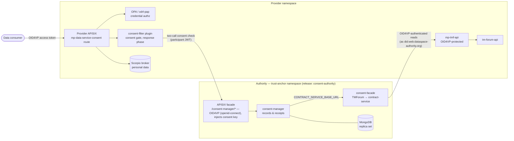
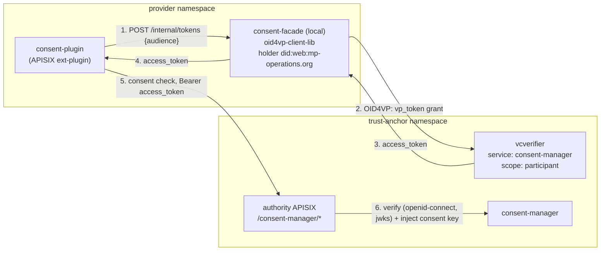
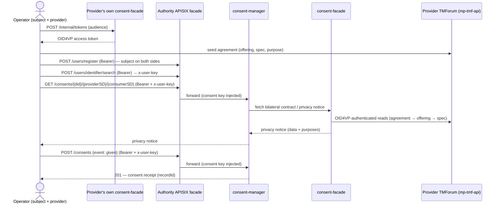
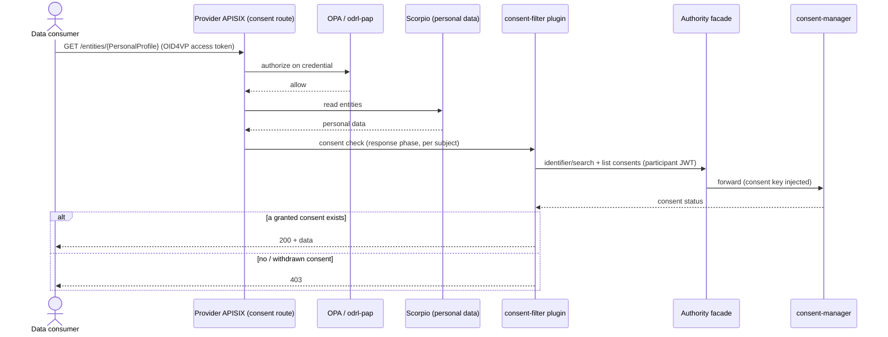
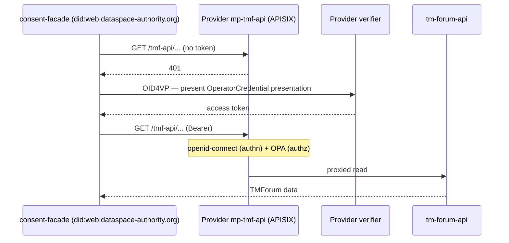

## Consent Management

Some data spaces require that access to personal data is backed by the **explicit consent** of the data subject, recorded in an auditable way. The Data Space Connector can deploy an optional consent-management layer based on the [Prometheus-X / Visions consent-manager](https://github.com/VisionsOfficial/consent-manager), producing [ISO/IEC TS 27560](https://www.iso.org/standard/80392.html) consent records, and enforce them at the gateway through the existing ODRL/OPA authorization stack.

> :warning: This is a **reference integration**: the consent-manager is kept cluster-internal (no
> ingress) and the demo uses example credentials. Before production use, harden the credentials,
> expose the data-subject consent UI over ingress + TLS + auth, and run the authority in its own
> environment. See [Known limitations](#known-limitations).

The decisions behind this integration are recorded as [ADRs](adr/README.md).

## Architecture

Consent management spans **two namespaces**: a central **authority** (the trust-anchor - it knows all participants; in real deployments the consent-manager is operated by such a central authority, typically in its own environment) and the **provider** that serves the personal data.



### Components

**Authority** (trust-anchor namespace). The authority is deployed as **two releases** in the same namespace, split along the chart boundary:

* the **`trust-anchor` release** (the [`charts/trust-anchor`](../charts/trust-anchor) chart) carries the consent **data plane** - the consent-manager, the consent-facade and their managed MongoDB - turned on for the consent scenario by [`k3s/consent-trust-anchor-components.yaml`](../k3s/consent-trust-anchor-components.yaml);
* the **`consent-authority` release** (the [`charts/data-space-connector`](../charts/data-space-connector) umbrella chart, via [`k3s/consent-trust-anchor.yaml`](../k3s/consent-trust-anchor.yaml)) carries the **IAM** that backs consent - the keycloak issuer, the `did:web:dataspace-authority.org` helper (which provisions the `dataspace-authority.org-tls` secret the facade mounts), the vc-operator (which mints the `vc-operator-credential` the facade presents) and the APISIX facade route.

The two releases share the namespace and reference each other by well-known name (the facade route reads `consent-manager-secret` and targets the `consent-manager` service; the facade pod mounts the did/credential secrets), so no cross-release value plumbing is needed.

* **consent-manager** (`consent-manager:3000`, *trust-anchor release*) - stores and serves the consent records/receipts (Node/MongoDB) on a managed MongoDB replica set. It derives its privacy notices from the contract-service API the consent-facade serves (`CONTRACT_SERVICE_BASE_URL` → `consent-facade.trust-anchor.svc.cluster.local`). Run **unmodified**.
* **APISIX facade route** (*consent-authority release*) - an internal APISIX in front of the consent-manager (route `/consent-manager/*`). It authenticates callers over **OID4VP** (`openid-connect`, `bearer_only`, against the authority verifier's JWKS) and **injects** the shared consent key server-side (read from `consent-manager-secret`), so callers present only their own access token and never hold the consent key. The gateway itself **is** published (ingress `consent-authority-apisix`, host `consent-manager.dataspace-authority.org`), so every route on it is internet-reachable and must carry its own authentication - see the `/consent-user` allow-list below.
* **consent-facade** (`consent-facade:8080`, *trust-anchor release*) - a Micronaut service ([wistefan/consent-facade](https://github.com/wistefan/consent-facade)) that projects a provider's TMForum APIs (agreements, catalog, party) into the contract-service API the consent-manager consumes: bilateral contracts, catalog self-descriptions, and participant self-descriptions at `/participants/{tmforum-org-id}`. It runs at the authority so it can front **multiple providers**, authenticating its outbound TMForum reads to each provider's OID4VP-protected `mp-tmf-api` as `did:web:dataspace-authority.org`.
* **consent secret** (`consent-manager-secret`, *trust-anchor release*) - the session/JWT/OAuth secrets and the shared consent key; read by the consent-manager and, cross-release, by the APISIX facade route.
* **direct subject access** (*optional*) - a **data subject** grants/reads consent for its *own* identity by authenticating to the consent-manager **directly** with its OID4VP access token - no facade, no `x-user-key`. The consent-manager (≥ 1.2.0) verifies external tokens whose `iss` is trusted (`consentManager.externalIdp`) via OIDC discovery + JWKS and maps the token `sub` (the holder DID) to a local `User`/`UserIdentifier`/`Participant`; the subject then uses the user-authenticated endpoints (`GET /v1/consents/me`, `POST /v1/consents/user`). The subject obtains its token from the authority verifier's **`consent-manager` service** (exposed at `https://verifier.dataspace-authority.org`). Because the verifier stamps its bare `server.host` (`https://verifier.dataspace-authority.org`) as the token `iss` but serves OIDC discovery only under a per-service path, `consentManager.externalIdp.discoveryPath` points the consent-manager at `/services/consent-manager/.well-known/openid-configuration` while the trusted `issuers` stays the bare host that matches the token. The participant `/consent-manager/*` facade route requires a token issued for the participant scope and would reject a subject token at the gateway, so subject tokens use dedicated authority-APISIX routes under **`/consent-user`** (no participant auth, no consent-key injection) that only proxy to the consent-manager - which verifies the OID4VP token itself. Because those routes apply **no gateway authentication**, they are an explicit **allow-list of (uri x method) pairs** whose handlers are `verifyUserJWT`-gated in the consent-manager, i.e. they authenticate the subject's own token: `GET /consents/me`, `GET /consents/me/{id}`, `GET /consents/exchanges/user`, `GET /users/me`, `POST /consents/user`, `DELETE /consents/{id}`, plus the deliberately-open `POST /users/signup` (self-service PDI signup, unauthenticated upstream). Everything else under `/consent-user` has no route and returns 404. The consent-manager stays unexposed (the NetworkPolicy still admits only APISIX); the subject reaches it at `https://consent-manager.dataspace-authority.org/consent-user/v1/*`.

The consent-manager and consent-facade are isolated by a **NetworkPolicy** (trust-anchor chart) so they are reachable only through the authority APISIX (and the consent-manager↔facade contract-service link) - not by arbitrary in-cluster pods.

**Provider** (the [`k3s/consent-provider.yaml`](../k3s/consent-provider.yaml) overlay):

* **consent-filter plugin** - an APISIX external plugin on the `mp-data-service-consent` route. It is the **canonical (and only) consent-enforcement path**: OPA/odrl-pap authorizes each request on the presented *credential*, and the plugin then gates on the data subject's *consent* by calling the authority's consent-manager (through the facade).

### Trust & authentication

* **Callers → consent-manager**: every `/consent-manager/*` call goes through the authority facade, which validates an **OID4VP access token** (`openid-connect`, `bearer_only`, against the authority verifier's JWKS, with `aud` checked explicitly) and injects the shared consent key downstream. The consent-manager then resolves the token subject to a `Participant` by its `did`. A participant obtains the token from **its own** consent-facade (`POST /internal/tokens`), which presents that participant's verifiable credential - so no component holds a participant secret, there is no `/participants/login`, and no APISIX consumer shares the consent-manager's `JWT_SECRET_KEY`. The details are in [Participant authentication over OID4VP](#participant-authentication-over-oid4vp) below.
* **consent-facade → provider TMForum**: the facade authenticates its reads to the provider's OID4VP-protected `mp-tmf-api` by presenting a verifiable credential (holder `did:web:dataspace-authority.org`, an `OperatorCredential`) over OID4VP; the provider's verifier issues an access token, and the request passes the route's `openid-connect` (authn) and OPA (authz) checks.
* **Consumer → personal data**: two gates on the `mp-data-service-consent` route - OPA authorizes the credential, then the consent-filter plugin (in the response phase) gates on consent.
* **Subject → consent-manager**: the `/consent-user` routes carry **no gateway authentication** by design - the
  consent-manager verifies the subject's OID4VP token itself. They are therefore an **allow-list**, not a prefix: each route
  pins both `uris` and `methods`, and every allow-listed handler is `verifyUserJWT`-gated (the one exception, `POST
  /users/signup`, is unauthenticated upstream by design).

> :warning: **Never widen `/consent-user` to a wildcard.** The authority gateway is published via ingress, so
> `uri: /consent-user/*` exposes the *entire* consent-manager API unauthenticated. Concretely it would publish endpoints
> gated only by the shared consent key - which this route does not inject, so they cannot even be used legitimately
> (`POST /v1/consents`, `GET /v1/consents/{userId}/{providerId}/{consumerId}`) - and endpoints with **no** gate at all:
> `GET /v1/consents/emailverification`, and `GET /v1/users/{userId}`, which returns the subject's name, DID and its
> `identifiers` - the `x-user-key` that authenticates **as that subject** on every `verifyUserKey` endpoint. Before adding a
> uri here, check its middleware in the consent-manager's `src/routes/*.ts`; the method pinning exists because several paths
> host differently-gated handlers per verb (`DELETE /v1/consents/{id}` is the subject's revoke, `POST /v1/consents` is the
> consent-key-gated provider-on-behalf grant).

### Participant authentication over OID4VP

Every consent check the provider makes crosses a participant boundary, and it is authenticated the
same way as every other cross-participant call in the connector: over **OID4VP**, with a holder DID,
a verifiable credential and the trust-anchor's TIR. No component holds a participant secret.

The provider's own consent-facade instance is its **OID4VP token service**: it holds the holder key,
presents the participant credential and hands the consent-plugin a short-lived access token. It does
not proxy consent traffic - the plugin keeps talking to the consent-manager directly, so the facade is
on the token-refresh path only, not on every request.



Steps 1-4 happen only on a cache miss (token expiry); step 5 is every request.

#### The facade's token endpoint

Declared in its own spec, `api/consent-facade-internal.yaml`, which holds the facade's internal
surface (this endpoint plus the `/providers` admin API) and is deliberately separate from
`api/consent-facade.yaml` - the generated contract *towards the consent-manager*. Both specs generate
Micronaut server interfaces; the internal one into `org.fiware.consent.internal.api`.

```
POST /internal/tokens
Content-Type: application/json

  { "audience": "consent-manager" }

200 OK
  { "access_token": "eyJ...", "token_type": "Bearer", "expires_in": 3540 }
```

* **`audience` is a configured name, never a URL.** The facade resolves it against its configured
  target list (url + OID4VP `client_id` + `scope` + `discoveryPath`). A caller-supplied URL would let
  anything in the namespace make the facade present the participant's credential to an arbitrary
  host, i.e. leak a signed VP naming it as holder. Unknown audience ⇒ `400`.
* **`/internal/**` is never published.** The facade ingress allow-lists only `/participants` and
  `/catalog`; reachability is further restricted by NetworkPolicy (see below).
* Tokens are cached per audience until shortly before expiry, and concurrent misses are coalesced, so
  a burst of requests costs one presentation.
* Failure mapping - the plugin fails closed, so it must be able to tell "retry later" from "will
  never work":

  | Cause | Status |
  |---|---|
  | verifier unreachable, no `vp_token` grant advertised, empty token response | `502` |
  | credential refused (not in the TIR, expired, invalid authorization request) | `403` |
  | unknown or blank audience | `400` |
  | the facade's own OID4VP setup broken (holder key, credential files) | `500` |

Each target carries its own `discoveryPath`, because a FIWARE VCVerifier serves OIDC discovery per
service (`/services/consent-manager/.well-known/openid-configuration`); asking at the host root
returns a `404` the OID4VP client tries to parse as the configuration document.

#### The verifier: one service, a scope per credential

Subjects and participants authenticate to the **same relying party** - the consent-manager. They
present different credentials (`UserCredential` vs `MembershipCredential`), but a different
credential is a different *policy*, not a different audience: the verifier stamps its **service id**
as the token's `aud`. The credential policy is therefore selected by **scope** on the single
`consent-manager` service - the pattern `k3s/provider.yaml` already uses for `data-service`:

```yaml
- id: consent-manager
  defaultOidcScope: openid
  oidcScopes:
    openid:            # the data subject's UserCredential
      credentials:
        - type: UserCredential
          ...
    participant:       # a participant's MembershipCredential
      credentials:
        - type: MembershipCredential
          trustedIssuersLists: ["*"]
          trustedParticipantsLists: ["https://tir.127.0.0.1.nip.io"]
          jwtInclusion: { enabled: true, fullInclusion: true }
```

Both scopes issue tokens with `aud: consent-manager`, so the consent-manager keeps a single expected
audience and a single `discoveryPath`.

The participant presents a **`MembershipCredential`** - the one its own keycloak already issues
(`vcCredentials` → `credentialType: membership-credential`, secret `vc-fdsc-edc-credential`,
`issuerDid: did:web:mp-operations.org`). "Member of this dataspace" is the claim that matches "I am a
participant", and it needs no additional issuer scope or credential pipeline.

> :warning: The provider mints that credential with `holderBinding.enabled: false`, so it carries no
> confirmation claim: whoever holds the JWT can present it. The credential file must therefore be
> treated as a secret; enabling holder binding is the hardening step for a real deployment.

#### The gateway route

`/consent-manager/*` authenticates with `openid-connect` against that verifier service - the same
plugin every other OID4VP-protected DSC route uses - and injects the shared consent key server-side:

```yaml
plugins:
  openid-connect:
    bearer_only: true
    use_jwks: true
    audience: consent-manager     # the token's `aud` is the verifier service id; check it explicitly
    discovery: https://verifier.dataspace-authority.org/services/consent-manager/.well-known/openid-configuration
    proxy_opts:                   # the verifier's ingress host resolves to 127.0.0.1 in-cluster
      http_proxy: http://squid-proxy.infra.svc.cluster.local:8888
      https_proxy: http://squid-proxy.infra.svc.cluster.local:8888
    ssl_verify: false             # its ingress cert is signed by the cluster CA
  proxy-rewrite:
    regex_uri: ["^/consent-manager/(.*)", "/$1"]
    headers:
      set:
        x-visionstrust-consent-key: "$env://CONSENT_KEY"
```

The `proxy_opts` are load-bearing in the local cluster: the discovery document's `issuer` and
`jwks_uri` are the verifier's **public** host (that host is the token's `iss`), CoreDNS only rewrites
`*.nip.io`, so without the forward proxy every request fails with
`failed to query the DNS server: name error` and the gateway answers `401`.

There is deliberately **no `/participants/login` route**: nothing issues consent-manager-signed
participant tokens, and that endpoint is an unauthenticated credential exchange.

#### Resolving the token to a participant

The consent-manager verifies externally-issued OID4VP tokens (`consentManager.externalIdp`) and maps
the verified subject to a local identity - the same mechanism the data-subject path uses.
`mapExternalSubjectToLocal` resolves the subject against `Participant.findOne({ did: subject })`
alongside the `UserIdentifier`/`User` lookup, and `verifyParticipantJWT` requires that a participant
was found.

Because `did` is the key an external token authenticates through, a DID must not be claimable twice -
two participants sharing one would make that lookup arbitrary, i.e. one participant authenticated as
another. `registerParticipant` guards it at write time with a `findOne` + `409`, beside the existing
`clientID` check, for any non-empty `did` (`""` is the field's default and is legitimately shared).
`did` cannot be changed afterwards, so one check covers every path.

A shared `aud` does **not** let a subject act as a participant: the role follows from the local record
the token's subject resolves to, so a subject token only passes participant middleware if its DID is
also registered as a `Participant.did`, and vice versa.

#### NetworkPolicy

The provider-side services are unauthenticated and rely on not being reachable, so reachability is
the control. Two policies are declared alongside the components they protect in
[`k3s/consent-provider.yaml`](../k3s/consent-provider.yaml):

| Policy | Selects | Accepts on 8080 |
|---|---|---|
| `consent-facade-ingress` | `app.kubernetes.io/name: consent-facade` | the APISIX pods (the plugin, for `POST /internal/tokens`) and the owner-resolver (contract lookup) |
| `owner-resolver-ingress` | `app.kubernetes.io/name: owner-resolver` | the APISIX pods |

The consent-plugin runs **inside** the APISIX pod as an ext-plugin runner, so its traffic is selected
by the apisix labels. A `from` entry with only a `podSelector` means "this namespace", which is right
here - every legitimate caller is provider-local. Selecting a pod makes ingress default-deny for it.

A NetworkPolicy is L3/L4 and **cannot** scope to `/internal/**`: it admits the plugin to the facade's
port, not to a path. `kubectl port-forward` is unaffected either way - it is proxied by the kubelet,
so the traffic originates from the node rather than a pod and the selectors never match it.

The detailed component diagram (drawio source [`consent.drawio`](img/consent/consent.drawio)):


### Known limitations

Stated explicitly so the integration is not mistaken for a complete hardening:

* **The shared consent key carries no caller identity.** Any onboarded participant can look up any
  subject at any other participant: `/users/identifier/search` and `/users/search` are gated by
  `consentKeyCheck` alone, which only compares one global secret. OID4VP makes the caller's identity
  verified and available at the gateway, which is the precondition for scoping those endpoints, but
  the scoping itself is a consent-manager change.
* **`x-user-key` is a bearer-equivalent** validated by existence only: `verifyUserKey` accepts any
  `UserIdentifier` id that resolves in the database - no signature, no expiry, no binding to the
  caller. Anything that can read one can act as that subject on every `verifyUserKey` endpoint.
* **Onboarding asserts identity rather than proving it.** `POST /participants` has no authentication,
  so anyone who can reach it may onboard a participant claiming any `did`, `legalName` and
  `selfDescriptionURL`. The `did` uniqueness guard stops two participants *sharing* a DID, but not the
  first one claiming a DID that is not theirs. In this deployment the endpoint is reached only
  directly on the consent-manager (which no ingress exposes).
* **Participant records still carry `clientID`/`clientSecret`.** These are mandatory in the
  consent-manager's own schemas, stored in plaintext, and the secret doubles as the HMAC key of a
  legacy `serviceKey` token path. Nothing in the consent flow uses them any more.
* **A missing processing purpose degrades silently.** A product specification without a `purpose`
  characteristic still yields a well-formed privacy notice - the facade substitutes the product's own
  name - so consent is recorded against a product name rather than a declared purpose, and nothing
  downstream can detect it. See
  [Product modelling: declaring the processing purpose](#product-modelling-declaring-the-processing-purpose).
* **In-cluster transport to the authority is plain HTTP.** The bearer is a short-lived,
  audience-bound token rather than a long-lived secret, but there is no TLS between the namespaces.

## Flows

The [Demo](#demo-consent-gated-access-to-personal-data) below walks these through as executable steps.

### Granting consent

A participant (acting for the data subject) records a granted consent. Every consent-manager call goes through the authority facade with a participant JWT; the privacy notice is projected by the consent-facade from a TM Forum agreement.



### Subject-authenticated consent (verifiable credential)

The subject grants for *itself* with its own OID4VP access token, reaching the consent-manager through the authority APISIX's `/consent-user` routes (no participant auth, no consent-key injection). The consent-manager verifies the token against the authority verifier's JWKS and maps the holder DID (`sub`) to the subject's local `User` - so there is no facade in the path and no `x-user-key`. The subject never holds the consent key or a participant token.

```mermaid
sequenceDiagram
  actor sub as Data subject (wallet)
  participant ver as Authority verifier (consent-manager service)
  participant gw as Authority APISIX (/consent-user)
  participant cm as consent-manager

  sub->>ver: OID4VP presentation (UserCredential, holder DID)
  ver-->>sub: access token (iss = https://verifier.dataspace-authority.org, aud = consent-manager, sub = holder DID)
  sub->>gw: POST /consent-user/v1/consents/user (Bearer token, notice + data)
  gw->>cm: proxy (no participant auth, no consent-key) -> POST /v1/consents/user
  cm->>cm: iss trusted -> verify via JWKS; map sub (DID) -> local User
  cm->>ver: (cached) OIDC discovery (per-service path) + JWKS
  cm-->>sub: 201 - consent receipt
```

### Consent-gated data access

A consumer reads personal data through the `mp-data-service-consent` route. OPA authorizes the credential; the consent-filter plugin then decides on consent in the response phase, so the decision can be made per data subject in the body.



### Authenticated projection (consent-facade → provider)

When the consent-facade reads a provider's TMForum data (to serve self-descriptions and project privacy notices) it authenticates with a verifiable credential over OID4VP - the same protection any cross-organisation data access uses.



## Enabling

Consent management is **opt-in** via the dedicated `consent` maven profile. It is
spread across four overlays:

* [`k3s/consent-provider.yaml`](../k3s/consent-provider.yaml) (layered on `provider.yaml`) - the provider's **consent-filter plugin**, the **owner-resolver** and the provider-side NetworkPolicies.
* [`k3s/consent-provider-facade.yaml`](../k3s/consent-provider-facade.yaml) - the provider's **own consent-facade** instance, as a second release of `charts/trust-anchor` in the `provider` namespace (pom execution `template-provider-facade`). It serves the owner-resolver's contract lookups and mints the provider's OID4VP tokens for the plugin. Deployed from that chart because it needs the chart's full OID4VP holder wiring (PKCS#8 key conversion, dsc-ca in the JVM truststore, credential projection); everything else the chart ships is disabled in that release, so it renders exactly the facade Service + Deployment.
* [`k3s/consent-trust-anchor-components.yaml`](../k3s/consent-trust-anchor-components.yaml) (layered on `trust-anchor.yaml`) - the consent **data plane** (consent-manager + consent-facade + managed MongoDB), added to the **`trust-anchor` release** (`charts/trust-anchor`).
* [`k3s/consent-trust-anchor.yaml`](../k3s/consent-trust-anchor.yaml) - the **`consent-authority` release** (`charts/data-space-connector`) with the **IAM** that backs consent (keycloak issuer, `did:web` helper, APISIX facade route + verifier scopes, vc-operator).

The provider overlay disables both the consent-manager and the consent-facade (they run
at the authority) and keeps the plugin:

```yaml
consentManagement:
  enabled: true
  consentManager:
    enabled: false   # the consent-manager runs at the trust-anchor, not the provider
  consentFacade:
    enabled: false   # the consent-facade also runs at the trust-anchor (it fronts multiple providers)
```

The shared `consentKey` (`X_VISIONSTRUST_CONSENT_KEY`) is set on the data-plane side in [`k3s/consent-trust-anchor-components.yaml`](../k3s/consent-trust-anchor-components.yaml) (`consentManagement.consentKey`), seeded into `consent-manager-secret`; the consent-manager validates it and the `consent-authority` release's facade route injects it (reading it from that same secret by name), so callers never hold it.

Deploy the consent scenario with `mvn clean deploy -Pconsent`. That profile layers the
consent data plane onto the `trust-anchor` release (consent-manager + consent-facade +
MongoDB, pulling `quay.io/wi_stefan/consent-manager`) and the IAM onto the
`consent-authority` release, plus the provider's consent-filter plugin. A plain
`mvn clean deploy -Plocal` brings up the connector **without** consent management.

> :bulb: The consent-manager, its APISIX facade, the **consent-facade** and MongoDB all run in the `trust-anchor` namespace; the provider runs only the consent-filter plugin (inside its own APISIX). Check with `kubectl -n trust-anchor get pods` (consent-manager, consent-facade, `consent-authority-apisix`, `mongodb`).

### Integration tests

The consent flow has an automated counterpart to the [first demo](#demo-consent-gated-access-to-personal-data):
the cucumber feature [`it/src/test/resources/it/consent_management.feature`](../it/src/test/resources/it/consent_management.feature),
tagged `@consent` and implemented by `ConsentStepDefinitions`. It drives the same give-consent API -
onboard both participants, seed the agreement the notice is projected from, register the subject, then
grant, read, withdraw - and asserts the decision the consent-filter plugin makes at each stage
(`403` without consent, `200` with it, `403` again after withdrawal).

Run it the same one-shot, tag-filtered way as `local-test` / `central-test` / `dsp-test` - deploy and
test in a single command:

```shell
  mvn clean integration-test -Ptest,consent,consent-test
```

`test` brings the cluster up and applies the manifests, `consent` supplies the consent-specific
templating, and `consent-test` filters to `@consent`. The `consent` profile is otherwise deploy-only
(it skips compiler and failsafe so that `mvn clean deploy -Pconsent` does not run tests), which
`consent-test` re-enables. To test against an already-deployed data space instead, run
`mvn verify -pl it -Pconsent,consent-test`.

> :warning: Do not pass `-Dk3s.skipRm=true` to keep the cluster for inspection: the next run then
> re-applies onto it and fails, because a second helm render regenerates the etcd pre-upgrade hook
> Job's token and its pod template is immutable. To keep logs from a run, stream them
> (`kubectl logs -f`) while it is still in the test phase.

Each run works on a **fresh data subject**: the test wallet generates a new `did:key`, which becomes
the published entity's `dataOwner` and the identity consent is granted for. Scenarios are therefore
independent of each other and of earlier runs. The TM Forum organizations backing the two participants
are find-or-created by name, so the participant self-descriptions stay stable - a participant is pinned
to the self-description it was onboarded with, and a new one would mismatch the agreement.

The gated read sends an explicit `Accept: application/json`. That is not incidental: the OwnerResolver
is configured to read the data owner at `/dataOwner/value`, which only exists in the **concise**
NGSI-LD representation. Asking without an `Accept` header lets the broker answer in expanded JSON-LD,
where the attribute is a full URI - the resolver then correctly reports `no owner at
"/dataOwner/value"` and the request is denied, with the plugin logging only `owner resolver error:
status 422`. Any client of a consent-gated NGSI-LD endpoint has to request the representation the
deployment's owner pointer describes.

Two endpoints are reached over `kubectl port-forward` rather than through the ingress, exactly as the
walkthrough does: the consent-manager's unauthenticated onboarding API (not exposed through the
participant-authenticated facade) and the provider consent-facade's token service (its NetworkPolicy
admits only the APISIX pods and the owner-resolver; a port-forward originates from the node, so the pod
selectors do not match it). Everything else goes through the ingress hosts via the squid proxy, which
is what the tests' shared HTTP client already does.

## Product modelling: declaring the processing purpose

A consent record is consent *for a purpose*. Everything else the consent-manager needs is derived by
the connector - the participants from onboarding, the contract and its data resources from the TM Forum
agreement - but the **processing purpose cannot be derived**: it is a legal declaration by the data
provider about what the data will be used for. No component can synthesise it, so the provider has to
declare it on the **product specification**, and the rest of the chain carries it through.

Declare it as a product-specification characteristic **named `purpose`**:

```json
{
  "name": "Personal Profile",
  "productSpecCharacteristic": [
    {
      "name": "purpose",
      "valueType": "object",
      "productSpecCharacteristicValue": [
        {
          "value": {
            "id": "profile-service-provision",
            "name": "Personal profile for service provision",
            "description": "Deliver the requested service.",
            "purpose": "https://w3id.org/dpv#ServiceProvision"
          }
        }
      ]
    }
  ]
}
```

How it is read:

* The characteristic is matched on its **`name`** (`purpose`), configurable as the facade's
  `spec.purposeCharacteristic`. Note the contrast with the ODRL policy on the same specification,
  which contract-management matches on **`valueType`** (`authorizationPolicy`) - the two are not
  selected the same way.
* The value may be a structured object (as above), a JSON string, or a plain string; a plain string
  is taken as the purpose *name*.
* From the object, `name` becomes the software-resource name the consent-manager records as the
  **consent purpose**, and `description` becomes its description. A DPV URI in `purpose` documents
  the purpose in a machine-readable vocabulary; it is carried in the value, not used for matching.

> :warning: **A missing purpose does not fail - it degrades silently.** When no `purpose`
> characteristic is present, the facade falls back to the product specification's own **`name`** as
> the purpose name (`CatalogMapper.toSoftwareResource`). The privacy notice is then well-formed and
> the demo flow still passes, but the subject has consented to something like *"Personal Profile"* -
> a product name, not a processing purpose. Nothing downstream can detect this, which is why it is
> worth asserting on: check that a projected notice's `purposes[].purpose` is the value you declared
> and not the product's name.

Where the declaration has to happen:

* **TM Forum API** - include the characteristic when creating the `productSpecification`, as the
  [Demo](#demo-consent-gated-access-to-personal-data) does in step 3b.
* **BAE Marketplace** - BAE creates specifications through the same TM Forum APIs, so a specification
  carrying the characteristic works unchanged. BAE's product-creation UI has **no field** for a
  processing purpose today, so it needs either a specification template that carries one or a small
  extension; without it, every BAE-created product falls into the silent fallback above.

The other consent-relevant fields are *not* the provider's job: the agreement's `provider-id`,
`consumer-id`, `signing-date` and `policy` characteristics are written by the component that concludes
the contract (contract-management on a completed product order, or the EDC TM Forum extension after a
DSP negotiation).

## Working with consent records

The consent-manager is not exposed directly; reach it through its authority **APISIX facade** - the
front door that authenticates callers over OID4VP (`openid-connect`) and injects the shared consent key
server-side, so you present a participant token (`Authorization: Bearer`) and never hold the consent
key. The facade is published at the ingress host `consent-manager.dataspace-authority.org`; reach it
through the squid proxy (`-x localhost:8888`), trusting its self-signed cert with `-k` - the same way
the provider demo reaches its ingresses. Set the same `$CM` base the
[Demo](#demo-consent-gated-access-to-personal-data) uses:

```shell
  export CM=https://consent-manager.dataspace-authority.org/consent-manager/v1
  # every $CM call goes through squid, e.g. curl -k -x localhost:8888 ... $CM/participants/me
```

> :key: **Reproducing the plugin's two calls by hand.** The plugin obtains both values itself (a
> token from its own consent-facade, and the provider self-description from `/participants/me`), but
> to run the two calls manually you need the same two: an *access token* and the *provider
> self-description* URL. Ask the provider's facade for a token exactly as the plugin does - it
> presents the provider's credential over OID4VP, so no secret is involved:
>
> ```shell
>   export PROVIDER_JWT=$(curl -s -X POST $TOKENS -H 'Content-Type: application/json' \
>     -d '{"audience":"consent-manager"}' | jq -r .access_token)
>   export PROVIDER_SD=$(curl -s -k -x localhost:8888 $CM/participants/me \
>     -H "Authorization: Bearer $PROVIDER_JWT" | jq -r .selfDescriptionURL)
> ```

An identity in the consent-manager is a **`UserIdentifier`** - a record that binds an **e-mail** to a **participant** (`attachedParticipant`). The consent-manager keys its lookup and cross-participant matching on that `email` field, so the DSC uses the **access-token `sub` as-is** as the value (it may be a `did:key:…` or a real e-mail; either is stored verbatim). A consent record is thus tied to whatever `sub` appears in the presented credential's access token.

#### Registering a user identity (must happen before it can be resolved)

```shell
  mkdir cert
  chmod o+rw cert
  docker run -v $(pwd)/cert:/cert quay.io/wi_stefan/did-helper:0.1.1
  # unsecure, only do that for demo
  sudo chmod -R o+rw cert/private-key.pem
```

The `identifier/search` call below only finds a `UserIdentifier` that has been **registered first**. In the consent-manager's own model a participant registers one of its users' identifiers itself, authenticated with a **participant JWT** (`sub` = the participant's id in the consent-manager):

```shell
  curl -s -k -x localhost:8888 -X POST $CM/users/register \
    -H 'Content-Type: application/json' \
    -H "Authorization: Bearer <participantToken>" \
    -d '{ "email": "did:key:zDnaeeWrPc6G8GQEpBgLJGwPdFtHK1Mk7JbYhQyFu8waJNLBx" }'
  # -> the created UserIdentifier (attachedParticipant = the participant from the token)
```

The `email` is the holder DID; a throw-away one can be minted with the [did-helper](https://github.com/wistefan/did-helper) (`docker run -v $(pwd)/cert:/cert quay.io/wi_stefan/did-helper:0.1.1`, then read `cert/did.json`). A PDI `User` account can be created explicitly with `POST /v1/users/signup`, but the identifier matcher also **creates one automatically** the moment the *same* e-mail is registered as a `UserIdentifier` under a **second** participant (it links both identifiers into one `User`). The demo relies on that: registering the holder DID on both provider and consumer sides (3c) yields the `User` the subject's OID4VP token resolves to - no signup call needed.

> :warning: **Nothing registers users automatically.** The consent-manager is deployed **empty**, so out of the box `identifier/search` returns `userIdentifierExists: false`. The [Demo](#demo-consent-gated-access-to-personal-data) below performs this bootstrap through the consent-manager API - it registers the provider/consumer participants and the subject's `UserIdentifier` (`email` = the holder DID) before recording the granted consent.

Once an identity is registered, the consent-filter plugin that gates access resolves and checks consent with a **two-call chain** against the consent-manager:

1. Resolve the DID to a `UserIdentifier`. The consent-manager requires the shared consent key on this
   endpoint; through the facade you present your **participant JWT** and the facade injects that key.
   `selfDescription` must be the **provider self-description** (`providerSd`) the consent-facade serves
   at `/participants/{tmforum-org-id}` - the value `GET /participants/me` returns for the provider
   participant:
```shell
  curl -s -k -x localhost:8888 -X POST $CM/users/identifier/search \
    -H 'Content-Type: application/json' \
    -H "Authorization: Bearer <participantToken>" \
    -d '{
          "selfDescription": "http://consent-facade.trust-anchor.svc.cluster.local:8080/participants/urn:ngsi-ld:organization:<id>",
          "email": "did:key:zDnaeeWrPc6G8GQEpBgLJGwPdFtHK1Mk7JbYhQyFu8waJNLBx"
        }' | jq .
  # -> { "participantExists": true, "userIdentifierExists": true, "userIdentifier": "<id>", ... }
```
2. List that user's consents (auth: the provider's OID4VP access token, whose subject the consent-manager resolves to the provider `Participant` by `did`); the plugin allows only if some consent has `status == "granted"`:
```shell
  curl -s -k -x localhost:8888 "$CM/consents/participants/<userIdentifier>?receipt=true" \
    -H "Authorization: Bearer <participantToken>" | jq '.consents[] | .status'
```

> :warning: `GET /consents/participants/...` **always builds a receipt** for every consent, which HTTP-fetches each participant's `selfDescriptionURL` and reads `legalPerson.legalAddress` from it. So the participants' `selfDescriptionURL` **must** resolve to a valid self-description - the consent-facade serves these at `/participants/{tmforum-org-id}` (backed by the party API), which is why each participant is backed by a real TMForum organization (created by the Demo below - step 3a provisions both the provider and consumer orgs). A participant whose SD URL 404s makes this call return `500`, which the plugin treats as "no consent".

The full give-consent flow additionally needs a bootstrapped privacy notice - the consent-facade projects one from a TM Forum agreement. The [Demo](#demo-consent-gated-access-to-personal-data) below grants and revokes consent end to end through the consent-manager API (registering the participants and subject, seeding the agreement, then `POST /v1/consents`), with no direct database writes.

## Enforcing consent on a concrete service

Consent is enforced on the data path by the **APISIX consent-filter plugin** - the canonical, only enforcement path (used by the [demo below](#demo-consent-gated-access-to-personal-data)). A custom external plugin attached to the `mp-data-service-consent` route runs the **two-call consent check** against the consent-manager on every request - resolve the subject's `userIdentifier` (`POST /v1/users/identifier/search`, authenticated with the `consent_key`), then list its consents (`GET /v1/consents/participants/{id}`, authenticated with the participant token) - and blocks unless a granted consent exists for the credential subject. OPA still authorizes the request on the *credential* first; the plugin adds the *consent* gate on top, keeping the access policy free of consent logic. The plugin holds **no participant credential**: it asks its own provider-local consent-facade (`token_service_url` → `POST /internal/tokens`) for a short-lived **OID4VP access token**, caching it until shortly before the expiry the facade reports, and derives the provider self-description from `/participants/me`. The `consent_key` is injected by the authority facade. So nothing per-seed, and no secret, is wired into the plugin.

The check runs in the **response phase** (`ext-plugin-post-resp`) rather than pre-request: a personal-data read can return entities belonging to several data subjects, and gating on the response lets the decision be made per subject in the body rather than only on the caller's token. The alternative - the odrl-pap `consent:hasValidConsent` PIP evaluating consent inside OPA - is **not used**; consent is decided by the plugin, and odrl-pap/OPA handles only credential authorization.

The end-to-end behaviour is:

1. Authenticate via OID4VP (see the [demo prerequisites](#demo-consent-gated-access-to-personal-data)) and call the service **without** a consent record &rarr; **403**.
2. Grant consent for the holder DID in the consent-manager (see above) &rarr; the same request now returns **200**.
3. Revoke the consent &rarr; the request returns **403** again.

> :bulb: The consent-filter plugin implements the two-call check directly and gates the `mp-data-service-consent` route end to end (grant → 200 / revoke → 403, see [`verify_consent_flow.sh`](scripts/verify_consent_flow.sh)).

> :warning: A full local bring-up of the provider **with** consent management is resource-hungry; the &ge;24 GB recommendation in the [local deployment requirements](deployment-integration/local-deployment/LOCAL.MD#requirements) applies.

## Access audit log

The consent-filter plugin can record **every access decision** (who accessed what, under which decision) to the OpenTelemetry Collector, kept **separate from traces**. When `audit_enabled` is set in the route conf, the plugin emits one **OTLP/HTTP log record** per request to `audit_otlp_endpoint` (`…/v1/logs`), stamped with resource `service.name=consent-access-audit` and log attributes `event.domain=audit`, `consent.decision` (allow/deny), `consent.reason`, `enduser.id` (the subject), `http.request.method`, `url.path`, `http.request.id`. Emission is **asynchronous and best-effort** - it never blocks or changes the access decision, and drops (with a counter) if the Collector is slow/absent; durability and retention are the Collector's sink's job, not the plugin's.

Enable it in two steps:

1. Deploy the Collector (`opentelemetry-collector.enabled: true`) and set `audit_enabled: true` on the `mp-data-service-consent` route in [`k3s/provider.yaml`](../k3s/provider.yaml) (the endpoint defaults to `http://provider-opentelemetry-collector:4318`). The endpoint may also be supplied out-of-band via the `CONSENT_AUDIT_OTLP_ENDPOINT` env var.
2. Give the Collector a **`logs/audit` pipeline** that routes on the marker to a durable, append-only sink - separate from the traces pipeline:

```yaml
# routes audit records (service.name=consent-access-audit) to their own sink;
# because the plugin is the only logs source today, a plain logs pipeline suffices.
service:
  pipelines:
    logs:
      receivers: [otlp]
      processors: [memory_limiter, batch]
      exporters: [file/audit]      # or opensearch/audit, kafka/audit, ...
```

If you later ingest other logs too, split them with the `routing` connector on `service.name == "consent-access-audit"` (see the OTEL notes). The plugin only *routes* the audit stream out; immutability/retention is enforced by the chosen sink (WORM volume, OpenSearch audit index with restricted deletes, Kafka→immudb, …). The **consent record** itself (its TS 27560 lifecycle log) is a separate concern that lives in the consent-manager, not here.

## Demo: consent-gated access to personal data

This walkthrough shows the core consent story end to end: a data subject publishes personal data at the provider, a consumer is **denied** access until the subject **grants consent**, after which the identical request **succeeds**.

> :bulb: This demo seeds the provider↔consumer agreement by hand, standing in for the contract
> negotiation. For the same story driven by a real **product order** - the provider publishes an
> offering, the consumer buys it and contract-management writes the agreement - see
> [Demo 2](#demo-2-consent-on-a-purchased-offering-the-full-tm-forum-lifecycle).

> :bulb: **Two enforcement layers.** The `mp-data-service-consent` route runs each request through **two** gates: first OPA (fed by odrl-pap) authorizes the call on the presented *credential*, then the custom **consent-filter** APISIX plugin gates it on the data subject's *consent*. The plugin no longer uses the requestor's token to identify the subject: in the response phase it sends the returned data to the **OwnerResolver** (deployed provider-side), which returns the data owner (from the entity's `dataOwner`) and the resource (the entity `id`); the plugin then checks that owner's consent for that entity against the consent-manager. This walkthrough exercises exactly that split - OPA must **allow** the `PersonalProfile` read (step 0) so that the **plugin** is the component that denies the access when no consent exists and permits it once consent is granted. The data requests therefore target the plugin-enforced host `mp-data-service-consent.127.0.0.1.nip.io`; the access token is still obtained from `mp-data-service.127.0.0.1.nip.io`, which serves the OIDC discovery.

**Prerequisites.** Deploy the data space with consent management enabled (`mvn clean deploy -Pconsent`, see [Enabling](#enabling)). All commands below are run from the repository root. The grant step reaches the consent-manager and TM Forum API through `kubectl port-forward`, so point `KUBECONFIG` at the local cluster:

```shell
  export KUBECONFIG=$(pwd)/target/k3s.yaml
```

Then, on the consumer side, generate a holder identity and issue the credential the demo presents - the same steps as in the [local deployment guide](deployment-integration/local-deployment/LOCAL.MD#the-data-consumer), repeated here so this walkthrough is self-contained.

1. Generate the consumer's holder key material (a `did:key` plus signing key under `cert/`, read by `get_access_token_oid4vp.sh`):

```shell
  mkdir -p cert && chmod o+rw cert
  docker run -v $(pwd)/cert:/cert quay.io/wi_stefan/did-helper:0.1.1
  # unsecure, demo only:
  sudo chmod -R o+rw cert/private-key.pem
```

2. Issue a `UserCredential` for the consumer's `employee` user and keep it in `$USER_CREDENTIAL`:

```shell
  export USER_CREDENTIAL=$(./doc/scripts/get_credential.sh https://keycloak-consumer.127.0.0.1.nip.io user-credential employee); echo ${USER_CREDENTIAL}
```

**0. Allow the read at OPA - consent is left to the plugin.** Register a policy that permits *read* of `PersonalProfile` entities to any credential holder (`vc:any`). It carries **no** consent refinement: OPA authorizes purely on the credential, so the request reaches the consent-filter plugin, which is the component that decides on consent. (Without this policy OPA denies the call outright and the plugin never runs.)

```shell
  curl -k -x localhost:8888 -s -X POST https://pap-provider.127.0.0.1.nip.io/policy \
    -H 'Content-Type: application/json' \
    -d '{
          "@context": { "odrl": "http://www.w3.org/ns/odrl/2/" },
          "@id": "https://mp-operation.org/policy/common/personalProfileRead",
          "odrl:uid": "https://mp-operation.org/policy/common/personalProfileRead",
          "@type": "odrl:Policy",
          "odrl:permission": {
            "odrl:assigner": { "@id": "https://www.mp-operation.org/" },
            "odrl:target": {
              "@type": "odrl:AssetCollection",
              "odrl:source": "urn:asset",
              "odrl:refinement": [
                { "@type": "odrl:Constraint", "odrl:leftOperand": "ngsi-ld:entityType", "odrl:operator": { "@id": "odrl:eq" }, "odrl:rightOperand": "PersonalProfile" }
              ]
            },
            "odrl:assignee": { "@id": "vc:any" },
            "odrl:action": { "@id": "odrl:read" }
          }
        }'
```

**1. The subject publishes personal data.** The data owner creates a `PersonalProfile` entity in the provider's context broker (via the demo scorpio ingress). Crucially, the entity carries a **`dataOwner`** attribute = the subject's DID: this is what the OwnerResolver reads to decide *whose* data it is, so the consent gate is bound to the data owner and **not** to whoever requests it. (`SUBJECT_DID` is the holder DID from the `cert/` identity created in the prerequisites.)

```shell
  export SUBJECT_DID=$(jq -r '.id' cert/did.json); echo ${SUBJECT_DID}
  export ENTITY_ID=urn:ngsi-ld:PersonalProfile:alice
  curl -k -x localhost:8888 -s -X POST https://scorpio-provider.127.0.0.1.nip.io/ngsi-ld/v1/entities \
    -H 'Content-Type: application/json' \
    -d "{
      \"id\": \"urn:ngsi-ld:PersonalProfile:alice\",
      \"type\": \"PersonalProfile\",
      \"dataOwner\": { \"type\": \"Property\", \"value\": \"${SUBJECT_DID}\" },
      \"email\": { \"type\": \"Property\", \"value\": \"alice@example.org\" },
      \"loyaltyPoints\": { \"type\": \"Property\", \"value\": 4200 }
    }"
```

**2. The consumer requests the data &rarr; access denied.** Authenticate the consumer via OID4VP - the `get_access_token_oid4vp.sh` helper builds the `vp_token` from the `cert/` identity created in the prerequisites - and read the entity through the plugin-enforced host. OPA now authorizes the read (step 0), but no consent exists yet, so the **consent-filter plugin** denies the request:

```shell
  export ACCESS_TOKEN=$(./doc/scripts/get_access_token_oid4vp.sh https://mp-data-service.127.0.0.1.nip.io $USER_CREDENTIAL default); echo ${ACCESS_TOKEN}
  curl -k -x localhost:8888 -s -o /dev/null -w 'HTTP %{http_code}\n' \
    -X GET 'https://mp-data-service-consent.127.0.0.1.nip.io/ngsi-ld/v1/entities/urn:ngsi-ld:PersonalProfile:alice' \
    -H "Authorization: Bearer ${ACCESS_TOKEN}"
  # -> HTTP 403 (denied by the consent-filter plugin, not by OPA)
```

**3. The subject grants consent.** The consent-filter plugin determines the data owner from the **data**, not the requestor: in the response phase it sends the returned entity to the **OwnerResolver**, which reads the entity's `dataOwner` (→ `$SUBJECT_DID`). The plugin then checks that this owner has a granted consent (v1 is **owner-level**: consent is recorded against the privacy notice's data resource, so the check is per data owner). Consent is therefore granted for `$SUBJECT_DID` (set in step 1):

The consent-manager is deployed empty. Rather than seeding Mongo, the demo records consent through
the **real give-consent API** (no direct database writes): it registers the two participants, seeds a
TM Forum **agreement** (which the consent-facade projects into a privacy notice), registers the
subject, then `POST /v1/consents`. Every consent-manager call goes through the authority's **APISIX
facade** (`consent-authority-apisix-gateway`, route `/consent-manager/*`): it authenticates the caller
**per participant** over OID4VP (`openid-connect`) and injects the shared consent key server-side - so you
authenticate with a participant token (`Authorization: Bearer`) and never hold the consent key.
The participant `$CM` calls reach the facade through its **ingress host**
`consent-manager.dataspace-authority.org` over the squid proxy (`-k -x localhost:8888`) - the same
squid the provider steps above already use. The authority onboarding in 3a additionally talks to the
consent-manager **directly** (`$CM_DIRECT`), to the APISIX admin API and to the provider facade's
token service (`$TOKENS`), so port-forward those. The facade's NetworkPolicy admits only the APISIX
pods and the owner-resolver, but it does not get in the way here: `kubectl port-forward` is proxied by
the kubelet, so the traffic originates from the **node**, not from a pod, and the policy's pod
selectors never match it. No policy needs loosening for the demo.
`FACADE` is the consent-facade's **public** base url on purpose: the participant self-descriptions and
catalog data-resource ids built from it are written into privacy notices and ISO 27560 consent receipts,
so they must be dereferenceable by a data subject, an auditor or another participant - not
cluster-internal names. It must match the facade's `selfUrl`
([`k3s/consent-trust-anchor-components.yaml`](../k3s/consent-trust-anchor-components.yaml)); only the
read-only `/participants` and `/catalog` paths are published, while `/verify` and `/bilaterals` stay
internal. The consent-manager still resolves these ids from inside the cluster (through the squid
proxy, trusting the cluster CA):

```shell
  kubectl -n provider     port-forward svc/tm-forum-api-svc 8090:8080
  kubectl -n trust-anchor port-forward svc/consent-authority-apisix-admin 9180:9180   # apisix admin (optional: inspecting routes)
  kubectl -n trust-anchor port-forward svc/consent-manager 3000:3000                  # direct CM: participant onboarding (3a)
  kubectl -n provider     port-forward svc/consent-facade 8081:8080                   # the provider's OID4VP token service (3a)

  export CM=https://consent-manager.dataspace-authority.org/consent-manager/v1   # authority APISIX facade (via squid: -k -x localhost:8888)
  export CM_DIRECT=http://localhost:3000/v1            # the consent-manager directly - participant onboarding only (3a)
  export CU=https://consent-manager.dataspace-authority.org/consent-user/v1      # subject routes (allow-listed, no participant auth)
  export TMF=http://localhost:8090/tmf-api
  export TOKENS=http://localhost:8081/internal/tokens  # the provider facade's token service (3a)
  export FACADE=https://consent-facade.dataspace-authority.org   # public id space (== the facade's selfUrl)
  export DID=$SUBJECT_DID
```

> :warning: **`$CM` calls go through the facade over squid** - every one carries `-k -x localhost:8888`
> and resolves the `consent-manager.dataspace-authority.org` ingress. The APISIX routes are host-scoped
> to that name, so a plain `localhost` port-forward to the gateway would return `404 Route Not Found`.
> The calls below authenticate per-participant with the participant JWT (`Authorization: Bearer`); the
> facade validates it and injects the shared consent key server-side. Confirm you are on the facade
> (a no-auth request is rejected by APISIX `openid-connect`, not the consent-manager):
>
> ```shell
>   curl -s -k -x localhost:8888 -X POST $CM/users/identifier/search -d '{}'
>   # {"message":"Missing JWT token in request"}  -> facade (correct); the 3a calls add the Bearer token
> ```
>
> The access token is short-lived; if a call starts failing with an authentication error, re-run the
> token fetch in 3a to refresh `$PROVIDER_JWT`.

**3a. Participants.** Nothing pre-registers participants, so both are **onboarded the same way** -
as they would be in a real dataspace. Onboarding is an **authority-side action**, not something a peer
participant does: `POST /participants` is the consent-manager's onboarding entry point and is
*unauthenticated* (see `src/routes/participants.ts`), so it is called **directly** on the
consent-manager (`$CM_DIRECT`, the `svc/consent-manager` port-forward on `3000`) rather than through
the participant-authenticated facade. Each participant then obtains its own access token.

> :bulb: Why not through the facade? The authority APISIX applies OID4VP `openid-connect` to
> `/consent-manager/*` (only the allow-listed subject routes under `/consent-user` are exempt),
> so a call through the facade would need a participant token that does not exist yet at onboarding
> time. Exempting `POST /participants` on the gateway (with its own onboarding credential) would let
> both be onboarded through the public facade instead - the production shape.

The provider participant's `did` **must** match the holder DID the provider's consent-facade presents
(`did:web:mp-operations.org`), because that is what the consent-manager resolves the plugin's access
token to. The `clientID`/`clientSecret` in the onboarding call below are required by the
consent-manager's participant schema; nothing in this flow uses them (see
[Known limitations](#known-limitations)).

```shell
  # --- 1) backing TM Forum orgs (find-or-create: stable selfDescriptionURLs across re-runs) ---
  export PROV_ORG=$(curl -s "$TMF/party/v4/organization?limit=1000" \
    | jq -r 'map(select(.name=="Consent Demo Provider"))[0].id // empty')
  [ -n "$PROV_ORG" ] || export PROV_ORG=$(curl -s -X POST $TMF/party/v4/organization -H 'Content-Type: application/json' \
    -d '{"name":"Consent Demo Provider","tradingName":"Consent Demo Provider","isLegalEntity":true,
         "organizationType":"company","contactMedium":[{"characteristic":{"country":"DE"}}],
         "partyCharacteristic":[{"name":"did","value":"did:web:mp-operations.org"}]}' | jq -r .id)
  export CONS_ORG=$(curl -s "$TMF/party/v4/organization?limit=1000" \
    | jq -r 'map(select(.name=="Consent Demo Consumer"))[0].id // empty')
  [ -n "$CONS_ORG" ] || export CONS_ORG=$(curl -s -X POST $TMF/party/v4/organization -H 'Content-Type: application/json' \
    -d '{"name":"Consent Demo Consumer","tradingName":"Consent Demo Consumer","isLegalEntity":true,
         "organizationType":"company","contactMedium":[{"characteristic":{"country":"DE"}}],
         "partyCharacteristic":[{"name":"did","value":"did:web:fancy-marketplace.biz"}]}' | jq -r .id)
  export PROVIDER_SD=$FACADE/participants/$PROV_ORG
  export CONSUMER_SD=$FACADE/participants/$CONS_ORG
  echo "provider org: $PROV_ORG"; echo "consumer org: $CONS_ORG"

  # --- 2) onboard BOTH participants identically (authority action, unauthenticated endpoint) ---
  #     201 = created, 409 = already onboarded (both fine)
  curl -s -w ' %{http_code}\n' -X POST $CM_DIRECT/participants -H 'Content-Type: application/json' \
    -d "{\"legalName\":\"M&P Operations Inc.\",\"email\":\"provider@mp-operation.org\",
         \"did\":\"did:web:mp-operations.org\",\"clientID\":\"consent-demo-provider\",
         \"clientSecret\":\"demo\",\"selfDescriptionURL\":\"$PROVIDER_SD\"}"
  curl -s -w ' %{http_code}\n' -X POST $CM_DIRECT/participants -H 'Content-Type: application/json' \
    -d "{\"legalName\":\"Fancy Marketplace Co.\",\"email\":\"consumer@fancy-marketplace.biz\",
         \"did\":\"did:web:fancy-marketplace.biz\",\"clientID\":\"consent-demo-consumer\",
         \"clientSecret\":\"demo\",\"selfDescriptionURL\":\"$CONSUMER_SD\"}"

  # --- 3) each participant obtains an OID4VP access token ----------------------------------
  #     No jwt-auth consumers, no /participants/login, no shared jwtSecret: the gateway
  #     validates an access token issued by the authority verifier, and the consent-manager
  #     resolves its subject to a Participant by `did`. Each participant's own
  #     consent-facade mints the token by presenting that participant's credential - here
  #     asked for exactly as the consent-plugin asks for it.
  export PROVIDER_JWT=$(curl -s -X POST $TOKENS -H 'Content-Type: application/json' \
    -d '{"audience":"consent-manager"}' | jq -r .access_token)
  echo "provider token: ${PROVIDER_JWT:0:24}..."

  # sanity: the SD the consent-manager stored must match the one used above
  curl -s -k -x localhost:8888 $CM/participants/me -H "Authorization: Bearer $PROVIDER_JWT" | jq -r .selfDescriptionURL
```

**3b. Contract source (the EDC stand-in).** In production the provider↔consumer **agreement** is
written by the Marketplace / EDC contract negotiation; the facade only *projects* it. The demo has no
negotiation, so it creates a product specification (carrying the `purpose` characteristic), an
offering, and the agreement through the TM Forum API.

The agreement's ODRL **`target` names the data object** the permission covers (`$ENTITY_ID`). That is
what lets the consent gate work without any static configuration: the OwnerResolver looks up the signed
contract for this provider↔consumer pair, matches the requested object's URI against the target, and
takes the resource to check consent for from that contract. (A real EDC writes asset URNs here; the
consent-facade preserves whatever the agreement carried as `assetTarget`.)

```shell
  export SPEC_ID=$(curl -s -X POST $TMF/productCatalogManagement/v4/productSpecification \
    -H 'Content-Type: application/json' -d @- <<JSON | jq -r .id
{ "name": "Personal Profile", "description": "The subject's profile",
  "productSpecCharacteristic": [ { "name": "purpose", "valueType": "object",
    "productSpecCharacteristicValue": [ { "value": {
      "id": "profile-service-provision",
      "name": "Personal profile for service provision",
      "description": "Deliver the requested service.",
      "purpose": "https://w3id.org/dpv#ServiceProvision" } } ] } ] }
JSON
  ); echo $SPEC_ID

  export OFFERING_ID=$(curl -s -X POST $TMF/productCatalogManagement/v4/productOffering \
    -H 'Content-Type: application/json' \
    -d "{\"name\":\"Personal Profile Offering\",\"productSpecification\":{\"id\":\"$SPEC_ID\"}}" | jq -r .id); echo $OFFERING_ID

  export AGREEMENT_ID=$(curl -s -X POST $TMF/agreementManagement/v4/agreement \
    -H 'Content-Type: application/json' -d @- <<JSON | jq -r .id
{ "name": "Profile sharing agreement", "status": "approved",
  "agreementItem": [ { "productOffering": [ { "id": "$OFFERING_ID" } ] } ],
  "engagedParty": [ { "id": "$PROV_ORG", "role": "Provider" }, { "id": "$CONS_ORG", "role": "Consumer" } ],
  "characteristic": [
    { "name": "policy", "value": { "@type": "Set", "uid": "urn:policy:profile",
        "permission": [ { "target": "$ENTITY_ID", "action": "use" } ] } },
    { "name": "provider-id", "value": "$PROVIDER_SD" },
    { "name": "consumer-id", "value": "$CONSUMER_SD" },
    { "name": "signing-date", "value": $(date +%s) } ] }
JSON
  ); echo $AGREEMENT_ID
```

**3c. Register the subject, then give it a PDI account.** A `UserIdentifier` binds the holder DID to a
participant. It is registered **only at the provider** - the party that actually holds the subject's
data; the consumer never needs to know the subject (`Consent.consumerUserIdentifier` is optional, and
the consent-filter plugin resolves the subject against the *provider's* self-description).

The subject then needs a **PDI `User`** account, because the subject-authenticated grant in 3e resolves
its OID4VP token to a `User`. So the subject signs itself up and the provider-side identifier is
**attached** to that account - the explicit link that makes the token resolve:

```shell
  # 1) the provider registers its data subject (idempotent - a repeat registration is a no-op)
  curl -s -k -x localhost:8888 -o /dev/null -X POST $CM/users/register -H 'Content-Type: application/json' \
    -H "Authorization: Bearer $PROVIDER_JWT" -d "{\"email\":\"$DID\",\"identifier\":\"$DID\"}"
  export USER_KEY=$(curl -s -k -x localhost:8888 -X POST $CM/users/identifier/search -H 'Content-Type: application/json' \
    -H "Authorization: Bearer $PROVIDER_JWT" \
    -d "{\"selfDescription\":\"$PROVIDER_SD\",\"email\":\"$DID\"}" | jq -r .userIdentifier); echo $USER_KEY

  # 2) the SUBJECT creates its own PDI account. /users/signup needs no auth, and the subject route
  #    /consent-user/v1/users/signup is allow-listed with no participant auth, so the subject can do this itself.
  #    The account e-mail is the holder DID - the same value the UserIdentifier carries (see the note
  #    below); the consent-manager keys its identity lookups on that field.
  export SUBJECT_USER_ID=$(curl -s -k -x localhost:8888 -X POST $CU/users/signup -H 'Content-Type: application/json' \
    -d "{\"firstName\":\"Alice\",\"lastName\":\"Subject\",\"email\":\"$DID\",\"password\":\"demo-password\"}" \
    | jq -r '.user._id'); echo $SUBJECT_USER_ID

  # 3) attach the provider-side identifier to that account (authority action - needs the consent key,
  #    which the facade injects). This is what makes the subject's OID4VP token resolve to its User.
  curl -s -k -x localhost:8888 -o /dev/null -w 'attach -> HTTP %{http_code}\n' -X POST $CM/users/identifier \
    -H 'Content-Type: application/json' -H "Authorization: Bearer $PROVIDER_JWT" \
    -d "{\"userId\":\"$SUBJECT_USER_ID\",\"userIdentifiers\":[\"$USER_KEY\"]}"
```

> :bulb: Why the explicit attach? The consent-manager creates a `User` implicitly only when the *same*
> e-mail is registered under a **second** participant (its identifier matcher). Registering the subject
> at the consumer purely to trip that matcher would misrepresent the model, so the demo creates the
> account and links it explicitly instead. `POST /users/signup` alone does **not** link identifiers.
> This needs `consent-manager` ≥ `0.0.5`: earlier images crash with `500` when a consent is granted for
> a subject that has no consumer-side identifier (`Cannot read properties of null (reading '_id')`).
>
> The PDI account is created with the **holder DID as its e-mail**, matching the `UserIdentifier`
> registered in step 1. The subject's token itself resolves *via the attached identifier* and is
> e-mail-independent, but the consent-manager's `identifier/search` reports `userExists` by looking up
> `User.email == UserIdentifier.email` - so a different account e-mail still works, yet makes 3d report
> `userExists: false` (a false negative). Keeping them equal also satisfies the e-mail fallback
> `giveConsentUser` uses to re-attach a provider identifier, and avoids collisions between demo runs.

**3d. Verify the resolution (the lookup the plugin does).** 3c already captured the provider-side
`UserIdentifier._id` as `$USER_KEY` - the value that selects the subject when a *participant* grants on
its behalf. This is the same `identifier/search` lookup the consent-filter plugin performs on every
request, so it is worth confirming it resolves: you authenticate per-participant with the **provider
token** (the facade injects the consent key this endpoint requires), and `selfDescription` must be the
**provider** self-description (`$PROVIDER_SD`):

```shell
  curl -s -k -x localhost:8888 -X POST $CM/users/identifier/search -H 'Content-Type: application/json' \
    -H "Authorization: Bearer $PROVIDER_JWT" \
    -d "{\"selfDescription\":\"$PROVIDER_SD\",\"email\":\"$DID\"}" | jq '{userIdentifier, userIdentifierExists, userExists}'
```

`userIdentifierExists: true` with a non-empty `userIdentifier` (== `$USER_KEY`) is what the plugin
needs; `userExists: true` confirms the PDI account attached in 3c. An empty result means the
registration in 3c has not propagated yet - retry.

**3e. Grant - the data subject consents for itself, authenticated with its Verifiable Credential.**
The consent is given by the **actual data subject**, not the provider on its behalf: the subject
authenticates to the consent-manager **directly** with its own OID4VP access token (no facade, no
`x-user-key`, no consent key). The consent-manager (≥ 1.2.0) verifies that token against the authority
verifier's JWKS and maps the holder DID (`sub`) to the subject's local `User`.

> :information_source: **The subject's `User` comes from 3c.** The subject's OID4VP token resolves via
> its provider-side `UserIdentifier` to the PDI `User` that 3c created (signup) and linked (attach).
> Without that link the token verifies but resolution fails with *"User with subject doesn't exist"*.

> :warning: This needs a `quay.io/wi_stefan/consent-manager` image with the external-JWKS feature
> (*verify external IDP / OID4VP JWTs via OIDC discovery + JWKS*, plus the configurable
> `EXTERNAL_OIDC_DISCOVERY_PATH`); pin `consentManager.image.tag` accordingly.
> The verifier issues tokens with `aud: consent-manager` and `iss:
> https://verifier.dataspace-authority.org` - these must match `consentManager.externalIdp.audience`
> and `consentManager.externalIdp.issuers`. The verifier serves OIDC discovery only under a
> per-service path, so `consentManager.externalIdp.discoveryPath` is set to
> `/services/consent-manager/.well-known/openid-configuration` (discovery is fetched at
> `<issuer><discoveryPath>` while the `iss` stays the bare host). Because the consent-manager reaches
> the verifier's discovery/JWKS at that ingress host, its runtime must also (a) **trust the cluster
> CA** (the verifier's ingress cert is cert-manager self-signed - mounted via `NODE_EXTRA_CA_CERTS`
> from `externalIdp.caSecret`) and (b) **send the discovery/JWKS fetch through the squid proxy**
> (`externalIdp.proxy`; the consent-manager uses explicit `http(s)-proxy-agent`s for the `jose` JWKS
> fetch). Without both, verification fails with *"unable to verify the first certificate"* or
> *"request timed out"* respectively.

First fetch the privacy notice the facade projected from the 3b agreement (provider-authenticated -
this is the *offer* the subject consents to, not the consent itself; it must have non-empty `data`
**and** `purposes`):

```shell
  export PROV_B64=$(printf '%s' "$PROVIDER_SD" | base64 -w0)
  export CONS_B64=$(printf '%s' "$CONSUMER_SD" | base64 -w0)

  export NOTICE=$(curl -s -k -x localhost:8888 "$CM/consents/$DID/$PROV_B64/$CONS_B64" \
    -H "Authorization: Bearer $PROVIDER_JWT" -H "x-user-key: $USER_KEY")
  echo "$NOTICE" | jq '.[0] | {privacyNoticeId: ._id, data: [.data[].resource], purposes: [.purposes[].purpose]}'

  export PN_ID=$(echo "$NOTICE" | jq -r '.[0]._id')
  export DATA=$(echo "$NOTICE"  | jq -c '[.[0].data[].resource]')
```

Now the **subject** authenticates and grants. It presents its `$USER_CREDENTIAL` (issued in the
prerequisites, held by the `cert/` identity) over **OID4VP exactly as in the
[local deployment guide](deployment-integration/local-deployment/LOCAL.MD#authenticate-via-oid4vp)** to
the **authority verifier's `consent-manager` service** and receives an access token whose `sub` is the
holder DID. `get_access_token_oid4vp.sh` runs that whole flow (fetch the service's OIDC discovery →
build the signed `vp_token` from `cert/` → exchange it for the access token) - the same script the
provider demos use, only the base URL differs: the verifier's per-service discovery URL
`https://verifier.dataspace-authority.org/services/consent-manager`, with the `openid` scope. The
subject reaches the consent-manager through the authority APISIX's allow-listed **`/consent-user`** routes - a
subject path with **no** participant `jwt-auth` and **no** consent-key injection, so the subject's
OID4VP token is *not* rejected at the gateway (the participant `/consent-manager/*` route's `jwt-auth`
would reject it); the consent-manager verifies the token itself. It is the same public ingress + squid
the participant `$CM` calls use, so no port-forward is needed:

```shell
  # 1) authenticate the subject with its VC over OID4VP -> access token (sub = holder DID)
  export SUBJECT_TOKEN=$(./doc/scripts/get_access_token_oid4vp.sh \
    https://verifier.dataspace-authority.org/services/consent-manager $USER_CREDENTIAL openid); echo ${SUBJECT_TOKEN}

  # 2) (proof) the consent-manager verifies the external token and resolves the subject's User;
  #    listing the subject's own consents returns 200 once 3c has registered both sides.
  curl -s -k -x localhost:8888 "$CU/consents/me" -H "Authorization: Bearer $SUBJECT_TOKEN" | jq '{totalCount, consents}'

  # 3) the subject grants consent for ITS OWN identity via the user-authenticated endpoint
  #    (verifyUserJWT -> the mapped User). It supplies the notice id, the `given` event and the notice
  #    data. The consent is recorded against the notice's data resource; the plugin's owner-level check
  #    then allows any data owned by this subject. This POST REGISTERS the consent.
  export CONSENT_ID=$(curl -s -k -x localhost:8888 -X POST $CU/consents/user -H 'Content-Type: application/json' \
    -H "Authorization: Bearer $SUBJECT_TOKEN" \
    -d "{\"privacyNoticeId\":\"$PN_ID\",\"event\":\"given\",\"data\":$DATA}" | jq -r .record.recordId); echo "granted, consent id: $CONSENT_ID"
```

A `201` with a receipt is the grant - given by the subject with its own credential, no facade and no
`x-user-key` in the path. The consent-filter plugin now sees it: it fetches an OID4VP access token
from the provider's own consent-facade (`token_service_url` in the `mp-data-service-consent` route conf
in [`k3s/provider.yaml`](../k3s/provider.yaml)) and derives the provider SD from `/participants/me`, so
no per-grant wiring is needed. Step 4 then observes access exactly as before.

> :bulb: **Provider-on-behalf alternative — needs a consumer-side identifier.** A participant can
> record the consent *for* the subject with its own token plus the `x-user-key` (the `USER_KEY` from
> 3c) - `POST $CM/consents` with `{"privacyNoticeId":…,"event":"given","data":…}` and header
> `x-user-key: $USER_KEY`. It does **not** work with the provider-only registration of 3c: that
> endpoint resolves the acting `User` only when a **consumer-side** `UserIdentifier` also exists
> (`giveConsent` sets `userId` solely inside `if (providerUserIdentifier && consumerUserIdentifier …)`),
> so without one it fails with `404 {"error":"No Matching user found"}`. To use it, additionally
> register the subject at the consumer (`POST $CM/users/register` with `$CONSUMER_JWT`). The
> subject-authenticated grant above needs none of that - it takes the user from the token.

> :warning: **Consistency.** The participants' stored `selfDescriptionURL`s (3a), the agreement's
> `provider-id`/`consumer-id` (3b), and therefore the projected notice (3e) must be **identical**. 3a
> find-or-creates *both* backing TM Forum orgs, so re-runs reuse the same SDs and stay consistent by
> construction. If you do point 3a at a *different* org while the participant already exists, the
> participant stays pinned to its original SD (`POST /v1/participants` is then a no-op `409`), which
> mismatches the agreement and fails notice projection. The steps also assume a **single**
> agreement between the pair; delete stale ones (`DELETE $TMF/agreementManagement/v4/agreement/{id}`) if
> you re-seed.

**4. The consumer requests again &rarr; access allowed.** With a granted consent in place the plugin now lets the request through, and the identical call succeeds:

```shell
  export ACCESS_TOKEN=$(./doc/scripts/get_access_token_oid4vp.sh https://mp-data-service.127.0.0.1.nip.io $USER_CREDENTIAL default)
  curl -k -x localhost:8888 -s -w '\nHTTP %{http_code}\n' \
    -X GET 'https://mp-data-service-consent.127.0.0.1.nip.io/ngsi-ld/v1/entities/urn:ngsi-ld:PersonalProfile:alice' \
    -H "Authorization: Bearer ${ACCESS_TOKEN}"
  # -> the entity + HTTP 200
```

**Withdraw the consent - again as the subject.** The subject revokes its own consent with its own
token (the `CONSENT_ID` from 3e is still in scope). Its status flips to `revoked`, so the plugin stops
allowing and the very next request returns `403` again. Access follows the subject's consent in real
time:

```shell
  curl -s -k -x localhost:8888 -X DELETE $CU/consents/$CONSENT_ID -H "Authorization: Bearer $SUBJECT_TOKEN" | jq '.'   # status -> "revoked"
```
(A participant can equivalently terminate on the subject's behalf: `POST $CM/consents/$CONSENT_ID/terminate`
with the provider token + `x-user-key: $USER_KEY`, via squid.) Re-running the grant in 3e issues a fresh
`granted` consent, so access is allowed again.

> :bulb: To run this whole check in one shot, use [`./doc/scripts/verify_consent_flow.sh`](scripts/verify_consent_flow.sh) - it issues the token, then drives the same give-consent API to grant → assert `200`, revoke → assert `403`, re-grant → assert `200`, and exits non-zero on any failure. Needs the `cert/` holder identity from the prerequisites above.

## Demo 2: consent on a purchased offering (the full TM Forum lifecycle)

The [first demo](#demo-consent-gated-access-to-personal-data) seeds the provider↔consumer agreement by
hand, standing in for the contract negotiation. This one does not: the provider **publishes a real
offering**, the consumer **orders it**, and **contract-management** turns the completed order into the
agreement the consent-facade projects. It is the flow a marketplace (BAE, or the TM Forum APIs
directly) actually produces.

**This walkthrough is standalone** - it does not require demo 1. What differs between them:

| | Demo 1 | Demo 2 |
|---|---|---|
| the agreement | written by hand | written by contract-management from a completed product order |
| the offering | a specification + offering, minimal | catalog, category, price, specification, offering |
| the purpose | declared on the specification | the same, and now the *only* source (see [Product modelling](#product-modelling-declaring-the-processing-purpose)) |
| ending the contract | not possible | cancelling the order revokes access even with consent granted |
| what is exercised | the consent path | the consent path **plus** the contract lifecycle that feeds it |

> :warning: **Requires a contract-management build that writes the agreement and enriches it.** Two
> things have to be true of the deployed image, both newer than the released `3.3.9`:
>
> 1. **The agreement is written outside the Rainbow path.** Creating it used to be a by-product of a
>    DSP contract negotiation, so with `enableRainbow: false` (as in
>    [`k3s/provider.yaml`](../k3s/provider.yaml)) a completed order produced *no agreement at all* -
>    step 5 shows an empty list and nothing downstream can work. It is now written by a TM Forum
>    handler that does not depend on Rainbow.
> 2. **Consent enrichment is on**, so the `provider-id`, `consumer-id`, `signing-date` and `policy`
>    characteristics land on the agreement. Configured in
>    [`k3s/provider.yaml`](../k3s/provider.yaml) as `CONSENT_ENABLED` and
>    `CONSENT_SELF_DESCRIPTION_BASE_URL` (`consent.enabled` /
>    `consent.self-description-base-url`); the base URL **must equal the consent-facade's `selfUrl`**,
>    because the consent-manager matches participants on that exact string.
>
> Without (1) step 5 finds no agreement. Without (2) the agreement exists but notice projection finds
> no contract: step 8 denies with `access denied by consent policy` and the owner-resolver logs
> `no signed contract between ...`.

> :warning: **If you already ran demo 1, delete its hand-seeded agreement first.** Two signed
> agreements between the same provider↔consumer pair are not additive: the OwnerResolver takes the
> **first** contract that permits the requested object (`findContractForTarget`), and each agreement
> resolves its *own* product specification as the data resource - so the consent granted here can end
> up checked against demo 1's resource, and the request is denied depending on ordering.
>
> ```shell
>   curl -s "$TMF/agreementManagement/v4/agreement?limit=50" | jq -r '.[] | "\(.id)\t\(.name)"'
>   curl -s -X DELETE $TMF/agreementManagement/v4/agreement/<demo-1-agreement-id> -o /dev/null -w '%{http_code}\n'
> ```

### 0. Environment

Deploy the data space with consent management enabled (`mvn clean deploy -Pconsent`, see
[Enabling](#enabling)) and run everything from the repository root.

```shell
export KUBECONFIG=$(pwd)/target/k3s.yaml
```

Generate the data subject's holder identity (a `did:key` plus signing key under `cert/`, read by
`get_access_token_oid4vp.sh`):

```shell
mkdir -p cert && chmod o+rw cert
docker run -v $(pwd)/cert:/cert quay.io/wi_stefan/did-helper:0.1.1
# unsecure, demo only:
sudo chmod -R o+rw cert/private-key.pem
```

Issue the credential the consumer and the subject present over OID4VP:

```shell
export USER_CREDENTIAL=$(./doc/scripts/get_credential.sh https://keycloak-consumer.127.0.0.1.nip.io user-credential employee); echo ${USER_CREDENTIAL}
```

Open the port-forwards and set the endpoints. `$SUBJECT_DID` is the holder DID from `cert/` and is
both the data owner and the consenting identity:

```shell
  export SUBJECT_DID=$(jq -r '.id' cert/did.json); echo ${SUBJECT_DID}
  export ENTITY_ID=urn:ngsi-ld:PersonalProfile:alice

kubectl -n provider     port-forward svc/tm-forum-api-svc 8090:8080
kubectl -n trust-anchor port-forward svc/consent-authority-apisix-admin 9180:9180   # apisix admin (optional: inspecting routes)
kubectl -n trust-anchor port-forward svc/consent-manager 3000:3000                  # direct CM: participant onboarding (3a)
kubectl -n provider     port-forward svc/consent-facade 8081:8080                   # the provider's OID4VP token service (3a)

export CM=https://consent-manager.dataspace-authority.org/consent-manager/v1   # authority APISIX facade (via squid: -k -x localhost:8888)
export CM_DIRECT=http://localhost:3000/v1            # the consent-manager directly - participant onboarding only (3a)
export CU=https://consent-manager.dataspace-authority.org/consent-user/v1      # subject routes (allow-listed, no participant auth)
export TMF=http://localhost:8090/tmf-api
export TOKENS=http://localhost:8081/internal/tokens  # the provider facade's token service (3a)
export FACADE=https://consent-facade.dataspace-authority.org   # public id space (== the facade's selfUrl)
export DID=$SUBJECT_DID
```

> :bulb: Every `$CM`/`$CU` call goes through the authority's APISIX facade at its ingress host over
> the squid proxy (`-k -x localhost:8888`); the routes are host-scoped, so a plain `localhost`
> port-forward to the gateway returns `404 Route Not Found`.

### 1. Allow the read at OPA

Register a policy that permits *read* of `PersonalProfile` entities to any credential holder
(`vc:any`), carrying **no** consent refinement: OPA authorizes on the credential alone, so the request
reaches the consent-filter plugin, which is the component that decides on consent. Without this OPA
denies outright and the plugin never runs.

```shell
curl -k -x localhost:8888 -s -X POST https://pap-provider.127.0.0.1.nip.io/policy \
  -H 'Content-Type: application/json' \
  -d '{
        "@context": { "odrl": "http://www.w3.org/ns/odrl/2/" },
        "@id": "https://mp-operation.org/policy/common/personalProfileRead",
        "odrl:uid": "https://mp-operation.org/policy/common/personalProfileRead",
        "@type": "odrl:Policy",
        "odrl:permission": {
          "odrl:assigner": { "@id": "https://www.mp-operation.org/" },
          "odrl:target": {
            "@type": "odrl:AssetCollection",
            "odrl:source": "urn:asset",
            "odrl:refinement": [
              { "@type": "odrl:Constraint", "odrl:leftOperand": "ngsi-ld:entityType", "odrl:operator": { "@id": "odrl:eq" }, "odrl:rightOperand": "PersonalProfile" }
            ]
          },
          "odrl:assignee": { "@id": "vc:any" },
          "odrl:action": { "@id": "odrl:read" }
        }
      }'
```

### 2. The subject provides its data to the provider

The entity carries a **`dataOwner`** attribute - the subject's DID. That is what the OwnerResolver
reads to decide *whose* data it is, so the consent gate is bound to the data owner and not to whoever
requests it.

```shell
  curl -k -x localhost:8888 -s -X POST https://scorpio-provider.127.0.0.1.nip.io/ngsi-ld/v1/entities \
    -H 'Content-Type: application/json' \
    -d "{
      \"id\": \"${ENTITY_ID}\",
      \"type\": \"PersonalProfile\",
      \"dataOwner\": { \"type\": \"Property\", \"value\": \"${SUBJECT_DID}\" },
      \"email\": { \"type\": \"Property\", \"value\": \"alice@example.org\" },
      \"loyaltyPoints\": { \"type\": \"Property\", \"value\": 4200 }
    }"
```

### 3. Onboard both participants

Nothing pre-registers participants, and contract-management does not onboard them either (see
[Known limitations](#known-limitations)), so it is done here. `POST /participants` is the
consent-manager's onboarding entry point and is *unauthenticated*, so it is called **directly**
(`$CM_DIRECT`) rather than through the participant-authenticated facade. Each participant then obtains
its own OID4VP access token from its own consent-facade.

The provider participant's `did` **must** be the holder DID its consent-facade presents
(`did:web:mp-operations.org`), because that is what the consent-manager resolves the plugin's token to.

```shell
# --- 1) backing TM Forum orgs (find-or-create: stable selfDescriptionURLs across re-runs) ---
export PROV_ORG=$(curl -s "$TMF/party/v4/organization?limit=1000" \
  | jq -r 'map(select(.name=="Consent Demo Provider"))[0].id // empty')
[ -n "$PROV_ORG" ] || export PROV_ORG=$(curl -s -X POST $TMF/party/v4/organization -H 'Content-Type: application/json' \
  -d '{"name":"Consent Demo Provider","tradingName":"Consent Demo Provider","isLegalEntity":true,
       "organizationType":"company","contactMedium":[{"characteristic":{"country":"DE"}}],
       "partyCharacteristic":[{"name":"did","value":"did:web:mp-operations.org"}]}' | jq -r .id)
export CONS_ORG=$(curl -s "$TMF/party/v4/organization?limit=1000" \
  | jq -r 'map(select(.name=="Consent Demo Consumer"))[0].id // empty')
[ -n "$CONS_ORG" ] || export CONS_ORG=$(curl -s -X POST $TMF/party/v4/organization -H 'Content-Type: application/json' \
  -d '{"name":"Consent Demo Consumer","tradingName":"Consent Demo Consumer","isLegalEntity":true,
       "organizationType":"company","contactMedium":[{"characteristic":{"country":"DE"}}],
       "partyCharacteristic":[{"name":"did","value":"did:web:fancy-marketplace.biz"}]}' | jq -r .id)
export PROVIDER_SD=$FACADE/participants/$PROV_ORG
export CONSUMER_SD=$FACADE/participants/$CONS_ORG
echo "provider org: $PROV_ORG"; echo "consumer org: $CONS_ORG"

# --- 2) onboard BOTH participants identically (authority action, unauthenticated endpoint) ---
#     201 = created, 409 = already onboarded (both fine)
curl -s -w ' %{http_code}\n' -X POST $CM_DIRECT/participants -H 'Content-Type: application/json' \
  -d "{\"legalName\":\"M&P Operations Inc.\",\"email\":\"provider@mp-operation.org\",
       \"did\":\"did:web:mp-operations.org\",\"clientID\":\"consent-demo-provider\",
       \"clientSecret\":\"demo\",\"selfDescriptionURL\":\"$PROVIDER_SD\"}"
curl -s -w ' %{http_code}\n' -X POST $CM_DIRECT/participants -H 'Content-Type: application/json' \
  -d "{\"legalName\":\"Fancy Marketplace Co.\",\"email\":\"consumer@fancy-marketplace.biz\",
       \"did\":\"did:web:fancy-marketplace.biz\",\"clientID\":\"consent-demo-consumer\",
       \"clientSecret\":\"demo\",\"selfDescriptionURL\":\"$CONSUMER_SD\"}"

# --- 3) each participant obtains an OID4VP access token ----------------------------------
#     No jwt-auth consumers, no /participants/login, no shared jwtSecret: the gateway
#     validates an access token issued by the authority verifier, and the consent-manager
#     resolves its subject to a Participant by `did`. Each participant's own
#     consent-facade mints the token by presenting that participant's credential - here
#     asked for exactly as the consent-plugin asks for it.
export PROVIDER_JWT=$(curl -s -X POST $TOKENS -H 'Content-Type: application/json' \
  -d '{"audience":"consent-manager"}' | jq -r .access_token)
echo "provider token: ${PROVIDER_JWT:0:24}..."

# sanity: the SD the consent-manager stored must match the one used above
curl -s -k -x localhost:8888 $CM/participants/me -H "Authorization: Bearer $PROVIDER_JWT" | jq -r .selfDescriptionURL
```

### 4. The provider publishes the offering

A catalog entry needs a category, a catalog, a price, a product specification and an offering. Two
characteristics on the **specification** carry everything consent needs downstream:

* `purpose` - the processing purpose. The provider's declaration; nothing can derive it, and a missing
  one silently becomes the product's name
  (see [Product modelling](#product-modelling-declaring-the-processing-purpose)).
* `authorizationPolicy` - the ODRL, in the **JSON-LD form the ODRL PAP requires**: `odrl:`-prefixed
  keys and a mandatory `odrl:uid`. contract-management registers it at the PAP *and* copies it onto
  the agreement as the `policy` characteristic; the consent-facade normalizes the JSON-LD form
  (`OdrlNormalizer`), so one declaration serves both. The OwnerResolver then matches the requested
  object against the rule's target, so point `odrl:target` at `$ENTITY_ID` - a target naming an
  `odrl:AssetCollection` collapses to its `odrl:source` and its refinements are lost, which a
  plain-URI match will not equate with a concrete object.

  > :warning: An unprefixed policy (`uid`/`permission`) is rejected by the PAP with
  > `The provided policy does not contain an odrl:uid.`, the notification fails with `400`, and
  > **no agreement is created at all** - step 5 then shows an empty list.

```shell
  export CATEGORY_ID=$(curl -s -X POST $TMF/productCatalogManagement/v4/category \
    -H 'Content-Type: application/json' \
    -d '{"name":"Personal Data","description":"Personal data products"}' | jq -r .id); echo $CATEGORY_ID

  export CATALOG_ID=$(curl -s -X POST $TMF/productCatalogManagement/v4/catalog \
    -H 'Content-Type: application/json' \
    -d "{\"name\":\"Provider Catalog\",\"category\":[{\"id\":\"$CATEGORY_ID\"}]}" | jq -r .id); echo $CATALOG_ID

  export PRICE_ID=$(curl -s -X POST $TMF/productCatalogManagement/v4/productOfferingPrice \
    -H 'Content-Type: application/json' \
    -d '{"name":"Flat","priceType":"recurring","price":{"unit":"EUR","value":10}}' | jq -r .id); echo $PRICE_ID

  # the specification: the purpose AND the ODRL the consent is scoped by. The ODRL is the
  # JSON-LD form the ODRL PAP requires (odrl:-prefixed, odrl:uid mandatory); the
  # consent-facade normalizes it, so one declaration serves both.
  export SPEC_ID=$(curl -s -X POST $TMF/productCatalogManagement/v4/productSpecification \
    -H 'Content-Type: application/json' -d @- <<JSON | jq -r .id
{
  "name": "Personal Profile",
  "description": "The subject's profile",
  "relatedParty": [ { "id": "$PROV_ORG", "role": "provider" } ],
  "productSpecCharacteristic": [
    {
      "name": "purpose",
      "valueType": "object",
      "productSpecCharacteristicValue": [ { "value": {
        "id": "profile-service-provision",
        "name": "Personal profile for service provision",
        "description": "Deliver the requested service.",
        "purpose": "https://w3id.org/dpv#ServiceProvision" } } ]
    },
    {
      "name": "Access Policy",
      "valueType": "authorizationPolicy",
      "productSpecCharacteristicValue": [ { "value": [ {
        "@context": { "odrl": "http://www.w3.org/ns/odrl/2/" },
        "@type": "odrl:Policy",
        "odrl:uid": "https://mp-operation.org/policy/profile",
        "odrl:permission": {
          "odrl:assigner": { "@id": "https://www.mp-operation.org/" },
          "odrl:assignee": { "@id": "vc:any" },
          "odrl:target": { "@id": "$ENTITY_ID" },
          "odrl:action": { "@id": "odrl:read" }
        }
      } ] } ]
    }
  ]
}
JSON
  ); echo $SPEC_ID

  export OFFERING_ID=$(curl -s -X POST $TMF/productCatalogManagement/v4/productOffering \
    -H 'Content-Type: application/json' \
    -d "{\"name\":\"Personal Profile Offering\",\"isBundle\":false,\"isSellable\":true,
         \"lifecycleStatus\":\"Active\",
         \"productSpecification\":{\"id\":\"$SPEC_ID\"},
         \"productOfferingPrice\":[{\"id\":\"$PRICE_ID\"}],
         \"category\":[{\"id\":\"$CATEGORY_ID\"}]}" | jq -r .id); echo $OFFERING_ID
```

> :bulb: The `relatedParty` with role `provider` on the **specification** is how contract-management
> finds the providing organisation (`general.organization.provider.role`, default `provider`). Without
> it the agreement is written unenriched and the consent path finds no contract.

### 5. The consumer orders it

Placing the order and completing it is what triggers contract-management's notification listener. The
consuming organisation is the order's related party - contract-management reads it as the `Customer`
(`general.productOrder.customerRole`, default `Customer`; a lone party without a role also counts):

```shell
  export ORDER_ID=$(curl -s -X POST $TMF/productOrderingManagement/v4/productOrder \
    -H 'Content-Type: application/json' \
    -d "{
          \"productOrderItem\": [ { \"id\": \"item-1\", \"action\": \"add\",
                                   \"productOffering\": { \"id\": \"$OFFERING_ID\" } } ],
          \"relatedParty\": [ { \"id\": \"$CONS_ORG\", \"role\": \"Customer\" } ]
        }" | jq -r .id); echo $ORDER_ID

  # completing the order is the event contract-management acts on
  curl -s -X PATCH $TMF/productOrderingManagement/v4/productOrder/$ORDER_ID \
    -H 'Content-Type: application/json' -d '{"state":"completed"}' | jq -r .state
```

On completion contract-management creates the trusted-issuers entry, registers the ODRL policy at the
odrl-pap, and creates the **agreement** - once per order, so a retried notification does not produce a
second one. Verify it carries what the consent-facade needs:

```shell
  # the agreement references the order under agreementItem[].product[]
  export AGREEMENT_ID=$(curl -s "$TMF/agreementManagement/v4/agreement?limit=50" \
    | jq -r --arg order "$ORDER_ID" '
        map(select(any(.agreementItem[]?.product[]?; .id == $order))) | .[0].id // empty')
  echo ${AGREEMENT_ID:-"NO AGREEMENT - see the prerequisites above"}

  curl -s "$TMF/agreementManagement/v4/agreement/$AGREEMENT_ID" \
    | jq '.characteristic | map({(.name): .value}) | add'
  # -> provider-id / consumer-id (self-description URLs), signing-date, policy
```

> :bulb: The agreement carries no `status` and no `name` - neither is needed. The consent-facade reads
> a `signing-date` as "concluded by all parties" whatever the status says, which is also why
> cancelling the order (step 9) has to *remove* that characteristic rather than only restate the
> status.

In a real deployment the consumer orders through the OID4VP-protected ingress with its own credential
(`Authorization: Bearer $(./doc/scripts/get_access_token_oid4vp.sh https://mp-data-service.127.0.0.1.nip.io $USER_CREDENTIAL default)`
against `https://tm-forum-api.127.0.0.1.nip.io`, as in [DSP integration](DSP_INTEGRATION.md)). The
port-forwarded `$TMF` keeps this walkthrough about consent rather than about role credentials.

### 6. Register the subject and give it a PDI account

A `UserIdentifier` binds the holder DID to a participant. It is registered **only at the provider** -
the party that actually holds the subject's data. The subject then needs a **PDI `User`** account,
because the grant in step 7 resolves its OID4VP token to a `User`, so it signs itself up and the
provider-side identifier is **attached** to that account:

```shell
# 1) the provider registers its data subject (idempotent - a repeat registration is a no-op)
curl -s -k -x localhost:8888 -o /dev/null -X POST $CM/users/register -H 'Content-Type: application/json' \
  -H "Authorization: Bearer $PROVIDER_JWT" -d "{\"email\":\"$DID\",\"identifier\":\"$DID\"}"
export USER_KEY=$(curl -s -k -x localhost:8888 -X POST $CM/users/identifier/search -H 'Content-Type: application/json' \
  -H "Authorization: Bearer $PROVIDER_JWT" \
  -d "{\"selfDescription\":\"$PROVIDER_SD\",\"email\":\"$DID\"}" | jq -r .userIdentifier); echo $USER_KEY

# 2) the SUBJECT creates its own PDI account. /users/signup needs no auth, and the subject route
#    /consent-user/v1/users/signup is allow-listed with no participant auth, so the subject can do this itself.
#    The account e-mail is the holder DID - the same value the UserIdentifier carries (see the note
#    below); the consent-manager keys its identity lookups on that field.
export SUBJECT_USER_ID=$(curl -s -k -x localhost:8888 -X POST $CU/users/signup -H 'Content-Type: application/json' \
  -d "{\"firstName\":\"Alice\",\"lastName\":\"Subject\",\"email\":\"$DID\",\"password\":\"demo-password\"}" \
  | jq -r '.user._id'); echo $SUBJECT_USER_ID

# 3) attach the provider-side identifier to that account (authority action - needs the consent key,
#    which the facade injects). This is what makes the subject's OID4VP token resolve to its User.
curl -s -k -x localhost:8888 -o /dev/null -w 'attach -> HTTP %{http_code}\n' -X POST $CM/users/identifier \
  -H 'Content-Type: application/json' -H "Authorization: Bearer $PROVIDER_JWT" \
  -d "{\"userId\":\"$SUBJECT_USER_ID\",\"userIdentifiers\":[\"$USER_KEY\"]}"
```

Confirm the resolution the consent-filter plugin performs on every request:

```shell
curl -s -k -x localhost:8888 -X POST $CM/users/identifier/search -H 'Content-Type: application/json' \
  -H "Authorization: Bearer $PROVIDER_JWT" \
  -d "{\"selfDescription\":\"$PROVIDER_SD\",\"email\":\"$DID\"}" | jq '{userIdentifier, userIdentifierExists, userExists}'
```

`userIdentifierExists: true` with a non-empty `userIdentifier` is what the plugin needs;
`userExists: true` confirms the attached PDI account.

### 7. The subject gives consent

First fetch the privacy notice the facade projected from the agreement created in step 5. It must have
non-empty `data` **and** `purposes` - and the purpose must be the one declared in step 4 rather than
the product's name:

```shell
export PROV_B64=$(printf '%s' "$PROVIDER_SD" | base64 -w0)
export CONS_B64=$(printf '%s' "$CONSUMER_SD" | base64 -w0)

export NOTICE=$(curl -s -k -x localhost:8888 "$CM/consents/$DID/$PROV_B64/$CONS_B64" \
  -H "Authorization: Bearer $PROVIDER_JWT" -H "x-user-key: $USER_KEY")
echo "$NOTICE" | jq '.[0] | {privacyNoticeId: ._id, data: [.data[].resource], purposes: [.purposes[].purpose]}'

export PN_ID=$(echo "$NOTICE" | jq -r '.[0]._id')
export DATA=$(echo "$NOTICE"  | jq -c '[.[0].data[].resource]')
  # -> purposes: ["Personal profile for service provision"]   (not "Personal Profile")
```

Now the **subject** authenticates with its own credential over OID4VP and grants for its own identity.
It reaches the consent-manager through the authority APISIX's allow-listed `/consent-user` routes - no
participant auth, no consent key, no `x-user-key`:

```shell
# 1) authenticate the subject with its VC over OID4VP -> access token (sub = holder DID)
export SUBJECT_TOKEN=$(./doc/scripts/get_access_token_oid4vp.sh \
  https://verifier.dataspace-authority.org/services/consent-manager $USER_CREDENTIAL openid); echo ${SUBJECT_TOKEN}

# 2) (proof) the consent-manager verifies the external token and resolves the subject's User;
#    listing the subject's own consents returns 200 once 3c has registered both sides.
curl -s -k -x localhost:8888 "$CU/consents/me" -H "Authorization: Bearer $SUBJECT_TOKEN" | jq '{totalCount, consents}'

# 3) the subject grants consent for ITS OWN identity via the user-authenticated endpoint
#    (verifyUserJWT -> the mapped User). It supplies the notice id, the `given` event and the notice
#    data. The consent is recorded against the notice's data resource; the plugin's owner-level check
#    then allows any data owned by this subject. This POST REGISTERS the consent.
export CONSENT_ID=$(curl -s -k -x localhost:8888 -X POST $CU/consents/user -H 'Content-Type: application/json' \
  -H "Authorization: Bearer $SUBJECT_TOKEN" \
  -d "{\"privacyNoticeId\":\"$PN_ID\",\"event\":\"given\",\"data\":$DATA}" | jq -r .record.recordId); echo "granted, consent id: $CONSENT_ID"
```

A `201` with a receipt is the grant.

### 8. The consumer accesses the data

Denied before the grant, allowed after it - the identical request:

```shell
  export ACCESS_TOKEN=$(./doc/scripts/get_access_token_oid4vp.sh https://mp-data-service.127.0.0.1.nip.io $USER_CREDENTIAL default)
  curl -k -x localhost:8888 -s -w '\nHTTP %{http_code}\n' \
    -X GET "https://mp-data-service-consent.127.0.0.1.nip.io/ngsi-ld/v1/entities/$ENTITY_ID" \
    -H "Authorization: Bearer ${ACCESS_TOKEN}"
  # -> the entity + HTTP 200
```

### 9. Ending it - two independent levers

The subject can **withdraw consent**, exactly as in demo 1:

```shell
curl -s -k -x localhost:8888 -X DELETE $CU/consents/$CONSENT_ID -H "Authorization: Bearer $SUBJECT_TOKEN" | jq '.'   # status -> "revoked"
```

Or the **order can be stopped**, which this demo can do and demo 1 cannot. contract-management drops
the agreement's `signing-date` and sets its status to `cancelled`, so the facade stops reporting a
signed contract and the next request is denied *even though the consent record is still* `granted` -
consent alone is not authority to access:

```shell
  curl -s -X PATCH $TMF/productOrderingManagement/v4/productOrder/$ORDER_ID \
    -H 'Content-Type: application/json' -d '{"state":"cancelled"}' | jq -r .state
```
