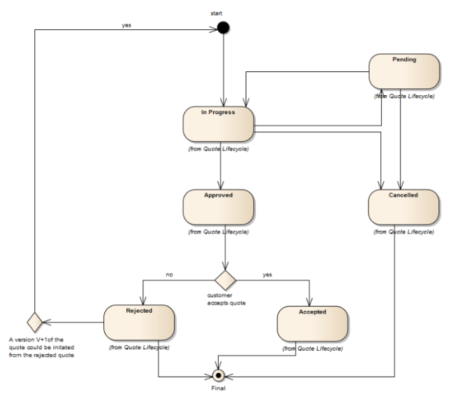
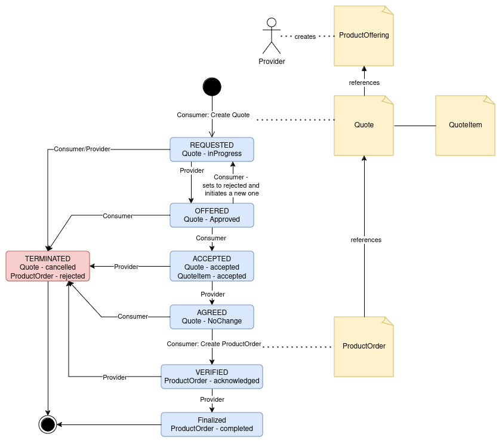

# Contract negotiation with TMForum

Contract Negotiation in the FIWARE Data Space Connector is provided through the [TMForum Quote API](https://www.tmforum.org/oda/open-apis/directory/quote-management-api-TMF648/v4.0). The Quote-API ```is one of the Pre-Ordering Management APIs. The customer Quote API provides a standardized mechanism for placing a customer quote with all the necessary quote parameters.```. It is intended to negotiate serivce and product acquisition between Customer and Provider(according to the Quote-Object documentation) and therefor well suited for the use-case of Contract Negotiation. 

In order to provide compatibility with the [IDSA Protocol](https://docs.internationaldataspaces.org/ids-knowledgebase/dataspace-protocol/contract-negotiation/contract.negotiation.protocol) the states between TMForum and IDSA are mapped by the [Contract Management](https://github.com/FIWARE/contract-management) and the negotiation states are available in [Rainbow](https://github.com/ging/rainbow).

## State Mapping

IDSA defines a State Machine for Contract Negotiation, while TMForum has its own State Machine around Quote-Items. Both have to be mapped and kept in synch.

### IDSA State Machine


States:

* REQUESTED: A contract for a Dataset has been requested by the Consumer based on an Offer and the Provider has sent an ACK response.
* OFFERED: The Provider has sent an Offer to the Consumer and the Consumer has sent an ACK response.
* ACCEPTED: The Consumer has accepted the latest Offer and the Provider has sent an ACK response.
* AGREED: The Provider has accepted the latest Offer, sent an Agreement to the Consumer, and the Consumer has sent an ACK response.
* VERIFIED: The Consumer has sent an Agreement verification to the Provider and the Provider has sent an ACK response.
* FINALIZED: The Provider has sent a finalization message including his own Agreement verification to the Consumer and the Consumer has sent an ACK response. Data is now available to the Consumer.
* TERMINATED: The Provider or Consumer has placed the CN in a terminated state. A termination message has been sent by either of the Participants and the other has sent an ACK response. This is a terminal state.

### TMForum State Machine



### The mapped State Machine:




## Usage

In order to access a Service by using the Transfer Process Protocol, the following steps need to be taken:

> :warning: The example calls are using the [local deployment](./deployment-integration/local-deployment/LOCAL.MD). Make sure its running before trying them out.

### Preparation 

0. Prepare the IAM

* Setup all required policies(see [DSP-Integration for details](DSP_INTEGRATION.md#authentication-and-authorization))
```shell
    ./doc/scripts/prepare-dsp-policies.sh
``` 

* Get credentials:
```shell
export USER_CREDENTIAL=$(./doc/scripts/get_credential.sh https://keycloak-consumer.127.0.0.1.nip.io user-credential employee); echo ${USER_CREDENTIAL}
```

* Prepare holder and its did:
```shell
    docker run -v $(pwd):/cert quay.io/wi_stefan/did-helper:0.1.1
    export HOLDER_DID=$(cat did.json | jq '.id' -r); echo ${HOLDER_DID}
```
1. Create a Category(to match offering and catalog):

```shell
export CATEGORY_ID=$(curl -X 'POST' \
  'http://tm-forum-api.127.0.0.1.nip.io:8080/tmf-api/productCatalogManagement/v4/category' \
  -H 'accept: application/json;charset=utf-8' \
  -H 'Content-Type: application/json;charset=utf-8' \
  -d '{
        "description": "Test Category",
        "name": "Test Category"
    }' | jq .id -r); echo ${CATEGORY_ID}
```

2. Create a Catalog:

```shell
export CATALOG_ID=$(curl -X 'POST' \
  'http://tm-forum-api.127.0.0.1.nip.io:8080/tmf-api/productCatalogManagement/v4/catalog' \
  -H 'accept: application/json;charset=utf-8' \
  -H 'Content-Type: application/json;charset=utf-8' \
  -d "{
  \"description\": \"Test Catalog\",
  \"name\": \"Test Catalog\", 
  \"category\": [
    {
        \"id\": \"${CATEGORY_ID}\"
    }
  ]
}" | jq .id -r); echo ${CATALOG_ID}
```

3. Create an offering price:

```shell
export PRICE_ID=$(curl -X 'POST' http://tm-forum-api.127.0.0.1.nip.io:8080/tmf-api/productCatalogManagement/v4/productOfferingPrice \
     -H 'Content-Type: application/json;charset=utf-8' \
     -d '{
            "priceType": "recurring",
            "recurringChargePeriodType": "month",
            "name": "Product Price",
            "price": {
                "unit": "EUR",
                "value": 10.0
            }
     }' | jq '.id' -r ); echo ${PRICE_ID}
```

4. Create a product specification. In order to be mapped to DCAT, it needs to contain the ```productSpecCharacteristic``` ```endpointUrl``` and ```endpointDescription```:

```shell
export PRODUCT_SPEC_ID=$(curl -X 'POST' \
  'http://tm-forum-api.127.0.0.1.nip.io:8080/tmf-api/productCatalogManagement/v4/productSpecification' \
  -H 'accept: application/json;charset=utf-8' \
  -H 'Content-Type: application/json;charset=utf-8' \
  -d "{
        \"name\": \"Test Spec\", 
        \"productSpecCharacteristic\": [
            {
                \"id\": \"endpointUrl\",
                \"name\":\"Service Endpoint URL\",
                \"valueType\":\"endpointUrl\",
                \"productSpecCharacteristicValue\": [{
                    \"value\":\"https://the-test-service.org\",
                    \"isDefault\": true
                }]
            },
            {
                \"id\": \"allowedAction\",
                \"name\":\"Allowed Actio\",
                \"valueType\":\"allowedAction\",
                \"productSpecCharacteristicValue\": [{
                    \"value\":\"Todrl:use\",
                    \"isDefault\": true
                }]
            },
            {
                \"id\": \"endpointDescription\",
                \"name\":\"Service Endpoint Description\",
                \"valueType\":\"endpointDescription\",
                \"productSpecCharacteristicValue\": [{
                    \"value\":\"The Test Service\"
                }]
            }
        ]
    }" | jq .id -r); echo ${PRODUCT_SPEC_ID}
```

5. Create the Product Offering:

```shell
export PRODUCT_OFFERING_ID=$(curl -X 'POST' http://tm-forum-api.127.0.0.1.nip.io:8080/tmf-api/productCatalogManagement/v4/productOffering \
     -H 'Content-Type: application/json;charset=utf-8' \
     -d "{
        \"name\": \"Test Offering\",
        \"description\": \"Test Offering description\", 
        \"isBundle\": false,
        \"isSellable\": true,
        \"lifecycleStatus\": \"Active\",
        \"productSpecification\": {
            \"id\": \"${PRODUCT_SPEC_ID}\",
            \"name\":\"The Test Spec\"
        },
        \"productOfferingPrice\": [{   
                \"id\": \"${PRICE_ID}\"
        }],
        \"category\": [{
            \"id\": \"${CATEGORY_ID}\"
        }]
     }"| jq '.id' -r ); echo ${PRODUCT_OFFERING_ID}
```

### Interaction

Once prepartion is done, Consumer and Provider do negotiate the contract by exchanging information around the Quote-Object and transition through the state machine. 

#### INITIAL State

In the initial state, the consumer has to be registered at the marketplace and then can create a Quote to get the negotiation started.

1. Get the consumer Did:

```shell
    export CONSUMER_DID=$(curl -X GET http://did-consumer.127.0.0.1.nip.io:8080/did-material/did.env | cut -d'=' -f2); echo ${CONSUMER_DID} 
```

2. Register the consumer at the marketplace:

```shell
    export ACCESS_TOKEN=$(./doc/scripts/get_access_token_oid4vp.sh http://mp-data-service.127.0.0.1.nip.io:8080 $USER_CREDENTIAL default); echo ${ACCESS_TOKEN}
    export FANCY_MARKETPLACE_ID=$(curl -X POST http://mp-tmf-api.127.0.0.1.nip.io:8080/tmf-api/party/v4/organization \
    -H 'Accept: */*' \
    -H "Authorization: Bearer ${ACCESS_TOKEN}" \
    -H 'Content-Type: application/json' \
    -d "{
      \"name\": \"Fancy Marketplace Inc.\",
      \"partyCharacteristic\": [
        {
          \"name\": \"did\",
          \"value\": \"${CONSUMER_DID}\" 
        }
      ]
    }" | jq '.id' -r); echo ${FANCY_MARKETPLACE_ID} 
```

3. Create a ```Quote``` to get into state REQUESTED, referencing the offer:

```shell
export QUOTE_ID=$(curl -X 'POST' http://tm-forum-api.127.0.0.1.nip.io:8080/tmf-api/quote/v4/quote \
    -H 'Content-Type: application/json;charset=utf-8' \
    -d "{
        \"description\": \"Request for Test Offering\",
        \"version\": \"1\",
        \"relatedParty\":[{
            \"id\":\"${FANCY_MARKETPLACE_ID}\",
            \"role\":\"Consumer\"
        }],
        \"quoteItem\": [
            {
                \"id\": \"item-id\",
                \"@schemaLocation\": \"https://raw.githubusercontent.com/FIWARE/contract-management/refs/heads/tpp-integration/schemas/policies.json\",
                \"productOffering\": {
                    \"id\": \"${PRODUCT_OFFERING_ID}\"
                },
                \"policy\": [{
                    \"odrl:permission\": [{
                        \"odrl:action\": \"odrl:use\",
                        \"odrl:constraint\": [{
                            \"odrl:leftOperand\": \"odrl:dateTime\",
                            \"odrl:operator\": \"odrl:eq\",
                            \"odrl:rightOperand\": \"2027-01-01\"
                        }]
                    }]
                }],
                \"action\": \"modify\",
                \"state\": \"inProgress\",
                \"note\": [{
                    \"id\": \"uri:random:note\",
                    \"text\": \"We would prefer weekly pricing and a discount\"
                }],
                \"quoteItemPrice\": [{
                    \"priceType\": \"recurring\",
                    \"name\": \"alternative price\",
                    \"recurringChargePeriod\": \"weekly\",
                    \"price\": {
                        \"taxIncludedAmount\": {
                            \"unit\": \"EUR\",
                            \"value\": 2.0
                        }
                    }
                }]
            }
        ]}" | jq '.id' -r ); echo ${QUOTE_ID}
```

4. Verify that the quote was handled and a negotiation is started(might take a couple of seconds):

Get the quote and its "externalId", which corresponds to the negotiation:

```shell
    export NEGOTIATION_ID=$(curl -X 'GET' http://tm-forum-api.127.0.0.1.nip.io:8080/tmf-api/quote/v4/quote/${QUOTE_ID} | jq '.externalId' -r); echo ${NEGOTIATION_ID}
```

And get the negotiation state: 

```shell
    curl -X 'GET' http://rainbow-provider.127.0.0.1.nip.io:8080/negotiations/${NEGOTIATION_ID} | jq .
```

#### IDSA REQUESTED - Quote in state ```inProgress```

With that, the negotiation is in state REQUESTED and needs to be processed by the provider:

Provider can cancel the Quote and go to state TERMINATED:
```shell
    curl -X 'PATCH' http://tm-forum-api.127.0.0.1.nip.io:8080/tmf-api/quote/v4/quote/${QUOTE_ID} \
     -H 'Content-Type: application/json;charset=utf-8' \
     -d '{ 
        "state": "cancelled"     
     }' | jq .
```

Provider can approve it and go to state OFFERED:
```shell
    curl -X 'PATCH' http://tm-forum-api.127.0.0.1.nip.io:8080/tmf-api/quote/v4/quote/${QUOTE_ID} \
     -H 'Content-Type: application/json;charset=utf-8' \
     -d '{ 
        "state": "approved"     
     }' | jq . 
```

And get the negotiation state: 

```shell
    curl -X 'GET' http://rainbow-provider.127.0.0.1.nip.io:8080/negotiations/${NEGOTIATION_ID} | jq .
```


Provider can reject the original QuoteItem, add a new one and go to OFFERED: 
```shell
curl -X 'PATCH' http://tm-forum-api.127.0.0.1.nip.io:8080/tmf-api/quote/v4/quote/${QUOTE_ID} \
     -H 'Content-Type: application/json;charset=utf-8' \
     -d "{
        \"description\": \"Request for Test Offering\",
        \"version\": \"1\",
        \"relatedParty\":[{
            \"id\":\"${FANCY_MARKETPLACE_ID}\",
            \"role\":\"Consumer\"
        }],
        \"quoteItem\": [
            {
                \"id\": \"item-id\",
                \"@schemaLocation\": \"https://raw.githubusercontent.com/FIWARE/contract-management/refs/heads/tpp-integration/schemas/policies.json\",
                \"productOffering\": {
                    \"id\": \"${PRODUCT_OFFERING_ID}\"
                },
                \"policy\": [{
                    \"odrl:permission\": [{
                        \"odrl:action\": \"odrl:use\",
                        \"odrl:constraint\": [{
                            \"odrl:leftOperand\": \"odrl:dateTime\",
                            \"odrl:operator\": \"odrl:eq\",
                            \"odrl:rightOperand\": \"2027-01-01\"
                        }]
                    }]
                }],
                \"action\": \"modify\",
                \"state\": \"rejected\",
                \"note\": [{
                    \"id\": \"uri:random:note\",
                    \"text\": \"We would prefer weekly pricing and a discount\"
                }],
                \"quoteItemPrice\": [{
                    \"priceType\": \"recurring\",
                    \"name\": \"alternative price\",
                    \"recurringChargePeriod\": \"weekly\",
                    \"price\": {
                        \"taxIncludedAmount\": {
                            \"unit\": \"EUR\",
                            \"value\": 2.0
                        }
                    }
                }]
            },
            {
                \"id\": \"item-id\",
                \"@schemaLocation\": \"https://raw.githubusercontent.com/FIWARE/contract-management/refs/heads/tpp-integration/schemas/policies.json\",
                \"productOffering\": {
                    \"id\": \"${PRODUCT_OFFERING_ID}\"
                },
                \"policy\": [{
                    \"odrl:permission\": [{
                        \"odrl:action\": \"odrl:use\",
                        \"odrl:constraint\": [{
                            \"odrl:leftOperand\": \"odrl:dateTime\",
                            \"odrl:operator\": \"odrl:eq\",
                            \"odrl:rightOperand\": \"2027-01-01\"
                        }]
                    }]
                }],
                \"action\": \"modify\",
                \"state\": \"rejected\",
                \"note\": [{
                    \"id\": \"uri:random:second-note\",
                    \"text\": \"We can offer weekly payment, but no discount.\"
                }],
                \"quoteItemPrice\": [{
                    \"priceType\": \"recurring\",
                    \"name\": \"alternative price\",
                    \"recurringChargePeriod\": \"weekly\",
                    \"price\": {
                        \"taxIncludedAmount\": {
                            \"unit\": \"EUR\",
                            \"value\": 2.5
                        }
                    }
                }]
            }
        ]
     }"
```

#### IDSA OFFERED  - Quote in state ```inProgress```

Within state OFFERED, the consumer can either:

Accept the offer and go to ACCEPTED:

```shell
curl -X 'PATCH' http://tm-forum-api.127.0.0.1.nip.io:8080/tmf-api/quote/v4/quote/${QUOTE_ID} \
     -H 'Content-Type: application/json;charset=utf-8' \
     -d "{ 
        \"state\": \"accepted\",
        \"quoteItem\": [
            {
                \"id\": \"item-id\",
                \"@schemaLocation\": \"https://raw.githubusercontent.com/FIWARE/contract-management/refs/heads/tpp-integration/schemas/policies.json\",
                \"productOffering\": {
                    \"id\": \"${PRODUCT_OFFERING_ID}\"
                },
                \"policy\": [{
                    \"odrl:permission\": [{
                        \"odrl:action\": \"odrl:use\",
                        \"odrl:constraint\": [{
                            \"odrl:leftOperand\": \"odrl:dateTime\",
                            \"odrl:operator\": \"odrl:eq\",
                            \"odrl:rightOperand\": \"2027-01-01\"
                        }]
                    }]
                }],
                \"action\": \"modify\",
                \"state\": \"accepted\",
                \"note\": [{
                    \"id\": \"uri:random:note\",
                    \"text\": \"We would prefer weekly pricing and a discount\"
                }],
                \"quoteItemPrice\": [{
                    \"priceType\": \"recurring\",
                    \"name\": \"alternative price\",
                    \"recurringChargePeriod\": \"weekly\",
                    \"price\": {
                        \"taxIncludedAmount\": {
                            \"unit\": \"EUR\",
                            \"value\": 2.0
                        }
                    }
                }]
            }
        ]     
     }" | jq . 
```
And get the negotiation state: 

```shell
    curl -X 'GET' http://rainbow-provider.127.0.0.1.nip.io:8080/negotiations/${NEGOTIATION_ID} | jq .
```

Or can reject the quote and create a new one in REQUESTED:

```shell
curl -X 'PATCH' http://tm-forum-api.127.0.0.1.nip.io:8080/tmf-api/quote/v4/quote/${QUOTE_ID} \
     -H 'Content-Type: application/json;charset=utf-8' \
     -d "{
        \"state\": \"rejected\"
     }" | jq .
```

```shell
export QUOTE_ID=$(curl -X 'POST' http://tm-forum-api.127.0.0.1.nip.io:8080/tmf-api/quote/v4/quote \
     -H 'Content-Type: application/json;charset=utf-8' \
     -d "{
        \"description\": \"Request for Test Offering\",
        \"version\": \"1\",
        \"relatedParty\":[{
            \"id\":\"${FANCY_MARKETPLACE_ID}\",
            \"role\":\"Consumer\"
        }],
        \"quoteItem\": [
            {
                \"id\": \"item-id\",
                \"@schemaLocation\": \"https://raw.githubusercontent.com/FIWARE/contract-management/refs/heads/tpp-integration/schemas/policies.json\",
                \"productOffering\": {
                    \"id\": \"${PRODUCT_OFFERING_ID}\"
                },
                \"policy\": [{
                    \"odrl:permission\": [{
                        \"odrl:action\": \"odrl:use\",
                        \"odrl:constraint\": [{
                            \"odrl:leftOperand\": \"odrl:dateTime\",
                            \"odrl:operator\": \"odrl:eq\",
                            \"odrl:rightOperand\": \"2027-01-01\"
                        }]
                    }]
                }],
                \"action\": \"modify\",
                \"state\": \"inProgress\",
                \"note\": [{
                    \"id\": \"uri:random:note\",
                    \"text\": \"What about a discount, but monthly payment\"
                }],
                \"quoteItemPrice\": [{
                    \"priceType\": \"recurring\",
                    \"name\": \"alternative price\",
                    \"recurringChargePeriod\": \"monthly\",
                    \"price\": {
                        \"taxIncludedAmount\": {
                            \"unit\": \"EUR\",
                            \"value\": 9.0
                        }
                    }
                }]
            }
        ]
     }" | jq '.id' -r ); echo ${QUOTE_ID}
```


#### IDSA ACCEPTED  - Quote in state ```accepted```

When the consumer did accept the offer from the provider, the provider can:

Approve the offer and go to state AGREED: 

-> verify the request and answer 200

Or cancel the Quote and go to state TERMINATED:
```shell
    curl -X 'PATCH' http://tm-forum-api.127.0.0.1.nip.io:8080/tmf-api/quoteManagement/v4/quote/${QUOTE_ID} \
     -H 'Content-Type: application/json;charset=utf-8' \
     -d "{ 
        "state": "cancelled"     
     }"
```

#### IDSA AGREED - Quote in state ```approved```

When the Provider approved the Quote, the Consumer can now either:

* Use it to create the order and go to state VERIFIED:

```shell
    export ORDER_ID=$(curl -X 'POST' http://tm-forum-api.127.0.0.1.nip.io:8080/tmf-api/productOrderingManagement/v4/productOrder \
     -H 'Content-Type: application/json;charset=utf-8' \
     -d "{
            \"quote\": [{
                \"id\": \"${QUOTE_ID}\" 
            }],
            \"relatedParty\": [{
                \"id\": \"${FANCY_MARKETPLACE_ID}\",
                \"role\":\"Consumer\"
            }]
     }" | jq '.id' -r ); echo ${ORDER_ID}
```
And get the negotiation state: 

```shell
    curl -X 'GET' http://rainbow-provider.127.0.0.1.nip.io:8080/negotiations/${NEGOTIATION_ID} | jq .
```

* Or reject it and go to TERMINATED:

```shell
    curl -X 'PATCH' http://tm-forum-api.127.0.0.1.nip.io:8080/tmf-api/quote/v4/quote/${QUOTE_ID} \
     -H 'Content-Type: application/json;charset=utf-8' \
     -d "{ 
        "state": "rejected"     
     }"
```

#### IDSA VERIFIED - Quote in state ```approved```, ProductOrder is created in state ```acknowledged```

Once the order is received, the Provider can:

* Create the agreement for the Order in Rainbow, fullfil all additonal steps(f.e. Trusted List entries, Policy creation) and set the order to completed and go to state FINALIZED:

> all the following steps are already handled(with the exception of Policy-Creation) by the ContractManagement

* create Agreement in Rainbow
* create Agreement in TMForum-API
* add Consumer to TrustedIssuersList
* create connected Policies in the PAP
* update the order:

```shell
    curl -X 'PATCH' \
        -H "Authorization: Bearer ${ACCESS_TOKEN}" \
        http://tm-forum-api.127.0.0.1.nip.io:8080/tmf-api/productOrderingManagement/v4/productOrder/${ORDER_ID} \
        -H 'accept: application/json;charset=utf-8' \
        -H 'Content-Type: application/json;charset=utf-8' \
        -d '{
                "state": "completed"
            }' | jq .
```
And get the negotiation state: 

```shell
    curl -X 'GET' http://rainbow-provider.127.0.0.1.nip.io:8080/negotiations/${NEGOTIATION_ID} | jq .
```

* Or reject the order and go to TERMINATED:

```shell
    curl -X 'PATCH' http://tm-forum-api.127.0.0.1.nip.io:8080/tmf-api/quote/v4/productOrder/${ORDER_ID} \
     -H 'Content-Type: application/json;charset=utf-8' \
     -d "{ 
        "state": "rejected"     
     }"
```

#### FINALIZED

The consumer can access data throught the [Transfer Process Protocol](https://docs.internationaldataspaces.org/ids-knowledgebase/dataspace-protocol/transfer-process/transfer.process.protocol) as described in the [DSP Integration](DSP_INTEGRATION.md).
