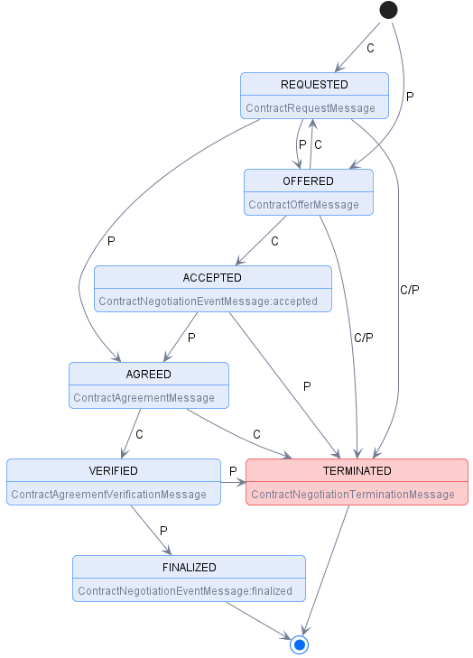

# Contract negotiation with TMForum

## Idea

Use the [TMForum Quote API](https://www.tmforum.org/oda/open-apis/directory/quote-management-api-TMF648/v4.0) to execute contract negotiation between Consumer and Provider.
The Quote-API ```is one of the Pre-Ordering Management APIs. The customer Quote API provides a standardized mechanism for placing a customer quote with all the necessary quote parameters.```. It is intended to negotiate serivce and product acquisition between Customer and Provider(according to the Quote-Object documentation) and therefor well suited for the use-case of Contract Negotiation. 

Alternatives: 
* [Product Offering Qualification API](https://www.tmforum.org/oda/open-apis/directory/product-offering-qualification-management-api-TMF679/v4.0): Pre-ordering API intended to check commercial elgibility, rather than negotiation. Not necessarily targeting Consumer interaction
* direct manipilation of the Product Order: ProductOrder states are intended for "processing" the actual order, rather than negotiating 
* [Agreement-API](https://www.tmforum.org/oda/open-apis/directory/agreement-management-api-TMF651/v4.0): Intended to specify concrete agreements between partners, not necessariyl product acquisiton. Limited states to be used.


## State Mapping


> [IDSA Contract Negotiation](https://docs.internationaldataspaces.org/ids-knowledgebase/dataspace-protocol/contract-negotiation/contract.negotiation.protocol)



States:

* REQUESTED: A contract for a Dataset has been requested by the Consumer based on an Offer and the Provider has sent an ACK response.
* OFFERED: The Provider has sent an Offer to the Consumer and the Consumer has sent an ACK response.
* ACCEPTED: The Consumer has accepted the latest Offer and the Provider has sent an ACK response.
* AGREED: The Provider has accepted the latest Offer, sent an Agreement to the Consumer, and the Consumer has sent an ACK response.
* VERIFIED: The Consumer has sent an Agreement verification to the Provider and the Provider has sent an ACK response.
* FINALIZED: The Provider has sent a finalization message including his own Agreement verification to the Consumer and the Consumer has sent an ACK response. Data is now available to the Consumer.
* TERMINATED: The Provider or Consumer has placed the CN in a terminated state. A termination message has been sent by either of the Participants and the other has sent an ACK response. This is a terminal state.

Relevant TMForum APIs:

* [Product Catalog Management](https://www.tmforum.org/oda/open-apis/directory/product-catalog-management-api-TMF620/v4.1)
* [Quote](https://www.tmforum.org/oda/open-apis/directory/quote-management-api-TMF648/v4.0)
* [Product Order Management](https://www.tmforum.org/oda/open-apis/directory/product-ordering-management-api-TMF622/v4.0)
* [Product Offering Qualification](https://www.tmforum.org/oda/open-apis/directory/product-offering-qualification-management-api-TMF679/v4.0)
* [Agreement Management](https://www.tmforum.org/oda/open-apis/directory/agreement-management-api-TMF651/v4.0)


### Initialization 

Provider creates a ProductOffering:

```shell
export PRICE_ID=$(curl -X 'POST' http://tm-forum-api.127.0.0.1.nip.io:8080/tmf-api/productCatalogManagement/v4/productOfferingPrice \
     -H 'Content-Type: application/json;charset=utf-8' \
     -d '{
            "priceType": "recurring",
            "recurringChargePeriodType": "month",
            "name": "Product Price",
            "price": {
                "unit": "EUR",
                "value": 10.0
            }
     }' | jq '.id' -r ); echo ${PRODUCT_SPEC_ID}

export PRODUCT_SPEC_ID=$(curl -X 'POST' http://tm-forum-api.127.0.0.1.nip.io:8080/tmf-api/productCatalogManagement/v4/productSpecification \
     -H 'Content-Type: application/json;charset=utf-8' \
     -d '{
        "version": "1.0.0",
        "lifecycleStatus": "ACTIVE",
        "name": "Test Spec"
     }' | jq '.id' -r ); echo ${PRODUCT_SPEC_ID}
export PRODUCT_OFFERING_ID=$(curl -X 'POST' http://tm-forum-api.127.0.0.1.nip.io:8080/tmf-api/productCatalogManagement/v4/productOffering \
     -H 'Content-Type: application/json;charset=utf-8' \
     -d "{
        \"version\": \"1.0.0\",
        \"lifecycleStatus\": \"ACTIVE\",
        \"name\": \"Test Offering\",
        \"productSpecification\": {
          \"id\": \"${PRODUCT_SPEC_ID}\"
        },
        \"productOfferingPrice\": [
            {   
                \"id\": \"${PRICE_ID}\"
            }
        ]
     }"| jq '.id' -r ); echo ${PRODUCT_OFFERING_ID}
```

IDSA State Requested:

### Intialization

To get into state REQUESTED, the consumer creates a ```Quote```, referncing the offer:

```shell
export QUOTE_ID=$(curl -X 'POST' http://tm-forum-api.127.0.0.1.nip.io:8080/tmf-api/quoteManagement/v4/quote \
     -H 'Content-Type: application/json;charset=utf-8' \
     -d "{
        \"description\": \"Request for Test Offering\",
        \"relatedParty\": [
            {
                \"id\": \"Requesting-Consumer\",
                \"role\": \"Consumer\"
            }
        ],
        \"state\": "pending",
        \"quoteItem\": [
            {
                \"id\": \"item-id\",
                \"productOffering\": {
                    \"id\": \"${PRODUCT_OFFERING_ID}\"
                },
                \"action\": \"modify\",
                \"note\": [{
                    \"id\": \"First note\",
                    \"text\": \"We would prefer weekly pricing and a discount\"
                }],
                \"priceAlteration\": [
                    {
                        \"name\": \"alternative price\",
                        \"priceType\": \"recurring\",
                        \"recurringChargePeriod\": \"weekly\",
                        \"price\": {
                            "unit": "EUR",
                            "value": 2.0
                        }
                    }
                ]

            }
        ]
     }" | jq '.id' -r ); echo ${QUOTE_ID}
```

### IDSA REQUESTED - Quote in state ```pending```

With that, the negotiation is in state requested and needs to be processed by the provider:

Provider can reject the Quote and go to state TERMINATED:
```shell
    curl -X 'PATCH' http://tm-forum-api.127.0.0.1.nip.io:8080/tmf-api/quoteManagement/v4/quote/${QUOTE_ID} \
     -H 'Content-Type: application/json;charset=utf-8' \
     -d "{ 
        "state": "rejected"     
     }"
```

Provider can approve it and go to state AGREED:
```shell
    curl -X 'PATCH' http://tm-forum-api.127.0.0.1.nip.io:8080/tmf-api/quoteManagement/v4/quote/${QUOTE_ID} \
     -H 'Content-Type: application/json;charset=utf-8' \
     -d "{ 
        "state": "approved"     
     }"
```

Provider can make a counter-offer and go to OFFERED: 
```shell
curl -X 'PATCH' http://tm-forum-api.127.0.0.1.nip.io:8080/tmf-api/quoteManagement/v4/quote/${QUOTE_ID} \
     -H 'Content-Type: application/json;charset=utf-8' \
     -d "{
        \"state\": "inProgress",
        \"quoteItem\": [
            {
                \"id\": \"item-id\",
                \"productOffering\": {
                    \"id\": \"${PRODUCT_OFFERING_ID}\"
                },
                \"action\": \"modify\",
                \"note\": [
                    {
                        \"id\": \"First note\",
                        \"text\": \"We would prefer weekly pricing and a discount.\"
                    },
                    {
                        \"id\": \"Answer note\",
                        \"text\": \"We can offer weekly payment, but no discount.\"
                    }

                ],
                \"priceAlteration\": [
                    {
                        \"name\": \"alternative price\",
                        \"priceType\": \"recurring\",
                        \"recurringChargePeriod\": \"weekly\",
                        \"price\": {
                            "unit": "EUR",
                            "value": 2.5
                        }
                    }
                ]
            }
        ]
     }"
```

### IDSA OFFERED  - Quote in state ```inProgress```

Within state offered, the consumer can either:

Accept the offer and go to ACCEPTED:

```shell
    curl -X 'PATCH' http://tm-forum-api.127.0.0.1.nip.io:8080/tmf-api/quoteManagement/v4/quote/${QUOTE_ID} \
     -H 'Content-Type: application/json;charset=utf-8' \
     -d "{ 
        "state": "accepted"     
     }"
```

Or make another counter-offer and send it back to REQUESTED:

```shell
curl -X 'PATCH' http://tm-forum-api.127.0.0.1.nip.io:8080/tmf-api/quoteManagement/v4/quote/${QUOTE_ID} \
     -H 'Content-Type: application/json;charset=utf-8' \
     -d "{
        \"state\": "pending",
        \"quoteItem\": [
            {
                \"id\": \"item-id\",
                \"productOffering\": {
                    \"id\": \"${PRODUCT_OFFERING_ID}\"
                },
                \"action\": \"modify\",
                \"note\": [
                    {
                        \"id\": \"First note\",
                        \"text\": \"We would prefer weekly pricing and a discount.\"
                    },
                    {
                        \"id\": \"Answer note\",
                        \"text\": \"We can offer weekly payment, but no discount.\"
                    },
                    {
                        \"id\": \"New Answer note\",
                        \"text\": \"What about a discound and monthly payments.\"
                    }

                ],
                \"priceAlteration\": [
                    {
                        \"name\": \"alternative price\",
                        \"priceType\": \"recurring\",
                        \"recurringChargePeriod\": \"monthly\",
                        \"price\": {
                            "unit": "EUR",
                            "value": 9
                        }
                    }
                ]
            }
        ]
     }"
```

Or reject the Quote and go to state TERMINATED:
```shell
    curl -X 'PATCH' http://tm-forum-api.127.0.0.1.nip.io:8080/tmf-api/quoteManagement/v4/quote/${QUOTE_ID} \
     -H 'Content-Type: application/json;charset=utf-8' \
     -d "{ 
        "state": "rejected"     
     }"
```

### IDSA ACCEPTED  - Quote in state ```accepted```

When the consumer did accept the offer from the provider, the provider can:

Approve the offer and go to state AGREED: 

```shell
    curl -X 'PATCH' http://tm-forum-api.127.0.0.1.nip.io:8080/tmf-api/quoteManagement/v4/quote/${QUOTE_ID} \
     -H 'Content-Type: application/json;charset=utf-8' \
     -d "{ 
        "state": "approved"     
     }"
```

Or reject the Quote and go to state TERMINATED:
```shell
    curl -X 'PATCH' http://tm-forum-api.127.0.0.1.nip.io:8080/tmf-api/quoteManagement/v4/quote/${QUOTE_ID} \
     -H 'Content-Type: application/json;charset=utf-8' \
     -d "{ 
        "state": "rejected"     
     }"
```

### IDSA AGREED - Quote in state ```approved```

When the Provider approved the Quote, the Consumer can now either:

Use it to create the order and go to state VERIFIED:

```shell
    export ORDER_ID=$(curl -X 'POST' http://tm-forum-api.127.0.0.1.nip.io:8080/productOrderingManagement/v4/productOrder \
     -H 'Content-Type: application/json;charset=utf-8' \
     -d "{
        \"productOrderItem\": [
         {
           \"id\": \"random-order-id\",
           \"action\": \"add\",
           \"quoteItem\": {
             \"id\" :  \"${QUOTE_ID}\"
           }
         }  
       ],,
       \"relatedParty\": [
         {
           \"id\": \"Requesting-Consumer\"
         }
       ]
     }" | jq '.id' -r ); echo ${QUOTE_ID}
```

Or reject it and go to TERMINATED:

```shell
    curl -X 'PATCH' http://tm-forum-api.127.0.0.1.nip.io:8080/tmf-api/quoteManagement/v4/quote/${QUOTE_ID} \
     -H 'Content-Type: application/json;charset=utf-8' \
     -d "{ 
        "state": "rejected"     
     }"
```


### IDSA VERIFIED - Quote in state ```approved```, ProductOrder is created in state ```acknowledged```

Once the order is received, the Provider can:

Create the agreement for the Order in Rainbow, fullfil all additonal steps(f.e. Trusted List entries, Policy creation) and set the order to completed and go to state FINALIZED:

> all the following steps are already handled(with the exception of Policy-Creation) by the ContractManagement

* create Agreement in Rainbow
* create Agreement in TMForum-API
* add Consumer to TrustedIssuersList
* create connected Policies in the PAP
* update the order:

```shell
    curl -X 'PATCH' \
        -H "Authorization: Bearer ${ACCESS_TOKEN}" \
        http://tm-forum-api.127.0.0.1.nip.io:8080/tmf-api/productOrderingManagement/v4/productOrder/${ORDER_ID} \
        -H 'accept: application/json;charset=utf-8' \
        -H 'Content-Type: application/json;charset=utf-8' \
        -d '{
                "state": "completed",
                "agreement": {
                    "id": "tmf-agreement-id"
                }
            }'
```

Or reject the order and go to TERMINATED:

```shell
    curl -X 'PATCH' http://tm-forum-api.127.0.0.1.nip.io:8080/tmf-api/quoteManagement/v4/productOrder/${ORDER_ID} \
     -H 'Content-Type: application/json;charset=utf-8' \
     -d "{ 
        "state": "rejected"     
     }"
```

### FINALIZED

The consumer can access data throught the [Transfer Process Protocol](https://docs.internationaldataspaces.org/ids-knowledgebase/dataspace-protocol/transfer-process/transfer.process.protocol) as described in the [DSP Integration](DSP_INTEGRATION.md).