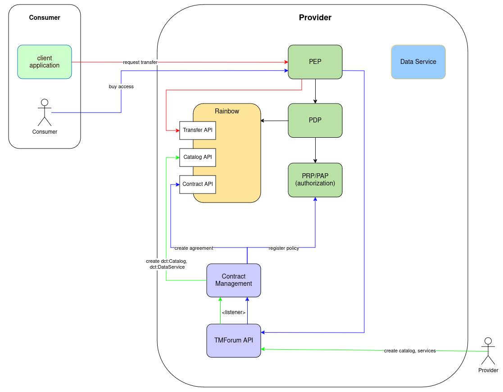

# Integration of the Dataspace Protocol

In order to be compatible with other connectors, the FIWARE Data Space Connector supports the [IDSA Dataspace Protocol](https://docs.internationaldataspaces.org/ids-knowledgebase/dataspace-protocol).

## Architecture




* [TMForum API](https://github.com/FIWARE/tmforum-api) provides the APIs for creating and managing Products and Offerings
    * integrates with the Contract Management through Events
* [Rainbow](https://github.com/ging/rainbow)(not yet public) is a RUST-implementation of the [Dataspace Protocol](https://docs.internationaldataspaces.org/ids-knowledgebase/dataspace-protocol)
    * provides the  [Transfer Process API](https://docs.internationaldataspaces.org/ids-knowledgebase/dataspace-protocol/transfer-process/transfer.process.protocol)
    * provides the [Catalog API](https://docs.internationaldataspaces.org/ids-knowledgebase/dataspace-protocol/catalog/catalog.protocol)
    * provides CRUD functionality for Agreement objects defined by the [Contract Negotiation API](https://docs.internationaldataspaces.org/ids-knowledgebase/dataspace-protocol/contract-negotiation/contract.negotiation.protocol)
    * provides the callback interface for the Consumer
* [Contract Management](https://github.com/FIWARE/contract-management):
    * integrates with the TMForum API and translate its entities to [DCAT Entries](https://www.w3.org/TR/vocab-dcat-3/) in Rainbow([Catalogs](https://www.w3.org/TR/vocab-dcat-3/#Class:Catalog) and [DataServices](https://www.w3.org/TR/vocab-dcat-3/#Class:Data_Service))
    * create Agreements in Rainbow based on the Product Orderings
    * writes back the Agreemnt-IDs to the TMForum API Product Orderings

## Usage

In order to access a Service by using the Transfer Process Protocol, the following steps need to be taken:

> :warning: The example calls are using the [local deployment](./deployment-integration/local-deployment/LOCAL.MD). Make sure its running before trying them out.

### Preparation

To have some demo data available, create the following entity directly at the context broker:

```shell
  curl -X POST http://scorpio-provider.127.0.0.1.nip.io:8080/ngsi-ld/v1/entities \
    -H 'Accept: application/json' \
    -H 'Content-Type: application/json' \
    -d '{
      "id": "urn:ngsi-ld:UptimeReport:fms-1",
      "type": "UptimeReport",
      "name": {
        "type": "Property",
        "value": "Standard Server"
      },
      "uptime": {
        "type": "Property",
        "value": "99.9"
      }
    }'
```

### Create the offering

In order to be compatible with the Dataspace Protocol, a Data Service needs to be available at the [Catalog API](https://docs.internationaldataspaces.org/ids-knowledgebase/dataspace-protocol/catalog/catalog.protocol) in the [DCAT-Format](https://www.w3.org/TR/vocab-dcat-3/). To do so, Catalogs, Categories and ProductOfferings from TMForum are mapped to the entries by the Contract Management.
With the following steps, a catalog containing a DataService can be created:

>:warning: For better understandability, the creation happens directly through the TMForum-API, without authentication.

1. Create a Category(to match offering and catalog):

```shell
export CATEGORY_ID=$(curl -X 'POST' \
  'http://tm-forum-api.127.0.0.1.nip.io:8080/tmf-api/productCatalogManagement/v4/category' \
  -H 'accept: application/json;charset=utf-8' \
  -H 'Content-Type: application/json;charset=utf-8' \
  -d '{
  "description": "Test Category",
  "name": "Test Category"
}' | jq .id -r); echo ${CATEGORY_ID}
```

2. Create a Catalog:

```shell
export CATALOG_ID=$(curl -X 'POST' \
  'http://tm-forum-api.127.0.0.1.nip.io:8080/tmf-api/productCatalogManagement/v4/catalog' \
  -H 'accept: application/json;charset=utf-8' \
  -H 'Content-Type: application/json;charset=utf-8' \
  -d "{
  \"description\": \"Test Catalog\",
  \"name\": \"Test Catalog\", 
  \"category\": [
    {
        \"id\": \"${CATEGORY_ID}\"
    }
  ]
}" | jq .id -r); echo ${CATALOG_ID}
```

3. Create a product specification. In order to be mapped to DCAT, it needs to contain the ```productSpecCharacteristic``` ```endpointUrl``` and ```endpointDescription```:


```shell
export PRODUCT_SPEC_ID=$(curl -X 'POST' \
  'http://tm-forum-api.127.0.0.1.nip.io:8080/tmf-api/productCatalogManagement/v4/productSpecification' \
  -H 'accept: application/json;charset=utf-8' \
  -H 'Content-Type: application/json;charset=utf-8' \
  -d "{
        \"name\": \"Test Spec\", 
        \"productSpecCharacteristic\": [
            {
                \"id\": \"endpointUrl\",
                \"name\":\"Service Endpoint URL\",
                \"valueType\":\"endpointUrl\",
                \"productSpecCharacteristicValue\": [{
                    \"value\":\"https://the-test-service.org\",
                    \"isDefault\": true
                }]
            },
            {
                \"id\": \"endpointDescription\",
                \"name\":\"Service Endpoint Description\",
                \"valueType\":\"endpointDescription\",
                \"productSpecCharacteristicValue\": [{
                    \"value\":\"The Test Service\"
                }]
            }
        ]
    }" | jq .id -r); echo ${PRODUCT_SPEC_ID}
```

4. Create the Product Offering:


```shell
export PRODUCT_OFFERING_ID=$(curl -X 'POST' \
  'http://tm-forum-api.127.0.0.1.nip.io:8080/tmf-api/productCatalogManagement/v4/productOffering' \
  -H 'accept: application/json;charset=utf-8' \
  -H 'Content-Type: application/json;charset=utf-8' \
  -d "{
        \"name\": \"Test Offering\",
        \"description\": \"Test Offering description\", 
        \"isBundle\": false,
        \"isSellable\": true,
        \"lifecycleStatus\": \"Active\",
        \"productSpecification\": 
            {
                \"id\": \"${PRODUCT_SPEC_ID}\",
                \"name\":\"The Test Spec\"
            },
        \"category\": [{
            \"id\": \"${CATEGORY_ID}\"
        }]
    }" | jq .id -r); echo ${PRODUCT_OFFERING_ID}
```

After those steps, the catalog with the offering(as a ```dcat:service```) is available:

```shell
    curl -X GET 'http://rainbow-provider.127.0.0.1.nip.io:8080/api/v1/catalogs' | jq .
```

The result will be similar to the following:

```json
[
    {
        "@context": "https://w3id.org/dspace/2024/1/context.json",
        "@type": "dcat:Catalog",
        "@id": "urn:ngsi-ld:catalog:5b33f5bc-65e7-40b4-a71c-b722da52a919",
        "foaf:homepage": null,
        "dcat:theme": "",
        "dcat:keyword": "",
        "dct:conformsTo": null,
        "dct:creator": null,
        "dct:identifier": "urn:ngsi-ld:catalog:5b33f5bc-65e7-40b4-a71c-b722da52a919",
        "dct:issued": "2025-01-15T07:25:19.779168",
        "dct:modified": null,
        "dct:title": "Test Catalog",
        "dct:description": [],
        "dspace:participantId": null,
        "odrl:hasPolicy": [],
        "dspace:extraFields": null,
        "dcat:dataset": [],
        "dcat:service": [
            {
                "@context": "https://w3id.org/dspace/2024/1/context.json",
                "@type": "dcat:DataService",
                "@id": "urn:ngsi-ld:product-offering:96eaae6d-1615-41b0-b721-91c6a2e36551",
                "dcat:theme": "",
                "dcat:keyword": "",
                "dcat:endpointDescription": "The Test Service",
                "dcat:endpointURL": "https://the-test-service.org",
                "dct:conformsTo": null,
                "dct:creator": null,
                "dct:identifier": "urn:ngsi-ld:product-offering:96eaae6d-1615-41b0-b721-91c6a2e36551",
                "dct:issued": "2025-01-15T07:25:31.220506",
                "dct:modified": null,
                "dct:title": "Test Spec",
                "dct:description": [],
                "odrl:hasPolicy": [],
                "dspace:extraFields": null
            }
        ]
    }
]
```

### Authentication and Authorization

The TMForum-API and the Data Service are secured by the IAM in addition to be connected with the Transfer Process Protocol. Therefor, the provider has to create policies to controll access to TMForumm the Data Service and the Rainbow API.

1. Allow [read-access to the Rainbow Catalog API](../it/src/test/resources/policies/allowCatalogRead.json)

```shell
curl -X 'POST' http://pap-provider.127.0.0.1.nip.io:8080/policy \
    -H 'Content-Type: application/json' \
    -d "$(cat ./it/src/test/resources/policies/allowCatalogRead.json)"
```

2. Allow [self-registration of organizations at TMForum](../it/src/test/resources/policies/allowSelfRegistration.json)

```shell
curl -X 'POST' http://pap-provider.127.0.0.1.nip.io:8080/policy \
    -H 'Content-Type: application/json' \
    -d "$(cat ./it/src/test/resources/policies/allowSelfRegistration.json)"
```

3. Allow [to order at TMForum](../it/src/test/resources/policies/allowProductOrder.json.json)

```shell
curl -X 'POST' http://pap-provider.127.0.0.1.nip.io:8080/policy \
    -H 'Content-Type: application/json' \
    -d "$(cat ./it/src/test/resources/policies/allowProductOrder.json)"
```

4. Allow [operators to read uptime-reports](../it/src/test/resources/policies/uptimeReport.json)

```shell
curl -X 'POST' http://pap-provider.127.0.0.1.nip.io:8080/policy \
    -H 'Content-Type: application/json' \
    -d "$(cat ./it/src/test/resources/policies/uptimeReport.json)"
```

5. Allow [operators to request data transfers at Rainbow](../it/src/test/resources/policies/transferRequest.json)

```shell
curl -X 'POST' http://pap-provider.127.0.0.1.nip.io:8080/policy \
    -H 'Content-Type: application/json' \
    -d "$(cat ./it/src/test/resources/policies/transferRequest.json)"
```

6. Allow [the consumer to read its agreements.](../it/src/test/resources/policies/allowTMFAgreementRead.json)

```shell
curl -X 'POST' http://pap-provider.127.0.0.1.nip.io:8080/policy \
    -H 'Content-Type: application/json' \
    -d "$(cat ./it/src/test/resources/policies/allowTMFAgreementRead.json)"
```

In order to use the endpoints, the Consumer needs to issue a User and an Operator credential:

1. Get the UserCredential:
```shell
 export USER_CREDENTIAL=$(./doc/scripts/get_credential_for_consumer.sh http://keycloak-consumer.127.0.0.1.nip.io:8080 user-credential); echo ${USER_CREDENTIAL}
```
2. Get the OperatorCredential:
```shell
 export OPERATOR_CREDENTIAL=$(./doc/scripts/get_credential_for_consumer.sh http://keycloak-consumer.127.0.0.1.nip.io:8080 operator-credential); echo ${OPERATOR_CREDENTIAL}
```

To prepare usage of the credentials, also create the keymaterial for the holder:

```shell
  docker run -v $(pwd):/cert quay.io/wi_stefan/did-helper:0.1.1
```

Its did is: 

```shell
  export HOLDER_DID=$(cat did.json | jq '.id' -r); echo ${HOLDER_DID}
```

### Get access to the Data Service

To gain access to the service and become able to use the service through the Transfer Process Protocol, the offering has to be accepted through a ProductOrder. The order will be translated into an 
[IDSA Agreement](https://docs.internationaldataspaces.org/ids-knowledgebase/dataspace-protocol/overview/terminology#agreement) once its completed. 

1. Get the consumer Did:

```shell
    export CONSUMER_DID=$(curl -X GET http://did-consumer.127.0.0.1.nip.io:8080/did-material/did.env | cut -d'=' -f2); echo ${CONSUMER_DID} 
```

2. Register the consumer at the marketplace:

```shell
    export ACCESS_TOKEN=$(./doc/scripts/get_access_token_oid4vp.sh http://mp-tmf-api.127.0.0.1.nip.io:8080 $USER_CREDENTIAL default); echo ${ACCESS_TOKEN}
    export FANCY_MARKETPLACE_ID=$(curl -X POST http://mp-tmf-api.127.0.0.1.nip.io:8080/tmf-api/party/v4/organization \
    -H 'Accept: */*' \
    -H "Authorization: Bearer ${ACCESS_TOKEN}" \
    -H 'Content-Type: application/json' \
    -d "{
      \"name\": \"Fancy Marketplace Inc.\",
      \"partyCharacteristic\": [
        {
          \"name\": \"did\",
          \"value\": \"${CONSUMER_DID}\" 
        }
      ]
    }" | jq '.id' -r); echo ${FANCY_MARKETPLACE_ID} 
```

3. Create the Product Order(in the demo flow, we just reuse the already known offer-id. In reality, it should be retrieved from the list of offerings):

```shell
    export ACCESS_TOKEN=$(./doc/scripts/get_access_token_oid4vp.sh http://mp-tmf-api.127.0.0.1.nip.io:8080 $USER_CREDENTIAL default); echo ${ACCESS_TOKEN}
    export PRODUCT_ORDER_ID=$(curl -X 'POST' \
    'http://mp-tmf-api.127.0.0.1.nip.io:8080/tmf-api/productOrderingManagement/v4/productOrder' \
    -H 'accept: application/json;charset=utf-8' \
    -H "Authorization: Bearer ${ACCESS_TOKEN}" \
    -H 'Content-Type: application/json;charset=utf-8' \
    -d "{
            \"productOrderItem\": [
                {
                    \"id\":\"the-order-item\",
                    \"action\": \"add\",
                    \"productOffering\": {
                        \"id\": \"${PRODUCT_OFFERING_ID}\",
                        \"name\":\"The Test Offer\"
                    }
                }
            ],
            \"relatedParty\": [{
                \"id\": \"${FANCY_MARKETPLACE_ID}\",
                \"name\": \"Fancy Marketplace Co.\"
            }]
        }" | jq .id -r); echo ${PRODUCT_ORDER_ID}
```

4. Complete the order. Usually, thats something a marketplace application might do, f.e. once the payment is fullfilled.


```shell
    export ACCESS_TOKEN=$(./doc/scripts/get_access_token_oid4vp.sh http://mp-tmf-api.127.0.0.1.nip.io:8080 $USER_CREDENTIAL default); echo ${ACCESS_TOKEN}
    curl -X 'PATCH' \
        -H "Authorization: Bearer ${ACCESS_TOKEN}" \
        http://mp-tmf-api.127.0.0.1.nip.io:8080/tmf-api/productOrderingManagement/v4/productOrder/${PRODUCT_ORDER_ID} \
        -H 'accept: application/json;charset=utf-8' \
        -H 'Content-Type: application/json;charset=utf-8' \
        -d "{
                \"state\": \"completed\"
            }" | jq .
```

### Access the service through the Transfer Process Protocol

In order to actually use the service, an active [Transfer Process](https://docs.internationaldataspaces.org/ids-knowledgebase/dataspace-protocol/transfer-process/transfer.process.protocol) is required. 
To start it, a [Transfer Request Message](https://docs.internationaldataspaces.org/ids-knowledgebase/dataspace-protocol/transfer-process/transfer.process.protocol#id-2.1-transfer-request-message) including the id of the previously created agreement has to be submitted.

1. Get the Agreement ID in TMForum. The contract management creates a [TMForum Agreement](https://github.com/FIWARE/tmforum-api/blob/main/api/tm-forum/agreement/api.json#L1485) containing the ID of the Agreement in Rainbow. Its linked in the original ProductOrder.

```shell 
    export ACCESS_TOKEN=$(./doc/scripts/get_access_token_oid4vp.sh http://mp-tmf-api.127.0.0.1.nip.io:8080 $USER_CREDENTIAL default); echo ${ACCESS_TOKEN}
    export AGREEMENT_TMF_ID=$(curl -X 'GET' \
    http://mp-tmf-api.127.0.0.1.nip.io:8080/tmf-api/productOrderingManagement/v4/productOrder/${PRODUCT_ORDER_ID} \
    -H 'accept: application/json;charset=utf-8' \
    -H "Authorization: Bearer ${ACCESS_TOKEN}" \
    -H 'Content-Type: application/json;charset=utf-8' | jq -r '.agreement[0].id'
    ); echo ${AGREEMENT_TMF_ID}
```

2. Get the Agreement and retrieve the ID of the Agreement in Rainbow(provider rainbow is available at ```tpp-service.127.0.0.1.nip.io``` through the ApiGateway):

```shell
    export ACCESS_TOKEN=$(./doc/scripts/get_access_token_oid4vp.sh http://mp-tmf-api.127.0.0.1.nip.io:8080 $USER_CREDENTIAL default); echo ${ACCESS_TOKEN}
    export AGREEMENT_ID=$(curl -X 'GET' \
    http://mp-tmf-api.127.0.0.1.nip.io:8080/tmf-api/agreementManagement/v4/agreement/${AGREEMENT_TMF_ID} \
    -H 'accept: application/json;charset=utf-8' \
    -H "Authorization: Bearer ${ACCESS_TOKEN}" \
    -H 'Content-Type: application/json;charset=utf-8' | jq -r '.characteristic[0].value'
    ); echo ${AGREEMENT_ID}
```

3. Request the transfer at Rainbow and retrieve consumer and provider PID from it:

```shell
    export ACCESS_TOKEN=$(./doc/scripts/get_access_token_oid4vp.sh http://tpp-service.127.0.0.1.nip.io:8080 $OPERATOR_CREDENTIAL default); echo ${ACCESS_TOKEN}
    export CONSUMER_PID=$(curl -X 'POST' 'http://tpp-service.127.0.0.1.nip.io:8080/transfers/request'\
    -H 'accept: application/json;charset=utf-8' \
    -H "Authorization: Bearer ${ACCESS_TOKEN}" \
    -H 'Content-Type: application/json;charset=utf-8' \
    -d "{
            \"@context\": \"https://w3id.org/dspace/2024/1/context.json\",
            \"@type\": \"dspace:TransferRequestMessage\",
            \"dspace:consumerPid\": \"urn:uuid:$(cat /proc/sys/kernel/random/uuid)\",
            \"dspace:agreementId\": \"${AGREEMENT_ID}\",
            \"dct:format\": \"http+pull\",
            \"dspace:callbackAddress\": \"http://rainbow-consumer.127.0.0.1.nip.io:8080/api/v1/callbacks\"
        }" | jq .\"dspace:consumerPid\" -r); echo ${CONSUMER_PID}
    # workaround to get the provider pid into an env-var. The id is already included in the previous response, thus this call is not required in "normal" usage
    export PROVIDER_PID=$(curl -X 'GET' 'http://rainbow-provider.127.0.0.1.nip.io:8080/api/v1/transfers' | jq --arg CPID "${CONSUMER_PID}" -r -c '[.[] | select (."dspace:consumerPid" | contains($CPID))][0] | ."dspace:providerPid"'); echo ${PROVIDER_PID}
```
Once the request is completed, provider´s rainbow will check the callback at the consumer to ensure its actually reachable.


4. Start the transfer(e.g. move state-machine to [STARTED](https://docs.internationaldataspaces.org/ids-knowledgebase/dataspace-protocol/transfer-process/transfer.process.protocol#id-1.3-state-machine))

```shell
    export ACCESS_TOKEN=$(./doc/scripts/get_access_token_oid4vp.sh http://tpp-service.127.0.0.1.nip.io:8080 $OPERATOR_CREDENTIAL default); echo ${ACCESS_TOKEN}
    curl -X 'POST' 'http://tpp-service.127.0.0.1.nip.io:8080/transfers/start'\
    -H 'accept: application/json;charset=utf-8' \
    -H "Authorization: Bearer ${ACCESS_TOKEN}" \
    -H 'Content-Type: application/json;charset=utf-8' \
    -d "{
            \"@context\": \"https://w3id.org/dspace/2024/1/context.json\",
            \"@type\": \"dspace:TransferStartMessage\",
            \"dspace:consumerPid\": \"${CONSUMER_PID}\",
            \"dspace:providerPid\": \"${PROVIDER_PID}\"
        }" | jq .
```

5. Get data for the running process. The provider-pid needs to be included as ```transferId``` header: 


```shell
    export ACCESS_TOKEN=$(./doc/scripts/get_access_token_oid4vp.sh http://mp-data-service.127.0.0.1.nip.io:8080 $OPERATOR_CREDENTIAL operator); echo ${ACCESS_TOKEN}
    curl -X GET http://tpp-data-service.127.0.0.1.nip.io:8080/ngsi-ld/v1/entities/urn:ngsi-ld:UptimeReport:fms-1 \
        -H 'Accept: */*' \
        -H "transferId: ${PROVIDER_PID}" \
        -H "Authorization: Bearer ${ACCESS_TOKEN}"
```

6. Stop the transfer by setting its state to ```COMPLETED```:

```shell
    export ACCESS_TOKEN=$(./doc/scripts/get_access_token_oid4vp.sh http://tpp-service.127.0.0.1.nip.io:8080 $OPERATOR_CREDENTIAL default); echo ${ACCESS_TOKEN}
    curl -X 'POST' http://tpp-service.127.0.0.1.nip.io:8080/transfers/completion \
    -H 'accept: application/json;charset=utf-8' \
    -H "Authorization: Bearer ${ACCESS_TOKEN}" \
    -H 'Content-Type: application/json;charset=utf-8' \
    -d "{
            \"@context\": \"https://w3id.org/dspace/2024/1/context.json\",
            \"@type\": \"dspace:TransferCompletionMessage\",
            \"dspace:consumerPid\": \"${CONSUMER_PID}\",
            \"dspace:providerPid\": \"${PROVIDER_PID}\"
        }" | jq .
```

7. Try to get data again. It should not be allowed anymore.

```shell
    export ACCESS_TOKEN=$(./doc/scripts/get_access_token_oid4vp.sh http://mp-data-service.127.0.0.1.nip.io:8080 $OPERATOR_CREDENTIAL operator); echo ${ACCESS_TOKEN}
    curl -X GET http://tpp-data-service.127.0.0.1.nip.io:8080/ngsi-ld/v1/entities/urn:ngsi-ld:UptimeReport:fms-1 \
        -H 'Accept: */*' \
        -H "transferId: ${PROVIDER_PID}" \
        -H "Authorization: Bearer ${ACCESS_TOKEN}" 
```