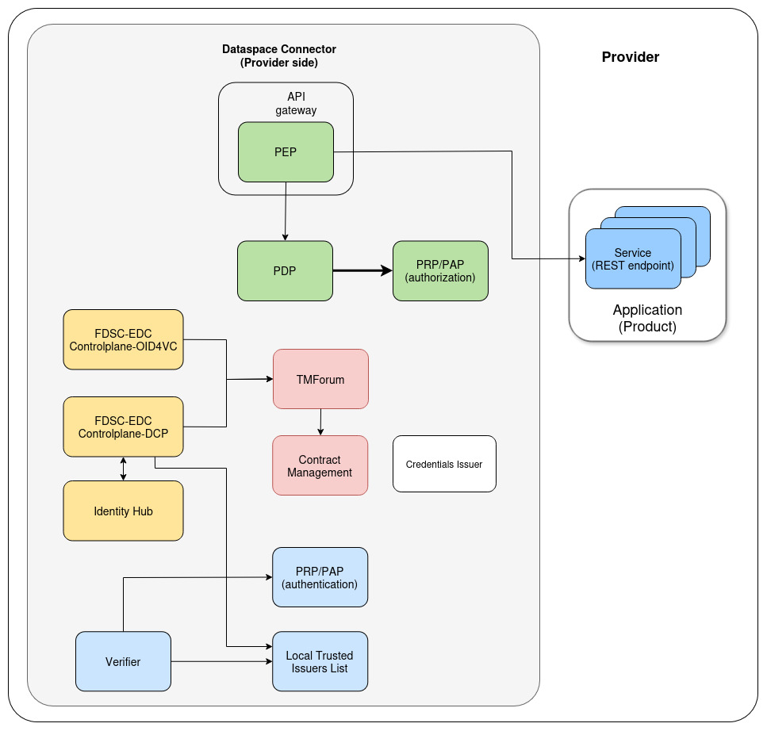
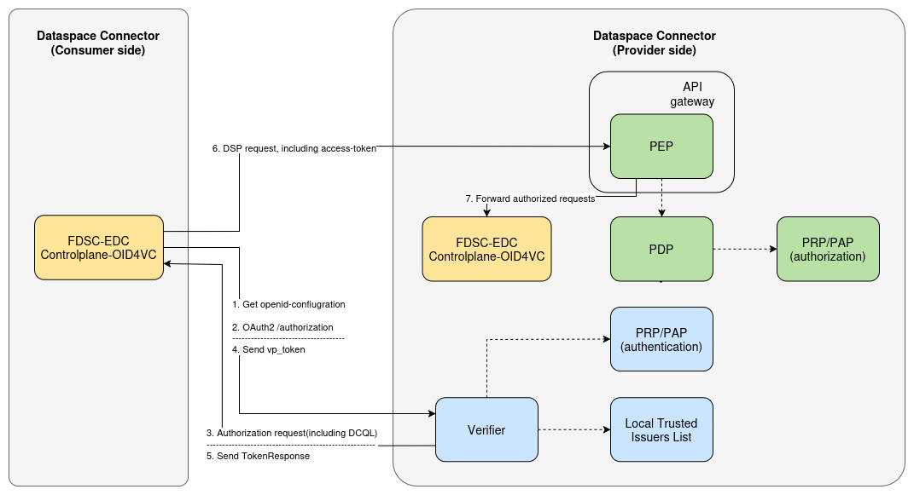
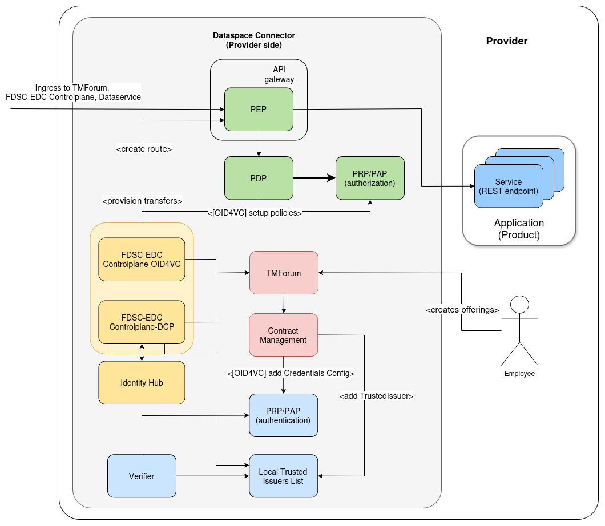

# Integration of the Dataspace Protocol

In order to be compatible with other connectors, the FIWARE Data Space Connector supports the [Dataspace Protocol](https://eclipse-dataspace-protocol-base.github.io/DataspaceProtocol/2025-1-err1/) and the [Decentralize Claims Protocol with the Dataspace Protocol](https://eclipse-dataspace-dcp.github.io/decentralized-claims-protocol/v1.0.1/).

## Architecture




* [TMForum API](https://github.com/FIWARE/tmforum-api) provides the APIs for creating and managing Products and Offerings
    * integrates with the Contract Management through Events
* [FDSC-EDC](https://github.com/SEAMWARE/fdsc-edc) is an implementation of the Eclipse Data Space Components that
    * provides the  [Transfer Process API](https://eclipse-dataspace-protocol-base.github.io/DataspaceProtocol/2025-1-err1/#transfer-protocol)
    * provides the [Catalog API](https://eclipse-dataspace-protocol-base.github.io/DataspaceProtocol/2025-1-err1/#catalog-protocol)
    * provides the [Contract Negotiation API](https://eclipse-dataspace-protocol-base.github.io/DataspaceProtocol/2025-1-err1/#negotiation-protocol)
    * uses the TMForum API as storage backend
    * uses the FIWARE Data Space Connector as the dataplane to provision transfers
    * provides two flavors:
      * OID4VC - uses the [OpenID for Verifiable Credentials Protocols](https://openid.net/sg/openid4vc/) for authentication between connectors
      * DCP - uses the [Decentralized Claims Protocol](https://eclipse-dataspace-dcp.github.io/decentralized-claims-protocol/v1.0.1/) for authentication between connectors
* Identity Hub - implementation of the EDC-Identity Services, currently using the [Tractus-X IdentityHub](github.com/eclipse-tractusx/tractusx-identityhub)
    
### Authentication via OID4VP

In order to integrate with [EUDI Wallet ARF](https://eudi.dev/1.1.0/arf/) compatible wallets and better support for human-to-machine interaction, the FDSC-EDC implementation supports the usage of [OpenID 4 Verifiable Presentations](https://openid.net/specs/openid-4-verifiable-presentations-1_0.html) for Connector-to-Connector communication and for authentication of users accessing the actual data and services. 
Both sides need to have a full IAM-Framework in place(including Verifier and PEP). The following architecture only shows those components at the provider side, however the flow is the same on call from provider to consumer, thus the consumer needs to have them, too.



A request uses the flow:

1. Get /.well-known/openid-configuration
2. Extract the [Authorization Endpoint](https://datatracker.ietf.org/doc/html/rfc6749#section-3.1) and call it
3. Verifier will return the Authorization Request, including information about the requested credentials(via [DCQL](https://openid.net/specs/openid-4-verifiable-presentations-1_0.html#name-digital-credentials-query-l))
4. Consumer selects the claims and credentials to be presented, creates and signs a vp_token and sends it to the verifiers [Token Endpoint](https://datatracker.ietf.org/doc/html/rfc6749#section-3.2)
5. Verifier verifies the token against, checks the issuer at the configured trusted lists and returns a [Token Response](https://datatracker.ietf.org/doc/html/rfc6749#section-4.1.4) containing the JWT in the configured(see [Credentials-Config-Service](https://github.com/FIWARE/credentials-config-service)) format
6. Consumer requests the Provider Controlplane through its Policy-Enforcement-Point. PEP will apply policies, controling access to the DSP-API
7. PEP forwards request to the Controlplane, in order to handle it


#### Preparation

In order to authenticate itself, the FDSC-EDC requires access to the Verifiable Credentials it needs to present. Currently, the implementation only supports storage of the credentials inside a folder provided to the FDSC-EDC. The credentials need to be provided in plain fails, using `.jwt` for JWT-VC and `.sd_jwt`for SD-JWT VC as file extension. See the [FDSC-EDC Helm Chart documentation](https://github.com/FIWARE/helm-charts/blob/main/charts/fdsc-edc/values.yaml#L173) for more details on configuring the FDSC-EDC.

### Authentication via DCP

In order to authenticate via DCP, an instance of the Identity Hub has to be provided. The following diagram only includes it on the Consumer side, but its also needed on the Provider side to call back.


1. Connector gets a [Self-Issued Token](https://eclipse-dataspace-dcp.github.io/decentralized-claims-protocol/v1.0.1/#self-issued-id-tokens) from its IdentiyHub(STS-Service), that includes the ID-Token and the Access Token
2. Sends request with both Tokens to the Provider connector
3. Provider resolves the DID, extracted from the ID-Token, requests did-document at the Consumer's IdentityHub(DID-Service)
4. Consumer returns did-document, containing the Credential Service address
5. Provider requests Credentials at the IdentityHub(Credential Service), using the Access Token
6. Consumer returns Verifiable Presentation, containing the Credentials. Provider side verifies them and checks issuers at the TrustedIssuersList.

For configuration details, see the [FDSC-EDC Helm Chart documentation](https://github.com/FIWARE/helm-charts/blob/main/charts/fdsc-edc/values.yaml#L299).

### Provisioning

The FIWARE FDSC-EDC does not come with an explicit implementation of the dataplane, since the FIWARE Data Space Connector itself acts as such. Transfers are provisioned at Apisix and configured depending on the requested Authentication Protocol.



With an agreement in place, connectors can request data transfers using the [Transfer Process Protocol](https://eclipse-dataspace-protocol-base.github.io/DataspaceProtocol/2025-1-err1/#transfer-protocol). When a Transfer Process gets started, the provisioning happens as following

#### OID4VP

1. Add AccessPolicies to the PAP, enforces them on usage of the transfer
2. Add Credentials Configuration to the Credentials-Config-Service if configured
3. Create a <TRANSFER_PROCESS_ID>/.well-known/openid-configuration route at Apisix, to allow OID4VP auth
4. Create a <TRANSFER_PROCESS_ID>/ route to the data-service/data-set
5. Return the created route-endpoint to the counterparty for usage

#### DCP

1. Enforce AccessPolicies
2. Create a <TRANSFER_PROCESS_ID>/ route to the data-service/data-set
3. Generate a JWT, containing the transfer-process-id as scope, signed with the controlplanes key
4. Return the route-endpoint and the jwt to the counterparty for usage

## Usage

> :warning: The following steps expect a local environment deployed, as described in [the local deployment quick start](./deployment-integration/local-deployment/LOCAL.MD#quick-start)

The following steps will show how to create a ProductOffering throught the TMForum-APIs, buy access to it via TMForum, DSP+OID4VP and DSP+DCP and access the purchased data-service through all 3 methods. It requires a proper setup of Consumer and Provider identities as expected for the DCP, which also works for OID4VP.

### Setup the consumer

The consumer-identity and key-material needs to be registered in the identityhub, in order to participate in DCP-based DSP interactions. Since all OID4VC base flows do not rely on any propriatary extensions to the did-standard, they can also work with that.

1. Get the private key(generated during deployment process, used for signing the certificates) as JWK(to allow signing tokens in the Secure Token Service):
```shell
export CONSUMER_JWK=$(./doc/scripts/get-private-jwk-p-256.sh ./helpers/certs/out/client-consumer/private/client-pkcs8.key.pem); echo $CONSUMER_JWK
```

2. Insert the key into Vault:
```shell
curl -X POST 'http://vault-fancy-marketplace.127.0.0.1.nip.io:8080/v1/secret/data/key-1' \
  --header 'X-Vault-Token: root' \
  --data "$(jq -n --arg content "$CONSUMER_JWK" '{data:{content:$content}}')"
```

3. Insert the participants identity and public key into identity hub. 
```shell
export CONSUMER_PARTICIPANT=$(./doc/scripts/get-participant-create.sh "${CONSUMER_JWK}" did:web:fancy-marketplace.biz "http://identityhub-fancy-marketplace.127.0.0.1.nip.io" "key-1"); echo ${CONSUMER_PARTICIPANT} | jq .
curl -X POST \
  'http://identityhub-management-fancy-marketplace.127.0.0.1.nip.io:8080/api/identity/v1alpha/participants' \
  --header 'Accept: */*' \
  --header 'x-api-key: c3VwZXItdXNlcg==.random' \
  --header 'Content-Type: application/json' \
  --data "${CONSUMER_PARTICIPANT}"
```

4. Check that the identity(e.g. did-document) is available:
```shell
curl -x localhost:8888 https://fancy-marketplace.biz/.well-known/did.json -k | jq .
```

### Setup the provider

The provider indentity has to be prepared exactly the same way:

1. Get the private key(generated during deployment process, used for signing the certificates) as JWK(to allow signing tokens in the Secure Token Service):
```shell
export PROVIDER_JWK=$(./doc/scripts/get-private-jwk-p-256.sh ./helpers/certs/out/client-provider/private/client-pkcs8.key.pem); echo $PROVIDER_JWK
```

2. Insert the key into Vault:
```shell
curl -X POST 'http://vault-mp-operations.127.0.0.1.nip.io:8080/v1/secret/data/key-1' \
  --header 'X-Vault-Token: root' \
  --data "$(jq -n --arg content "$PROVIDER_JWK" '{data:{content:$content}}')"
```

3. Insert the participants identity and public key into identity hub. 
```shell
export PROVIDER_PARTICIPANT=$(./doc/scripts/get-participant-create.sh "${PROVIDER_JWK}" "did:web:mp-operations.org" "http://identityhub-mp-operations.127.0.0.1.nip.io" "key-1"); echo ${PROVIDER_PARTICIPANT} | jq .
curl -X POST \
  'http://identityhub-management-mp-operations.127.0.0.1.nip.io:8080/api/identity/v1alpha/participants' \
  --header 'Accept: */*' \
  --header 'x-api-key: c3VwZXItdXNlcg==.random' \
  --header 'Content-Type: application/json' \
  --data "${PROVIDER_PARTICIPANT}"
```

4. Check that the identity(e.g. did-document) is available:
```shell
curl -x localhost:8888 https://mp-operations.org/.well-known/did.json -k | jq .
```

### Issue membership-credentials

The demo deployment of the DSP is configured to require every participant to identify itself with a "MembershipCredential". In most use-cases, this credential will be issued by a central data-space authority. In order to keep the local deployment at managable size, we allow self-issuance of such credentials.
The OID4VC based flows are automatically configured to get such credential in the local deployment, thus the Credential only needs to be issued for usage in DCP-based flows. The deployed [Tractus-X Identityhub](https://github.com/eclipse-tractusx/tractusx-identityhub) supports integration with compliant [Issuer Services](https://eclipse-dataspace-dcp.github.io/decentralized-claims-protocol/v1.0.1/#credential-issuance-protocol). However, we are reusing the [default issuer](./deployment-integration/local-deployment/LOCAL.MD#credentials-issuance-at-the-consumer) from the FIWARE Data Space Connector and insert the credential manually into the identity hub:

#### Consumer

1. Get the credential and its decoded content:
```shell
export CONSUMER_CREDENTIAL=$(./doc/scripts/get_credential.sh https://keycloak-consumer.127.0.0.1.nip.io membership-credential employee); echo Consumer Credential: ${CONSUMER_CREDENTIAL}
export CONSUMER_CREDENTIAL_CONTENT=$(./doc/scripts/get-payload-from-jwt.sh "${CONSUMER_CREDENTIAL}" | jq -r '.vc'); echo ${CONSUMER_CREDENTIAL_CONTENT} | jq .
```

2. Insert the credential into the identity hub:
```shell
curl  -X POST \
  'http://identityhub-management-fancy-marketplace.127.0.0.1.nip.io:8080/api/identity/v1alpha/participants/ZGlkOndlYjpmYW5jeS1tYXJrZXRwbGFjZS5iaXo/credentials' \
  --header 'Accept: */*' \
  --header 'x-api-key: c3VwZXItdXNlcg==.random' \
  --header 'Content-Type: application/json' \
  --data-raw "{
    \"id\": \"membership-credential\",
    \"participantContextId\": \"did:web:fancy-marketplace.biz\",
    \"verifiableCredentialContainer\": {
      \"rawVc\": \"${CONSUMER_CREDENTIAL}\",
      \"format\": \"VC1_0_JWT\",
      \"credential\": ${CONSUMER_CREDENTIAL_CONTENT}
    }
  }"
```


#### Provider

1. Get the credential and its decoded content:
```shell
export PROVIDER_CREDENTIAL=$(./doc/scripts/get_credential.sh https://keycloak-provider.127.0.0.1.nip.io membership-credential employee); echo Provider Credential: ${PROVIDER_CREDENTIAL}
export PROVIDER_CREDENTIAL_CONTENT=$(./doc/scripts/get-payload-from-jwt.sh "${PROVIDER_CREDENTIAL}" | jq -r '.vc'); echo ${PROVIDER_CREDENTIAL_CONTENT} | jq .
```

2. Insert the credential into the identity hub:
```shell
curl  -X POST \
  'http://identityhub-management-mp-operations.127.0.0.1.nip.io:8080/api/identity/v1alpha/participants/ZGlkOndlYjptcC1vcGVyYXRpb25zLm9yZw/credentials' \
  --header 'Accept: */*' \
  --header 'x-api-key: c3VwZXItdXNlcg==.random' \
  --header 'Content-Type: application/json' \
  --data-raw "{
    \"id\": \"membership-credential\",
    \"participantContextId\": \"did:web:mp-operations.org\",
    \"verifiableCredentialContainer\": {
      \"rawVc\": \"${PROVIDER_CREDENTIAL}\",
      \"format\": \"VC1_0_JWT\",
      \"credential\": ${PROVIDER_CREDENTIAL_CONTENT}
    }
  }"
```

###  Trusted Issuers List

Both participants are preconfigured to trust each other for membership credentials. All components(VCVerifier, FDSC-EDC Controlplane) use the same local trusted issuers list to verify issuers of credentials(check provider-side list for example):

```shell
curl -X GET http://til-provider.127.0.0.1.nip.io:8080/issuer/did:web:fancy-marketplace.biz | jq .
```

### Prepare some data

The Dataservice provided in the Demo Environment is an NGSI-LD Context Broker. In order to have some data available, an entity will be inserted directly. In the demo-scenario, the provider participant "mp-operations.org" offers hosting capabilities and offers detailed data about those machines. As example, we provide an uptime report:

```shell
curl -X POST http://scorpio-provider.127.0.0.1.nip.io:8080/ngsi-ld/v1/entities \
  -H 'Accept: application/json' \
  -H 'Content-Type: application/json' \
  -d '{
    "id": "urn:ngsi-ld:UptimeReport:fms-1",
    "type": "UptimeReport",
    "name": {
      "type": "Property",
      "value": "Standard Server"
    },
    "uptime": {
      "type": "Property",
      "value": "99.9"
    }
  }'
```

### Prepare the offering

The Demo - Offering  should be available for negotiation and usage through standard TMForum mechanisms and through DSP. Therefor all offerings are managed through TMForum-Standard APIs. In the Demo they are requested directly, while in real-world use-cases they most likely will be used through graphical interfaces like the [BAE Marketplace](https://github.com/FIWARE-TMForum/Business-API-Ecosystem).

1. A category has to be created, in order to assing the offering to a catalog:
```shell
export CATEGORY_ID=$(curl -X 'POST' \
  'http://tm-forum-api.127.0.0.1.nip.io:8080/tmf-api/productCatalogManagement/v4/category' \
  -H 'accept: application/json;charset=utf-8' \
  -H 'Content-Type: application/json;charset=utf-8' \
  -d '{
  "description": "Demo Category",
  "name": "Demo Category"
}' | jq .id -r); echo ${CATEGORY_ID}
```

2. Create the catalog, that includes the category:
```shell
export CATALOG_ID=$(curl -X 'POST' \
  'http://tm-forum-api.127.0.0.1.nip.io:8080/tmf-api/productCatalogManagement/v4/catalog' \
  -H 'accept: application/json;charset=utf-8' \
  -H 'Content-Type: application/json;charset=utf-8' \
  -d "{
  \"description\": \"Demo Catalog\",
  \"name\": \"Demo Catalog\",
  \"category\": [
    {
        \"id\": \"${CATEGORY_ID}\"
    }
  ]
}" | jq .id -r); echo ${CATALOG_ID}
```

3. Create the product specification:
```shell
export PRODUCT_SPEC_ID=$(curl -X 'POST' \
    'http://tm-forum-api.127.0.0.1.nip.io:8080/tmf-api/productCatalogManagement/v4/productSpecification' \
    -H 'accept: application/json;charset=utf-8' \
    -H 'Content-Type: application/json;charset=utf-8' \
    -d '{
           "name": "Demo Spec",
           "externalId": "ASSET-1",
           "@schemaLocation": "https://raw.githubusercontent.com/wistefan/edc-dsc/refs/heads/init/schemas/external-id.json",
           "productSpecCharacteristic": [
                {
                   "id": "dcp",
                   "name":"Endpoint, that the service can be negotiated at via DCP.",
                   "valueType":"endpointUrl",
                   "productSpecCharacteristicValue": [{
                      "value":"http://dcp-mp-operations.127.0.0.1.nip.io:8080/api/dsp/2025-1",
                      "isDefault": true
                   }]
               },{
                   "id": "oid4vc",
                   "name":"Endpoint, that the service can be negotiated at via OID4VC.",
                   "valueType":"endpointUrl",
                   "productSpecCharacteristicValue": [{
                      "value":"http://dsp-mp-operations.127.0.0.1.nip.io:8080/api/dsp/2025-1",
                      "isDefault": true
                   }]
               },
               {
                   "id": "upstreamAddress",
                   "name":"Address of the upstream serving the data",
                   "valueType":"upstreamAddress",
                   "productSpecCharacteristicValue": [{
                       "value":"data-service-scorpio:9090",
                       "isDefault": true
                   }]
               },
               {
                   "id": "endpointDescription",
                   "name":"Service Endpoint Description",
                   "valueType":"endpointDescription",
                   "productSpecCharacteristicValue": [{
                       "value":"The Demo Service"
                   }]
               },
               {
                   "id": "targetSpecification",
                   "name":"Detailed specification of the ODRL target. Allows to over services via OID4VC",
                   "valueType":"targetSpecification",
                   "productSpecCharacteristicValue": [{
                      "value": {
                        "@type": "AssetCollection",
                        "refinement": [
                          {
                            "@type": "Constraint",
                            "leftOperand": "http:path",
                            "operator": "http:isInPath",
                            "rightOperand": "/*/ngsi-ld/v1/entities"
                          }
                        ]
                       },
                       "isDefault": true
                   }]
               },
               {
                 "id": "serviceConfiguration",
                 "name": "Service config to be used in the credentials config service when provisioning transfers through OID4VC",
                 "valueType": "serviceConfiguration",
                 "productSpecCharacteristicValue": [
                   {
                     "isDefault": true,
                     "value": {
                       "defaultOidcScope": "openid",
                       "authorizationType": "DEEPLINK",
                       "oidcScopes": {
                         "openid": {
                           "credentials": [
                             {
                               "type": "MembershipCredential",
                               "trustedParticipantsLists": [
                                {
                                  "type": "ebsi",
                                  "url": "http://tir.127.0.0.1.nip.io"
                                }
                               ],
                               "trustedIssuersLists": ["http://trusted-issuers-list:8080"],
                               "jwtInclusion": {
                                 "enabled": true,
                                 "fullInclusion": true
                               }
                             }
                           ],
                           "dcql": {
                             "credentials": [
                               {
                                 "id": "legal-person-query",
                                 "format": "jwt_vc_json",
                                 "multiple": false,
                                 "meta": {
                                   "type_values": ["MembershipCredential"]
                                 }
                               }
                             ]
                           }
                         }
                       }
                     }
                   }
                 ]
               },
               {
                    "id": "credentialsConfig",
                    "name": "Credentials Config",
                    "@schemaLocation": "https://raw.githubusercontent.com/FIWARE/contract-management/refs/heads/main/schemas/credentials/credentialConfigCharacteristic.json",
                    "valueType": "credentialsConfiguration",
                    "productSpecCharacteristicValue": [
                        {
                        "isDefault": true,
                        "value": {
                            "credentialsType": "OperatorCredential",
                            "claims": [{
                                "name": "roles",
                                "path": "$.roles[?(@.target==\"did:web:mp-operation.org\")].names[*]",
                                "allowedValues": [
                                    "OPERATOR"
                                ]
                            }]
                        }
                    }]
                },
                {
                    "id": "policyConfig",
                    "name": "Policy for creation of K8S clusters.",
                    "@schemaLocation": "https://raw.githubusercontent.com/FIWARE/contract-management/refs/heads/policy-support/schemas/odrl/policyCharacteristic.json",
                    "valueType": "authorizationPolicy",
                    "productSpecCharacteristicValue": [
                        {
                        "isDefault": true,
                        "value": {
                            "@context": {
                            "odrl": "http://www.w3.org/ns/odrl/2/"
                            },
                            "@id": "https://mp-operation.org/policy/common/k8s-small",
                            "odrl:uid": "https://mp-operation.org/policy/common/k8s-small",
                            "@type": "odrl:Policy",
                            "odrl:permission": {
                            "odrl:assigner": "https://www.mp-operation.org/",
                            "odrl:target": {
                                "@type": "odrl:AssetCollection",
                                "odrl:source": "urn:asset",
                                "odrl:refinement": [
                                    {
                                        "@type": "odrl:Constraint",
                                        "odrl:leftOperand": "http:path",
                                        "odrl:operator": "http:isInPath",
                                        "odrl:rightOperand": "/ngsi-ld/v1/entities"
                                    }
                                ]
                            },
                            "odrl:assignee": {
                                "@type": "odrl:PartyCollection",
                                "odrl:source": "urn:user",
                                "odrl:refinement": {
                                "@type": "odrl:LogicalConstraint",
                                "odrl:and": [
                                    {
                                    "@type": "odrl:Constraint",
                                    "odrl:leftOperand": "vc:role",
                                    "odrl:operator": "odrl:hasPart",
                                    "odrl:rightOperand": {
                                        "@value": "OPERATOR",
                                        "@type": "xsd:string"
                                    }
                                    },
                                    {
                                    "@type": "odrl:Constraint",
                                    "odrl:leftOperand": "vc:type",
                                    "odrl:operator": "odrl:hasPart",
                                    "odrl:rightOperand": {
                                        "@value": "OperatorCredential",
                                        "@type": "xsd:string"
                                    }
                                    }
                                ]
                                }
                            },
                            "odrl:action": "odrl:read"
                        }
                    }
                }]
        }]
    }' | jq '.id' -r); echo ${PRODUCT_SPEC_ID}
```

4. Create the coresponding offering. It includes the policies required to make it accessible through DSP:
```shell
access_policy_id=$(uuidgen)
contract_policy_id=$(uuidgen)
curl -X 'POST' \
    'http://tm-forum-api.127.0.0.1.nip.io:8080/tmf-api/productCatalogManagement/v4/productOffering' \
    -H 'accept: application/json;charset=utf-8' \
    -H 'Content-Type: application/json;charset=utf-8' \
    -d "{
          \"name\": \"Test Offering\",
          \"description\": \"Test Offering description\",
          \"isBundle\": false,
          \"isSellable\": true,
          \"lifecycleStatus\": \"Active\",
          \"@schemaLocation\": \"https://raw.githubusercontent.com/wistefan/edc-dsc/refs/heads/init/schemas/external-id.json\",
          \"externalId\": \"OFFER-1\",
          \"productSpecification\":
              {
                  \"id\": \"${PRODUCT_SPEC_ID}\",
                  \"name\":\"The Test Spec\"
              },
          \"category\": [{
              \"id\": \"${CATEGORY_ID}\"
          }],
          \"productOfferingTerm\": [
          {
              \"name\": \"edc:contractDefinition\",
              \"@schemaLocation\": \"https://raw.githubusercontent.com/wistefan/edc-dsc/refs/heads/init/schemas/contract-definition.json\",
              \"accessPolicy\": {
                \"@context\": \"http://www.w3.org/ns/odrl.jsonld\",
                \"odrl:uid\": \"${access_policy_id}\",
                \"assigner\": \"did:web:mp-operations.org\",
                \"permission\": [{
                    \"action\":  \"use\"
                }],
                \"@type\":  \"Offer\"  
              },
              \"contractPolicy\": {
                \"@context\": \"http://www.w3.org/ns/odrl.jsonld\",
                \"odrl:uid\": \"${contract_policy_id}\",
                \"assigner\": \"did:web:mp-operations.org\",
                \"permission\": [{
                    \"action\":  \"use\",
                    \"constraint\": {
                      \"leftOperand\": \"odrl:dayOfWeek\",
                      \"operator\": \"lt\",
                      \"rightOperand\": 6
                    }
                }],
                \"@type\":  \"Offer\"
              }
          }]
        }" | jq .
```


### Order through TMForum

> :bulb: While the purchase-process happens through direct API-Calls here, GUI solutions like the BAE-Marketplace can mask all those interactions.

The TMForum APIs are secured by the PEP(Apisix). In order to allow access, we need to put policies to allow that in place:
```shell
./doc/scripts/prepare-policies.sh
```

In order to interact with the TMForum and buy access, a couple of credentials are required:

1. The LegalPersonCredential for the representative allowed to buy products:
```shell
export REP_CREDENTIAL=$(./doc/scripts/get_credential.sh https://keycloak-consumer.127.0.0.1.nip.io user-credential representative); echo ${REP_CREDENTIAL}
```
2. The OperatorCredential for the operator allowed to use the product and access the service:
```shell
export OPERATOR_CREDENTIAL=$(./doc/scripts/get_credential.sh https://keycloak-consumer.127.0.0.1.nip.io operator-credential operator); echo ${OPERATOR_CREDENTIAL}
```

3. Register the consumer in the marketplace:

```shell
export CONSUMER_DID="did:web:fancy-marketplace.biz"  
export ACCESS_TOKEN=$(./doc/scripts/get_access_token_oid4vp.sh http://mp-data-service.127.0.0.1.nip.io:8080 $REP_CREDENTIAL default); echo ${ACCESS_TOKEN}
export FANCY_MARKETPLACE_ID=$(curl -X POST http://mp-tmf-api.127.0.0.1.nip.io:8080/tmf-api/party/v4/organization \
-H 'Accept: */*' \
-H 'Content-Type: application/json' \
-H "Authorization: Bearer ${ACCESS_TOKEN}" \
-d "{
    \"name\": \"Fancy Marketplace Inc.\",
    \"partyCharacteristic\": [
    {
        \"name\": \"did\",
        \"value\": \"${CONSUMER_DID}\" 
    }
    ]
}" | jq '.id' -r); echo ${FANCY_MARKETPLACE_ID} 
```

4. Buy access through TMForum:
    1. List offerings
    ```shell
        export ACCESS_TOKEN=$(./doc/scripts/get_access_token_oid4vp.sh http://mp-data-service.127.0.0.1.nip.io:8080 $REP_CREDENTIAL default); echo $ACCESS_TOKEN
        curl -X GET http://mp-tmf-api.127.0.0.1.nip.io:8080/tmf-api/productCatalogManagement/v4/productOffering -H "Authorization: Bearer ${ACCESS_TOKEN}" | jq .
    ```
    2. Get offer Id and order it:
    ```shell 
        export ACCESS_TOKEN=$(./doc/scripts/get_access_token_oid4vp.sh http://mp-data-service.127.0.0.1.nip.io:8080 $REP_CREDENTIAL default); echo $ACCESS_TOKEN
        export OFFER_ID=$(curl -X GET http://mp-tmf-api.127.0.0.1.nip.io:8080/tmf-api/productCatalogManagement/v4/productOffering -H "Authorization: Bearer ${ACCESS_TOKEN}" | jq '.[0].id' -r); echo ${OFFER_ID}
        export ORDER_ID=$(curl -X POST http://mp-tmf-api.127.0.0.1.nip.io:8080/tmf-api/productOrderingManagement/v4/productOrder \
            -H 'Accept: */*' \
            -H 'Content-Type: application/json' \
            -H "Authorization: Bearer ${ACCESS_TOKEN}" \
            -d "{
                \"productOrderItem\": [
                {
                    \"id\": \"random-order-id\",
                    \"action\": \"add\",
                    \"productOffering\": {
                    \"id\" :  \"${OFFER_ID}\"
                    }
                }  
                ],
                \"relatedParty\": [
                {
                    \"id\": \"${FANCY_MARKETPLACE_ID}\"
                }
                ]}" | jq '.id' -r); echo ${ORDER_ID}
    ```
    3. Complete the order:
    ```shell
        curl -X 'PATCH' \
            -H "Authorization: Bearer ${ACCESS_TOKEN}" \
            http://tm-forum-api.127.0.0.1.nip.io:8080/tmf-api/productOrderingManagement/v4/productOrder/${ORDER_ID} \
            -H 'accept: application/json;charset=utf-8' \
            -H 'Content-Type: application/json;charset=utf-8' \
            -d "{
                    \"state\": \"completed\"
                }" | jq .
    ```

With that, the Data Space Connector will create:
    * an entry in the TrustedIssuers registry, to allow issuance of OperatorCredentials
    * register the policy to allow access for users with OperatorCredential in role "Operator"

5. Access the entity:

```shell
export ACCESS_TOKEN=$(./doc/scripts/get_access_token_oid4vp.sh http://mp-data-service.127.0.0.1.nip.io:8080 $OPERATOR_CREDENTIAL operator); echo $ACCESS_TOKEN 
curl  -X GET http://mp-data-service.127.0.0.1.nip.io:8080/ngsi-ld/v1/entities/urn:ngsi-ld:UptimeReport:fms-1 \
    --header 'Content-Type: application/json' \
    --header "Authorization: Bearer ${ACCESS_TOKEN}"
``` 

### Order through DSP 

The same product now can be negotiatiated throught the Dataspace Protocol. The interactions will be controlled throught he management API of the FDSC-EDC Controlplane, authentication is done by the connector's and cannot be related to the actual actor.

#### DCP

1. Read the catalog:
```shell
curl  -X POST \
  'http://dsp-dcp-management.127.0.0.1.nip.io:8080/api/v1/management/v3/catalog/request' \
  --header 'Accept: */*' \
  --header 'Content-Type: application/json' \
  --data-raw '{
        "@context": [
            "https://w3id.org/edc/connector/management/v0.0.1"
        ],
        "@type": "CatalogRequestMessage",
        "protocol": "dataspace-protocol-http:2025-1",
        "counterPartyId": "did:web:mp-operations.org",
        "counterPartyAddress": "http://dcp-mp-operations.127.0.0.1.nip.io:8080/api/dsp/2025-1",
        "querySpec": {
        }
    }' | jq .
```

2. Start the negotiation by selecting the offer:
```shell
curl  -X POST \
  'http://dsp-dcp-management.127.0.0.1.nip.io:8080/api/v1/management/v3/contractnegotiations' \
  --header 'Accept: */*' \
  --header 'Content-Type: application/json' \
  --data-raw '{
        "@context": [
            "https://w3id.org/edc/connector/management/v0.0.1"
        ],
        "@type": "ContractRequest",
        "counterPartyAddress": "http://dcp-mp-operations.127.0.0.1.nip.io:8080/api/dsp/2025-1",
        "counterPartyId": "did:web:mp-operations.org",
        "protocol": "dataspace-protocol-http:2025-1",
        "policy": {
            "@context": "http://www.w3.org/ns/odrl.jsonld",
            "@type": "Offer",
            "@id": "OFFER-1:ASSET-1:123",
            "assigner": "did:web:mp-operations.org",
            "permission": [{
              "action":  "use",
              "constraint": {
                "leftOperand": "odrl:dayOfWeek",
                "operator": "lt",
                "rightOperand": 6
              }
            }],
            "target": "ASSET-1"
        }
    }' | jq .
```

3. Check the negotiation state:
```shell
curl  -X POST \
  'http://dsp-dcp-management.127.0.0.1.nip.io:8080/api/v1/management/v3/contractnegotiations/request' \
  --header 'Accept: */*' \
  --header 'Content-Type: application/json' | jq .
```

4. When the state of the negotiation is "finalized", the agreement id can be retrieved: 

```shell
export AGREEMENT_ID=$(curl  -X POST \
  'http://dsp-dcp-management.127.0.0.1.nip.io:8080/api/v1/management/v3/contractnegotiations/request' \
  --header 'Accept: */*' \
  --header 'Content-Type: application/json' | jq -r .[].contractAgreementId); echo ${AGREEMENT_ID}
```

5. With the aggreement, the transfer can be started:
```shell
curl  -X POST \
  'http://dsp-dcp-management.127.0.0.1.nip.io:8080/api/v1/management/v3/transferprocesses' \
  --header 'Accept: */*' \
  --header 'Content-Type: application/json' \
  --data-raw "{
    \"@context\": [
        \"https://w3id.org/edc/connector/management/v0.0.1\"
    ],
    \"assetId\": \"ASSET-1\",
    \"counterPartyId\": \"did:web:mp-operations.org\",
    \"counterPartyAddress\":  \"http://dcp-mp-operations.127.0.0.1.nip.io:8080/api/dsp/2025-1\",
    \"connectorId\": \"did:web:mp-operations.org\",
    \"contractId\": \"${AGREEMENT_ID}\",
    \"protocol\": \"dataspace-protocol-http:2025-1\",
    \"transferType\": \"HttpData-PULL\"
}" | jq .
```

6. Retrieve the transfer state:
```shell
curl  -X POST \
  'http://dsp-dcp-management.127.0.0.1.nip.io:8080/api/v1/management/v3/transferprocesses/request' \
  --header 'Accept: */*' \
  --header 'Content-Type: application/json' \
  --data-raw '{
    "@context": ["https://w3id.org/edc/connector/management/v0.0.1"],
    "@type": "QuerySpec"
  }' | jq .
```

7. Get the transfer Id and use it for retrieving endpoint-url and access-token:
```shell
export TRANSFER_ID=$(curl -s -X POST \
  'http://dsp-dcp-management.127.0.0.1.nip.io:8080/api/v1/management/v3/transferprocesses/request' \
  --header 'Accept: */*' \
  --header 'Content-Type: application/json' \
  --data-raw '{
    "@context": ["https://w3id.org/edc/connector/management/v0.0.1"],
    "@type": "QuerySpec"
  }' | jq -r '.[]."@id"'); echo Transfer ID: ${TRANSFER_ID}
export ENDPOINT=$(curl -s -X GET "http://dsp-dcp-management.127.0.0.1.nip.io:8080/api/v1/management/v3/edrs/${TRANSFER_ID}/dataaddress" | jq -r .endpoint); echo Endpoint: ${ENDPOINT}
export ACCESS_TOKEN=$(curl -s -X GET "http://dsp-dcp-management.127.0.0.1.nip.io:8080/api/v1/management/v3/edrs/${TRANSFER_ID}/dataaddress" | jq -r .token); echo Access Token: ${ACCESS_TOKEN}
```

8. Access the service:
```shell
curl -s -x localhost:8888 -X GET ${ENDPOINT}/ngsi-ld/v1/entities/urn:ngsi-ld:UptimeReport:fms-1 \
  --header 'Content-Type: application/json' \
  --header "Authorization: Bearer ${ACCESS_TOKEN}" | jq .
```

### OID4VC

The exact same process can be done through connectors authenticating via OID4VC. In order to keep it simple, we will not run the full negotiation process again, since an agreement can be used independetly from the protocol it was negotiated under. However, the catalog will be read and the transfer process will be setup using OID4VC.
In order to use OID4VC, the management API of the OID4VC instance of the controlplane has to be used.

1. Read the catalog:
```shell
curl -s -X POST \
  'http://dsp-oid4vc-management.127.0.0.1.nip.io:8080/api/v1/management/v3/catalog/request' \
  --header 'Accept: */*' \
  --header 'Content-Type: application/json' \
  --data-raw '{
        "@context": [
            "https://w3id.org/edc/connector/management/v0.0.1"
        ],
        "@type": "CatalogRequestMessage",
        "protocol": "dataspace-protocol-http:2025-1",
        "counterPartyId": "did:web:mp-operations.org",
        "counterPartyAddress": "http://dsp-mp-operations.127.0.0.1.nip.io:8080/api/dsp/2025-1",
        "querySpec": {
        }
    }' | jq .
```

2. Request the transfer with the Agreement created via DCP:
```shell
curl  -X POST \
  'http://dsp-oid4vc-management.127.0.0.1.nip.io:8080/api/v1/management/v3/transferprocesses' \
  --header 'Accept: */*' \
  --header 'Content-Type: application/json' \
  --data-raw "{
    \"@context\": [
        \"https://w3id.org/edc/connector/management/v0.0.1\"
    ],
    \"assetId\": \"ASSET-1\",
    \"counterPartyId\": \"did:web:mp-operations.org\",
    \"counterPartyAddress\":  \"http://dsp-mp-operations.127.0.0.1.nip.io:8080/api/dsp/2025-1\",
    \"connectorId\": \"did:web:mp-operations.org\",
    \"contractId\": \"${AGREEMENT_ID}\",
    \"dataDestination\": {
        \"type\": \"HttpProxy\"
    },
    \"protocol\": \"dataspace-protocol-http:2025-1\",
    \"transferType\": \"HttpData-PULL\"
}" | jq .
```

3. Get the transfer state:
```shell
curl  -X POST \
  'http://dsp-oid4vc-management.127.0.0.1.nip.io:8080/api/v1/management/v3/transferprocesses/request' \
  --header 'Accept: */*' \
  --header 'Content-Type: application/json' \
  --data-raw '{
    "@context": ["https://w3id.org/edc/connector/management/v0.0.1"],
    "@type": "QuerySpec"
  }' | jq .
```

4. Retrieve the endpoint:
```shell
export TRANSFER_ID=$(curl  -X POST \
  'http://dsp-oid4vc-management.127.0.0.1.nip.io:8080/api/v1/management/v3/transferprocesses/request' \
  --header 'Accept: */*' \
  --header 'Content-Type: application/json' \
  --data-raw '{
    "@context": ["https://w3id.org/edc/connector/management/v0.0.1"],
    "@type": "QuerySpec"
  }' | jq -r '.[]."@id"'); echo ${TRANSFER_ID}
export ENDPOINT=$(curl -X GET "http://dsp-oid4vc-management.127.0.0.1.nip.io:8080/api/v1/management/v3/edrs/${TRANSFER_ID}/dataaddress" | jq -r .endpoint); echo ${ENDPOINT}
```

5. Request without token fails:
```shell
curl -x localhost:8888 -X GET ${ENDPOINT}/ngsi-ld/v1/entities/urn:ngsi-ld:UptimeReport:fms-1
```

6. Request openid-configuration:
```shell
curl -x localhost:8888 -X GET ${ENDPOINT}/.well-known/openid-configuration | jq .
```

7. Access via OID4VP:
```shell
export MEMBERSHIP_CREDENTIAL=$(./doc/scripts/get_credential.sh https://keycloak-consumer.127.0.0.1.nip.io membership-credential employee)
export ACCESS_TOKEN=$(./doc/scripts/get_access_token_oid4vp.sh ${ENDPOINT} $MEMBERSHIP_CREDENTIAL openid); echo Access Token: $ACCESS_TOKEN
curl -x localhost:8888 -X GET ${ENDPOINT}/ngsi-ld/v1/entities/urn:ngsi-ld:UptimeReport:fms-1 \
  --header 'Content-Type: application/json' \
  --header "Authorization: Bearer ${ACCESS_TOKEN}" | jq .
```