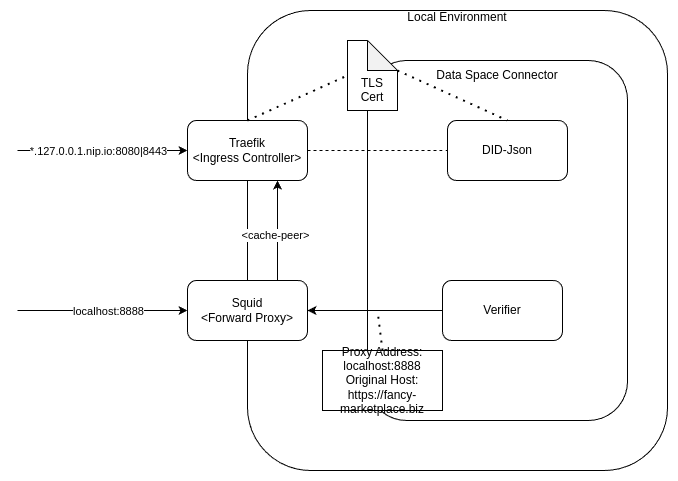

# Integration with the Gaia-X Trustframework

In order to be compatible with common european frameworks for Dataspaces, the FIWARE Data Space Connector provides integrations with the [Gaia-X Trustframework](https://gaia-x.gitlab.io/policy-rules-committee/trust-framework/). 

> :warning: The FIWARE Data Space Connector is not supporting the full Gaia-X Trustframework. While a number of features is still under development(see [Ongoing-Work](./ONGOING_WORK.md)), others (like ```did:web``` for Verifiable Presentations) are not enforced in order to keep it more flexible. If strict support is required, users need to ensure that holders are also using ```did:web``` based identities, instead of the default ```did:key```

## Gaia-X Digital Clearing Houses as Trusted Issuers Registry

The FIWARE Data Space Connector requires at least one Trusted Issuers Registry as its [Trust Anchor](./deployment-integration/local-deployment/LOCAL.MD#the-trust-anchor). While one of the options is the usage of an [EBSI-Trusted Issuers Registry compatible service](https://hub.ebsi.eu/apis/pilot/trusted-issuers-registry/v4), its also possible to rely on [Gaia-X Digital Clearing Houses(GDCH)](https://gaia-x.eu/services-deliverables/digital-clearing-house/). 
As part of its mandatory components, each GDCH has to provide a [Gaia-X Registry Service](https://docs.gaia-x.eu/technical-committee/architecture-document/24.04/gx_services/#gaia-x-registry). The registry-service is responsible for storing the Trust Anchors accepted by the Gaia-X Trust Framework and provides an [API](https://registry.lab.gaia-x.eu/v2/docs/) that can be used for verifying such trust chains. 

Since Gaia-X supports [did:web as schema for credentials issuers](https://gitlab.com/gaia-x/technical-committee/identity-credentials-and-access-management-working-group/icam/-/blob/main/docs/credential_format.md#issuers), an integration with the FIWARE Data Space Connector can be achieved by just using such identity for the participant. Thus, when a participant is registered with a Gaia-X compatible ```did:web``` in the Data Space and the [Verifier is configured to use a Gaia-X registry](https://github.com/FIWARE/VCVerifier?tab=readme-ov-file#gaia-x-registry), a GDCH can be used as participants registry.

### Demo Usage

A demonstrational support for integration of the Gaia-X Digital Clearing House is provided as part of the [Local-Deployment](./deployment-integration/local-deployment/LOCAL.MD). As a deviation from the default-example(using did:key for the consumer), the ```gaia-x``` profile has to be used to create a local-resolvable, gaia-x compliant ```did:web``` and a local instance of a GDCH.

To run the local setup:
```shell
      mvn clean deploy -Plocal,gaia-x
```

Once the system started, all flows described for the [local setup](./deployment-integration/local-deployment/LOCAL.MD#the-data-space) can be executed. 

#### Differences to local deployment

In order to have a valid ```did:web``` available inside the local environment, a proper certificate chain has to be generated. This can be done with the scripts available in the [helpers/certs/-folder](../helpers/certs/). When executed, the will create a Root-CA, an Intermediate-CA and a Client-Certificate, containing the identity of our demo-consumer ```did:web:fancy-marketplace.biz```. The script will also take care to distribute the secrets and certificates through the k3s configuration:

* the client-certificate private-key and the certificate-chain as a java-keystore to the [Consumers Keycloak Deployment](../k3s/consumer/), in order to properly sign credentials
* the certificate chain as a tls-secrets to the [Treafik Deployment](../k3s/infra/traefik/) to be used as TLS Certificate on the Ingress
* the Root-CA's keypair as a secret for the [gx-registry Deployment](../k3s/infra/gx-registry/), to be used as trust-anchor of the GDCH
* the Root-CA as a secret for the [Provider](../k3s/provider/) to allow import into the Verifiers Trust-Store for trusting the certificates
* the certificate chain as a secret to the [Consumer] to allow its publication as part of the did.json-document
* the Root-CA as a an env-var for the [registries init-container](../k3s/infra/gx-registry/deployment-registry.yaml) to be inserted in the [Trust-Anchors List](../helpers/gaiax-local-trust/README.md)
* the client-certs modulus and exponent for the [values.yaml](../k3s/consumer-gaia-x.yaml) to allow its publication as part of the did.json-document

In addition to create the ```did:web``` some more infrastructure changes are required to support proper resolution of the did. According to the [spec](https://w3c-ccg.github.io/did-method-web/), a did.json document needs to be made available at a well-known endpoint(in case of the demo-consumer that would be `fancy-marketplace.biz/.well-known/did.json`) through https. To support the required dns-resolution and local certificates for the Verifier and Gaia-X Registry Service, a proxy solution is integrated with the local deployment:



While [Traefik](../k3s/infra/traefik/) still acts as the [Ingress-Controller](https://kubernetes.io/docs/concepts/services-networking/ingress-controllers/), it now also offers an ```https``` endpoint, using the previously created certificate for all configured endpoints. Certificate support can be enabled at Ingress-Level with the annotation ```traefik.ingress.kubernetes.io/router.tls: "true"```. With that, our did-document could be addressed through Traefik by explicitly using the ssl-port(8443). However, to be compliant with the spec, there needs to be a way to support access by directly using ```https://fancy-marketplace.biz/.well-known/did.json```. 
For that, [Squid](../k3s/infra/squid/) is deployed and configured as an (Https-)Forward-Proxy, using Treafik as a Cache-Peer. By doing so, Squid will forward all request that are proxied through it(achievable in the Verifier and GX-Registry by using the HTTP(|S)_PROXY env var) to Treafik and allows it to be resolved through its internal mechanisms.
The proxy can also be used for locally accessing the document:

```shell
curl --insecure -x  http://localhost:8888 https://fancy-marketplace.biz/.well-known/did.json
```

The request has to be flagged as insecure, since the generated certificate is self-signed. The resulting document will be similar to:

```json
{
  "@context": "https://www.w3.org/ns/did/v1",
  "id": "did:web:fancy-marketplace.biz",
  "verificationMethod": [
    {
      "id": "did:web:fancy-marketplace.biz",
      "type": "JsonWebKey2020",
      "controller": "did:web:fancy-marketplace.biz",
      "publicKeyJwk": {
        "kty": "RSA",
        "e": "AQAB",
        "n": "1j7tntXHTIoRR4zL80XmOaI5bxC1SpqiNKbCiIR_8y689libIV0P_J1pB_MyeCJHwhbih91MHRAu2Dg4pg9dskpWBSKUtrQxHcPxSubupzZc0HUunoe-6jX_4GW-2stZ3gyZCsBBLLBAKMHlZGOMPGjG1gKci2ieBG-Vgyk6uKKelMqyJAxDFqqeXvD0rtFXmkcTCUZhgJyXc0PRYQr0EDdNTZprMY9aVg2g46vveBU_ck9y7Fws6MEwR3ElPonaU2sMOOrAfTpJm0OMaYYSDb-Pi41WCv3eXYPMkSyRA-nLVFeckv79tt1bKC48uuIq1DaRibJShCSt5Bb2BVrIQ1PdU4huO-HesyOTghspPC9jwf8JHDY4ND441_KsIUtuW3HBI6IQsTmovz7N022qCcEAC6rav8R25qOEKeX0_jHHg-BdlXIUFJXfKmOh17KAFFpreQfuyPXhYa2yE26HhZll-eZCKyWwfIqsmCBQdXA3_ZqpRN5xGjkhp92o4KWqGU9G0Eo9FTvbQDAxLri4hZlfe38XDwAoP_7pZrYx2oDPEv5E_0-GR2k2usTJQPuJjCpfu5BXBWHbAHv1--qqOBgHOcfBTroCMLgaYFLq0pu3ZnW-gf3RRcNtZyoh2PjD_MkbK_oMP16PX597heEAoOAHuQEcVRCuwNFIOtMxTtc",
        "x5u": "http://fancy-marketplace.biz/.well-known/tls.crt"
      }
    }
  ]
}
```

## Gaia-X ODRL Profile

As part of [Gaia-X](https://gaia-x.eu/), an [ODRL-Profile](https://gitlab.com/gaia-x/lab/policy-reasoning/odrl-vc-profile) with the goal to be able to refer in a clear and preciese way to Verifiable Credential Claims within ODRL-Policies.
The FIWARE Data Space Connector supports the usage of all defined  components:


### ovc:Constraint

Its a sup type of an [odrl:Constraint](https://www.w3.org/TR/odrl-vocab/#constraints), that requires an ovc:leftOperand and ovc:credentialSubjectType to be present, beside the mandatory [odrl:operator](https://www.w3.org/TR/odrl-vocab/#term-Operator) and [odrl:rightOperand](https://www.w3.org/TR/odrl-vocab/#term-RightOperand).

### ovc:leftOperand

Implementation of the [odrl:leftOperand](https://www.w3.org/TR/odrl-vocab/#term-LeftOperand) that addresses a Verifiable Credential's Claim by using the Json-Path. Json-Paths into arrays are currently not supported.

Supported:
```shell
  "ovc:leftOperand": "$.credentialSubject.my.claim"
```

Not supported:
```shell
  "ovc:leftOperand": "$.credentialSubject.my.claim[0]"
```

### ovc:credentialSubjectType

```ovc:credentialSubjectType``` is a way to define the type of Verifiable Credential that the ```ovc:Constraint``` is intended for. 


## Usage 

Policies can be created at the [ODRL-PAP](https://github.com/wistefan/odrl-pap). 

> :bulb: The following examples use the [local-deployment of the connector](./deployment-integration/local-deployment/LOCAL.MD). However, all of them can be run on any other installation of the Data Space Connector.

The policy would allow any caller providing a Verifiable Credential with the the ```credentialSubject.type``` being ```gx:LegalParticipant``` and containing a claim ```credentialSubject.gx:legalAddress.gx:countrySubdivisionCode``` with the value either being ```FR-HDF``` or ```BE-BRU``` to read the entity with the id ```my-secured-object``` .

```shell
curl -X 'POST' http://pap-provider.127.0.0.1.nip.io:8080/policy \
    -H 'Content-Type: application/json'
    -d '{
        "@context": {
            "odrl": "http://www.w3.org/ns/odrl/2/",
            "ovc": "https://w3id.org/gaia-x/ovc/1/",
            "rdfs": "http://www.w3.org/2000/01/rdf-schema#"
        },
        "@id": "urn:uuid:some-uuid",
        "@type": "odrl:Policy",
        "odrl:profile": "https://github.com/DOME-Marketplace/dome-odrl-profile/blob/main/dome-op.ttl",
        "odrl:permission": {
            "odrl:assigner": {
                "@id": "https://www.mp-operation.org/"
            },
            "odrl:target": "my-secured-object",
            "odrl:assignee":{
              "@id": "vc:any"
            },
            "odrl:action": {
                "@id": "odrl:read"
            },
            "ovc:constraint": [{
                "ovc:leftOperand": "$.credentialSubject.gx:legalAddress.gx:countrySubdivisionCode",
                "odrl:operator": "odrl:anyOf",
                "odrl:rightOperand": [
                    "FR-HDF",
                    "BE-BRU"
                ],
                "ovc:credentialSubjectType": "gx:LegalParticipant"
            }]
        }
    }' 
```