# Marketplace integration

In order to offer data and data services or buy them, the FIWARE Data Space Connector supports the integration with the [FIWARE BAE Marketplace](https://github.com/FIWARE-TMForum). It can be enabled through the ```marketplace.enabled: true``` configuration. 

## Demo Usage

The Marketplace is integrated into the [Local Deployment](./deployment-integration/local-deployment/LOCAL.MD). To prepare the DEMO interaction, deploy it via ```mvn clean deploy -Plocal```. Since it contains a frontend and needs to integrate with a wallet, the deployment contains [Squid](https://www.squid-cache.org/) as an https-forward-proxy in order to delegate DNS-resolution directly to the [Traefik-Ingress Controller](https://traefik.io). Follow the documented steps to prepare the demo.

### The Wallet

In order to receive Verifiable Credentials and present them to the Marketplace via OID4VP, the [EUDI Android Wallet](https://github.com/eu-digital-identity-wallet/eudi-app-android-wallet-ui) is used. Since the local environment uses self-signed certificates, an apk with certificate validation disabled is provided [here](https://drive.google.com/file/d/10NT5uX1uLwjI2D_XoE1eqmarv8Wo61hO/view?usp=sharing). DO NOT USE THIS VERSION FOR PRODUCTION USE-CASES!

For using the wallet, two options exist - with a connected Mobile Phone or with an locally installed Android Emulator.

#### Mobile Phone

To setup your (Android) Mobile Phone, the following is required:

* enable the ```Developer-Mode``` on the phone -> [Android Documentation](https://developer.android.com/studio/debug/dev-options)
* download the Wallet App -> [Wallet on Google Drive](https://drive.google.com/file/d/10NT5uX1uLwjI2D_XoE1eqmarv8Wo61hO/view?usp=sharing)
* install the Wallet through the downloaded APK. Be aware that warnings will be shown, since it does not come from a trusted store
* connect the Mobile Phone with the local network, two options:
    * if the machine running the local environment is connected to a WLAN without client isolation:  get the IP address of it in the local WLAN(```ip a```)
    * if not, connect the Mobile Phone via USB cable and enable USB tethering: get the IP address in the tethering(```ip a```, most likely the last in the list)
* on the mobile phone, go to ```settings```-> ```connections``` -> ```WLAN```
  * select the local WLAN
  * show advanced settings
  * set Proxy -> Manual
  * Proxy-Hostname: <IP-ADDRESS-OF-THE-LAPTOP>
  * Proxy-Port: 8888

#### Android Emulator

> :warning: This is only tested on Ubuntu. In other systems, different solutions might be required.

If running on the Mobile Phone is not possible or desirable, the Android Emulator can be used:

* install the [Android Studio](https://developer.android.com/studio/install)
* create a Virtual Device(through the device-manager), rename it to an easy typable name(in the example, its 'p-xl-4')
    * the image should support Android Version >= 13, min target SDK >= 23, for example an Google Pixel 4 image
* close Android Studio and interact directly with the emulator, its located in the Android-SDK folder(most likely something like ~/Android/Sdk/emulator)

Since retrieving and presenting Credentials requires scanning an QR-Code from the screen, the screen-output needs to be presented to the emulator camera:
* install and enable the [v4l2loopback](https://github.com/v4l2loopback/v4l2loopback) kernel module:
```shell
  sudo apt install v4l2loopback-dkms
  sudo modprobe v4l2loopback
```
* find you virtual camera:
```shell
  v4l2-ctl --list-devices
```
* stream the screen to the virtual camera, using [FFmpeg](https://ffmpeg.org/):
```shell
    sudo apt install ffmpeg
    # streams the top left 200x200px rectangle from the screen to the virtual device
    ffmpeg -f x11grab -video_size 1024x768 -i :0.0+200,200 -f v4l2 -pix_fmt yuv420p <NAME-OF-THE-CAMERA-DEVICE>
```

Once this is done, the camera can be connected to the emulator:
* check the name of the camera connected to the virtual device in the emulator:
```shell
    ~/Android/Sdk/emulator/emulator -avd p-xl-4 -webcam-list
```
* start the emulator, with the camera configured as the back-camera
```shell
  # webcam2 is the virtual camera in our example, webcam0 is any other cam in the system, p-xl-4 is the device, hardware accelaration is on
  # Vulkan is required for proper browser rendering an api >29
  ~/Android/Sdk/emulator/emulator -avd p-xl-4 -camera-back webcam2 -accel on -no-snapshot-load -feature -Vulkan -grpc 8554
```

* download the apk from https://drive.google.com/file/d/10NT5uX1uLwjI2D_XoE1eqmarv8Wo61hO/view?usp=sharing
* install the apk to the device:
```shell
    adb install app-dev-debug.apk
```
> :bulb: When first starting the app on the device, an error will be displayed. This is due to not having a Personal ID available in the demo environment and wallet and can just be ignored.

##### Debug the wallet

In order to the debug any issues, adb logcat can be used:
```shell
# get the concrete name of the wallet
* adb shell pm list packages | grep euid
# get pid of the package
* adb shell pidof <your.package.name>
# get logs of the app
* adb logcat | grep pid
```

### The Marketplace

In order to access the marketplace on the local browser, the browser needs to proxy its requests through squid. The easiest solution is to use [Chrome](https://www.google.com/chrome)/[Chromium](https://www.chromium.org/chromium-projects/) with the [FoxyProxy Plugin](https://chromewebstore.google.com/detail/foxyproxy/gcknhkkoolaabfmlnjonogaaifnjlfnp).

* install FoxyProxy into the browser
* go to "options" -> "proxies" -> Add a proxy with:
    * Type HTTP 
    * Hostname 127.0.0.1
    * Port 8888

When enabled, every request will be routed through the squid-proxy inside the local environment.

### Usage

In order to test the marketplace integration, a Provider and a Consumer will be required. For both, Verifiable Credentials will be required. In the example, Credentials for both Participants will be in the same wallet. In real environments, every user will have its own wallet. 

> :warning: All interactions need to happen in the proxied browser.

> :warning: When the pages are first opened in the browser, a certificate warning will be shown. The local environment uses self-signed certificates, add an exception for those sites.

The following flow will enable a customer to use a service offered by the provider by presenting an "OperatorCredential". The data-service is available for M2M-interactions, thus the flows described in the [Local Deployment](./deployment-integration/local-deployment/LOCAL.MD) can be used. To test that the service is not available before the process, do the following steps:

* Create an identity for the Consumer Service:
```shell
  mkdir cert
  chmod o+rw cert
  docker run -v $(pwd)/cert:/cert quay.io/wi_stefan/did-helper:0.1.1
  # unsecure, only do that for demo
  sudo chmod -R o+rw cert/private-key.pem
```

* Export the holder-did:
```shell
  export HOLDER_DID=$(cat cert/did.json | jq '.id' -r); echo ${HOLDER_DID}
```

* Get the "OperatorCredential":
```shell
  export OPERATOR_CREDENTIAL=$(./doc/scripts/get_credential_for_consumer.sh https://keycloak-consumer.127.0.0.1.nip.io operator-credential operator); echo ${OPERATOR_CREDENTIAL}
```

* Try to get an access-token from the Provider - nothing should be returned:

```shell
  ./doc/scripts/get_access_token_oid4vp.sh http://mp-data-service.127.0.0.1.nip.io:8080 $OPERATOR_CREDENTIAL operator
```

Now, buy access to the service.

#### Get a credential as "seller" and login to the marketplace

In order to offer something at the marketplace, the provider needs to issue a credential, containing the "seller"-role to one of its employees.

* Access the provider keycloak at ```https://keycloak-provider.127.0.0.1.nip.io/realms/test-realm/account/oid4vci```
* Login with ```employee@provider.org``` - Password: ```test```
* Open the wallet in the emulator and click on "Scan QR":
  
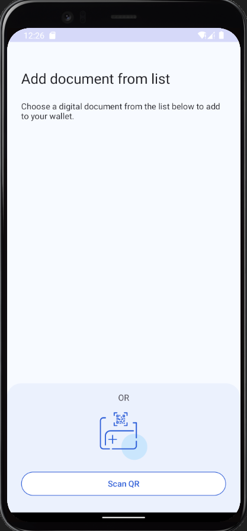
* In Keycloak, goto the "VerifiableCredentials" section and select "user-sd"
* Move the QR in the camera field and follow the flow (BE AWARE: every QR is only valid for 30s, if it times out, reload the page)
* The credential should now be shown in the "Documents" section of the app:
  
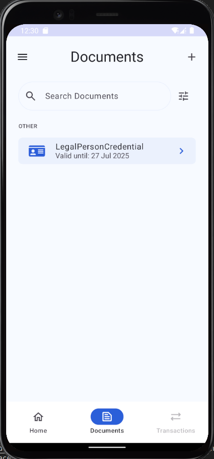
* Open the marketplace at ```https://marketplace.127.0.0.1.nip.io/```
  
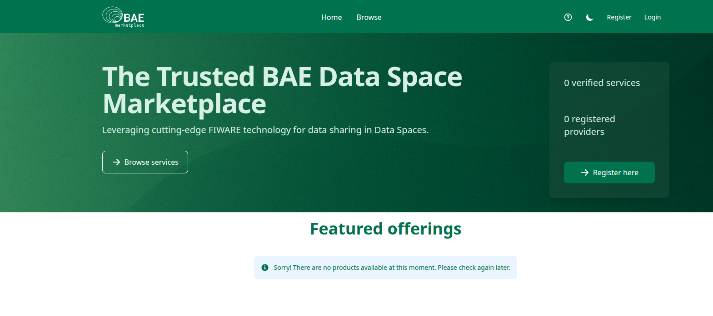
* Click on login, a QR will be shown:
  
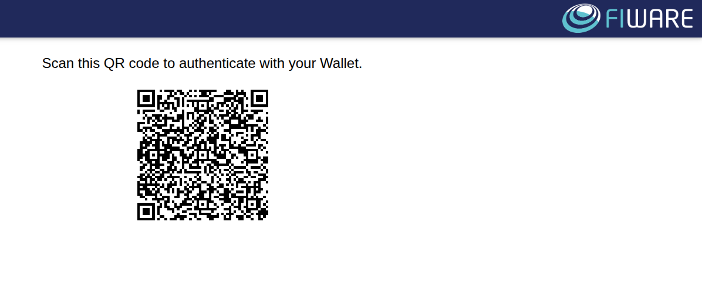
* In the Wallet, select "Home" -> "Authenticate" -> "Online" and scan the QR
* Share the requested credential
* 
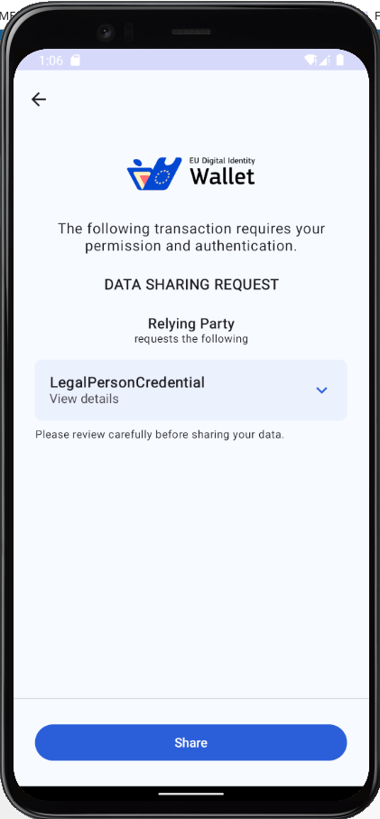

#### Create the offering

An offering has to be created and launched for customers to be bought.

* In the marketplace, move the "My Offerings"-Section
  
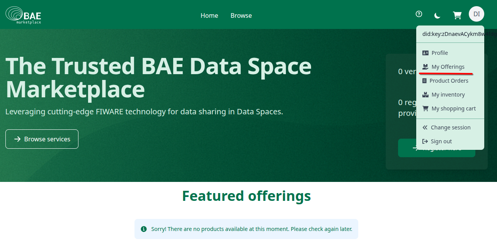

* Create a Catalog and a ProductSpecification, set both to state "Launched"
* Create an Offering, referencing the Catalog and Specification.    
    * leave the PricePlan empty, the local environment does not have any payment integration
    * set Procurment Mode to "manual"
* Set it also to "Launched"
* Logout

#### Get a credential as "customer" and login to the marketplace

In order to buy, an organization has to issue a credential containing the "customer"-role to one of its employees.

* Access the consumer keycloak at ```https://keycloak-consumer.127.0.0.1.nip.io/realms/test-realm/account/oid4vci```
* Login with ```employee@consumer.org``` - Password: ```test```
* In the wallet, go to the documents section and click on "+"
* In Keycloak, goto the "VerifiableCredentials" section and select "user-sd"
* Move the QR in the camera field and follow the flow (BE AWARE: every QR is only valid for 30s, if it times out, reload the page)
* Both credentials should now be shown in the "Documents" section of the app
* Open the marketplace at ```https://marketplace.127.0.0.1.nip.io/```
* Click on login, a QR will be shown
* In the Wallet, select "Home" -> "Authenticate" -> "Online" and scan the QR
* In the sharing request, both credentials will be shown:
  
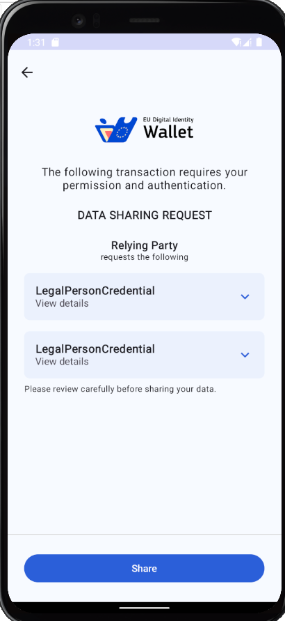
* Open the credential and disable sharing of the "seller"-credential:
  
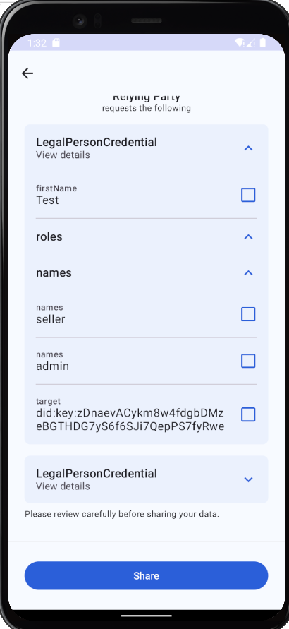

#### Buy access

In order to get access to the service, the offering has to be bought.

* In the marketplace, now select the service and add it to your cart
  
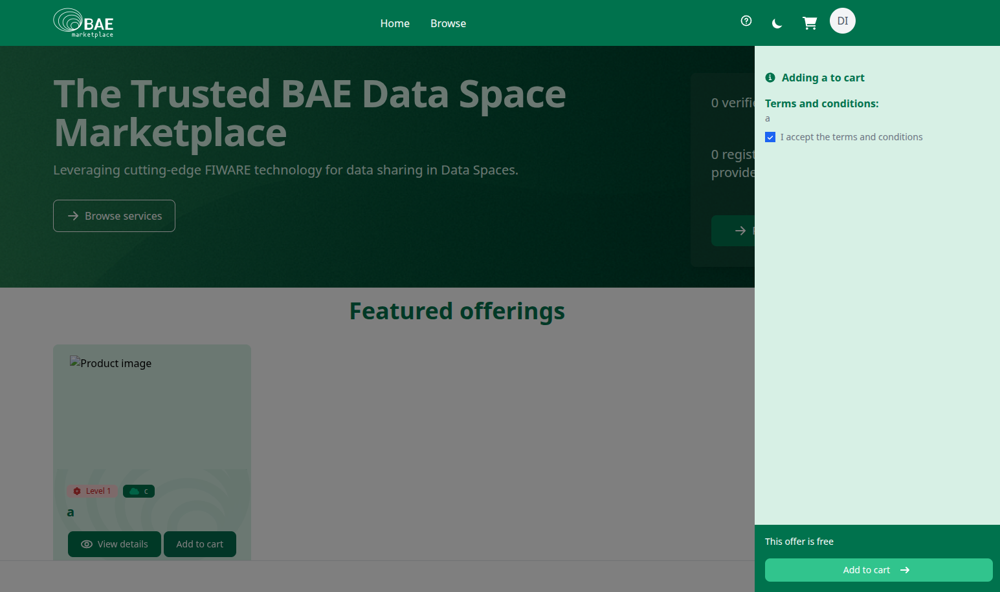
* Click on the cart button and "Proceed to purchase"
* Fill out the billing address and click on the checkout button. The order will now be created in state "Unchecked"
  
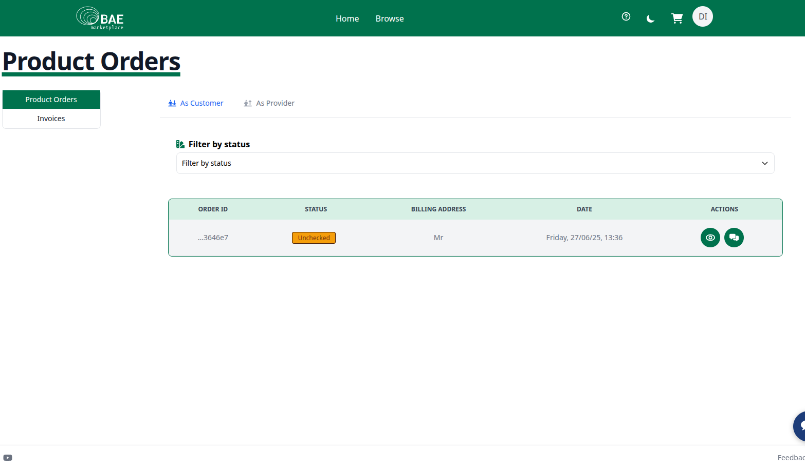
* Logout

#### Process the order

The created order now needs to be processed from within the backoffice of the provider. 

* Login with the "seller"-credential(see [customer-login](#get-a-credential-as-customer-and-login-to-the-marketplace))
* Move to the "Product Order"-Section and open "As Provider"
* Review the order, using the "Review"-Button
  
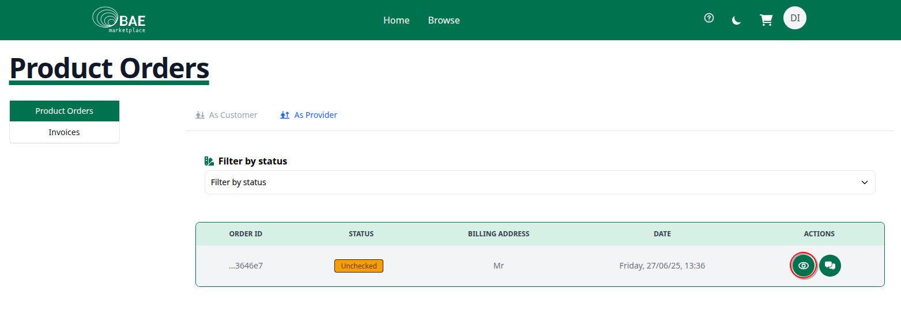
* Move the Order forward, until its in state "completed"

Once the order is completed, the offering is bought and the customer can use the service. Try to get an access-token again - this time an access-token should be returned:

```shell
  ./doc/scripts/get_access_token_oid4vp.sh http://mp-data-service.127.0.0.1.nip.io:8080 $OPERATOR_CREDENTIAL operator
```
