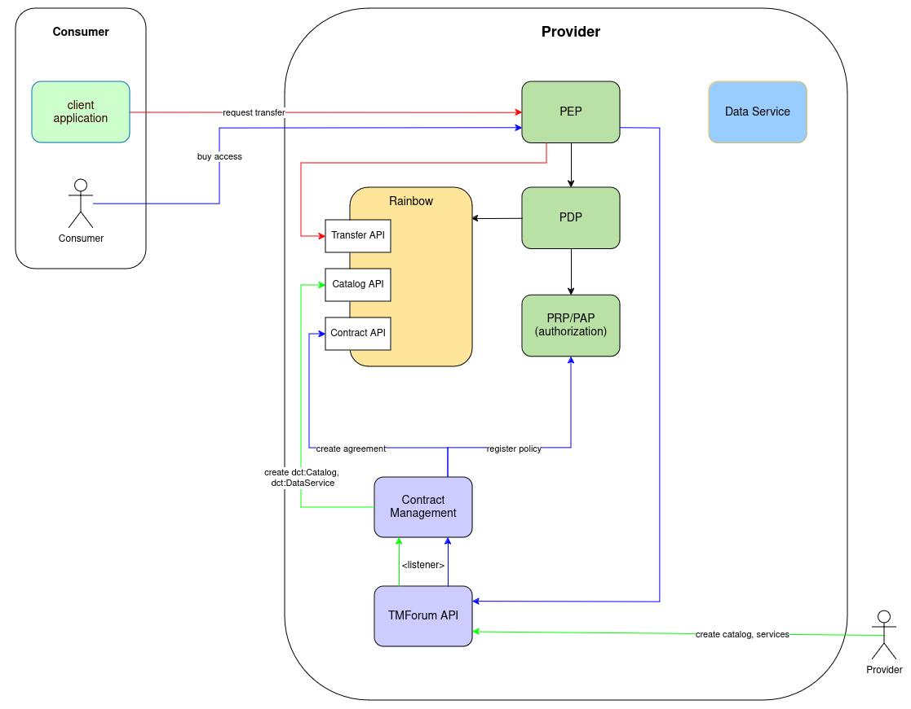

# Ongoing Work

The FIWARE Data Space Connector is constantly beeing developed and extended with new features. Their status and some previews will be listed on this page.

All planned work is listed in the [FIWARE Data Space Connector Taiga-Board](https://tree.taiga.io/project/dwendland-fiware-data-space-connector/epics).

>:warning: Since everything in this section is still under development, it might not work at all times.

## Transfer Process Protocol

In order to be compatible with other Connectors, the FIWARE Data Space Connector will support the [IDSA Transfer Process Protocol](https://docs.internationaldataspaces.org/ids-knowledgebase/dataspace-protocol/transfer-process/transfer.process.protocol). 
The architecture to be implemented is drafted in the following diagramm:



* [Rainbow](https://github.com/ging/rainbow)(not yet public) is a RUST-implementation of the [Dataspace Protocol](https://docs.internationaldataspaces.org/ids-knowledgebase/dataspace-protocol), used for providing the  [Transfer Process API](https://docs.internationaldataspaces.org/ids-knowledgebase/dataspace-protocol/transfer-process/transfer.process.protocol), the [Catalog API](https://docs.internationaldataspaces.org/ids-knowledgebase/dataspace-protocol/catalog/catalog.protocol) and the Agreement-Part of the [Contract Negotiation API](https://docs.internationaldataspaces.org/ids-knowledgebase/dataspace-protocol/contract-negotiation/contract.negotiation.protocol)
* the [Contract Management](https://github.com/FIWARE/contract-management) component is beeing extended to:
    * integrate with the TMForum API and translate its entities to [DCAT Entries](https://www.w3.org/TR/vocab-dcat-3/) in Rainbow([Catalogs](https://www.w3.org/TR/vocab-dcat-3/#Class:Catalog) and [DataServices](https://www.w3.org/TR/vocab-dcat-3/#Class:Data_Service))
    * create Agreements in Rainbow based on the Product Orderings
    * create Policies at the [ODRL-PAP](https://github.com/wistefan/odrl-pap) based in the Product Orderings

The current state of work can be found at the [TPP-Integration Branch of the Contract Management](https://github.com/FIWARE/contract-management/tree/tpp-integration) and the [TPP-Integration Branch of the Data Space Connector](https://github.com/FIWARE/data-space-connector/tree/tpp-integration).   

In order to try it out, check out the branch and deploy the Connector from there. Once everything is running, the following steps can be executed:

1. Create a category:

```shell
export CATEGORY_ID=$(curl -X 'POST' \
  'http://tm-forum-api.127.0.0.1.nip.io:8080/tmf-api/productCatalogManagement/v4/category' \
  -H 'accept: application/json;charset=utf-8' \
  -H 'Content-Type: application/json;charset=utf-8' \
  -d '{
  "description": "Test Category",
  "name": "Test Category"
}' | jq .id -r); echo ${CATEGORY_ID}
```

2. Create a catalog:

```shell
export CATALOG_ID=$(curl -X 'POST' \
  'http://tm-forum-api.127.0.0.1.nip.io:8080/tmf-api/productCatalogManagement/v4/catalog' \
  -H 'accept: application/json;charset=utf-8' \
  -H 'Content-Type: application/json;charset=utf-8' \
  -d "{
  \"description\": \"Test Catalog\",
  \"name\": \"Test Catalog\", 
  \"category\": [
    {
        \"id\": \"${CATEGORY_ID}\"
    }
  ]
}" | jq .id -r); echo ${CATALOG_ID}
```

3. Create a product specification:

```shell
export PRODUCT_SPEC_ID=$(curl -X 'POST' \
  'http://tm-forum-api.127.0.0.1.nip.io:8080/tmf-api/productCatalogManagement/v4/productSpecification' \
  -H 'accept: application/json;charset=utf-8' \
  -H 'Content-Type: application/json;charset=utf-8' \
  -d "{
        \"name\": \"Test Spec\", 
        \"productSpecCharacteristic\": [
            {
                \"id\": \"endpointUrl\",
                \"name\":\"Service Endpoint URL\",
                \"valueType\":\"endpointUrl\",
                \"productSpecCharacteristicValue\": [{
                    \"value\":\"https://the-test-service.org\",
                    \"isDefault\": true
                }]
            },
            {
                \"id\": \"endpointDescription\",
                \"name\":\"Service Endpoint Description\",
                \"valueType\":\"endpointDescription\",
                \"productSpecCharacteristicValue\": [{
                    \"value\":\"The Test Service\"
                }]
            }
        ]
    }" | jq .id -r); echo ${PRODUCT_SPEC_ID}
```

4. Create the product offering:

```shell
export PRODUCT_OFFERING_ID=$(curl -X 'POST' \
  'http://tm-forum-api.127.0.0.1.nip.io:8080/tmf-api/productCatalogManagement/v4/productOffering' \
  -H 'accept: application/json;charset=utf-8' \
  -H 'Content-Type: application/json;charset=utf-8' \
  -d "{
        \"name\": \"Test Offering\",
        \"description\": \"Test Offering description\", 
        \"isBundle\": false,
        \"isSellable\": true,
        \"lifecycleStatus\": \"Active\",
        \"productSpecification\": 
            {
                \"id\": \"${PRODUCT_SPEC_ID}\",
                \"name\":\"The Test Spec\"
            },
        \"category\": [{
            \"id\": \"${CATEGORY_ID}\"
        }]
    }" | jq .id -r); echo ${PRODUCT_OFFERING_ID}
```

After those steps, the catalog with the offering is available at Rainbows' Catalog API:

```shell
    curl -X GET 'http://rainbow.127.0.0.1.nip.io:8080/api/v1/catalogs'
```

The result will be similar to the following:

```json
[
    {
        "@context": "https://w3id.org/dspace/2024/1/context.json",
        "@type": "dcat:Catalog",
        "@id": "urn:ngsi-ld:catalog:5b33f5bc-65e7-40b4-a71c-b722da52a919",
        "foaf:homepage": null,
        "dcat:theme": "",
        "dcat:keyword": "",
        "dct:conformsTo": null,
        "dct:creator": null,
        "dct:identifier": "urn:ngsi-ld:catalog:5b33f5bc-65e7-40b4-a71c-b722da52a919",
        "dct:issued": "2025-01-15T07:25:19.779168",
        "dct:modified": null,
        "dct:title": "Test Catalog",
        "dct:description": [],
        "dspace:participantId": null,
        "odrl:hasPolicy": [],
        "dspace:extraFields": null,
        "dcat:dataset": [],
        "dcat:service": [
            {
                "@context": "https://w3id.org/dspace/2024/1/context.json",
                "@type": "dcat:DataService",
                "@id": "urn:ngsi-ld:product-offering:96eaae6d-1615-41b0-b721-91c6a2e36551",
                "dcat:theme": "",
                "dcat:keyword": "",
                "dcat:endpointDescription": "The Test Service",
                "dcat:endpointURL": "https://the-test-service.org",
                "dct:conformsTo": null,
                "dct:creator": null,
                "dct:identifier": "urn:ngsi-ld:product-offering:96eaae6d-1615-41b0-b721-91c6a2e36551",
                "dct:issued": "2025-01-15T07:25:31.220506",
                "dct:modified": null,
                "dct:title": "Test Spec",
                "dct:description": [],
                "odrl:hasPolicy": [],
                "dspace:extraFields": null
            }
        ]
    }
]
```


>>> TRY WITH HOST MAPPING IN DEPLOYMENT - SEE CONTRACT_MANAGEMENT

```shell
# ca

```
