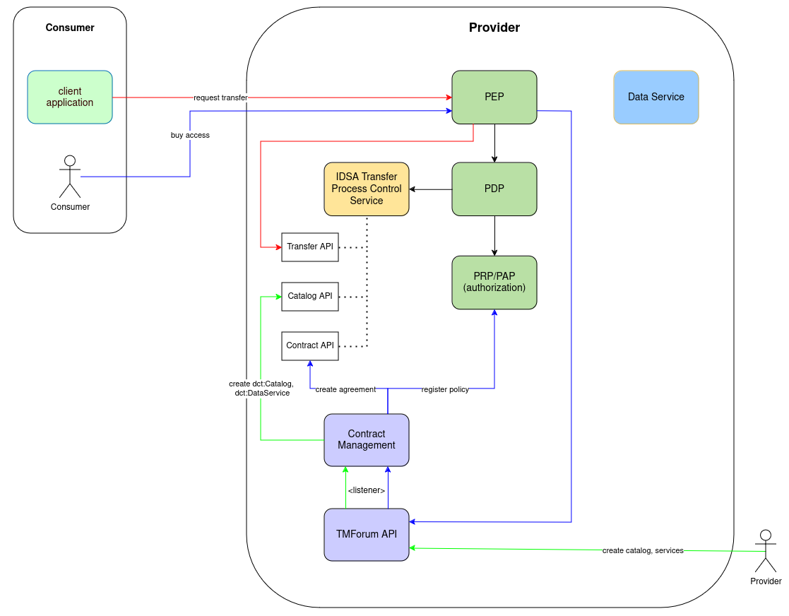

# IDSA Integration

## Transfer Request

{
  "@type": "dspace:TransferRequestMessage",
  "@context": "https://w3id.org/dspace/2024/1/context.json",
  "dspace:consumerPid": "urn:uuid:9bde790b-a42c-4b16-a246-69b4caa12c37",
  "dct:format": "ngsi-ld+pull",
  "dspace:callbackAddress":"http://my-callback.org",
  "dspace:agreementId": "urn:uuid:8d1872af-515d-4507-b470-0812709ec4e9"
}

## Catalog

{
	"id" : "test-catalog",
	"dct:title": "test-catalog"
}

## Data Service

{
	"dct:title": "Data Service", 
	"dct:description": "My new Data Service",
	"dcat:endpointDescription": "The service endpoint",
	"dcat:endpointURL": "https://my-endpoint.org"
}

## TMF to DCAT mapping

dsc:catalog:
  	a dcat:Catalog ;
	dct:language <http://id.loc.gov/vocabulary/iso639-1/en> ;
	dct:title "Imaginary Catalog"@en ; <- serviceCatalog.name
	dcat:service dsc:service-1

dsc:service-1
	a dcat:DataService ;
	dct:title "Imaginary Catalog"@en ; <- tmf.name
	dcat:endpointDescription "desc" ; <- serviceSpecification?
	dcat:endpointURL "desc" ; <- serviceSpecification?
	dcterms:description "description of the service" ; <- serviceSpecification.description
    adms:status "ACTIVE" ; <- serviceSpecification.lifecycleStatus
    dcat:version "0.0.1" ; <- serviceSpecification.version
    

## Deploy

docker run --network host -e POSTGRES_PASSWORD=ds-protocol-provider -e POSTGRES_USER=ds-protocol-provider -e POSTGRES_DB=ds-protocol-provider postgres

docker run --network host -e DB_URL=localhost -e DB_USER=ds-protocol-provider -e DB_PASSWORD=ds-protocol-provider -e DB_DATABASE=ds-protocol-provider -e DB_TYPE=postgres -e DB_PORT=5432 rainbow start

