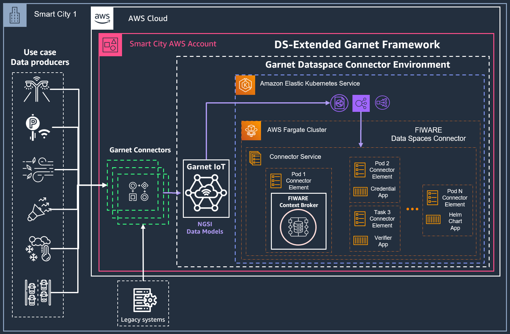
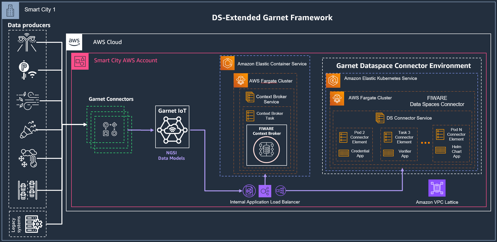

# Integration with AWS Garnet Framework

> :construction: Please note, that this document is currently being reworked for the latest updates of the 
> connector and does not contain the latest information

## Overview

AWS Garnet Framework is an open-source framework aimed at simplifying the creation and operation of interoperable platforms across diverse domains, including Smart Cities, Energy, Agriculture, and more. 
Compliant with the NGSI-LD open standard and harnessing NGSI-LD compliant Smart Data Models, this solution promotes openness and efficiency. 
At its core, AWS Garnet Framework integrates the FIWARE Context Broker, an integral component that facilitates data management. 
[In the official project GitHub repository](https://github.com/awslabs/garnet-framework), you'll find the necessary resources to deploy both the FIWARE Context Broker and the Garnet IoT module as separate AWS Cloud Development Kit (CDK) nested stacks, offering a flexible and modular approach to enhance and integrate existing solutions over time.

For the context of Data Spaces, the AWS Garnet Framwork can be extended with the capabilities of the FIWARE Data Spaces Connector, which can instrument an existing deployment of the FIWARE Context Broker, as seen in other examples of this repository.

In this example, the procedure to deploy the packet delivery service provider named IPS on AWS is provided. This deployment pattern can be reused to implement data spaces use cases requiring the infrastructure of the FIWARE Data Spaces Connector.

## Prerequisites

This deployment example focuses on 2 possible initial configurations of infrastructure:

* 1/ No existing AWS Garnet Framework deployment in the AWS Account



* 2/ Existing AWS Garnet Framework deployment in the AWS Account with a Context Broker on AWS ECS Fargate
 


In any of the previous cases, an Amazon EKS Cluster is needed to deploy the Data Space Connector. However, if there is an existing Amazon EKS Cluster in your AWS, it can be leveraged for this deployment and no additional cluster must be created. The next steps will help deploying a new cluster from scratch for the connector deployment.

### Amazon EKS Cluster Creation
If the creation of a dedicated Kubernetes cluster is considered for the deployment of the FIWARE Data Spaces Connector, it is recommended that users follow the instructions to create a new Amazon EKS Cluster available in the [official Amazon EKS Immersion Workshop](https://catalog.workshops.aws/eks-immersionday/en-US/introduction#confirm-eks-setup)

#### AWS EKS Cluster Setup with Fargate Profile

* Assign environment variables to choose the deployment parameters
```shell
export AWS_REGION=eu-west-1
export ekscluster_name="fiware-dsc-cluster"
```

* Create the VPC to host the Amazon EKS cluster on your AWS Account - update the `eks-vpc-3az.yaml` file to select the desired region for your deployment

```shell
aws cloudformation deploy --stack-name "eks-vpc" --template-file "./yaml/eks-vpc-3az.yaml" --capabilities CAPABILITY_NAMED_IAM
```

* Store the VPC ID in an environment variable

```shell
export vpc_ID=$(aws ec2 describe-vpcs --filters Name=tag:Name,Values=eks-vpc | jq -r '.Vpcs[].VpcId')
echo $vpc_ID
```

*  Export the Subnet ID, CIDR, and Subnet Name to a text file for tracking

```shell
aws ec2 describe-subnets --filter Name=vpc-id,Values=$vpc_ID | jq -r '.Subnets[]|.SubnetId+" "+.CidrBlock+" "+(.Tags[]|select(.Key=="Name").Value)'
echo $vpc_ID > vpc_subnet.txt
aws ec2 describe-subnets --filter Name=vpc-id,Values=$vpc_ID | jq -r '.Subnets[]|.SubnetId+" "+.CidrBlock+" "+(.Tags[]|select(.Key=="Name").Value)' >> vpc_subnet.txt
cat vpc_subnet.txt
```

* Store VPC ID, Subnet IDs as environment variables that will be used on next steps

```shell
export PublicSubnet01=$(aws ec2 describe-subnets --filter Name=vpc-id,Values=$vpc_ID | jq -r '.Subnets[]|.SubnetId+" "+.CidrBlock+" "+(.Tags[]|select(.Key=="Name").Value)' | awk '/eks-vpc-PublicSubnet01/{print $1}')
export PublicSubnet02=$(aws ec2 describe-subnets --filter Name=vpc-id,Values=$vpc_ID | jq -r '.Subnets[]|.SubnetId+" "+.CidrBlock+" "+(.Tags[]|select(.Key=="Name").Value)' | awk '/eks-vpc-PublicSubnet02/{print $1}')
export PublicSubnet03=$(aws ec2 describe-subnets --filter Name=vpc-id,Values=$vpc_ID | jq -r '.Subnets[]|.SubnetId+" "+.CidrBlock+" "+(.Tags[]|select(.Key=="Name").Value)' | awk '/eks-vpc-PublicSubnet03/{print $1}')
export PrivateSubnet01=$(aws ec2 describe-subnets --filter Name=vpc-id,Values=$vpc_ID | jq -r '.Subnets[]|.SubnetId+" "+.CidrBlock+" "+(.Tags[]|select(.Key=="Name").Value)' | awk '/eks-vpc-PrivateSubnet01/{print $1}')
export PrivateSubnet02=$(aws ec2 describe-subnets --filter Name=vpc-id,Values=$vpc_ID | jq -r '.Subnets[]|.SubnetId+" "+.CidrBlock+" "+(.Tags[]|select(.Key=="Name").Value)' | awk '/eks-vpc-PrivateSubnet02/{print $1}')
export PrivateSubnet03=$(aws ec2 describe-subnets --filter Name=vpc-id,Values=$vpc_ID | jq -r '.Subnets[]|.SubnetId+" "+.CidrBlock+" "+(.Tags[]|select(.Key=="Name").Value)' | awk '/eks-vpc-PrivateSubnet03/{print $1}')
echo "export vpc_ID=${vpc_ID}" | tee -a ~/.bash_profile
echo "export PublicSubnet01=${PublicSubnet01}" | tee -a ~/.bash_profile
echo "export PublicSubnet02=${PublicSubnet02}" | tee -a ~/.bash_profile
echo "export PublicSubnet03=${PublicSubnet03}" | tee -a ~/.bash_profile
echo "export PrivateSubnet01=${PrivateSubnet01}" | tee -a ~/.bash_profile
echo "export PrivateSubnet02=${PrivateSubnet02}" | tee -a ~/.bash_profile
echo "export PrivateSubnet03=${PrivateSubnet03}" | tee -a ~/.bash_profile
source ~/.bash_profile
```

* Use the provided script `eks-cluster-fargateProfiler.sh` [available in this repository](./scripts/eks-cluster-fargateProfiler.sh) to populate your resources IDs to instantiate the Amazon EKS Cluster template 

```shell
chmod +x ./scripts/eks-cluster-fargateProfiler.sh
./scripts/eks-cluster-fargateProfiler.sh
```

* Create the Amazon EKS Cluster with Fargate Profile using `eksctl`

```shell
eksctl create cluster --config-file=./yaml/eks-cluster-3az.yaml
```

* Create an IAM Identity Mapping to access your Amazon EKS cluster metadata using the AWS Console

```shell
eksctl create iamidentitymapping --cluster fiware-dsc-cluster --arn arn:aws:iam::<YOUR-AWS-ACCOUNT_ID>:role/<YOUR-AWS-ROLE-FOR-ACCESSING-CONSOLE> --group system:masters --username admin
```

* Check if your cluster is running properly once the Amazon CloudFormation Stack creation is complete

```shell
kubectl get svc
```

* Configuring OIDC ID Provider(IdP) to EKS cluster allows you to use AWS IAM roles for Kubernetes service accounts, and this requires an IAM OIDC provider in the cluster. Let's run the command below to integrate OIDC into the cluster.

```shell 
eksctl utils associate-iam-oidc-provider --region ${AWS_REGION} --cluster fiware-dsc-cluster --approve
```

#### (OPTIONAL) Install [AWS Load Balancer Controller](https://docs.aws.amazon.com/eks/latest/userguide/aws-load-balancer-controller.html) add-on to manage ingress configuration
AWS Load Balancer Controller is a Kubernetes add-on that manages AWS Elastic Load Balancers(ELB) used by Kubernetes cluster. 
This controller provides:

* Provision new AWS ALB when Kubernetes Ingress is created. 
* Provision new AWS NLB when Kubernetes LoadBalancer is created.

It is recommended to follow the official AWS documentation to install the AWS Load Balancer Controller add-on to control ingress. The step-by-step procedure is available in [this link](https://docs.aws.amazon.com/eks/latest/userguide/aws-load-balancer-controller.html)

#### nginx Ingress Controller Configuration 
In AWS, we use a Network load balancer (NLB) to expose the Ingress-Nginx Controller behind a Service of ```Type=LoadBalancer```. It is advised that the [official Installation Guide is followed for the next steps](https://kubernetes.github.io/ingress-nginx/deploy/#aws)
A short version of the procedure is reproduced below for a quick setup: 

* Create an AWS IAM Policy for the Ingress Controller using the provided file `./policies/aws-lbc-iam_policy.json`. The JSON file can also be found [here](https://raw.githubusercontent.com/kubernetes-sigs/aws-load-balancer-controller/v2.5.4/docs/install/iam_policy.json)

```shell
aws iam create-policy --policy-name AWSLoadBalancerControllerIAMPolicy --policy-document file://./policies/aws-lbc-iam_policy.json
```

* Create an IAM Role and ServiceAccount for the AWS Load Balancer controller

```shell
eksctl create iamserviceaccount --cluster=fiware-dsc-cluster --namespace=kube-system --name=ingress-nginx-controller --attach-policy-arn=arn:aws:iam::${ACCOUNT_ID}:policy/AWSLoadBalancerControllerIAMPolicy --override-existing-serviceaccounts --region ${AWS_REGION} --approve
```

* Deploy the Kubernetes Service for the nginx Ingress Controller on your cluster using the provided file `./yaml/nginx-ingress-controller.yaml` . The default deployment file is also available in [this link](https://raw.githubusercontent.com/kubernetes/ingress-nginx/controller-v1.8.1/deploy/static/provider/aws/nlb-with-tls-termination/deploy.yaml)

```shell
kubectl apply -n kube-system -f ./yaml/nginx-ingress-controller.yaml
```

## Next Steps
Once your Amazon EKS Cluster is ready, head to the specific step-by-step procedure that best describes your current environment in the following links of this documentation:

* [1/ No existing AWS Garnet Framework deployment in the AWS Account](./scenario-1-deployment/)

* [2/ Existing AWS Garnet Framework deployment in the AWS Account with a Context Broker on AWS ECS Fargate](./scenario-2-deployment/)
