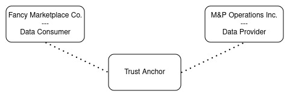
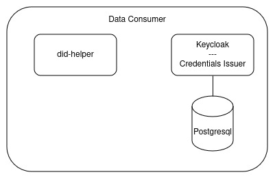
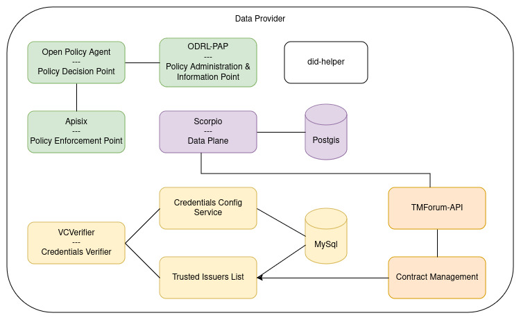

# Local Deployment

In order to support development and exploration of the FIWARE Data Space Connector, a "Minimal Viable Dataspace" is
provided as part of this repo.
An alternative deployment guide, based on [MicroK8s](https://microk8s.io/) can be found here: https://github.com/cgonzalezITA/DSFiware-hackathon?tab=readme-ov-file#quick-deployment-from-scratch

## Requirements

Since the local deployment installs 2 connector instances and a trust-anchor, its recommended to use a strong enough machine. While 16Gb Ram might be enough, its recommended to have >24Gb available. The deployment is build and tested on Ubuntu, most other Linux distributions should work as well.

The local deployment tries to be as decoupled from the host system as possible to reduce the amount of requirements but stills needs the following programs:

- [Maven](https://maven.apache.org/)
- Java Development Kit (at least v17)
- [Docker](https://www.docker.com/)

In order to interact with the system, the following tools are also helpful:

- [kubectl](https://kubernetes.io/docs/tasks/tools/install-kubectl/)
- [curl](https://curl.se/download.html)
- [jq](https://stedolan.github.io/jq/download/)
- [yq](https://mikefarah.gitbook.io/yq/)

To check if the tools are installed, can run and are able to spin up minimal kubernetes cluster without further FIWARE components, you should execute the prepared [script](checkRequirements.sh).

Issues revealed by the script are most likely due to incompatibility of your system or faulty installation of the required tools.


## Quick Start

> :warning: The local deployment uses [k3s](https://k3s.io/) and is currently only tested on linux.
> Its not recommended to use it on Windows or Mac Systems.

> :warning: In current Linux installations, ```br_netfilter``` is disabled by default. That leads to networking issues inside the k3s cluster and will prevent the connector to start up properly. Make sure that its enabled via ```modprobe br_netfilter```. See [Stackoverflow](https://stackoverflow.com/questions/48148838/kube-dns-error-reply-from-unexpected-source/48151279#48151279) for more.

To start the Data Space, just use:

```shell
    mvn clean deploy -Plocal
```

Depending on the machine, it should take between 5 and 10min to spin up the complete data space. You can connect to the
running k3s-cluster via:

```shell
    export  KUBECONFIG=$(pwd)/target/k3s.yaml
    # get all deployed resources
    kubectl get all --all-namespaces
```

## The Data Space



The locally deployed Data Space consists of 2 Participants, connected through a Trust Anchor.

### The Trust Anchor

Every Data Spaces requires a framework that ensures trust between the participants. Depending on the requirements of the
concrete Data Space,
this can become a rather complex topic. Various trust-providers exist(
f.e. [Gaia-X Digital Clearing Houses](https://gaia-x.eu/gxdch)) and could be reused(see [Gaia-X for more information](../GAIA_X.MD)). The default setup of the connector requires an [EBSI-Trusted Issuers Registry](https://hub.ebsi.eu/apis/pilot/trusted-issuers-registry/v4) to provide the list of participants.

The local Data Spaces comes with the [FIWARE Trusted Issuers List](https://github.com/FIWARE/trusted-issuers-list) as a
rather simple implementation of that API, providing CRUD functionality
for Issuers and storage in an MySQL Database. After deployment, the API is available
at ```http://tir.127.0.0.1.nip.io:8080```. Both participants
are automatically registered as "Trusted Issuers" in the registry with their did's.

Get a list of the issuers:

```shell
    curl -X GET http://tir.127.0.0.1.nip.io:8080/v4/issuers | python3 -m json.tool
```

A new issuer could for example be registered via:

```shell
  curl -X POST http://til.127.0.0.1.nip.io:8080/issuer \
    --header 'Content-Type: application/json' \
    --data '{
      "did": "did:key:myKey",
      "credentials": []
    }'  | python3 -m json.tool
```

For more information about the API, see
its [OpenAPI Spec](https://github.com/FIWARE/trusted-issuers-list/blob/main/api/trusted-issuers-list.yaml)

## The Participants

The minimal Data Space should provide an easy-to-understand introduction to the FIWARE Data Space. Therefor the roles of
the
participants are clearly seperated into "Data Consumer" and "Data Provider". However, in most real-world Data Spaces the
participants
will have both roles. They are not restricted to either consume or provide.

In our scenario, the Data Provider(`M&P Operations Inc.`) is a company offering solutions to host and operate digital
services for other companies. The Data Consumer(`Fancy Marketplace Co.`)
provides an online shop, offering various products. To fulfill their roles, they need different
components of the FIWARE Data Space Connector.

### The Data Consumer



Since the Data Consumer in our example is only retrieving data, it requires very few components:

* [Keycloak](https://github.com/keycloak/keycloak) - to issue VerifiableCredentials
* [did-helper](https://github.com/wistefan/did-helper) - a small helper application, providing the decentralized
  identity to be used for the local Data Space

After deployment, Keycloak can be used to issue VerifiableCredentials for users or services, to be used for
authorization at other participants of the Data Space.
It comes with 2 preconfigured users:

* the `keycloak-admin` - has a password generated during deployment, it can be retrieved
  via ```kubectl get secret -n consumer -o json issuance-secret | jq '.data."keycloak-admin"' -r | base64 --decode```
* the `test-user` - it has a fixed password, set to "test"

The admin-console of keycloak is available at: ```https://keycloak-consumer.127.0.0.1.nip.io:8443```, login with
the `keycloak-admin`
The credentials issuance in the account-console is available
at: ```https://keycloak-consumer.127.0.0.1.nip.io:8443/realms/test-realm/account/oid4vci```, login with the `test-user`

In order to retrieve an actual credential two ways are available:

* Use the account-console and retrieve the credential with a wallet. Currently, we cannot recommend any for a local use
  case.
* Get the credential via http-requests through the `SameDevice-Flow`:

> :warning: The pre-authorized code and the offer expire within 30s for security reasons. Be fast.

> :bulb: In case you did the demo before, you can use the following snippet to unset the env-vars:
> ```shell
>           unset ACCESS_TOKEN; unset OFFER_URI; unset PRE_AUTHORIZED_CODE; \
>           unset CREDENTIAL_ACCESS_TOKEN; unset VERIFIABLE_CREDENTIAL; unset HOLDER_DID; \
>           unset VERIFIABLE_PRESENTATION; unset JWT_HEADER; unset PAYLOAD; unset SIGNATURE; unset JWT; \
>           unset VP_TOKEN; unset DATA_SERVICE_ACCESS_TOKEN;
> ```

Get an AccessToken from Keycloak:

```shell
  export ACCESS_TOKEN=$(curl -s -k -x localhost:8888 -X POST https://keycloak-consumer.127.0.0.1.nip.io/realms/test-realm/protocol/openid-connect/token \
    --header 'Accept: */*' \
    --header 'Content-Type: application/x-www-form-urlencoded' \
    --data grant_type=password \
    --data client_id=account-console \
    --data username=employee \
    --data password=test | jq '.access_token' -r); echo ${ACCESS_TOKEN}
```

(Optional, since in the local case we know all of the values in advance)
Get the credentials issuer information:

```shell
  curl -k -x localhost:8888 -X GET https://keycloak-consumer.127.0.0.1.nip.io/realms/test-realm/.well-known/openid-credential-issuer | python3 -m json.tool
```

Get a credential offer uri(for the `user-credential), using the retrieved AccessToken:

```shell
  export OFFER_URI=$(curl -s -k -x localhost:8888 -X GET 'https://keycloak-consumer.127.0.0.1.nip.io/realms/test-realm/protocol/oid4vc/credential-offer-uri?credential_configuration_id=user-credential' \
    --header "Authorization: Bearer ${ACCESS_TOKEN}" | jq '"\(.issuer)\(.nonce)"' -r); echo ${OFFER_URI}
```

Use the offer uri(e.g. the `issuer`and `nonce` fields), to retrieve the actual offer:

```shell
  export PRE_AUTHORIZED_CODE=$(curl -s -k -x localhost:8888 -X GET ${OFFER_URI} \
    --header "Authorization: Bearer ${ACCESS_TOKEN}" | jq '.grants."urn:ietf:params:oauth:grant-type:pre-authorized_code"."pre-authorized_code"' -r); echo ${PRE_AUTHORIZED_CODE}
```

Exchange the pre-authorized code from the offer with an AccessToken at the authorization server:

```shell
  export CREDENTIAL_ACCESS_TOKEN=$(curl -s -k -x localhost:8888 -X POST https://keycloak-consumer.127.0.0.1.nip.io/realms/test-realm/protocol/openid-connect/token \
    --header 'Accept: */*' \
    --header 'Content-Type: application/x-www-form-urlencoded' \
    --data grant_type=urn:ietf:params:oauth:grant-type:pre-authorized_code \
    --data pre-authorized_code=${PRE_AUTHORIZED_CODE} | jq '.access_token' -r); echo ${CREDENTIAL_ACCESS_TOKEN}
```

Use the returned access token to get the actual credential:

```shell
  export VERIFIABLE_CREDENTIAL=$(curl -s -k -x localhost:8888 -X POST https://keycloak-consumer.127.0.0.1.nip.io/realms/test-realm/protocol/oid4vc/credential \
    --header 'Accept: */*' \
    --header 'Content-Type: application/json' \
    --header "Authorization: Bearer ${CREDENTIAL_ACCESS_TOKEN}" \
    --data '{"credential_identifier":"user-credential", "format":"jwt_vc"}' | jq '.credential' -r); echo ${VERIFIABLE_CREDENTIAL}
```

You will receive a jwt-encoded credential to be used within the data space.

### The Data Provider



The Data Provider requires a couple of more components, in order to provide secure access to its data. It needs
essentially 3 building blocks:

* Data-Service: In our example case, the data is provided by
  an [NGSI-LD Context Broker](https://github.com/ScorpioBroker/ScorpioBroker)
* Authentication:
    * [VCVerifier](https://github.com/FIWARE/VCVerifier): Verifies incoming VerifiableCredentials
      through [OID4VP](https://openid.net/specs/openid-4-verifiable-presentations-1_0.html) and returns a JWT token
    * [CredentialsConfigService](https://github.com/FIWARE/credentials-config-service): Allows to configure the Trusted
      Lists to be used for certain credentials
    * [TrustedIssuersList](https://github.com/FIWARE/trusted-issuers-list): Allows to specify the capabilities of
      certain issuers, f.e. what credentials they are allowed to issue
* Authorization:
    * [Apisix](https://apisix.apache.org/): An Api-Gateway that verifies the incoming JWT(provided by the verifier) and
      acts as Policy Enforcement Point to authorize requests based on the PDP's decision
    * [Open Policy Agent](https://www.openpolicyagent.org/): Acts as the Policy Decision Point, to evaluate existing
      policies for requests and either allows or denies them.
    * [ODRL-PAP](https://github.com/wistefan/odrl-pap): Policy Administration & Information Point, that allows to
      configure policies in ODRL and provides them to the Open Policy Agent(translated into rego). It can be used to
      offer additional infromation to be taken into account.
* Value creation:
    * [TMForum API](https://github.com/FIWARE/tmforum-api): Implementation of the [TMForum APIs](https://www.tmforum.org/oda/open-apis/directory) 
      to provide API's focused for offering, selling and buying data products and services.
    * [Contract Management](https://github.com/FIWARE/contract-management): Enables access to services and data when orders
      happend at the TMForum-API
* [did-helper](https://github.com/wistefan/did-helper) - a small helper application, providing the decentralized
  identity to be used for the local Data Space

After the deployment, the provider can create a policy to allow access to its data. An example policy can be found in
the [test-resources](../it/src/test/resources/policies/energyReport.json)
It allows every participant to access entities of type ```EnergyReport```.

> :warning: The PAP and Scorpio APIs are only published to make demo interactions easier.
> In real environments, they should never be public without any authentication/authorization framework in front of them.

The policy can be created at the PAP via:

```shell
  curl -s -X 'POST' http://pap-provider.127.0.0.1.nip.io:8080/policy \
    -H 'Content-Type: application/json' \
    -d  '{ 
            "@context": {
              "dc": "http://purl.org/dc/elements/1.1/",
              "dct": "http://purl.org/dc/terms/",
              "owl": "http://www.w3.org/2002/07/owl#",
              "odrl": "http://www.w3.org/ns/odrl/2/",
              "rdfs": "http://www.w3.org/2000/01/rdf-schema#",
              "skos": "http://www.w3.org/2004/02/skos/core#"
            },
            "@id": "https://mp-operation.org/policy/common/type",
            "@type": "odrl:Policy",
            "odrl:permission": {
              "odrl:assigner": {
                "@id": "https://www.mp-operation.org/"
              },
              "odrl:target": {
                "@type": "odrl:AssetCollection",
                "odrl:source": "urn:asset",
                "odrl:refinement": [
                  {
                    "@type": "odrl:Constraint",
                    "odrl:leftOperand": "ngsi-ld:entityType",
                    "odrl:operator": {
                      "@id": "odrl:eq"
                    },
                    "odrl:rightOperand": "EnergyReport"
                  }
                ]
              },
              "odrl:assignee": {
                "@id": "vc:any"
              },
              "odrl:action": {
                "@id": "odrl:read"
              }
            }
          }'
```

Data can be created through the NGSI-LD API itself. In order to make interaction easier, its directly available through
an ingress at ```http://scorpio-provider.127.0.0.1.nip.io/ngsi-ld/v1```. In
real environments, no endpoint should be publicly available without beeing protected by the authorization framework.
Create an entity via:

```shell
  curl -s -X POST http://scorpio-provider.127.0.0.1.nip.io:8080/ngsi-ld/v1/entities \
    -H 'Accept: application/json' \
    -H 'Content-Type: application/json' \
    -d '{
      "id": "urn:ngsi-ld:EnergyReport:fms-1",
      "type": "EnergyReport",
      "name": {
        "type": "Property",
        "value": "Standard Server"
      },
      "consumption": {
        "type": "Property",
        "value": "94"
      }
    }'
```

## Demo Interactions

Once everything is deployed and configured(e.g. the consumer received a credential -
see [The Data Consumer](#the-data-consumer) - and policy/entity are setup - see [The Data Provider](#the-data-provider))
,
the consumer can access the data as following:

### Authenticate via OID4VP

> :warning: Those steps assume that interaction with consumer and provider already happend, e.g. a VerifiableCredential
> is available
> and policy/entity are created.

The credential needs to be presented for authentication
through [OID4VP]((https://openid.net/specs/openid-4-verifiable-presentations-1_0.html).
Every required information for that flow can be retrieved via the standard endpoints.

If you try to request the provider api without authentication, you will receive an 401:

```shell
  curl -s -X GET 'http://mp-data-service.127.0.0.1.nip.io:8080/ngsi-ld/v1/entities/urn:ngsi-ld:EnergyReport:fms-1'
```

The normal flow is now to request the oidc-information at the well-known endpoint:

```shell
  export TOKEN_ENDPOINT=$(curl -s -X GET 'http://mp-data-service.127.0.0.1.nip.io:8080/.well-known/openid-configuration' | jq -r '.token_endpoint'); echo $TOKEN_ENDPOINT
```

In the response, the grant type `vp_token` will be present, indicating the support for the OID4VP authentication flow:

```json
{
  "issuer": "https://provider-verifier.127.0.0.1.nip.io:8443",
  "authorization_endpoint": "https://provider-verifier.127.0.0.1.nip.io:8443",
  "token_endpoint": "https://provider-verifier.127.0.0.1.nip.io:8443/services/data-service/token",
  "jwks_uri": "https://provider-verifier.127.0.0.1.nip.io:8443/.well-known/jwks",
  "scopes_supported": [
    "default"
  ],
  "response_types_supported": [
    "token"
  ],
  "response_mode_supported": [
    "direct_post"
  ],
  "grant_types_supported": [
    "authorization_code",
    "vp_token"
  ],
  "subject_types_supported": [
    "public"
  ],
  "id_token_signing_alg_values_supported": [
    "EdDSA",
    "ES256"
  ]
}
```

With that information, the authentication flow at the verifier(e.g.`"https://provider-verifier.127.0.0.1.nip.io:8443`)
can be started.
First, the credential needs to be encoded into a vp_token. If you want to do that manually, first a did and the
corresponding key-material is required.
You can create such via:

```shell
  mkdir cert
  chmod o+rw cert
  docker run -v $(pwd)/cert:/cert quay.io/wi_stefan/did-helper:0.1.1
  # unsecure, only do that for demo
  sudo chmod -R o+rw cert/private-key.pem
```

This will produce the files cert.pem, cert.pfx, private-key.pem, public-key.pem and did.json, containing all required
information for the generated did:key.
Find the did here:

```shell
  export HOLDER_DID=$(cat cert/did.json | jq '.id' -r); echo ${HOLDER_DID}
```

As a next step, a VerifiablePresentation, containing the Credential has to be created:

```shell
  export VERIFIABLE_PRESENTATION="{
    \"@context\": [\"https://www.w3.org/2018/credentials/v1\"],
    \"type\": [\"VerifiablePresentation\"],
    \"verifiableCredential\": [
        \"${VERIFIABLE_CREDENTIAL}\"
    ],
    \"holder\": \"${HOLDER_DID}\"
  }"; echo ${VERIFIABLE_PRESENTATION}
```

Now, the presentation has to be embedded into a signed JWT:

Setup the header:

```shell
  export JWT_HEADER=$(echo -n "{\"alg\":\"ES256\", \"typ\":\"JWT\", \"kid\":\"${HOLDER_DID}\"}"| base64 -w0 | sed s/\+/-/g | sed 's/\//_/g' | sed -E s/=+$//); echo Header: ${JWT_HEADER}
```

Setup the payload:

```shell
  export PAYLOAD=$(echo -n "{\"iss\": \"${HOLDER_DID}\", \"sub\": \"${HOLDER_DID}\", \"vp\": ${VERIFIABLE_PRESENTATION}}" | base64 -w0 | sed s/\+/-/g |sed 's/\//_/g' |  sed -E s/=+$//); echo Payload: ${PAYLOAD};   
```

Create the signature:

```shell
  export SIGNATURE=$(echo -n "${JWT_HEADER}.${PAYLOAD}" | openssl dgst -sha256 -binary -sign cert/private-key.pem | base64 -w0 | sed s/\+/-/g | sed 's/\//_/g' | sed -E s/=+$//); echo Signature: ${SIGNATURE}; 
```

Combine them to the JWT:

```shell
  export JWT="${JWT_HEADER}.${PAYLOAD}.${SIGNATURE}"; echo The Token: ${JWT}
```

The JWT representation of the JWT has to be Base64-encoded(no padding!):

```shell
  export VP_TOKEN=$(echo -n ${JWT} | base64 -w0 | sed s/\+/-/g | sed 's/\//_/g' | sed -E s/=+$//); echo ${VP_TOKEN}
```

The vp_token can then be exchanged for the access-token

```shell
  export DATA_SERVICE_ACCESS_TOKEN=$(curl -s -k -x localhost:8888 -X POST $TOKEN_ENDPOINT \
    --header 'Accept: */*' \
    --header 'Content-Type: application/x-www-form-urlencoded' \
    --data grant_type=vp_token \
    --data vp_token=${VP_TOKEN} \
    --data scope=default | jq '.access_token' -r ); echo ${DATA_SERVICE_ACCESS_TOKEN}
```

With that token, try to access the data again:

```shell
  curl -s -X GET 'http://mp-data-service.127.0.0.1.nip.io:8080/ngsi-ld/v1/entities/urn:ngsi-ld:EnergyReport:fms-1' \
    --header 'Accept: application/json' \
    --header "Authorization: Bearer ${DATA_SERVICE_ACCESS_TOKEN}"
```

### Buy access to a service offering

An essential use-case within Dataspaces is trading of data and digital services. The Minimal Viable Dataspace supports 
such marketplace services as part of the Data Provider. In the scenario, M&P Operations will offer managed Kubernetes Clusters
to other participants of the Dataspace. While every participant should be allowed to see the offerings, only those that are 
registered as customers at M&P Operations and bought access should be allowed to create clusters. 
The following steps will show how Fancy Marketplace views the available offerings of M&P Operations, then decides to buy 
managed Kubernetes Services from M&P Operations and creates the cluster itself.

#### Offer creation

Similar to the interactions required for making the energy reports available, M&P Operations as the provider has to create some policies first.
Since the offerings are handled through the TMForum APIs, the policies belong to them:
1. Allow every authenticated participant to read offerings:
```shell
  curl -s -X 'POST' http://pap-provider.127.0.0.1.nip.io:8080/policy \
    -H 'Content-Type: application/json' \
    -d  '{
          "@context": {
            "dc": "http://purl.org/dc/elements/1.1/",
            "dct": "http://purl.org/dc/terms/",
            "owl": "http://www.w3.org/2002/07/owl#",
            "odrl": "http://www.w3.org/ns/odrl/2/",
            "rdfs": "http://www.w3.org/2000/01/rdf-schema#",
            "skos": "http://www.w3.org/2004/02/skos/core#"
          },
          "@id": "https://mp-operation.org/policy/common/type",
          "@type": "odrl:Policy",
          "odrl:permission": {
            "odrl:assigner": {
              "@id": "https://www.mp-operation.org/"
            },
            "odrl:target": {
              "@type": "odrl:AssetCollection",
              "odrl:source": "urn:asset",
              "odrl:refinement": [
                {
                  "@type": "odrl:Constraint",
                  "odrl:leftOperand": "tmf:resource",
                  "odrl:operator": {
                    "@id": "odrl:eq"
                  },
                  "odrl:rightOperand": "productOffering"
                }
              ]
            },
            "odrl:assignee": {
              "@id": "vc:any"
            },
            "odrl:action": {
              "@id": "odrl:read"
            }
          }
        }'
```
2. Allow 'REPRESENTATIVES' of authenticated participants to register as customer at M&P Operations:
```shell
  curl -s -X 'POST' http://pap-provider.127.0.0.1.nip.io:8080/policy \
    -H 'Content-Type: application/json' \
    -d  '{
          "@context": {
            "dc": "http://purl.org/dc/elements/1.1/",
            "dct": "http://purl.org/dc/terms/",
            "owl": "http://www.w3.org/2002/07/owl#",
            "odrl": "http://www.w3.org/ns/odrl/2/",
            "rdfs": "http://www.w3.org/2000/01/rdf-schema#",
            "skos": "http://www.w3.org/2004/02/skos/core#"
          },
          "@id": "https://mp-operation.org/policy/common/type",
          "@type": "odrl:Policy",
          "odrl:permission": {
            "odrl:assigner": {
              "@id": "https://www.mp-operation.org/"
            },
            "odrl:target": {
              "@type": "odrl:AssetCollection",
              "odrl:source": "urn:asset",
              "odrl:refinement": [
                {
                  "@type": "odrl:Constraint",
                  "odrl:leftOperand": "tmf:resource",
                  "odrl:operator": {
                    "@id": "odrl:eq"
                  },
                  "odrl:rightOperand": "organization"
                }
              ]
            },
            "odrl:assignee": {
              "@type": "odrl:PartyCollection",
              "odrl:source": "urn:user",
              "odrl:refinement": {
                "@type": "odrl:LogicalConstraint",
                "odrl:and": [
                  {
                    "@type": "odrl:Constraint",
                    "odrl:leftOperand": {
                      "@id": "vc:role"
                    },
                    "odrl:operator": {
                      "@id": "odrl:hasPart"
                    },
                    "odrl:rightOperand": {
                      "@value": "REPRESENTATIVE",
                      "@type": "xsd:string"
                    }
                  },
                  {
                    "@type": "odrl:Constraint",
                    "odrl:leftOperand": {
                      "@id": "vc:type"
                    },
                    "odrl:operator": {
                      "@id": "odrl:hasPart"
                    },
                    "odrl:rightOperand": {
                      "@value": "UserCredential",
                      "@type": "xsd:string"
                    }
                  }
                ]
              }
            },
            "odrl:action": {
              "@id": "tmf:create"
            }
          }
        }'
```
Similar to the previous policy, it restricts access to a defined TMForum Resource(e.g. with `"odrl:leftOperand" : "tmf:resource"`), but allows
creation of such through the action `"tmf:create"`. Additionaly, it restricts the assignee to have the role "REPRESENTATIVE" as part of its "LegalPersonCredential".

3. Allow 'REPRESENTATIVES' to order products: 
```shell
  curl -s -X 'POST' http://pap-provider.127.0.0.1.nip.io:8080/policy \
    -H 'Content-Type: application/json' \
    -d  '{
          "@context": {
            "dc": "http://purl.org/dc/elements/1.1/",
            "dct": "http://purl.org/dc/terms/",
            "owl": "http://www.w3.org/2002/07/owl#",
            "odrl": "http://www.w3.org/ns/odrl/2/",
            "rdfs": "http://www.w3.org/2000/01/rdf-schema#",
            "skos": "http://www.w3.org/2004/02/skos/core#"
          },
          "@id": "https://mp-operation.org/policy/common/type",
          "@type": "odrl:Policy",
          "odrl:permission": {
            "odrl:assigner": {
              "@id": "https://www.mp-operation.org/"
            },
            "odrl:target": {
              "@type": "odrl:AssetCollection",
              "odrl:source": "urn:asset",
              "odrl:refinement": [
                {
                  "@type": "odrl:Constraint",
                  "odrl:leftOperand": "tmf:resource",
                  "odrl:operator": {
                    "@id": "odrl:eq"
                  },
                  "odrl:rightOperand": "productOrder"
                }
              ]
            },
            "odrl:assignee": {
              "@type": "odrl:PartyCollection",
              "odrl:source": "urn:user",
              "odrl:refinement": {
                "@type": "odrl:LogicalConstraint",
                "odrl:and": [
                  {
                    "@type": "odrl:Constraint",
                    "odrl:leftOperand": {
                      "@id": "vc:role"
                    },
                    "odrl:operator": {
                      "@id": "odrl:hasPart"
                    },
                    "odrl:rightOperand": {
                      "@value": "REPRESENTATIVE",
                      "@type": "xsd:string"
                    }
                  },
                  {
                    "@type": "odrl:Constraint",
                    "odrl:leftOperand": {
                      "@id": "vc:type"
                    },
                    "odrl:operator": {
                      "@id": "odrl:hasPart"
                    },
                    "odrl:rightOperand": {
                      "@value": "UserCredential",
                      "@type": "xsd:string"
                    }
                  }
                ]
              }
            },
            "odrl:action": {
              "@id": "tmf:create"
            }
          }
        }'
```
Accepting an offer essentially happens by creating a ProductOrder in TMForum. While this step is "manual" in our demo here, its
usually hidden behind a marketplace application, taking care of the concrete TMForum interaction. A possible marketplace would be f.e. the [FIWARE BAE Marketplace](https://github.com/FIWARE-TMForum/Business-API-Ecosystem).

In addition to the policies for accessing the TMForum-APIS, another one to handle the actual "cluster creation" is required:

4. Allow creation of entities of type "K8SCluster" to authenticated participants with the role "OPERATOR":
```shell
  curl -s -X 'POST' http://pap-provider.127.0.0.1.nip.io:8080/policy \
    -H 'Content-Type: application/json' \
    -d  '{
              "@context": {
                "dc": "http://purl.org/dc/elements/1.1/",
                "dct": "http://purl.org/dc/terms/",
                "owl": "http://www.w3.org/2002/07/owl#",
                "odrl": "http://www.w3.org/ns/odrl/2/",
                "rdfs": "http://www.w3.org/2000/01/rdf-schema#",
                "skos": "http://www.w3.org/2004/02/skos/core#"
              },
              "@id": "https://mp-operation.org/policy/common/type",
              "@type": "odrl:Policy",
              "odrl:permission": {
                "odrl:assigner": {
                  "@id": "https://www.mp-operation.org/"
                },
                "odrl:target": {
                  "@type": "odrl:AssetCollection",
                  "odrl:source": "urn:asset",
                  "odrl:refinement": [
                    {
                      "@type": "odrl:Constraint",
                      "odrl:leftOperand": "ngsi-ld:entityType",
                      "odrl:operator": {
                        "@id": "odrl:eq"
                      },
                      "odrl:rightOperand": "K8SCluster"
                    }
                  ]
                },
                "odrl:assignee": {
                  "@type": "odrl:PartyCollection",
                  "odrl:source": "urn:user",
                  "odrl:refinement": {
                    "@type": "odrl:LogicalConstraint",
                    "odrl:and": [
                      {
                        "@type": "odrl:Constraint",
                        "odrl:leftOperand": {
                          "@id": "vc:role"
                        },
                        "odrl:operator": {
                          "@id": "odrl:hasPart"
                        },
                        "odrl:rightOperand": {
                          "@value": "OPERATOR",
                          "@type": "xsd:string"
                        }
                      },
                      {
                        "@type": "odrl:Constraint",
                        "odrl:leftOperand": {
                          "@id": "vc:type"
                        },
                        "odrl:operator": {
                          "@id": "odrl:hasPart"
                        },
                        "odrl:rightOperand": {
                          "@value": "OperatorCredential",
                          "@type": "xsd:string"
                        }
                      }
                    ]
                  }
                },
                "odrl:action": {
                  "@id": "odrl:use"
                }
              }
            }'
```
Since initially only "LegalPersonCredentials" are allowed to be issued for the consumer inside the providers' Trusted-Issuers-List, no "OperatorCredentials"
are accepted before an order was created. Thus, the policy effectively restricts the cluster creation to participants that bought access and assigned
users with the role "Operator".

In addition to the policies, an offering should be created. Similar to the broker access, the local deployment contains a direct
ingress to the TMForum API for test and demo instrumentation. In production environments, this should never be accessible without an IAM framework in front.

> :warning: This is a very simple demo product. Please check the [TMForum API Documentation](https://www.tmforum.org/oda/open-apis/directory/product-catalog-management-api-TMF620/v5.0.0) 
> for all available options.

The offer creation includes multiple steps:
1. Create the product specification:
```shell
export PRODUCT_SPEC_ID=$(curl -X 'POST' http://tm-forum-api.127.0.0.1.nip.io:8080/tmf-api/productCatalogManagement/v4/productSpecification \
  -H 'Content-Type: application/json;charset=utf-8' \
  -d '{
    "brand": "M&P Operations",
    "version": "1.0.0",
    "lifecycleStatus": "ACTIVE",
    "name": "M&P K8S"
  }' | jq '.id' -r ); echo ${PRODUCT_SPEC_ID}
```
2. Create a product offering, referencing the spec:
```shell
export PRODUCT_OFFERING_ID=$(curl -X 'POST' http://tm-forum-api.127.0.0.1.nip.io:8080/tmf-api/productCatalogManagement/v4/productOffering \
  -H 'Content-Type: application/json;charset=utf-8' \
  -d "{
    \"version\": \"1.0.0\",
    \"lifecycleStatus\": \"ACTIVE\",
    \"name\": \"M&P K8S Offering\",
    \"productSpecification\": {
      \"id\": \"${PRODUCT_SPEC_ID}\"
    }
  }"| jq '.id' -r ); echo ${PRODUCT_OFFERING_ID}
```

#### Credentials issuance at the consumer

In order to buy and use the offering, the consumer "Fancy Marketplace" has to issue two credentials. One for accessing and 
buying the offerings from the provider and one to actually carry out the cluster creation. For the ease of configuration, in the 
local environment the same user will take care of both actions. However, in a real use-case its possible to have different users
taking care of that. The issuance process is the same as it can be found in the [Data Consumer Chapter](#the-data-consumer), therefor 
the steps are combined within a script:

1. Get the LegalPersonCredential for the normal employee:
```shell
 export USER_CREDENTIAL=$(./doc/scripts/get_credential_for_consumer.sh https://keycloak-consumer.127.0.0.1.nip.io user-credential employee); echo ${USER_CREDENTIAL}
```
2. Get the LegalPersonCredential for the representative:
```shell
 export REP_CREDENTIAL=$(./doc/scripts/get_credential_for_consumer.sh https://keycloak-consumer.127.0.0.1.nip.io user-credential representative); echo ${REP_CREDENTIAL}
```
3. Get the OperatorCredential for the operator:
```shell
 export OPERATOR_CREDENTIAL=$(./doc/scripts/get_credential_for_consumer.sh https://keycloak-consumer.127.0.0.1.nip.io operator-credential operator); echo ${OPERATOR_CREDENTIAL}
```

#### Buy access and create cluster

With the credentials beeing issued, the employee of Fancy Marketplace now can buy and create the cluster. The authentication 
steps are equal to the description in the [OID4VP Authentication chapter](#authenticate-via-oid4vp), thus are combined within scripts.

In order to prove that not every user can just create a cluster, try the following:

1. Try creation with the USER_CREDENTIAL - it should result in a 403
```shell
  export ACCESS_TOKEN=$(./doc/scripts/get_access_token_oid4vp.sh http://mp-data-service.127.0.0.1.nip.io:8080 $USER_CREDENTIAL default); echo ${ACCESS_TOKEN}
  curl -X POST http://mp-data-service.127.0.0.1.nip.io:8080/ngsi-ld/v1/entities \
    -H 'Accept: */*' \
    -H 'Content-Type: application/json' \
    -H "Authorization: Bearer ${ACCESS_TOKEN}" \
    -d '{
      "id": "urn:ngsi-ld:K8SCluster:fancy-marketplace",
      "type": "K8SCluster",
      "name": {
        "type": "Property",
        "value": "Fancy Marketplace Cluster"
      },
      "numNodes": {
        "type": "Property",
        "value": "3"
      },
      "k8sVersion": {
        "type": "Property",
        "value": "1.26.0"        
      }
    }'
```
2. Try access with the OPERATOR_CREDENTIAL - no token will be returned:
```shell
    ./doc/scripts/get_access_token_oid4vp.sh http://mp-data-service.127.0.0.1.nip.io:8080 $OPERATOR_CREDENTIAL operator
```

> :bulb: For easier access, the identity(in form of the did) of the consumer is available at ```http://did-consumer.127.0.0.1.nip.io:8080/did-material/did.env```.

3. Export the Fancy Marketplace's did:
```shell
  export CONSUMER_DID=$(curl -X GET http://did-consumer.127.0.0.1.nip.io:8080/did-material/did.env | cut -d'=' -f2); echo ${CONSUMER_DID} 
```

4. Register Fancy Marketplace at M&P Operations(as representative, e.g. use the REP_CREDENTIAL):
```shell
  export ACCESS_TOKEN=$(./doc/scripts/get_access_token_oid4vp.sh http://mp-data-service.127.0.0.1.nip.io:8080 $REP_CREDENTIAL default); echo ${ACCESS_TOKEN}
  export FANCY_MARKETPLACE_ID=$(curl -X POST http://mp-tmf-api.127.0.0.1.nip.io:8080/tmf-api/party/v4/organization \
    -H 'Accept: */*' \
    -H 'Content-Type: application/json' \
    -H "Authorization: Bearer ${ACCESS_TOKEN}" \
    -d "{
      \"name\": \"Fancy Marketplace Inc.\",
      \"partyCharacteristic\": [
        {
          \"name\": \"did\",
          \"value\": \"${CONSUMER_DID}\" 
        }
      ]
    }" | jq '.id' -r); echo ${FANCY_MARKETPLACE_ID} 
```
As a result of the operation, Fancy Marketplace Inc. is registered in M&P Operations customer system and has a customer id.

5. Buy access. In order to buy access, a ProductOrder, referencing the offering from M&P Operations has to be created. A typical 
marketplace implementation would take care of that and handle potential payments. For the sample use-case, we continue to communicate 
with the TMForum-APIs directly.
    1. List offerings
    ```shell
        export ACCESS_TOKEN=$(./doc/scripts/get_access_token_oid4vp.sh http://mp-data-service.127.0.0.1.nip.io:8080 $REP_CREDENTIAL default); echo $ACCESS_TOKEN
        curl -X GET http://mp-tmf-api.127.0.0.1.nip.io:8080/tmf-api/productCatalogManagement/v4/productOffering -H "Authorization: Bearer ${ACCESS_TOKEN}" | jq .
    ```
    2. To accept the offering, one has to be choosen(in the example, only one exists) and its id needs to be extracted:
    ```shell
        export ACCESS_TOKEN=$(./doc/scripts/get_access_token_oid4vp.sh http://mp-data-service.127.0.0.1.nip.io:8080 $REP_CREDENTIAL default); echo $ACCESS_TOKEN
        export OFFER_ID=$(curl -X GET http://mp-tmf-api.127.0.0.1.nip.io:8080/tmf-api/productCatalogManagement/v4/productOffering -H "Authorization: Bearer ${ACCESS_TOKEN}" | jq '.[0].id' -r); echo ${OFFER_ID}
   ```
   3. Create the order:
   ```shell
      export ACCESS_TOKEN=$(./doc/scripts/get_access_token_oid4vp.sh http://mp-data-service.127.0.0.1.nip.io:8080 $REP_CREDENTIAL default); echo $ACCESS_TOKEN
      export ORDER_ID=$(curl -X POST http://mp-tmf-api.127.0.0.1.nip.io:8080/tmf-api/productOrderingManagement/v4/productOrder \
      -H 'Accept: */*' \
      -H 'Content-Type: application/json' \
      -H "Authorization: Bearer ${ACCESS_TOKEN}" \
      -d "{
          \"productOrderItem\": [
            {
              \"id\": \"random-order-id\",
              \"action\": \"add\",
              \"productOffering\": {
                \"id\" :  \"${OFFER_ID}\"
              }
            }  
          ],
          \"relatedParty\": [
            {
              \"id\": \"${FANCY_MARKETPLACE_ID}\"
            }
          ]}" | jq '.id' -r); echo ${ORDER_ID}
  ```
  4. Complete the order:
  ```shell
    curl -X 'PATCH' \
        -H "Authorization: Bearer ${ACCESS_TOKEN}" \
        http://tm-forum-api.127.0.0.1.nip.io:8080/tmf-api/productOrderingManagement/v4/productOrder/${ORDER_ID} \
        -H 'accept: application/json;charset=utf-8' \
        -H 'Content-Type: application/json;charset=utf-8' \
        -d "{
                \"state\": \"completed\"
            }" | jq .
  ```

  Once the order is created, TMForum will notify the ContractManagement to create an entry in the TrustedIssuersList, 
  allowing Fancy Marketplace to access M&P Operation's services with an ```Operator Credential``` 

6. Create a cluster as a Fancy Marketplace Operator:
```shell
  export ACCESS_TOKEN=$(./doc/scripts/get_access_token_oid4vp.sh http://mp-data-service.127.0.0.1.nip.io:8080 $OPERATOR_CREDENTIAL operator); echo $ACCESS_TOKEN
  curl -X POST http://mp-data-service.127.0.0.1.nip.io:8080/ngsi-ld/v1/entities \
    -H 'Accept: */*' \
    -H 'Content-Type: application/json' \
    -H "Authorization: Bearer ${ACCESS_TOKEN}" \
    -d '{
      "id": "urn:ngsi-ld:K8SCluster:fancy-marketplace",
      "type": "K8SCluster",
      "name": {
        "type": "Property",
        "value": "Fancy Marketplace Cluster"
      },
      "numNodes": {
        "type": "Property",
        "value": "3"
      },
      "k8sVersion": {
        "type": "Property",
        "value": "1.26.0"        
      }
    }'
```
7. Verify that it now exists:
```shell
  export ACCESS_TOKEN=$(./doc/scripts/get_access_token_oid4vp.sh http://mp-data-service.127.0.0.1.nip.io:8080 $OPERATOR_CREDENTIAL operator)
  curl -X GET http://mp-data-service.127.0.0.1.nip.io:8080/ngsi-ld/v1/entities/urn:ngsi-ld:K8SCluster:fancy-marketplace \
    -H 'Accept: */*' \
    -H "Authorization: Bearer ${ACCESS_TOKEN}"
```

## Holder Verification

All previous steps allowed essentially everyone to use the credentials issued, since the verification does not check if they belong to the holder presenting them.
However, in a lot of usecases only the one that got the credential issued should be able to use it. Therfor, the [Verifier](../../../README.md#components) can be configured to check that the presenter is actually the lawful holder of the credential.

To try it out, insert your holder did (```echo $HOLDER_DID```) into the mapper configuration of your consumer(e.g. [consumer.yaml](../../../k3s/consumer.yamlL234-L241)). Redeploy the connector and then try the following: 

1. Configure holder verfifcation for a certain scope:
```shell
  curl -v -X 'PUT' \
    'http://provider-ccs.127.0.0.1.nip.io:8080/service/data-service' \
    -H 'accept: application/json' \
    -H 'Content-Type: application/json' \
    -d '{
          "defaultOidcScope": "default",
          "oidcScopes": {
              "default": {
                "credentials": [
                    {
                        "type": "UserCredential",
                        "trustedParticipantsLists": [
                            "http://tir.trust-anchor.svc.cluster.local:8080"
                        ],
                        "trustedIssuersLists": [
                            "http://trusted-issuers-list:8080"
                        ],
                        "holderVerification": {
                            "enabled": true,
                            "claim": "subject"
                        }
                    }
                ]
              },
              "operator":{
                  "credentials": [
                      {
                          "type": "OperatorCredential",
                          "trustedParticipantsLists": [
                              "http://tir.trust-anchor.svc.cluster.local:8080"
                          ],
                          "trustedIssuersLists": [
                              "http://trusted-issuers-list:8080"
                          ],
                          "holderVerification": {
                              "enabled": true,
                              "claim": "subject"
                          }
                      }
                  ] 
              }
          }
      }'
``` 

With that configuration, the providers service is only available for Operators with ```OperatorCredentials``` bound to there individual identity anymore. E.g. only if the claim ```subject``` contains the did that the [presentation was created with](#authenticate-via-oid4vp).

If you now try to get an `ACCESS_TOKEN` with the `USER_CREDENTIAL`, it will fail(since it does not contain the `subject`):
```shell
  ./doc/scripts/get_access_token_oid4vp.sh http://mp-data-service.127.0.0.1.nip.io:8080 $USER_CREDENTIAL default
```

When using the `OPERATOR_CREDENTIAL`, it will work:
```shell
  ./doc/scripts/get_access_token_oid4vp.sh http://mp-data-service.127.0.0.1.nip.io:8080 $OPERATOR_CREDENTIAL operator
```

## eIDAS compliancy

In order to provide eIDAS complinacy, the Dataspace Connector supports the usage of the [did:elsi method](https://alastria.github.io/did-method-elsi/).
For that the configuration of provider and consumer needs to be extended:
* the consumer needs the ability to issue credentials according to the did:elsi spec
* the verifier needs the ability to verify credentials using did:elsi

### Preparation

To test the usage of did:elsi in your local (or test) environment, a valid eIDAS Certificate Chain can be generated using [the FIWARE/eIDAS tool](https://github.com/FIWARE/eIDAS).

To generate the required secrets:

0. Create a working dir:
```shell
  mkdir output
```

1. Create your config:
```shell
echo "COUNTRY=\"DE\"
LOCALITY=\"Berlin\"
STATE=\"Berlin\"
# the organisation identifier needs to match the identifier of your did:elsi
ORGANISATION_IDENTIFIER=\"VATDE-1234567\"
ORGANISATION=\"Test org\"
COMMON_NAME=\"Test\"
EMAIL=\"test@test.org\"
# needs to be an actual available crl. localhost:3000 is valid for the local test env
CRL_URI=http://localhost:3000/crl.pem" > output/config
```

2. Create the key material:
```shell
  docker run -v $(pwd)/output:/out -v $(pwd)/output/config:/config/config quay.io/fiware/eidas:1.3.2
```

3. Get the properly encoded contents and put them into you values files([provider](../../../k3s/provider-elsi.yaml) and [consumer](../../../k3s/consumer-elsi.yaml))
```shell
  # CRL file for [the provider](../../../k3s/provider-elsi.yaml#L111)
  kubectl create secret generic t --dry-run -o json --from-file output/crl.pem | jq .data.\"crl.pem\"
  # Keystore of the certificates for [the provider](../../../k3s/provider-elsi.yaml#L87)
  kubectl create secret generic t --dry-run -o json --from-file output/ca-store.jks | jq .data.\"ca-store.jks\"
  # Keystore with the [signing key](../../../k3s/consumer-elsi.yaml#L275)
  kubectl create secret generic t --dry-run -o json --from-file output/keystore.p12 | jq .data.\"keystore.p12\"
```

### The Consumer

Keycloak does currently not support the issuance of did:elsi compatible credentials. Therefor, it needs to be extended with the [keycloak-jades-vc-issuer](https://github.com/FIWARE/keycloak-jades-vc-issuer). It provides an implementation of the [SigningService-Interface](https://github.com/keycloak/keycloak/blob/main/services/src/main/java/org/keycloak/protocol/oid4vc/issuance/signing/SigningService.java), using the [Digitial Signature Service library](https://github.com/esig/dss). 
The standard local deployment needs to be changed in the following places:

1. [Enable elsi-support](../../../k3s/consumer-elsi.yaml#L266)
```yaml
  elsi:
    # enable the usage of did:elsi
    enabled: true
    # configure the path inside the keyloak container, where the signing key-store is located
    storePath: /trust-store/keystore.p12
    # password of the keystore
    storePassword: password
    # alias of the key inside the store
    keyAlias: test-keystore
    # password of the signing key
    keyPassword: password
    # algorithm of the key
    keyAlgorithm: RS256
    # did that the key belongs to
    did: did:elsi:VATDE-1234567
    # the store and its contents
    keystore:
      keystore.p12: <THE_KEYSTORE_BASE_&$>
```
This will load the keystore into a secret and configures the [realm](../../../charts/data-space-connector/templates/realm.yaml) to use did:elsi and load the key accordingly. 

2. [Mount the store to keycloak](../../../k3s/consumer-elsi.yaml#L88-L105)
```yaml
  # mount the secret-volume
  extraVolumeMounts:
    - name: elsi-trust-store
      # needs to match the storePath above
      mountPath: /trust-store
  ....
  # load the secret into a volume
  extraVolumes:
    - name: elsi-trust-store
      secret:
        secretName: elsi-secret
        defaultMode: 0755
```
3. [Add the jades-issuer via init-container](../../../k3s/consumer-elsi.yaml#L45)
```yaml
    # add the init container that copies the plugin to the shared folder
    - name: install-jades-issuer
      image: quay.io/fiware/keycloak-jades-vc-issuer:1.2.0
      imagePullPolicy: Always
      volumeMounts:
        - name: providers
          mountPath: /target
  # mount provider folder into keycloak 
  extraVolumeMounts:
    - name: providers
      mountPath: /opt/bitnami/keycloak/providers/
  # create an empty dir 
  extraVolumes:
    - name: providers
      emptyDir: {}
```

### The Provider

Since the validation of [JAdES Signatures](https://www.etsi.org/deliver/etsi_ts/119100_119199/11918201/01.01.01_60/ts_11918201v010101p.pdf) is quite complex,
the verifier does not fully validate itself. Instead, it requests validation at the [dss-validation-service](https://github.com/wistefan/dss-validation-service).
The service uses the [Digital Signature Service Library](https://github.com/esig/dss/tree/master), that is provided as a [Digital Building Block by the European Comission](https://ec.europa.eu/digital-building-blocks/sites/display/DIGITAL/Digital+Signature+Service+-++DSS).
To do so, the deployment needs to be changed as following:
1. [Enable dss](../../../k3s/provider-elsi.yaml#L84)
```yaml
dss:
  # enable the dss-validation-service
  enabled: true
  # port of the health check endpoint.
  health: 
    port: 8080
  # in order to validate credentials, trust sources need to be configured
  trust:
    # trust sources can be [eIDAS Trusted Lists](https://eidas.ec.europa.eu/efda/trust-services/browse/eidas/tls)
    lists:
      # refresh interval of the list 
      - refreshSeconds: 2
        # url of the concrete list to be used
        url: "https://ec.europa.eu/tools/lotl/eu-lotl.xml"
    # or keystores containing certificates
    stores:
      - path: /keystores/store.jks
        type: jks
        password: password
  # convinience to load a keystore into a secret for local environments 
  keystores:
    store.jks: <KEYSTORE_CONTENT_BASE_64>
  # valid certificates require a valid CRL(certificate revocation list). For the local (test) use-case, this can be provided via static-website
  deployment: 
    additionalContainers:
      - name: crl-provider-static
        imagePullPolicy: Always
        image: "lipanski/docker-static-website:2.1.0"
        volumeMounts:
          - name: crl-provider-json
            mountPath: /home/static/crl.pem
            subPath: crl.pem
    additionalVolumes:
      - name: crl-provider-json
        secret:
          secretName: crl-provider
  # allows to load a pem-encoded CRL to a secret for the local test case
  crl:
    enabled: true
    secret: 
      crl.pem: <CRL_CONTENT_BASE_64>
```
2. [Configure the verifier to use the dss-validation-service](../../../k3s/provider-elsi.yaml#L133)
```yaml
  elsi:
    # enable support for validation of did:elsi
    enabled: true
    # endpoints of the dss-validation service
    validationEndpoint:
      host: http://provider-dss:8080
      # path of the signature validation endpoint
      validationPath: /validateSignature
      # path of the health indicator
      healthPath: /health/liveness
```

### Usage

Once everything is properly configured, the Dataspace can be deployed locally via:
```shell
  mvn clean deploy -Plocal,etsi
```

The interaction is the same as in all previously described steps - see [Demo Interactions](#demo-interactions). The most visible difference is in the credential.
Get one via:
```shell
 export ELSI_CREDENTIAL=$(./doc/scripts/get_credential_for_consumer.sh http://keycloak-consumer.127.0.0.1.nip.io:8080 user-credential); echo ${ELSI_CREDENTIAL}
```
Now it can be inspected f.e. on [jwt.io](https://jwt.io/). The certificate chain should be included in the jwt-headers and the issuer is the configured `did:elsi`

## Deployment details

In order to make the setup properly working locally and usable for development and try out, some adaptions have been
made and will be explained here.

### Ingress

To have the local environment as close to reality as possible, all interaction happens
through [Ingress](https://kubernetes.io/docs/concepts/services-networking/ingress/). The ingress is provided via the
[Traefik-IngressController](https://doc.traefik.io/traefik/providers/kubernetes-ingress/) and configured
here: [k3s/infra/traefik]. Additionally, to ensure access to public endpoints happens
equally from inside the cluster and outside of it, [CoreDNS](https://coredns.io/)(deployed on default with k3s) is
instructed to resolve the ingresses(e.g. *.127.0.0.1.nip.io) directly to the loadbalancer-service of Traefik.

Available ingresses:

| URL                                              | Proxy URL                                  | Component                                                                  | Participant  | Comment                                                                             | Only for Demo                                        |
|--------------------------------------------------|--------------------------------------------|----------------------------------------------------------------------------|--------------|-------------------------------------------------------------------------------------|------------------------------------------------------|
| http://tir.127.0.0.1.nip.io:8080/                | http://tir.127.0.0.1.nip.io/               | [Trusted Issuers Registry](https://github.com/FIWARE/trusted-issuers-list) | Trust Anchor | Provides the list of trusted issuers                                                | no                                                   |
| http://til.127.0.0.1.nip.io:8080/                | http://til.127.0.0.1.nip.io/               | [Trusted Issuers List API](https://github.com/FIWARE/trusted-issuers-list) | Trust Anchor | Create,Update,Delete functionality for the Trusted Issuers Registry                 | should not be publicly available in real data spaces |
| http://keycloak-consumer.127.0.0.1.nip.io:8080/  | https://keycloak-consumer.127.0.0.1.nip.io | [Keycloak](https://github.com/keycloak/keycloak)                           | Consumer     | Issues credentials on behalf of the consumer                                        | no                                                   |
| https://marketplace.127.0.0.1.nip.io:8443/       | https://marketplace.127.0.0.1.nip.io | [BAE Marketplace](https://github.com/FIWARE-TMForum/business-ecosystem-logic-proxy)                    | Provider     | Provide marketplace functionality                                                   | no                                                   |
| http://keycloak-provider.127.0.0.1.nip.io:8080/  | https://keycloak-provider.127.0.0.1.nip.io | [Keycloak](https://github.com/keycloak/keycloak)                           | Provider     | Issues credentials on behalf of the provider                                        | no                                                   |
| http://did-consumer.127.0.0.1.nip.io:8080/       | http://did-consumer.127.0.0.1.nip.io/      | [did-helper](https://github.com/wistefan/did-helper)                       | Consumer     | Helper to provide access to the consumers did and key material                      | yes, should never be public                          |
| http://mp-data-service.127.0.0.1.nip.io:8080/    | http://mp-data-service.127.0.0.1.nip.io/   | [Apisix](https://apisix.apache.org/)                                       | Provider     | ApiGateway to be used as entry point to all secured services, f.e. the data-service | no                                                   |
| https://provider-verifier.127.0.0.1.nip.io:8443/ | https://provider-verifier.io               | [VCVerifier](https://github.com/FIWARE/VCVerifier)                         | Provider     | Authentication endpoint, used for authenticating through VerifiableCredentials      | no                                                   |
| http://did-provider.127.0.0.1.nip.io:8080/       | http://did-provider.127.0.0.1.nip.io/      | [did-helper](https://github.com/wistefan/did-helper)                       | Provider     | Helper to provide access to the providers did and key material                      | yes, should never be public                          |
| http://scorpio-provider.127.0.0.1.nip.io:8080/   | http://scorpio-provider.127.0.0.1.nip.io/  | [Scorpio ContextBroker](https://github.com/ScorpioBroker/ScorpioBroker)    | Provider     | Provides direct access to the context broker, to be used for test setup.            | yes, should only be available through the PEP        |
| http://pap-provider.127.0.0.1.nip.io:8080/       | http://pap-provider.127.0.0.1.nip.io       | [ODRL-PAP](https://github.com/wistefan/odrl-pap)                           | Provider     | Allows configuration of the access policie, used for authorization                  | yes, should only be available to authorized users    |


### Participant Identity

In a Data Space, every participant requires an identity. The FIWARE Data Space relies on [Decentralized Identifiers](https://www.w3.org/TR/did-core/)
to identify its participants. While the concrete scheme to be used for a Data Space needs to be decided by its requirements, 
the local installation uses [did:key](https://w3c-ccg.github.io/did-method-key/). While the did's are not well readable for humans,
they are well-supported, can be resolved without any external interaction and can easily be generated within the deployment. That makes
them a perfect fit for the local use-case. 
All participants(e.g. the consumer and the participant) get a did generated on installation, by using the [did-helper](https://github.com/wistefan/did-helper). 
The identities and connected key-material is automatically distributed in the cluster and set in the componets that require it.

In real world data spaces, the participants should rather use stabled identities, which can be [did:key](https://w3c-ccg.github.io/did-method-key/), but also 
more organization-focused once like [did:web](https://w3c-ccg.github.io/did-method-web/) or [did:elsi](https://alastria.github.io/did-method-elsi/).

### Deployment

The deployment leverages the [k3s-maven-plugin](https://github.com/kokuwaio/k3s-maven-plugin) to stay as close to the real deployments as possible,
while providing integration with the [integration tests](../it/src/test).
In order to build a concrete deployment, [maven](https://maven.apache.org/) executes the following steps, that would also be done by a `normal` deployment process:

1. Copy the required charts([charts/](../charts)) to the target folder, e.g. `target/charts`
2. Copy additionally required resources([k3s/infra & k3s/namespaces](../k3s/)) to the target folder, e.g. `target/k3s`
3. Execute `helm template` on the charts, with the local values provided for each participant(e.g. [trust-anchor](../k3s/trust-anchor.yaml), [provider](../k3s/provider.yaml) and [consumer](../k3s/consumer.yaml)) and copy the manifests to the target folder(e.g. `target/k3s`)
4. Spin up the cluster
5. Apply the infrastructure resources to the cluster, via `kubectl apply`
6. Apply the charts to the cluster, via `kubectl apply`