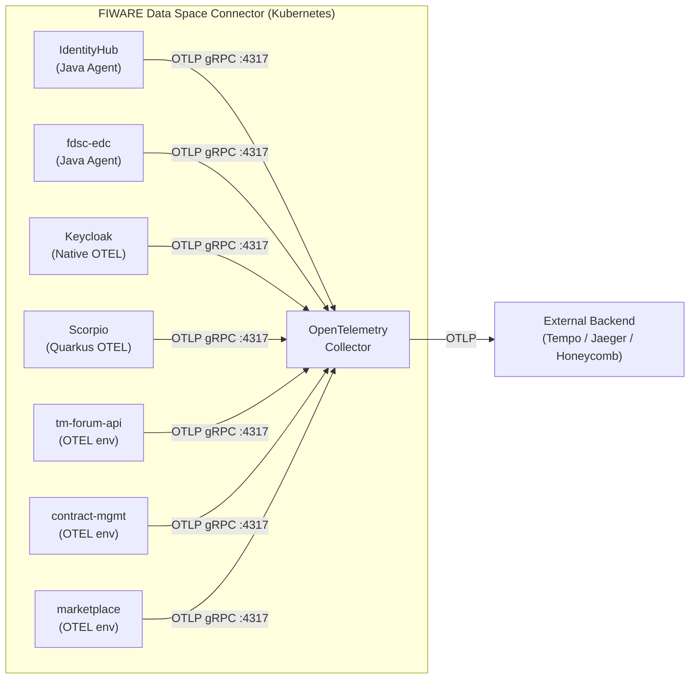
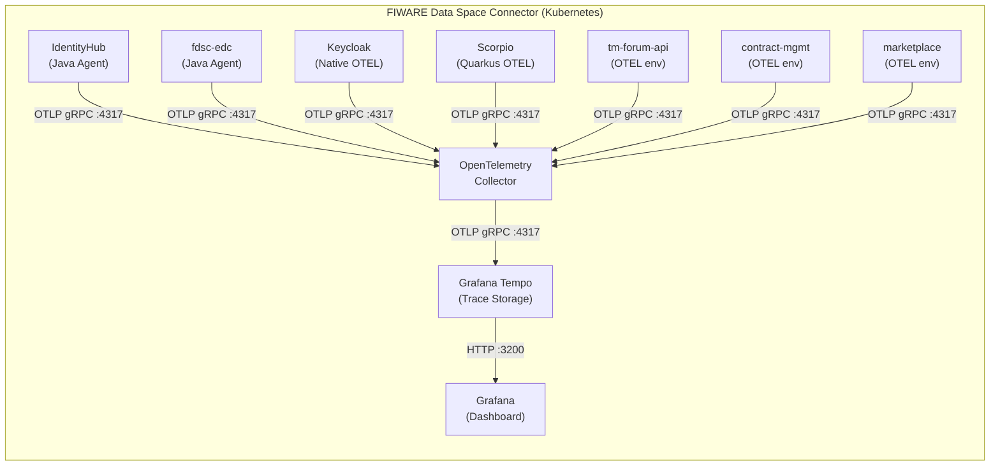

# Observability: Distributed Tracing with OpenTelemetry

The FIWARE Data Space Connector ships with built-in support for
[OpenTelemetry](https://opentelemetry.io/) (OTEL) distributed tracing.
When enabled, every instrumented component exports trace spans through the
[OTLP](https://opentelemetry.io/docs/specs/otlp/) protocol to an
in-cluster OpenTelemetry Collector, which can then forward them to any
OTLP-compatible backend (Jaeger, Grafana Tempo, Honeycomb, etc.).

Tracing is **disabled by default** and is strictly opt-in. Enabling it
adds no external network dependencies unless you configure a remote
backend exporter.

---

<!-- ToC created with: https://github.com/thlorenz/doctoc -->
<!-- Update with: doctoc README.md -->

<details>
<summary><strong>Table of Contents</strong></summary>

- [Architecture](#architecture)
- [Enabling Tracing](#enabling-tracing)
  - [Minimal Setup](#minimal-setup)
  - [Connecting an External Backend](#connecting-an-external-backend)
  - [TLS and Authentication](#tls-and-authentication)
- [Grafana Tempo Backend (In-Cluster)](#grafana-tempo-backend-in-cluster)
  - [Full-Stack Quick Start](#full-stack-quick-start)
  - [How the Auto-Wiring Works](#how-the-auto-wiring-works)
  - [Using an External Tempo Instance](#using-an-external-tempo-instance)
  - [Production Considerations](#production-considerations)
  - [Verifying Traces in Grafana](#verifying-traces-in-grafana)
- [Configuration Reference](#configuration-reference)
  - [Global Tracing Values](#global-tracing-values)
  - [OpenTelemetry Collector Values](#opentelemetry-collector-values)
- [Per-Component Notes](#per-component-notes)
  - [IdentityHub (Java Agent)](#identityhub-java-agent)
  - [fdsc-edc (Java Agent)](#fdsc-edc-java-agent)
  - [Keycloak (Native OTEL)](#keycloak-native-otel)
  - [Scorpio (Quarkus Native OTEL)](#scorpio-quarkus-native-otel)
  - [tm-forum-api, contract-management, marketplace (Subchart extraEnv)](#tm-forum-api-contract-management-marketplace-subchart-extraenv)
  - [decentralizedIam (Forward-Compatible Passthrough)](#decentralizediam-forward-compatible-passthrough)
- [Auto-Instrumentation via OpenTelemetry Operator](#auto-instrumentation-via-opentelemetry-operator)
  - [Why Auto-Instrumentation?](#why-auto-instrumentation)
  - [Prerequisites](#prerequisites)
  - [Enabling Auto-Instrumentation](#enabling-auto-instrumentation)
  - [Per-Workload Annotations](#per-workload-annotations)
  - [Interaction with Static OTEL Env Vars](#interaction-with-static-otel-env-vars)
  - [Which Approach to Use](#which-approach-to-use)
  - [Auto-Instrumentation Configuration Reference](#auto-instrumentation-configuration-reference)
- [Excluded Components](#excluded-components)
- [Troubleshooting](#troubleshooting)

</details>

---


## Architecture

The following diagram shows how trace data flows from the instrumented
workloads through the OpenTelemetry Collector to an external backend:



**Key points:**

- All workloads send spans to the **in-cluster Collector** via OTLP gRPC
  (port 4317) or OTLP HTTP (port 4318).
- The Collector batches, enriches, and forwards spans to the configured
  backend exporter(s).
- By default, the Collector only writes to the `debug` exporter (stdout
  logs), so **no external calls are made** until you add a backend.


## Enabling Tracing

### Minimal Setup

Enable tracing globally with a single value:

```bash
helm upgrade --install my-dsc dsc/data-space-connector \
  --set tracing.enabled=true
```

Or in your `values.yaml`:

```yaml
tracing:
  enabled: true
```

This will:
1. Deploy the OpenTelemetry Collector as a Deployment inside the release.
2. Inject `OTEL_*` environment variables into all instrumented workloads.
3. Attach the Java agent init container to IdentityHub and fdsc-edc.
4. Route all spans to the Collector's `debug` exporter (visible in
   Collector pod logs).

### Connecting an External Backend

To forward spans to an external OTLP-compatible backend, override the
Collector's exporter configuration. The `values.yaml` ships with
commented-out examples for Grafana Tempo, Jaeger, and Honeycomb.

**Example: Grafana Tempo**

```yaml
tracing:
  enabled: true

opentelemetry-collector:
  config:
    exporters:
      otlp/tempo:
        endpoint: "tempo.monitoring.svc.cluster.local:4317"
        tls:
          insecure: true
    service:
      pipelines:
        traces:
          exporters:
            - debug
            - otlp/tempo
```

**Example: Jaeger (OTLP native, v1.35+)**

```yaml
tracing:
  enabled: true

opentelemetry-collector:
  config:
    exporters:
      otlp/jaeger:
        endpoint: "jaeger-collector.monitoring.svc.cluster.local:4317"
        tls:
          insecure: true
    service:
      pipelines:
        traces:
          exporters:
            - debug
            - otlp/jaeger
```

**Example: Honeycomb (SaaS)**

```yaml
tracing:
  enabled: true

opentelemetry-collector:
  config:
    exporters:
      otlp/honeycomb:
        endpoint: "api.honeycomb.io:443"
        headers:
          x-honeycomb-team: "${env:HONEYCOMB_API_KEY}"
    service:
      pipelines:
        traces:
          exporters:
            - otlp/honeycomb
```

### TLS and Authentication

For production backends that require TLS:

```yaml
opentelemetry-collector:
  config:
    exporters:
      otlp/secure-backend:
        endpoint: "traces.example.com:443"
        tls:
          insecure: false
          # Optionally provide custom CA:
          # ca_file: /etc/otel/ca.pem
        headers:
          Authorization: "Bearer <token>"
```

To inject secrets as environment variables into the Collector pod, use the
upstream chart's `extraEnvs` mechanism:

```yaml
opentelemetry-collector:
  extraEnvs:
    - name: HONEYCOMB_API_KEY
      valueFrom:
        secretKeyRef:
          name: honeycomb-credentials
          key: api-key
```


## Grafana Tempo Backend (In-Cluster)

The chart includes optional **Grafana Tempo** and **Grafana** subchart
dependencies that deploy a complete trace-storage and visualisation stack
inside the cluster. When enabled, the OpenTelemetry Collector is
automatically configured to export spans to Tempo, and Grafana is
automatically provisioned with Tempo as a datasource -- no manual
pipeline configuration required.



### Full-Stack Quick Start

Enable the entire tracing pipeline with three values:

```yaml
tracing:
  enabled: true

tempo:
  enabled: true

grafana:
  enabled: true
```

Or via `--set` flags:

```bash
helm upgrade --install my-dsc dsc/data-space-connector \
  --set tracing.enabled=true \
  --set tempo.enabled=true \
  --set grafana.enabled=true
```

This will:
1. Deploy the OpenTelemetry Collector and inject `OTEL_*` env vars into
   all workloads (same as [Minimal Setup](#minimal-setup)).
2. Deploy Grafana Tempo as an in-cluster trace backend.
3. Auto-configure the Collector to export spans to Tempo via the
   `otlp/tempo` exporter (in addition to the default `debug` exporter).
4. Deploy Grafana with the datasource sidecar enabled.
5. Auto-provision a Grafana datasource pointing at Tempo, so traces
   are visible in the Grafana UI immediately.

### How the Auto-Wiring Works

The integration between the Collector, Tempo, and Grafana is handled
automatically by the umbrella chart's templates:

- **Collector -> Tempo:** When `tempo.enabled=true`, the chart renders a
  custom Collector ConfigMap (`otel-collector-config-cm.yaml`) that takes
  the user's `opentelemetry-collector.config` values as a base and
  injects an `otlp/tempo` exporter targeting
  `http://<release>-tempo:4317`. The exporter is also appended to the
  `service.pipelines.traces.exporters` list. Any exporters you define
  (including the default `debug` exporter) are preserved.

- **Tempo -> Grafana:** When both `tempo.enabled=true` and
  `grafana.enabled=true`, the chart renders a datasource ConfigMap
  (`grafana-tempo-datasource-cm.yaml`) labelled with
  `grafana_datasource: "1"`. The Grafana sidecar automatically detects
  this ConfigMap and provisions Tempo as a datasource at
  `http://<release>-tempo:3200`.

You do not need to manually edit the Collector pipeline or create
Grafana datasources. However, you can still override any of these
values if you need custom configuration.

### Using an External Tempo Instance

If you already operate a Tempo instance outside the cluster (or in
another namespace), disable the bundled Tempo subchart and point the
Collector at your external endpoint manually:

```yaml
tracing:
  enabled: true

# Do NOT enable the bundled Tempo subchart
tempo:
  enabled: false

# Point the Collector at your external Tempo
opentelemetry-collector:
  config:
    exporters:
      otlp/tempo:
        endpoint: "tempo.monitoring.svc.cluster.local:4317"
        tls:
          insecure: true
    service:
      pipelines:
        traces:
          exporters:
            - debug
            - otlp/tempo
```

If your external Tempo requires TLS or authentication, see
[TLS and Authentication](#tls-and-authentication) for examples.

To connect Grafana to an external Tempo, disable the auto-provisioned
datasource (by leaving `tempo.enabled=false`) and configure the
datasource manually in Grafana or through a custom datasource
ConfigMap.

### Production Considerations

The default configuration uses local filesystem storage for Tempo and
ephemeral storage for Grafana, which is suitable for development and
testing. For production deployments, consider the following adjustments:

**Tempo storage backend:**

By default, Tempo stores traces on the local filesystem. For production,
configure an object-storage backend (S3, GCS, or Azure Blob Storage):

```yaml
tempo:
  enabled: true
  tempo:
    storage:
      trace:
        backend: s3
        s3:
          bucket: my-tempo-traces
          endpoint: s3.amazonaws.com
          region: eu-west-1
          access_key: "${S3_ACCESS_KEY}"
          secret_key: "${S3_SECRET_KEY}"
```

Refer to the
[Tempo storage configuration](https://grafana.com/docs/tempo/latest/configuration/#storage)
documentation for all supported backends and options.

**Tempo retention:**

The default trace retention is `48h`. Adjust for your compliance and
cost requirements:

```yaml
tempo:
  tempo:
    retention: 168h   # 7 days
```

**Grafana persistence:**

Enable a PersistentVolumeClaim for Grafana to preserve dashboards and
settings across pod restarts:

```yaml
grafana:
  persistence:
    enabled: true
    size: 1Gi
```

**Grafana admin password:**

The default admin password is `"admin"`. Override it for any
non-development environment:

```yaml
grafana:
  adminPassword: "a-strong-secret"
```

**Ingress:**

To expose Grafana outside the cluster, enable ingress on the Grafana
subchart:

```yaml
grafana:
  ingress:
    enabled: true
    hosts:
      - grafana.example.com
    tls:
      - secretName: grafana-tls
        hosts:
          - grafana.example.com
```

### Verifying Traces in Grafana

After deploying the full stack, follow these steps to confirm traces are
flowing end-to-end:

1. **Check Tempo readiness:**

   ```bash
   kubectl get pods -l app.kubernetes.io/name=tempo
   ```

   The Tempo pod should be in `Running` state.

2. **Check Grafana readiness:**

   ```bash
   kubectl get pods -l app.kubernetes.io/name=grafana
   ```

3. **Port-forward to Grafana:**

   ```bash
   kubectl port-forward svc/<release>-grafana 3000:80
   ```

   Open `http://localhost:3000` in your browser (default credentials:
   `admin` / `admin`).

4. **Open the Explore view:** Navigate to **Explore** in the left
   sidebar and select the **Tempo** datasource from the dropdown.

5. **Search for traces:** Use the **Search** tab to find recent traces
   by service name, duration, or status. If workloads are actively
   handling requests, you should see traces appearing within seconds.

6. **If no traces appear:**
   - Verify the Collector is running and receiving spans (see
     [Troubleshooting](#troubleshooting)).
   - Check the Collector logs for export errors to the Tempo endpoint:
     ```bash
     kubectl logs -l app.kubernetes.io/name=opentelemetry-collector --tail=50 | grep -i "error\|failed"
     ```
   - Verify the Tempo pod is healthy:
     ```bash
     kubectl logs -l app.kubernetes.io/name=tempo --tail=50
     ```
   - Confirm the Grafana datasource was auto-provisioned:
     ```bash
     kubectl get configmap -l grafana_datasource=1
     ```


## Configuration Reference

### Global Tracing Values

These values live under the `tracing:` key in `values.yaml` and control
the `OTEL_*` environment variables injected into every instrumented
workload.

| Value | Default | Description |
|---|---|---|
| `tracing.enabled` | `false` | Global on/off switch for distributed tracing. |
| `tracing.exporter.otlp.endpoint` | `""` (auto-computed) | OTLP endpoint URL. When empty, defaults to `http://<release>-opentelemetry-collector:4317`. |
| `tracing.exporter.otlp.protocol` | `"grpc"` | OTLP transport protocol (`grpc` or `http/protobuf`). |
| `tracing.exporter.otlp.insecure` | `true` | Disable TLS verification for the OTLP exporter (in-cluster default). |
| `tracing.sampler` | `"parentbased_traceidratio"` | Trace sampler strategy. |
| `tracing.samplerArg` | `"1.0"` | Sampler argument (e.g., `"0.1"` for 10% sampling). |
| `tracing.resourceAttributes` | `{}` | Map of extra OTEL resource attributes added to every span. |
| `tracing.propagators` | `"tracecontext,baggage"` | Context propagation formats (W3C Trace Context + Baggage by default). |

### OpenTelemetry Collector Values

These values live under the `opentelemetry-collector:` key. The full
upstream chart documentation is at
[open-telemetry/opentelemetry-helm-charts](https://github.com/open-telemetry/opentelemetry-helm-charts/tree/main/charts/opentelemetry-collector).

| Value | Default | Description |
|---|---|---|
| `opentelemetry-collector.enabled` | `false` | Deploy the bundled Collector (automatically set to `true` when `tracing.enabled=true`). |
| `opentelemetry-collector.mode` | `"deployment"` | Collector topology (`deployment`, `daemonset`, or `statefulset`). |
| `opentelemetry-collector.replicaCount` | `1` | Number of Collector replicas. |
| `opentelemetry-collector.resources.requests.cpu` | `"100m"` | CPU request. |
| `opentelemetry-collector.resources.requests.memory` | `"128Mi"` | Memory request. |
| `opentelemetry-collector.resources.limits.cpu` | `"500m"` | CPU limit. |
| `opentelemetry-collector.resources.limits.memory` | `"512Mi"` | Memory limit. |

The default pipeline processes spans through:
`memory_limiter` -> `resource` -> `batch` -> `debug` exporter.


## Per-Component Notes

Each component integrates with OpenTelemetry differently depending on its
runtime and the extension points available in its subchart.

### IdentityHub (Java Agent)

**Instrumentation method:** OpenTelemetry Java auto-instrumentation agent
injected via init container.

When `tracing.enabled=true` and `identityhub.tracing.javaagent.enabled=true`
(the default), an init container copies the Java agent JAR into a shared
`emptyDir` volume (`otel-agent`), which is mounted read-only into the
IdentityHub container. The agent is activated by appending
`-javaagent:/otel-agent/opentelemetry-javaagent.jar` to `JAVA_TOOL_OPTIONS`.

**Per-component overrides:**

```yaml
identityhub:
  tracing:
    # enabled: true  # inherits from tracing.enabled
    serviceName: "identityhub"
    javaagent:
      enabled: true
      image: "ghcr.io/open-telemetry/opentelemetry-java-instrumentation/autoinstrumentation-java:2.11.0"
      pullPolicy: "IfNotPresent"
```

### fdsc-edc (Java Agent)

**Instrumentation method:** Same Java auto-instrumentation agent as
IdentityHub, injected via the subchart's `initContainers`,
`additionalVolumes`, and `additionalVolumeMounts` extension points.

**Per-component overrides:**

```yaml
fdsc-edc:
  tracing:
    # enabled: true  # inherits from tracing.enabled
    serviceName: "fdsc-edc"
    javaagent:
      enabled: true
      image: "ghcr.io/open-telemetry/opentelemetry-java-instrumentation/autoinstrumentation-java:2.11.0"
      pullPolicy: "IfNotPresent"
```

> **Note:** If you override `fdsc-edc.common.additonalEnvVars`,
> `initContainers`, or volume settings, you must manually merge the
> tracing entries. See the inline comments in `values.yaml` for a
> ready-to-copy snippet.

### Keycloak (Native OTEL)

**Instrumentation method:** Keycloak 25+ has built-in OpenTelemetry
support activated by setting `KC_TRACING_ENABLED=true`.

When tracing is enabled, the umbrella chart injects `KC_TRACING_ENABLED`
plus the standard `OTEL_*` environment variables through the Keycloak
subchart's `extraEnvVars` hook.

**Per-component overrides:**

```yaml
keycloak:
  tracing:
    # enabled: true  # inherits from tracing.enabled
    serviceName: "keycloak"
```

### Scorpio (Quarkus Native OTEL)

**Instrumentation method:** Scorpio runs on Quarkus, which provides
native OTEL integration via `QUARKUS_OTEL_*` environment variables.

When tracing is enabled, the umbrella chart injects Quarkus-specific
variables (`QUARKUS_OTEL_ENABLED=true`,
`QUARKUS_OTEL_EXPORTER_OTLP_TRACES_ENDPOINT`, etc.) through the
Scorpio subchart's `env` hook.

> **Note:** The current Scorpio container image (`scorpiobroker/all-in-one-runner:java-4.1.10`)
> does not include the `quarkus-opentelemetry` extension, so the static
> env vars have no effect. Use
> [auto-instrumentation via the OTel Operator](#auto-instrumentation-via-opentelemetry-operator)
> to inject the Java agent into Scorpio pods.

**Per-component overrides:**

```yaml
scorpio:
  tracing:
    # enabled: true  # inherits from tracing.enabled
    serviceName: "scorpio"
```

### tm-forum-api, contract-management, marketplace (Subchart extraEnv)

**Instrumentation method:** Standard `OTEL_*` environment variables
injected through each subchart's `extraEnv` or `additionalEnvVars` hook.

These components receive the same set of environment variables:
`OTEL_SERVICE_NAME`, `OTEL_EXPORTER_OTLP_ENDPOINT`,
`OTEL_EXPORTER_OTLP_PROTOCOL`, `OTEL_TRACES_SAMPLER`,
`OTEL_TRACES_SAMPLER_ARG`, `OTEL_PROPAGATORS`,
`OTEL_RESOURCE_ATTRIBUTES`, `OTEL_METRICS_EXPORTER=none`, and
`OTEL_LOGS_EXPORTER=none`.

> **Note:** These subcharts do not bundle an OTEL SDK, so the static
> env vars alone will not produce traces. Use
> [auto-instrumentation via the OTel Operator](#auto-instrumentation-via-opentelemetry-operator)
> to inject the appropriate language agent.

**Per-component overrides:**

```yaml
tm-forum-api:
  tracing:
    serviceName: "tm-forum-api"

contract-management:
  tracing:
    serviceName: "contract-management"

marketplace:
  tracing:
    serviceName: "marketplace"
```

### decentralizedIam (Forward-Compatible Passthrough)

The `decentralizedIam` subchart receives a `tracing` passthrough block
that mirrors the global `tracing.*` values. This is a **forward-compatible**
mechanism: if the upstream decentralizedIam chart adds direct tracing
support in the future, the values will flow through automatically without
changes to the umbrella chart.

Currently, the passthrough has no effect on the rendered manifests unless
the upstream chart consumes it.


## Auto-Instrumentation via OpenTelemetry Operator

The chart includes an optional **OpenTelemetry Operator** subchart that
enables Kubernetes-native auto-instrumentation. The operator injects
language-specific agents (Java, Python, Node.js) into pods at creation
time via a mutating admission webhook, removing the need for the
application image to bundle an OTEL SDK or agent.

### Why Auto-Instrumentation?

Several third-party subcharts cannot emit traces through static `OTEL_*`
environment variables alone because their container images do not include
an OpenTelemetry SDK or agent:

| Subchart | Runtime | Limitation |
|---|---|---|
| **Scorpio** | Quarkus (Java) | Image does not include the `quarkus-opentelemetry` extension; `QUARKUS_OTEL_ENABLED=true` is silently ignored. |
| **tm-forum-api** | Micronaut (Java) | No OTEL SDK or Java agent present; `OTEL_SDK_DISABLED=false` has no effect. |
| **contract-management** | Micronaut (Java) | Same as tm-forum-api. |
| **marketplace** (charging backend) | Python | No OTEL SDK bundled. |
| **marketplace** (logic proxy) | Node.js | No OTEL SDK bundled. |

The OpenTelemetry Operator solves this by injecting the appropriate
language agent as an init container, which copies the agent into a
shared volume. The operator also sets the necessary `OTEL_*` environment
variables from the `Instrumentation` custom resource.

### Prerequisites

1. **cert-manager** must be installed. The operator's webhook TLS
   certificates are managed by cert-manager. The umbrella chart includes
   cert-manager as an optional dependency (`cert-manager.enabled: true`),
   or you can use an external installation.

2. **OpenTelemetry Operator** must be enabled
   (`opentelemetry-operator.enabled: true`). This deploys the operator
   and registers the `Instrumentation` CRD.

### Enabling Auto-Instrumentation

Enable the operator and auto-instrumentation with these values:

```yaml
tracing:
  enabled: true
  autoInstrumentation:
    enabled: true

opentelemetry-operator:
  enabled: true
```

This renders an `Instrumentation` CR in the release namespace. The CR
defines the exporter endpoint (pointing at the in-cluster Collector),
sampler, propagators, and agent images. Pods must still be annotated
to opt in to injection (see below).

### Per-Workload Annotations

The operator's webhook only instruments pods that carry the appropriate
annotation. Add the annotation through each subchart's pod annotation
extension point:

```yaml
# Java workloads
scorpio:
  podAnnotations:
    instrumentation.opentelemetry.io/inject-java: "true"

tm-forum-api:
  defaultConfig:
    additionalAnnotations:
      instrumentation.opentelemetry.io/inject-java: "true"

contract-management:
  deployment:
    additionalAnnotations:
      instrumentation.opentelemetry.io/inject-java: "true"

# Python workload
marketplace:
  bizEcosystemChargingBackend:
    deployment:
      podAnnotations:
        instrumentation.opentelemetry.io/inject-python: "true"

# Node.js workload
marketplace:
  bizEcosystemLogicProxy:
    statefulset:
      podAnnotations:
        instrumentation.opentelemetry.io/inject-nodejs: "true"
```

Without the operator webhook installed, these annotations are harmless
no-ops.

### Interaction with Static OTEL Env Vars

When using auto-instrumentation, the operator injects `OTEL_*`
environment variables from the `Instrumentation` CR. If the pod also
has static `OTEL_*` env vars from `additionalEnvVars`, the two sets may
conflict (container-level env vars take precedence over operator-injected
ones).

**Recommendation:** When enabling auto-instrumentation for a workload,
remove the static `OTEL_*` env vars from that workload's
`additionalEnvVars`, keeping only non-OTEL entries (e.g.,
`API_EXTENSION_ENABLED` for tm-forum-api, `LOGGER_LEVELS_ROOT` for
contract-management). See `k3s/monitoring.yaml` for a working example.

### Which Approach to Use

| Scenario | Recommended Approach |
|---|---|
| App image has built-in OTEL support (e.g., Keycloak) | Static env vars via `tracing.enabled` |
| App image has the OTEL Java agent bundled (e.g., IdentityHub, fdsc-edc) | Init container injection via `tracing.javaagent.enabled` |
| App image has **no** OTEL SDK or agent (e.g., Scorpio, tm-forum-api) | **OTel Operator auto-instrumentation** |
| Mixed deployment with multiple languages | OTel Operator (supports Java, Python, Node.js from a single `Instrumentation` CR) |

### Auto-Instrumentation Configuration Reference

| Value | Default | Description |
|---|---|---|
| `tracing.autoInstrumentation.enabled` | `false` | Master gate for the `Instrumentation` CR. |
| `tracing.autoInstrumentation.java.image` | `ghcr.io/.../autoinstrumentation-java:2.11.0` | Java agent image injected by the operator. |
| `tracing.autoInstrumentation.python.image` | `ghcr.io/.../autoinstrumentation-python:0.52b1` | Python agent image injected by the operator. |
| `tracing.autoInstrumentation.nodejs.image` | `ghcr.io/.../autoinstrumentation-nodejs:0.57.0` | Node.js agent image injected by the operator. |
| `opentelemetry-operator.enabled` | `false` | Deploy the OTel Operator subchart. |
| `opentelemetry-operator.manager.resources` | 100m/128Mi req, 200m/256Mi lim | Operator manager pod resources. |


## Excluded Components

The following components are **not instrumented** by this tracing
integration:

| Component | Reason |
|---|---|
| **Rainbow** | Slated for removal in a future release. |
| **Registration jobs** (participant-registration, tmf-registration, dataplane-registration, rainbow-registration) | Short-lived batch jobs that do not benefit from continuous tracing. |
| **MongoDB** | Database-level tracing is handled by the application drivers, not the server. |
| **HashiCorp Vault** | Infrastructure component; tracing is configured independently if needed. |
| **cert-manager** | Cluster-level operator; out of scope for application tracing. |


## Troubleshooting

### Verify the Collector is Running

```bash
kubectl get pods -l app.kubernetes.io/name=opentelemetry-collector
```

The Collector pod should be in `Running` state. Check its logs for the
startup message:

```bash
kubectl logs -l app.kubernetes.io/name=opentelemetry-collector --tail=50
```

Look for: `"Everything is ready. Begin running and processing data."`

### Verify Spans are Being Received

With the default `debug` exporter, spans appear in the Collector's
stdout. Increase verbosity for more detail:

```yaml
opentelemetry-collector:
  config:
    exporters:
      debug:
        verbosity: "detailed"
```

### Common Issues

| Symptom | Likely Cause | Fix |
|---|---|---|
| No spans in Collector logs | Workload not sending to Collector endpoint | Check that `OTEL_EXPORTER_OTLP_ENDPOINT` is set on the pod: `kubectl exec <pod> -- env \| grep OTEL` |
| `connection refused` on port 4317 | Collector not deployed or wrong Service name | Verify `tracing.enabled=true` and the Collector Service exists: `kubectl get svc -l app.kubernetes.io/name=opentelemetry-collector` |
| Java agent not loading | Init container image pull failure | Check init container status: `kubectl describe pod <identityhub-pod>` and verify the image reference in `identityhub.tracing.javaagent.image` |
| Spans reach Collector but not backend | Exporter misconfigured | Check Collector logs for export errors. Verify the exporter endpoint, TLS settings, and auth headers. |
| `QUARKUS_OTEL_ENABLED` not taking effect | Scorpio image does not include OTEL extension | Ensure the Scorpio image version includes the `quarkus-opentelemetry` extension. |
| High memory usage on Collector | Too many spans, batch too large | Tune `batch.send_batch_size` and `memory_limiter.limit_percentage` in the Collector config. |
| Partial traces (missing spans) | Sampling rate too low or propagation mismatch | Verify `tracing.samplerArg` (set to `"1.0"` for 100%) and `tracing.propagators` matches across all components. |

### Checking OTEL Environment Variables on a Pod

To verify that a specific workload has the correct tracing configuration:

```bash
# IdentityHub
kubectl exec deploy/<release>-identityhub -- env | grep OTEL

# Keycloak
kubectl exec sts/<release>-keycloak -- env | grep -E "OTEL|KC_TRACING"

# Scorpio
kubectl exec deploy/<release>-scorpio -- env | grep -E "OTEL|QUARKUS_OTEL"
```

### Reducing Trace Volume in Production

For high-traffic deployments, reduce sampling to avoid overwhelming the
backend:

```yaml
tracing:
  samplerArg: "0.1"   # Sample 10% of traces
```

Or use the `parentbased_always_off` sampler on specific components while
keeping the global sampler on:

```yaml
scorpio:
  tracing:
    # Component-level override via subchart env
    serviceName: "scorpio"
```
