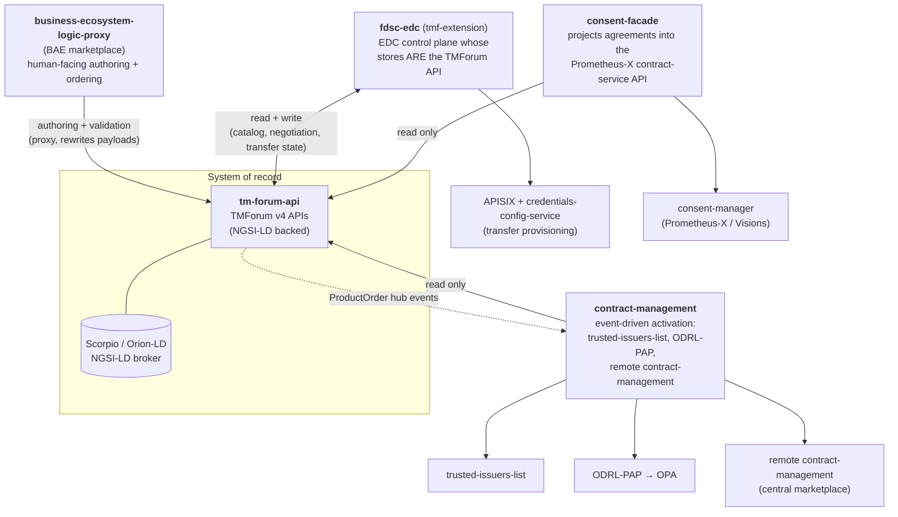
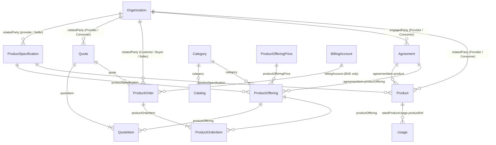
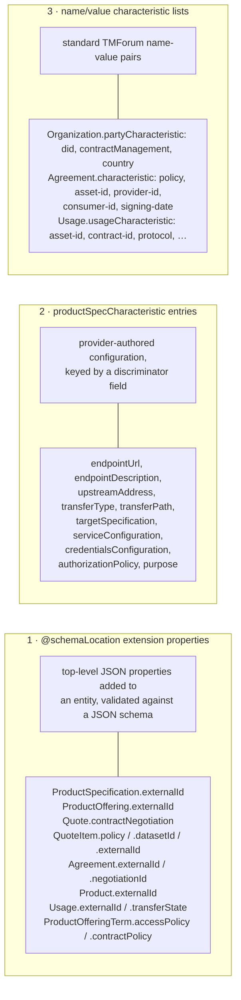
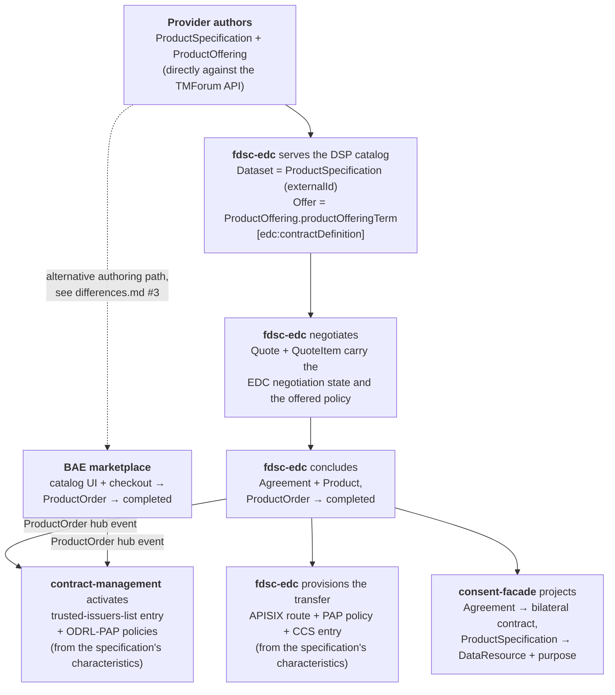

# The TMForum Data Model of the FIWARE Data Space Connector

> Scope: this document set describes **how the FIWARE Data Space Connector (DSC) and its satellite
> components use the TMForum APIs as their shared data model** — which entities exist, what each one
> means in a data space, how they reference each other, and where the components disagree about the
> shape of the very same object.

Everything in the DSC that has to do with *offering*, *negotiating*, *ordering*, *contracting* and
*billing* data services is stored in the TMForum APIs, as implemented by
[FIWARE/tmforum-api](https://github.com/FIWARE/tmforum-api). There is no separate DSC database for
this: **the TMForum API is the system of record**, and every component projects it into its own world
(ODRL policies, DSP/IDSA catalogs and negotiations, trusted-issuer entries, consent receipts, a
marketplace UI).

That makes the TMForum model the single most important integration contract in the whole stack — and
it is also the least specified one. The components extend the standard entities with their own
proprietary properties, they overload the same standard fields with different meanings, and they
disagree on trivialities such as which `relatedParty.role` string identifies a provider. This
document set writes that down.

## Documents

| Document | Content |
|---|---|
| **MODLE.md** (this file) | Big picture: components, entity graph, layering, reading guide |
| [`platform.md`](./platform.md) | The TMForum API implementation itself: versions, id scheme, the `@schemaLocation` extension mechanism, events, NGSI-LD consequences |
| [`entities.md`](./entities.md) | Entity-by-entity reference: purpose in a data space, fields that carry meaning, who writes and who reads |
| [`extensions.md`](./extensions.md) | The complete registry of DSC-specific extension properties and characteristics, with their JSON schemas |
| [`components.md`](./components.md) | Per-component view: what each component reads and writes, and what it requires to be present |
| [`lifecycles.md`](./lifecycles.md) | State machines and end-to-end flows (catalog publication, negotiation, order, transfer) |
| [`differences.md`](./differences.md) | **Divergences and incompatibilities** between components — read this before combining features |
| [`plan.md`](./plan.md) | The **plan** to turn this description into an agreed and enforced model: phases, components touched, decisions to ratify, breakage |

If you only read one other file, read [`differences.md`](./differences.md).

## The components

Five code bases share the TMForum model. They never talk to each other directly — they talk *through*
the TMForum API (plus TMForum's own event/notification hubs).

| Component | Role w.r.t. the model |
|---|---|
| [`FIWARE/tmforum-api`](https://github.com/FIWARE/tmforum-api) | The **implementation** of the model. Defines what is storable, queryable and extensible. |
| [`FIWARE-TMForum/business-ecosystem-logic-proxy`](https://github.com/FIWARE-TMForum/business-ecosystem-logic-proxy) | **Author + orchestrator** for the human path. Validates business rules, injects `relatedParty`, computes order state, and (importantly) **rewrites payloads on the way through**. |
| [`FIWARE/contract-management`](https://github.com/FIWARE/contract-management) | **Reactor**. Subscribes to TMForum `ProductOrder` events and turns completed orders into IAM state: trusted-issuer entries, ODRL-PAP policies, and forwarded order events for the central-marketplace scenario. Reads TMForum, never writes it. |
| [`SEAMWARE/fdsc-edc`](https://github.com/SEAMWARE/fdsc-edc) (`tmf-extension`) | **Persistence layer inversion**: an EDC control plane that uses TMForum entities *as its own stores* for assets, contract definitions, policies, negotiations, agreements and transfer processes. Owns the DSP/IDSA integration. |
| [`wistefan/consent-facade`](https://github.com/wistefan/consent-facade) | **Projector**. Reads (only) `Agreement` + catalog + party and serves them as Prometheus-X contract-service self-descriptions to the consent-manager. |
| [`FIWARE/data-space-connector`](https://github.com/FIWARE/data-space-connector) (this repo) | **Integrator**. Deploys and configures all of the above; the values in `charts/data-space-connector/values.yaml` and `k3s/*.yaml` decide which features are active. |

## The entity graph

The subset of TMForum that the DSC actually uses, and the meaning each entity carries here:

Mapped onto the data-space concepts the components care about:

| TMForum entity | Data-space meaning | Primary owner |
|---|---|---|
| `Organization` (TMF632) | A **participant**, identified by its DID | all |
| `Category` + `Catalog` (TMF620) | Marketplace taxonomy. **Not** used by the DSP path | BAE |
| `ProductSpecification` (TMF620) | The **data product / EDC asset**: endpoints, transfer config, credential + policy configuration, consent purpose | provider, via BAE or API |
| `ProductOffering` (TMF620) | The **contract definition / DSP dataset offer**: which policies apply | provider, via BAE or API |
| `ProductOfferingPrice` (TMF620) | Price; consumed by the marketplace's charging path | BAE |
| `Quote` + `QuoteItem` (TMF648) | The **contract negotiation** (DSP `ContractNegotiation`) | fdsc-edc |
| `ProductOrder` (TMF622) | The **commercial acquisition**, and the trigger for activation | BAE *or* fdsc-edc |
| `Agreement` (TMF651) | The **concluded contract** (DSP `ContractAgreement`) | fdsc-edc |
| `Product` (TMF637) | The **materialised entitlement** (an asset instance for one agreement) | fdsc-edc, BAE charging backend |
| `Usage` (TMF635) | A **DSP transfer process** and its state — *modelled in fdsc-edc but not wired yet* | (none) |
| `BillingAccount` (TMF666) | Billing target; mandatory for BAE orders, absent everywhere else | BAE |

## Three extension planes

Nothing in the standard TMForum model can express "this offering is negotiable over DSP under this
ODRL policy". So the DSC extends the model — in **three structurally different ways**, and knowing
which plane a piece of data lives in is the key to reading any payload:

* **Plane 1** requires a reachable JSON schema in `@schemaLocation`; without it the API *rejects* the
  payload. See [`platform.md`](./platform.md#extension-with-schemalocation).
* **Plane 2** is where the disagreements hurt most: the components do not agree on whether a
  characteristic is looked up by its `id`, its `name` or its `valueType`. See
  [`differences.md`](./differences.md#1-the-characteristic-discriminator).
* **Plane 3** is the most stable — but it is also where the whole consent projection hangs off five
  `Agreement` characteristics that only one component writes.

## How the pieces layer up

One data product, authored once, is consumed by four enforcement and projection points:

Note the two entry points into activation: a DSP negotiation finalising, and a marketplace checkout
completing. Both converge on `ProductOrder.state == completed`, which is the single trigger
contract-management listens to.

## Reading guide by task

| I want to … | Read |
|---|---|
| publish a data service that is negotiable over DSP | [`entities.md#productspecification`](./entities.md#productspecification), [`extensions.md`](./extensions.md), [`lifecycles.md#1-catalog-publication`](./lifecycles.md#1-catalog-publication) |
| understand what a `Quote` actually is | [`entities.md#quote--quoteitem`](./entities.md#quote--quoteitem), [`lifecycles.md#2-contract-negotiation`](./lifecycles.md#2-contract-negotiation) |
| know why my order did not activate anything | [`components.md#contract-management`](./components.md#contract-management), [`differences.md#2-relatedparty-roles`](./differences.md#2-relatedparty-roles) |
| add a new extension property | [`platform.md#extension-with-schemalocation`](./platform.md#extension-with-schemalocation), [`extensions.md#adding-a-new-extension`](./extensions.md#adding-a-new-extension) |
| combine the BAE marketplace with the EDC | [`differences.md#3-bae-rewrites-what-it-proxies`](./differences.md#3-bae-rewrites-what-it-proxies) |
| enable consent management | [`components.md#consent-facade`](./components.md#consent-facade), [`differences.md#5-consent-depends-on-an-agreement-only-the-edc-produces`](./differences.md#5-consent-depends-on-an-agreement-only-the-edc-produces) |

## Conventions used in these documents

* Field paths are written in TMForum JSON notation (`productSpecification.productSpecCharacteristic[].valueType`).
* `▲ writes` / `▼ reads` mark the direction a component uses a field in.
* Source references point at the file that actually implements the behaviour, so a claim can be
  re-verified: e.g. `contract-management: src/main/java/org/fiware/iam/tmforum/PolicyResolver.java`.
* Where a document says a value is *configurable*, the configuration key is given; the default is
  what the DSC charts use unless stated otherwise.
