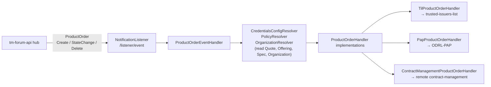
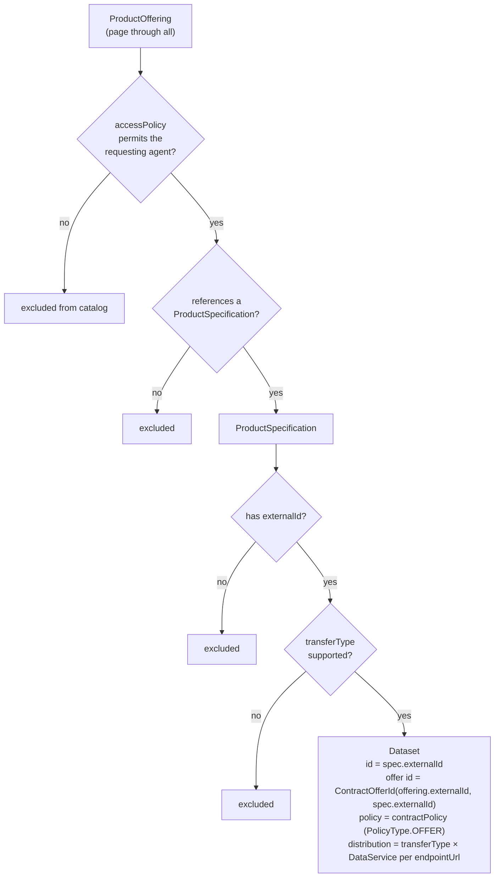
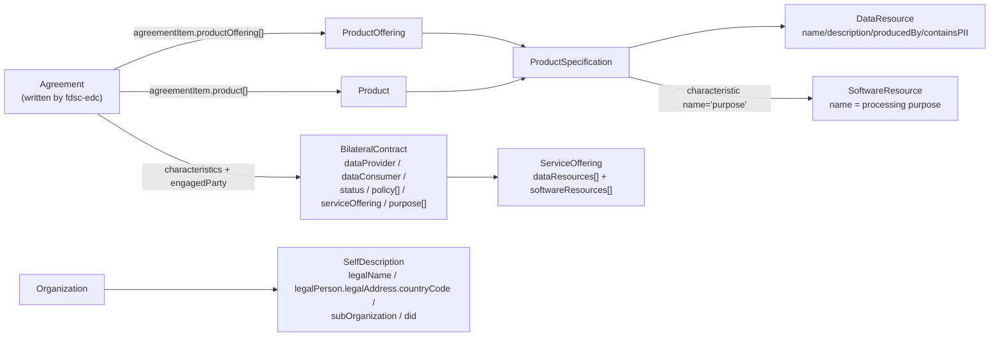

# Component view

What each component does with the TMForum model, what it *requires* to be present, and how it is
switched on.

---

## `tm-forum-api`

The system of record. See [`platform.md`](./platform.md).

Relevant DSC configuration (`charts/data-space-connector/values.yaml`, `tm-forum-api:`):

| Setting | Effect on the model |
|---|---|
| `API_EXTENSION_ENABLED=true` | enables `@schemaLocation` extension properties — **without it the whole DSP model is rejected** |
| `defaultConfig.contextUrl` | NGSI-LD `@context`; must declare every list-valued extension as `@set` |
| `defaultConfig.ngsiLd.url` | the broker holding all TMForum entities |
| `GENERAL_NGSILDORQUERYVALUE/KEY`, `GENERAL_ENCLOSEQUERY` | multi-value query translation (`?state=a,b,c`) |
| `allInOne.enabled` | one pod vs. one per API; paths unchanged |
| `registration.*` | registers the TMForum API as a service at the credentials-config-service so it can be protected by OID4VP |

---

## contract-management

**Role: event-driven activation.** It is the only component that *reacts* to the TMForum model rather
than reading it on demand — and it is read-only towards TMForum: everything it produces lands in the
trusted-issuers-list, the ODRL-PAP, or another participant's contract-management.



Handlers are activated by feature flags (`GeneralProperties`), all defaulting to `true`:

| Flag | Handlers |
|---|---|
| `general.enableTmForum` | the whole TMForum integration (event handler, resolvers) |
| `general.enableTrustedIssuersList` | `TilProductOrderHandler` |
| `general.enableOdrlPap` | `PapProductOrderHandler` |
| `general.enableCentralMarketplace` | `ContractManagementProductOrderHandler` |

### What it requires from the model

**On a `ProductOrder` event:**
* exactly one `relatedParty` whose role matches `general.productOrder.customerRole`
  (default `Customer`, `equalsIgnoreCase`). A single related party with a `null` role is also
  accepted. Otherwise: `Exactly one ordering related party is expected.`
* the customer `Organization` must resolve to a DID
  (`externalReference[idm_id].name` or `partyCharacteristic[did]`), else `TMForumException`.
* `state == completed` to activate (on create or state change); any other state change, and any
  delete, deactivates.
* if `quote[]` is non-empty on a create event, the negotiation branch is taken and nothing is
  activated — activation then happens on the later state change to `completed`.

**To resolve credentials/policies** it walks
`quote[] → Quote(state=accepted) → quoteItem[state=accepted, action≠delete] → productOffering → productSpecification`,
falling back to `productOrderItem[action∈{add,modify}] → productOffering → productSpecification`
when the order has no quote. On the specification it needs:
* `productSpecCharacteristic[valueType="credentialsConfiguration"]` for the trusted-issuers-list, and/or
* `productSpecCharacteristic[valueType="authorizationPolicy"]` for the ODRL-PAP,
* optionally `relatedParty[role=<general.organization.provider.role>]` (default `provider`) to look up
  that party's `contractManagement` characteristic. **Missing ⇒ treated as local.**
* **every characteristic must have a non-null `valueType`** — the resolvers call
  `psc.getValueType().equals(…)` unguarded.

Only the **first** matching characteristic is used per specification, and all of its values are
flattened, so one specification carries at most one credential configuration and one policy
configuration.

### Subscriptions

`notification.entities` in `application.yaml` subscribes to `ProductOrder`, `ProductOffering`,
`Catalog` and `Quote` hubs. Only the `ProductOrder` events have handlers; the other three
subscriptions exist but dispatch to an empty handler list, so they are no-ops. They still cost one
subscription each and show up in the service's health indicator.

Config in the DSC: `k3s/provider.yaml` → `contract-management:` (`did`,
`enableCentralMarketplace: true`, `enableOdrlPap: true`, per-API `services.*.url`,
`notification.enabled: true`).

---

## fdsc-edc (`tmf-extension`)

**Role: the TMForum API *is* the EDC's database.** Every EDC store interface is implemented against
TMForum:

| EDC store | TMForum backing | Notes |
|---|---|---|
| `AssetIndex` | `ProductSpecification` (by `externalId`) | read-only; `create/update/delete` throw `UnsupportedOperationException` |
| `ContractDefinitionStore` | `ProductOffering` + `productOfferingTerm[edc:contractDefinition]` | read-only |
| `PolicyDefinitionStore` | the policies inside `productOfferingTerm`, looked up by `odrl:uid` | read-only; `findAll` unsupported |
| `ContractNegotiationStore` | `Quote` (+ `ProductOrder`, `Agreement`, `Product`) | read/write, saga-compensated |
| `TransferProcessStore` | `Usage` | **not wired** — model, schema and mapper exist, but there is no `UsageApiClient` and no registered store implementation, so transfers stay in the EDC's own store. `tmfExtension.usageManagementApi` is nevertheless a required config value |
| `CatalogProtocolService` | `ProductSpecification` × `ProductOffering` | builds DSP `Dataset`s |
| participant resolution | `Organization` | creates organizations on demand |

Configuration (`tmfExtension.*`, one URL per API + `schemaBaseUri` + `catalog.enabled`), wired in
`charts/data-space-connector/values.yaml` and `k3s/dsp-provider.yaml` / `k3s/dsp-consumer.yaml`.

### Catalog construction



One `Dataset` per specification, one **offer** per matching offering — mirroring upstream EDC, where
one asset can be offered under several contract definitions.

### Negotiation persistence

Each EDC negotiation state transition is a multi-entity write, compensated by
`TMFTransactionContext` on failure:

| EDC state | TMForum effect |
|---|---|
| `REQUESTING`/`REQUESTED`, `OFFERING`/`OFFERED` | create or update a `Quote` (state `inProgress` / `approved`), cancelling a superseded one |
| `ACCEPTING`/`ACCEPTED` | `Quote` → `accepted` |
| `AGREEING`/`AGREED` | `Agreement` created (status `inProcess`) |
| `VERIFYING`/`VERIFIED` | `ProductOrder` created with `quote[{id}]` and `relatedParty` `Consumer` + `Customer` (+ `Provider`) |
| `FINALIZING`/`FINALIZED` | `Quote` → `accepted`; `Product` created; `Agreement` → `agreed`, `agreementItem.productItem` re-pointed at the `Product`; `ProductOrder` → `completed` |
| `TERMINATING`/`TERMINATED` | `Quote` → `cancelled`, `ProductOrder` → `cancelled`, `Agreement` → `rejected` |

The `ProductOrder` → `completed` write at FINALIZED is the **designed hand-off to
contract-management**: it fires `ProductOrderStateChangeEvent`, which makes contract-management add
the consumer to the trusted-issuers-list and install the ODRL-PAP policies. That is why fdsc-edc
explicitly adds a second `relatedParty` with role `Customer` next to `Consumer`, with the comment
*"Customer is the role expected by the Contract-Management"*
(`TMFBackedContractNegotiationStore.handleVerificationStates`).

Concurrency: since TMForum has no locking, the lease lives in
`Quote.contractNegotiation.{isLeased,leasedBy,leaseExpiry}` plus an in-JVM `activeNegotiations` set,
and `contractNegotiation.controlplane` records which EDC instance owns the negotiation.

### Transfer provisioning (`fdsc-transfer-extension`)

On provisioning a transfer the provisioner reads the **specification by `externalId`** and needs:

| Characteristic (by `id`) | Effect |
|---|---|
| `upstreamAddress` | APISIX upstream node — **mandatory**, else `FATAL_ERROR` |
| `targetSpecification` | replaces `odrl:target` in the policy pushed to the ODRL-PAP |
| `serviceConfiguration` | registered at the credentials-config-service (OID4VP variant) |

plus `endpointUrl` / `transferPath` from the asset's `DataAddress` (type `FDSC`) for the EDR.

---

## business-ecosystem-logic-proxy (BAE)

**Role: the human authoring and ordering path**, and a *validating, rewriting* proxy in front of the
TMForum APIs. It is the only component that changes payloads in flight.

### Rewrites it performs

`lib/tmfUtils.js` → `attachRelatedParty(req, api)` runs on POST/PATCH for:

| API / object | Function | What it does |
|---|---|---|
| `catalog/productSpecification`, `catalog/catalog`, `service/serviceSpecification`, `resource/resourceSpecification`, `account/billingAccount`, `usage/usageSpecification` | `attachPartySpec` | **replaces `relatedParty` entirely** with a normalised `Seller` (the requesting user) + a `SellerOperator` entry |
| `catalog/productOffering` | `attachOfferingParty` | replaces `relatedParty` (optional `Buyer`, `BuyerOperator`, `Seller`, `SellerOperator`) **and sets `@schemaLocation` to `config.offeringSchema`** (DOME `ExternallyBilled.schema.json`) |
| `catalog/productOfferingPrice` | `attachOfferingPriceParty` | same, `@schemaLocation` = DOME `PriceComponent.schema.json` (or `RelatedParty.schema.json` for bundles) |
| `catalog/category` | `attachCategoryParty` | `relatedParty` = only the operator; `@schemaLocation` = DOME `RelatedParty.schema.json` |
| `ordering/productOrder` | `attachProductOrderParty` | normalises the `Buyer` and `Seller` entries and appends operator entries |

Role names come from `config.roles` (`seller`, `customer` → upstream default **`Buyer`**,
`sellerOperator`, `buyerOperator`), overridable with `BAE_LP_OAUTH2_SELLER_ROLE` /
`BAE_LP_OAUTH2_CUSTOMER_ROLE`. The DSC's `business-api-ecosystem` chart sets them from
`oauth.sellerrole` / `oauth.customerrole`, whose defaults are `seller` / **`customer`**.

### Business rules it enforces

* `ProductOffering`: must reference a `productSpecification` (non-bundle) or ≥ 2
  `bundledProductOffering`s (bundle); `isBundle`, `productSpecification` and
  `bundledProductOffering` are immutable; categories are de-duplicated and the catalog's first
  category is injected; the owning catalog must be in a valid lifecycle state.
* `ProductSpecification`: `Launched` requires all referenced service/resource specs to be `Launched`;
  a *digital* product (characteristics `asset type` + `media type` + `location`, matched by
  **`name`**, case-insensitive) may only have its characteristics changed together with a `version`
  bump.
* `Category`: root categories must not carry `parentId`, non-root must; duplicate names per level are
  rejected.
* `ProductOrder`: `relatedParty` required, with the requesting user in the customer role; each
  `productOrderItem` needs `product` and `productOffering`; `billingAccount.id` required (422);
  buying your own offering is forbidden; order `state` is **computed** from item states; customers may
  only cancel, and only while all items are `acknowledged`; `completed` notifies the charging backend.
* `Quote`: **no validation at all** — `controllers/tmf-apis/quote.js` passes everything through
  (logged-in check only).

### Party creation

On login BAE creates the `Individual`/`Organization` if absent, keyed on
`externalReference.name == <idm id>`:

```jsonc
// Organization created by BAE for a VC login
{ "tradingName": "did:web:mp-operations.org",              // = credential issuer
  "externalReference": [ { "externalReferenceType": "idm_id",
                           "name": "did:web:mp-operations.org" } ],
  "partyCharacteristic": [ { "name": "country", "value": "…" } ] }
```

Note: **no `partyCharacteristic[name="did"]`**, and the DID is in `tradingName`/`externalReference`,
not `name`. See [`differences.md#4-participant-identity-two-places-for-the-did`](./differences.md#4-participant-identity-two-places-for-the-did).

---

## consent-facade

**Role: read-only projection** of the TMForum model into the Prometheus-X / Visions contract-service
API the consent-manager consumes. It never writes TMForum.



Endpoints served: `/bilaterals/for/{participantId}`, `/bilaterals/{contractId}`,
`/verify/{providerId}/{consumerId}`, `/catalog/serviceofferings/{id}`,
`/catalog/dataresources/{id}`, `/catalog/softwareresources/{id}`, `/participants/{id}`.
Ecosystem contracts (`/contracts/*`) return empty — there is no TMForum source for them.

### Model requirements

| Requirement | Why |
|---|---|
| An `Agreement` written by fdsc-edc | `provider-id`, `consumer-id`, `policy`, `signing-date` characteristics and `Provider`/`Consumer` engaged parties are the only source for `dataProvider`, `dataConsumer`, `policy[]` and `status` |
| `agreementItem[]` referencing a `ProductOffering` **or** a `Product` | the only route to the `ProductSpecification` = `DataResource` |
| `Organization.partyCharacteristic[did]` | the participant DID |
| `Organization` resolvable with a legal address | the consent-manager's receipt builder 500s otherwise, and the consent PIP reads that as "no consent" |
| `productSpecCharacteristic[name="purpose"]` | the processing purpose; falls back to the spec `name` |

### Deliberate projections (not bugs)

* **Granularity is fixed at 1 `ProductSpecification` = 1 `DataResource`**, and one agreement = one
  `ServiceOffering` = one all-or-nothing consent. The consent-manager has a single `status` per
  consent, so finer consent requires decomposing the data into more specifications.
* **Rule targets are rewritten.** The EDC writes asset URNs into `odrl:target`; the consent-manager
  matches data to policies with a string-containment check
  (`contract.serviceOffering.includes(rule.target)`), so the facade retargets every rule to the
  contract's service-offering URL. Both `permission` and `prohibition` are forced to exist as arrays,
  because the consent-manager maps over them unconditionally and TMForum drops empty arrays.
* **Every id the facade mints carries a provider key** (`providerKey~localId`, separator `~` because
  TMForum ids are full of colons), so one facade can front several providers' TMForum backends.
* `containsPII` is hard-coded `true` and `userInteraction` `true` — consent-gated data is personal
  data by definition here.

---

## The DSC chart as the arbiter

Because several of the interpretations above depend on configuration, the *deployment* decides which
model is in force. The switches that matter:

| Setting | Effect |
|---|---|
| `tm-forum-api.defaultConfig.additionalEnvVars[API_EXTENSION_ENABLED]` | on/off switch for the entire extension model |
| `tm-forum-api.defaultConfig.contextUrl` | which list-valued extensions survive a round-trip |
| `contract-management.enableCentralMarketplace` | whether `Organization.partyCharacteristic[contractManagement]` is honoured |
| `contract-management.productOrder.customerRole` | the `relatedParty.role` contract-management accepts as the customer |
| `fdsc-edc.*.config.tmfExtension.*` | whether the EDC uses TMForum as its store at all |
| `fdsc-edc.*.config.tmfExtension.schemaBaseUri` | where the extension schemas are fetched from |
| `marketplace.enabled` | whether BAE's rewriting proxy sits in front of the catalog |
| `marketplace.oauth.sellerrole` / `customerrole` | the `relatedParty.role` strings BAE writes — must stay compatible with contract-management's expectations |
