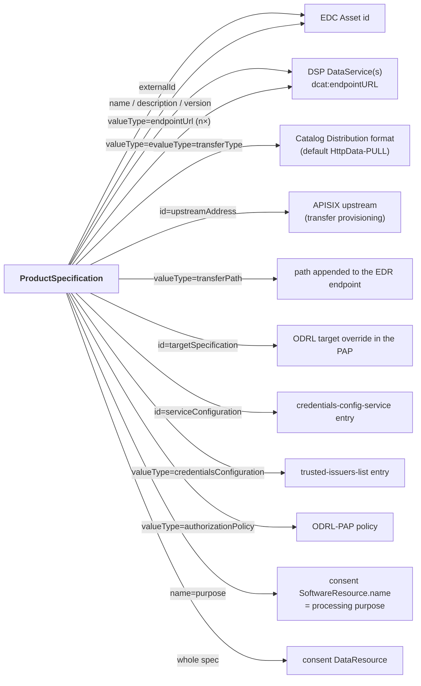
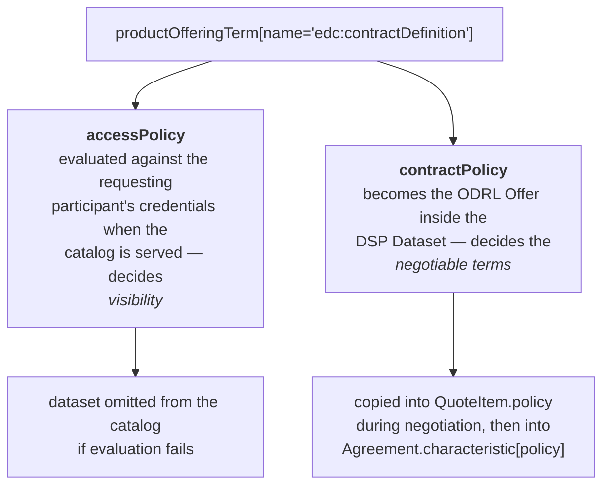

# Entity reference

For each TMForum entity used by the DSC: what it means in a data space, which fields carry meaning,
and which component writes or reads them.

Legend: **▲** = writes, **▼** = reads.
Components: `BAE` = business-ecosystem-logic-proxy, `CM` = contract-management,
`EDC` = fdsc-edc `tmf-extension` / `fdsc-transfer-extension`, `CF` = consent-facade.

---

## Organization

*TMF632 Party — `/tmf-api/party/v4/organization`*

**Meaning: a data space participant.** The bridge between the TMForum world (opaque
`urn:ngsi-ld:organization:…` ids) and the identity world (DIDs). Every component that has to turn a
TMForum reference into something the IAM understands goes through this entity.

| Field | Meaning | Used by |
|---|---|---|
| `id` | TMForum participant reference, used in every `relatedParty`/`engagedParty` | all |
| `name` | Legal name | ▼CF (`legalName`), ▲API-created orgs |
| `tradingName` | Legal name fallback | ▲BAE, ▼CF |
| `partyCharacteristic[name="did"].value` | **The participant's DID** | ▲API/demo, ▲EDC, ▼CM, ▼EDC, ▼CF |
| `partyCharacteristic[name="contractManagement"].value` | Object `{address, clientId, scope[]}` — where to reach *this* participant's contract-management (central-marketplace delegation) | ▲provider onboarding, ▼CM |
| `partyCharacteristic[name="country"].value` | Country, normalised | ▲BAE |
| `externalReference[externalReferenceType="idm_id"].name` | IdM identity. BAE stores the login identity here; for VC login that is the **credential issuer DID** | ▲BAE, ▼CM (as a DID, if it matches `did:*`), ▼BAE (as display name) |
| `organizationIdentification[].identificationId` | Registration number | ▼CF |
| `contactMedium[].characteristic.country` | Country → `legalPerson.legalAddress.countryCode` | ▼CF |

**DID resolution differs per component** — this is a live incompatibility, see
[`differences.md#4-participant-identity-two-places-for-the-did`](./differences.md#4-participant-identity-two-places-for-the-did):

| Component | Looks for the DID in |
|---|---|
| CM (`OrganizationResolver`) | `externalReference[idm_id].name` **first**, then `partyCharacteristic[did].value`; both validated with `did:*:*` |
| EDC (`ParticipantResolver`) | `partyCharacteristic[did].value` **only** — and *creates* an organization if not found |
| CF (`OrganizationSelfDescriptionMapper`) | `partyCharacteristic[<facade.party.did-characteristic>]`, default `did` |

Sources: `contract-management: .../tmforum/OrganizationResolver.java`,
`fdsc-edc: tmf-extension/.../tmf/ParticipantResolver.java` + `OrganizationApiClient.java`,
`consent-facade: .../mapping/OrganizationSelfDescriptionMapper.java`,
`business-ecosystem-logic-proxy: lib/auth.js` + `lib/tmfUtils.js`.

---

## Category and Catalog

*TMF620 Product Catalog — `/category`, `/catalog`*

**Meaning: marketplace taxonomy.** They organise the catalog a human browses. **No DSC backend
consumes them**: the DSP catalog fdsc-edc serves is computed from `ProductSpecification` ×
`ProductOffering` alone, and contract-management's activation path never looks at them.

| Field | Meaning | Used by |
|---|---|---|
| `Catalog.name`, `Catalog.lifecycleStatus` | Catalog identity and lifecycle validation | ▲▼BAE |
| `Catalog.category[].id` | The categories a catalog exposes; BAE injects the catalog's first category into every offering created under it | ▲▼BAE |
| `Category.isRoot` / `parentId` / `name` | Category tree; root categories must not carry a `parentId`, non-root must, and duplicate names per level are rejected | ▲▼BAE |
| `ProductOffering.category[].id` | Placement of an offering in the taxonomy; de-duplicated by BAE on write | ▲▼BAE |

Practical consequence: an offering authored for the DSP path needs **no** category, and adding one has
no effect on the DSP catalog. Conversely a purely taxonomic change in BAE never invalidates a DSP
offering.

---

## ProductSpecification

*TMF620 Product Catalog — `/productSpecification`*

**Meaning: the data product itself.** This is the single richest entity in the DSC model: it is
simultaneously the EDC **Asset**, the DSP **dataset**, the target of ODRL authorization policies, the
source of the credential configuration, the transfer provisioning descriptor and (with consent
enabled) the consent **DataResource** and **purpose** carrier.

### Standard fields with meaning

| Field | Meaning | Used by |
|---|---|---|
| `id` | Referenced from `ProductOffering.productSpecification.id` | all |
| `name` | EDC asset name; consent `DataResource.name`; purpose fallback | ▼EDC, ▼CF |
| `description` | EDC asset description; consent `DataResource.description` | ▼EDC, ▼CF |
| `version` | EDC asset version; BAE requires a version bump to change characteristics of a *digital* product | ▼EDC, ▲▼BAE |
| `lifecycleStatus` | BAE lifecycle (`Active` → `Launched`); launching requires referenced service/resource specs to be `Launched` too | ▲▼BAE |
| `relatedParty[].role` | Provider identification — **two different role strings**, see below | ▲BAE, ▼CM |
| `productSpecCharacteristic[]` | **The configuration plane** — see [`extensions.md`](./extensions.md) | all |

### Extension property

| Field | Meaning | Schema |
|---|---|---|
| `externalId` | **The EDC asset id / DSP dataset id.** An *opt-in marker*: its presence declares the specification DSP-negotiable | `external-id.json` |

`externalId` is a back-reference into the DSP world and is **not** part of the general FDSC model — a
specification without it is simply not DSP-negotiable. `fdsc-edc` treats it that way: a specification
with no `externalId` (or no `upstreamAddress` characteristic) yields `Optional.empty()` and is
skipped, not rejected (`TMFEdcMapper.assetFromProductSpec`). Nothing outside the DSP path reads it.

### `relatedParty` roles

| Role | Written by | Read by | Purpose |
|---|---|---|---|
| `provider` (configurable: `general.organization.provider.role`) | provider onboarding (API) | CM `PolicyResolver` / `CredentialsConfigResolver` | resolve which participant's contract-management is responsible (local vs. remote) |
| `Seller` / `SellerOperator` (configurable: `BAE_LP_OAUTH2_SELLER_ROLE`, DSC value `seller`) | **BAE, replacing whatever the client sent** | BAE ownership checks | marketplace ownership |

Sources: `contract-management: .../tmforum/PolicyResolver.java`, `.../CredentialsConfigResolver.java`;
`fdsc-edc: tmf-extension/.../store/TMFEdcMapper.java`;
`business-ecosystem-logic-proxy: lib/tmfUtils.js` (`attachPartySpec`).

### The specification in each projection



---

## ProductOffering

*TMF620 Product Catalog — `/productOffering`*

**Meaning: the contract definition.** The specification says *what* the data product is; the offering
says *under which policies and to whom* it is available.

| Field | Meaning | Used by |
|---|---|---|
| `id` | Referenced from `QuoteItem.productOffering`, `ProductOrderItem.productOffering`, `Agreement.agreementItem.productOffering` | all |
| `externalId` *(extension, `external-id.json`)* | **The EDC contract-definition id**; also the DSP offer id prefix. *Opt-in marker* — an offering without it is skipped by the DSP catalog, not rejected | ▲provider, ▼EDC |
| `productSpecification.id` | The asset this offering sells. BAE **requires** it on non-bundle offerings and treats it as immutable | ▲provider/BAE, ▼all |
| `productOfferingTerm[name="edc:contractDefinition"]` *(extension, `contract-definition.json`)* | **`accessPolicy` + `contractPolicy`** — the two ODRL policies the EDC needs | ▲provider, ▼EDC |
| `category[].id` | Marketplace taxonomy placement | ▲provider/BAE, ▼BAE |
| `productOfferingPrice[].id` | Price, for the marketplace charging path | ▲▼BAE |
| `lifecycleStatus` | BAE lifecycle | ▲▼BAE |
| `isBundle` / `bundledProductOffering[]` | BAE bundles: a bundle must not carry a `productSpecification` and needs ≥ 2 bundled offerings; all three fields are immutable after creation | ▲▼BAE |
| `isSellable` | BAE / marketplace | ▲▼BAE |
| `relatedParty[]` | **Completely replaced by BAE** with `Seller` + operator entries | ▲BAE |
| `@schemaLocation` | **Overwritten by BAE** with the DOME `ExternallyBilled` schema on every write it proxies | ▲BAE, required by EDC for `externalId` |

The two policies on the offering term have distinct jobs:



Each policy must carry an `odrl:uid` — fdsc-edc derives the EDC access/contract policy *definition
ids* from it (`TMFEdcMapper.getIdFromPolicy`, reading the expanded
`http://www.w3.org/ns/odrl/2/uid` property) and throws `Policy does not contain a uid.` otherwise.

An offering without an `edc:contractDefinition` term is silently skipped by the EDC catalog
(`getContractDefinitionTerm` returns empty → `Optional.empty()`), which is the intended way to keep
non-DSP offerings out of the DSP catalog.

---

## ProductOfferingPrice

*TMF620 Product Catalog — `/productOfferingPrice`*

**Meaning: the price.** Referenced from `ProductOffering.productOfferingPrice[]` and consumed by the
marketplace's charging and billing path (`priceType` `oneTime`/`recurring`,
`recurringChargePeriodType`, `recurringChargePeriodLength`, `price.value`, `price.unit`).

The DSP path ignores it: neither the catalog, the negotiation nor the agreement carries price
information. A consumer-proposed price can be recorded on `QuoteItem.quoteItemPrice[]`, but no
component currently reads it.

---

## Quote / QuoteItem

*TMF648 Quote — `/tmf-api/quote/v4/quote`*

**Meaning: the contract negotiation.** `Quote` is fdsc-edc's `ContractNegotiationStore`: an EDC
`ContractNegotiation` *is* a set of TMForum quotes, and the negotiation's authoritative state lives in
the `contractNegotiation` extension object.

### Standard fields

| Field | Meaning |
|---|---|
| `externalId` | **The EDC `ContractNegotiation` id** — written at creation, and the lookup key (`?externalId=`) |
| `quoteDate` | **Ordering key.** A negotiation may have several quotes; the newest one represents its current state (`TMFEdcMapper.getNewest`) |
| `state` (`QuoteStateType`) | A coarse mirror of the EDC state (`inProgress` / `approved` / `accepted` / `cancelled`), used for the `?state=` filter. The truth is in `contractNegotiation.state` |
| `relatedParty[].role` | `Provider` **and** `Consumer` — both required. Matching the local participant DID against these types the negotiation as PROVIDER or CONSUMER and identifies the counter-party |
| `quoteItem[]` | One item per EDC `ContractOffer` |
| `quoteItem[].productOffering.id` | The offered `ProductOffering` — set on the **provider** side only (a consumer does not know the provider's TMForum ids) |
| `quoteItem[].action` | Always `add` |
| `quoteItem[].state` | The negotiation state string at the time the item was written |
| `quoteItem[].quoteItemPrice[]`, `.note[]` | Available for commercial negotiation; not read by any component today |

### Extension properties

| Field | Schema | Meaning |
|---|---|---|
| `contractNegotiation` | `contract-negotiation.json` | the full EDC negotiation state (below) |
| `quoteItem[].externalId` | `quote-item.json` | the DSP **offer id** |
| `quoteItem[].datasetId` | `quote-item.json` | the DSP **dataset id** (= `ProductSpecification.externalId`) |
| `quoteItem[].policy` | `quote-item.json` | the offered/agreed ODRL policy, **expanded JSON-LD**, as an object |

`contractNegotiation` object:

```jsonc
{
  "controlplane": "<id of the EDC instance>",   // which control plane owns this negotiation
  "state": "REQUESTED",                          // EDC ContractNegotiationStates name — authoritative
  "isPending": false,
  "isLeased": false,                             // distributed lease, see platform.md
  "correlationId": "<counter-party PID>",
  "counterPartyAddress": "https://…/api/dsp/2025-1"
}
```

(`leasedBy` and `leaseExpiry` exist in the Java model `ContractNegotiationState` but are not part of
the published JSON schema.)

State mapping to and from the EDC is in
[`lifecycles.md#2-contract-negotiation`](./lifecycles.md#2-contract-negotiation).

---

## ProductOrder / ProductOrderItem

*TMF622 Product Ordering — `/productOrder`*

**Meaning: the commercial acquisition — and the activation trigger.** A `ProductOrder` reaching state
`completed` is what makes the DSC hand out credentials and policies. It is the one entity two
independent producers write.

| Field | Meaning | Used by |
|---|---|---|
| `id` | Used as the ODRL-PAP policy scope and the order-event `orderId` | ▲BAE/EDC/API, ▼CM |
| `state` (`ProductOrderStateType`) | `completed` ⇒ activate. Anything else on a state change ⇒ deactivate. `rejected` on create ⇒ ignore | ▲BAE/EDC, ▼CM |
| `relatedParty[].role` | **The customer.** CM needs exactly one party whose role matches `general.productOrder.customerRole` (default `Customer`, matched case-insensitively) | ▲BAE (DSC value `customer`), ▲EDC (`Consumer`+`Customer`+`Provider`), ▼CM |
| `quote[]` | Reference to the negotiation. Presence switches CM's *create* handling from "activate" to "negotiation" | ▲EDC/API, ▼CM, ▼EDC (`?quote.id=`) |
| `productOrderItem[]` | Ordered items. Required by BAE; **absent** on EDC-created orders | ▲BAE, ▼CM (fallback when no quote) |
| `productOrderItem[].action` | `add`/`modify` are considered; others skipped | ▼CM |
| `productOrderItem[].productOffering.id` | The ordered offering → credential/policy configuration | ▼CM |
| `productOrderItem[].product.relatedParty[]` | BAE injects customer + seller here so the inventory sees them | ▲BAE |
| `productOrderItem[].state` | BAE computes the order `state` from the item states | ▲▼BAE |
| `billingAccount.id` | **Mandatory in BAE** (422 otherwise); never set by EDC or the API demo flows | ▲▼BAE |
| `agreement[]` | Standard back-reference to an `Agreement`. **No component writes or reads it today** — fdsc-edc links the two the other way round, via `Agreement.agreementItem` | – |

BAE's order-state derivation (`controllers/tmf-apis/ordering.js`): all items `completed` ⇒
`completed`; all `cancelled` ⇒ `cancelled`; all `failed` ⇒ `failed`; a mix of terminal states ⇒
`partial`; any `inProgress`/terminal ⇒ `inProgress`; else `acknowledged`. Customers may only patch
the order to `cancelled`, and only while every item is `acknowledged`.

---

## Agreement / AgreementItem

*TMF651 Agreement — `/tmf-api/agreementManagement/v4/agreement`*

**Meaning: the concluded contract.** Written exclusively by fdsc-edc, as the projection of an EDC
`ContractAgreement`; read exclusively by the consent-facade.

| Field | Value |
|---|---|
| `externalId` *(extension, `agreement.json`)* | **DSP-only.** The EDC `ContractAgreement` id |
| `negotiationId` *(extension, `agreement.json`)* | **DSP-only.** The EDC `ContractNegotiation` id |
| `agreementType` | `dspContract` |
| `name` | `DSP Contract between <providerId> - <consumerId> for <assetId>.` |
| `status` | `inProcess` → `agreed` / `rejected` |
| `engagedParty[]` | exactly two: role `Consumer` and role `Provider` (TMForum organization ids) |
| `characteristic[name="asset-id"]` | the EDC asset id (= `ProductSpecification.externalId`) |
| `characteristic[name="provider-id"]` | provider **DID** |
| `characteristic[name="consumer-id"]` | consumer **DID** |
| `characteristic[name="policy"]` | the agreed ODRL policy, **expanded JSON-LD** |
| `characteristic[name="signing-date"]` | epoch seconds |
| `agreementItem[].productOffering[].id` | the offering the agreement is about |
| `agreementItem[].productItem[].id` | the `Product` (inventory) id, set when the negotiation finalises (replacing the earlier reference) |

Lookups: `?externalId=<contractId>` (`findByContractId`) and `?negotiationId=<negotiationId>`
(`findByNegotiationId`).

`externalId` and `negotiationId` are DSP back-references and are **required only by
`agreement.json`**, i.e. only for agreements that declare that schema. Everything the consent
projection needs — the five characteristics, the engaged parties, `status` and `agreementItem` — lives
in standard TMF651 fields, so an agreement written by a non-DSP producer needs neither the extension
properties nor an `@schemaLocation`.

The consent-facade reads exactly this shape
(`TMForumBackedRepository.AgreementCharacteristic`, `EngagedPartyRole`) and resolves the catalog graph
through `agreementItem[].productOffering[] → ProductOffering.productSpecification` **and**
`agreementItem[].product[] → Product.productSpecification`, de-duplicating by specification id.

---

## Product

*TMF637 Product Inventory — `/tmf-api/productInventory/v4/product`*

**Meaning: the materialised entitlement.** Created by fdsc-edc when a negotiation finalises: one
`Product` per (agreement × asset), representing "this consumer now holds this asset under this
contract".

| Field | Value |
|---|---|
| `externalId` *(extension, `external-id.json`)* | `<contractAgreementId>-<ASSETID>` — note the asset id is **upper-cased** (`String.format("%s-%S", …)`) |
| `status` | `ACTIVE` |
| `relatedParty[]` | role `Provider` and role `Consumer` (TMForum ids) |
| `productOffering.id` | set **on the provider side only** (the consumer does not know the provider's offering id) |
| `productSpecification` | followed by CF to reach the `DataResource` |

Referenced back from `Agreement.agreementItem[].productItem[].id` and from
`Usage.ratedProductUsage[].productRef.id`.

---

## Usage

*TMF635 Usage Management — `/tmf-api/usageManagement/v4/usage`*

**Meaning: a DSP transfer process — modelled, but not wired.**

> ⚠️ **Nothing writes `Usage` today.** `fdsc-edc` carries the full model for it — the
> `ExtendableUsage*VO` classes, the `usage.json` schema, the `usageManagementApi` config (which
> `TMFConfig` even *requires* when the extension is enabled) and the `TMFEdcMapper.fromTransferProcess`
> mapping — but there is **no `UsageApiClient` and no `TransferProcessStore` implementation
> registered**, and nothing calls the mapper. EDC transfer processes therefore still live in the EDC's
> own store. The description below is the intended shape, useful when the store is implemented, not
> current behaviour. The BAE charging backend is separately configured against the Usage API
> (`bizEcosystemApis.tmForum.usage`) for commercial usage records.

| Field | Value (intended) |
|---|---|
| `externalId` *(extension, `usage.json`)* | the EDC `TransferProcess` id |
| `transferState` *(extension, `usage.json`)* | the EDC `TransferProcessStates` name (`INITIAL` … `DEPROVISIONED`) |
| `usageType` | `dspTransfer` |
| `status` | `received` while `state < STARTED`, then `rated` |
| `ratedProductUsage[].productRef.id` | the `Product` this transfer belongs to (only once rated) |
| `usageCharacteristic[]` | name/value pairs: `asset-id`, `correlation-id`, `protocol`, `counter-party-address`, `transfer-type`, `type` (`CONSUMER`/`PROVIDER`), `contract-id`, `resource-manifest`, `dataplane-id`, `content-data-address` |

Nothing in the DSC reads `Usage`. The intent is that the EDC control plane becomes stateless and that
transfers become reportable/billable through standard TMForum tooling; both are still open.

---

## BillingAccount

*TMF666 Account — `/tmf-api/account/v4/billingAccount`*

**Meaning: the billing target.** Purely a BAE concern: `ordering.js` returns `422 Billing Account is
required` when `billingAccount.id` is missing and verifies the account exists and belongs to the
customer. Orders created by fdsc-edc or by the raw-API demo flows have no billing account — which is
fine for the TMForum API but makes those orders invalid from BAE's point of view (see
[`differences.md#7-productorder-three-incompatible-minimum-shapes`](./differences.md#7-productorder-three-incompatible-minimum-shapes)).

---

## Entity ownership summary

| Entity | BAE | CM | EDC | CF |
|---|---|---|---|---|
| Organization | ▲▼ | ▼ | ▲▼ | ▼ |
| Category / Catalog | ▲▼ | – | – | – |
| ProductSpecification | ▲▼ | ▼ | ▼ | ▼ |
| ProductOffering | ▲▼ | ▼ | ▼ | ▼ |
| ProductOfferingPrice | ▲▼ | – | – | – |
| Quote / QuoteItem | ▼ | – | ▲▼ | – |
| ProductOrder | ▲▼ | ▼ | ▲▼ | – |
| Agreement | – | – | ▲▼ | ▼ |
| Product | ▲ (charging backend) ▼ | – | ▲ | ▼ (optional path) |
| Usage | (charging backend ▲) | – | *modelled, not wired* | – |
| BillingAccount | ▲▼ | – | – | – |

Note that **contract-management does not write TMForum at all**: it reads the order, the quote, the
offering, the specification and the organization, and writes only to the trusted-issuers-list, the
ODRL-PAP and remote contract-management instances.
