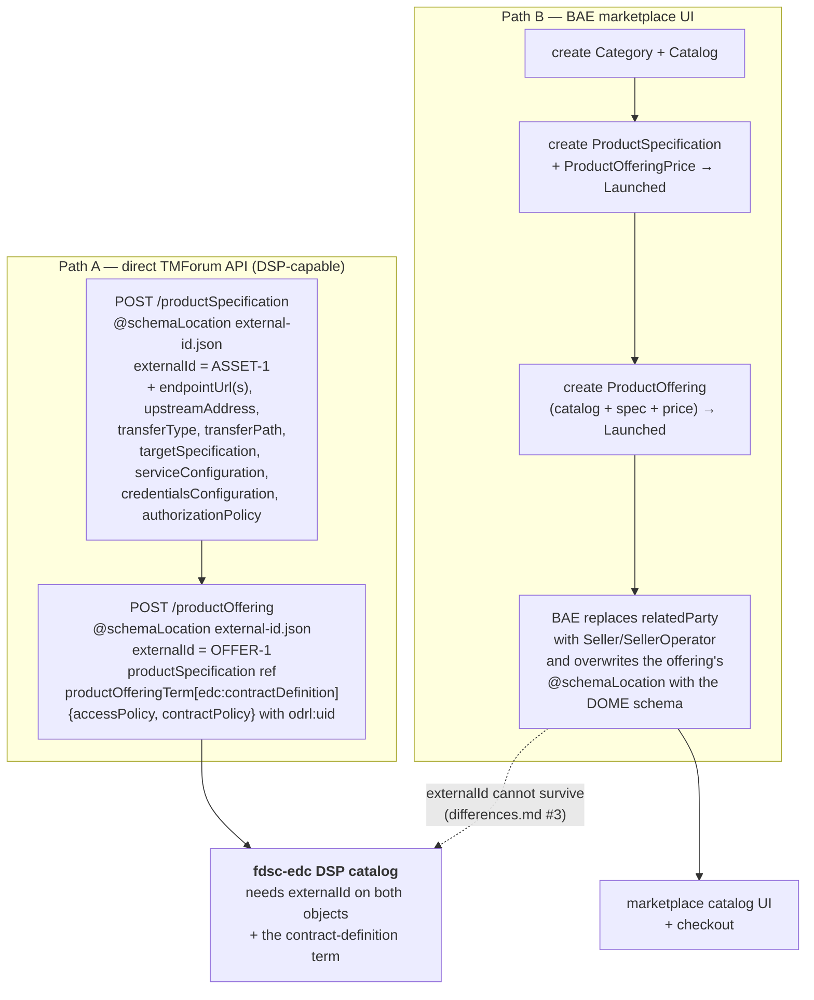
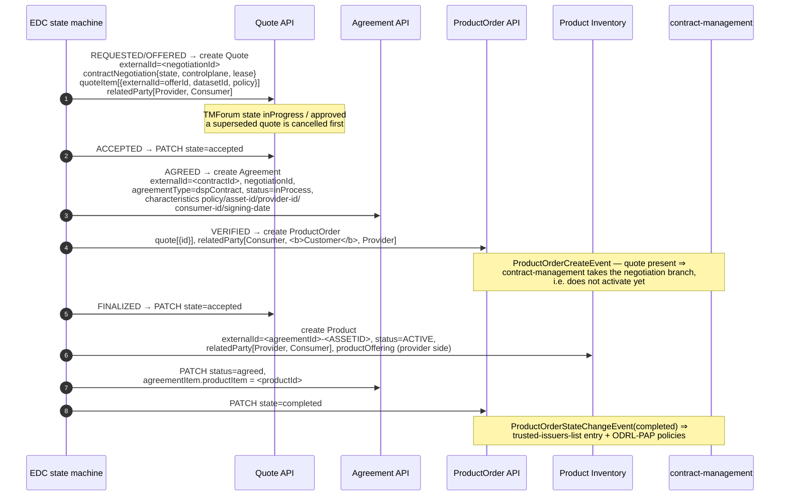
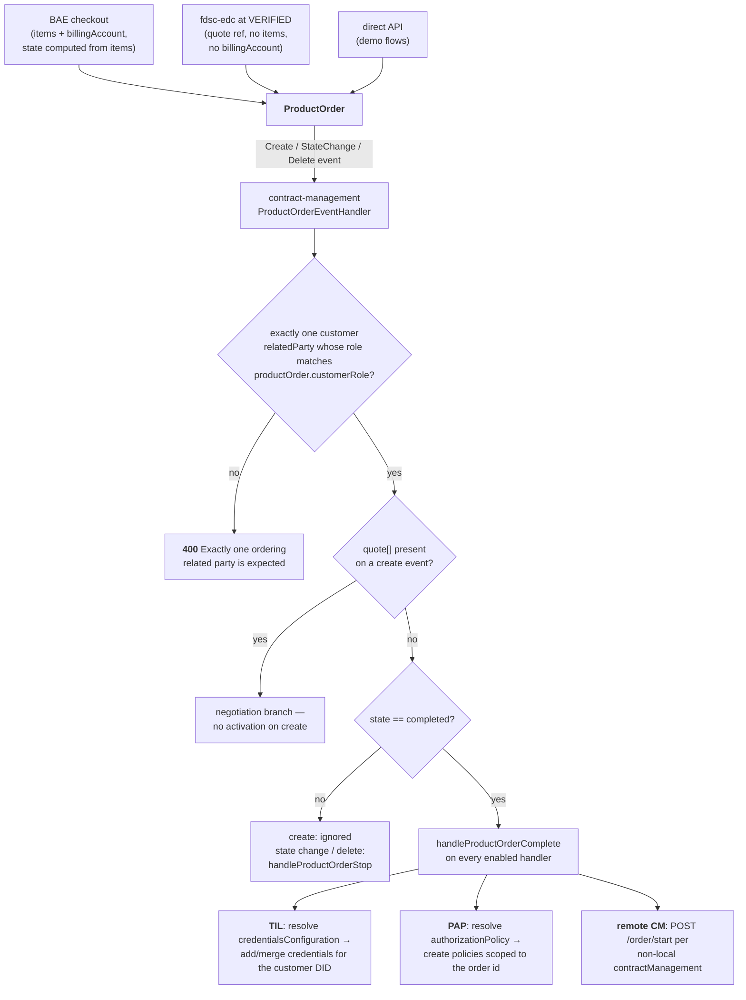
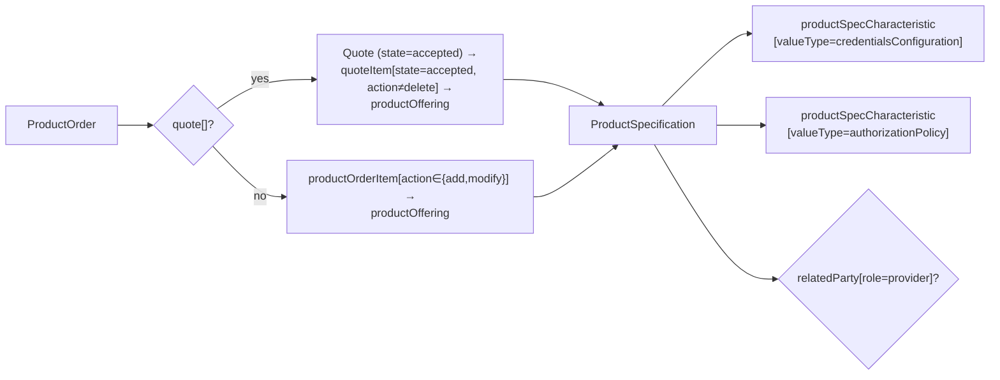
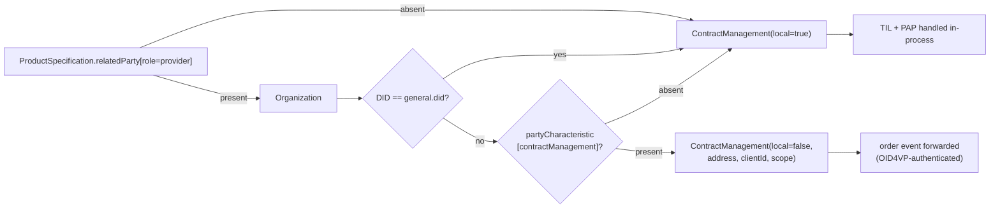
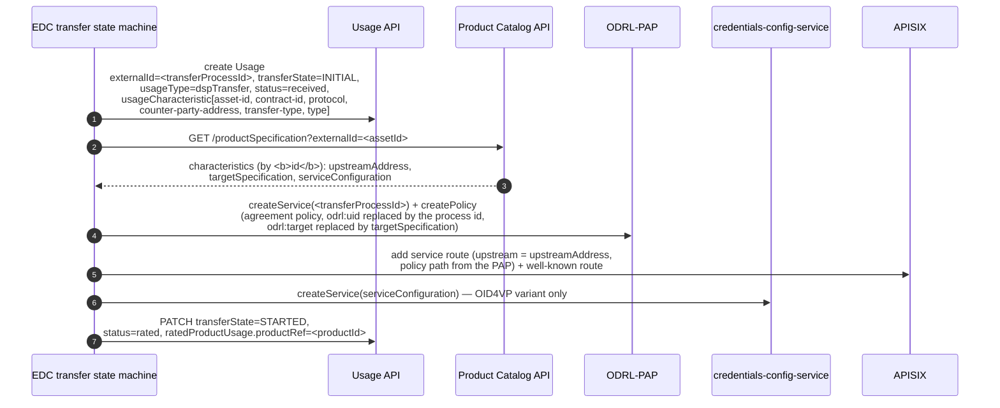

# Lifecycles and flows

How the entities come into existence and move through their states. Four flows:
catalog publication, contract negotiation, order activation, transfer.

---

## 1. Catalog publication

The provider authors the product. Two authoring paths exist and they produce **different** objects.

There is no publication *event* to react to: the DSP catalog is not materialised anywhere. fdsc-edc
computes it on every DSP catalog request, so a change to a specification or offering is visible
immediately, and an object that stops satisfying the requirements simply disappears from the catalog.

Categories and catalogs matter only for the marketplace UI — see
[`entities.md#category-and-catalog`](./entities.md#category-and-catalog).

---

## 2. Contract negotiation

The EDC state machine drives; TMForum stores. `Quote` is the negotiation record, and the
`contractNegotiation` extension object carries the authoritative state.

State mapping — the EDC state name is stored verbatim in `contractNegotiation.state`, and mirrored
onto the TMForum `Quote.state`:

| EDC `ContractNegotiationStates` | `Quote.state` | Other TMForum effect |
|---|---|---|
| `INITIAL`, `REQUESTING`, `REQUESTED` | `inProgress` | – |
| `OFFERING`, `OFFERED` | `inProgress` → `approved` | – |
| `ACCEPTING`, `ACCEPTED` | `accepted` | – |
| `AGREEING`, `AGREED` | `accepted` | Agreement created (`inProcess`) |
| `VERIFYING`, `VERIFIED` | `accepted` | ProductOrder created |
| `FINALIZING`, `FINALIZED` | `accepted` | Product created; Agreement `agreed`; Order `completed` |
| `TERMINATING`, `TERMINATED` | `cancelled` | Order `cancelled`; Agreement `rejected` |

Two properties of this mapping are worth remembering:

* **A negotiation can have several quotes.** A re-offer cancels the superseded quote and creates a new
  one with the same `externalId`; the quote with the newest `quoteDate` is authoritative
  (`TMFEdcMapper.getNewest`). Do not assume `?externalId=<id>` returns a single object.
* **Every step is compensated.** Each transition touches two to four entities, and TMForum has no
  transactions, so `TMFTransactionContext` registers a compensating action per write: a created quote
  is cancelled, an agreement's status reverted, an order's state restored
  (`fdsc-edc: TRANSACTION_README.md`).

Worked example with the corresponding DSP calls: [`../DSP_INTEGRATION.md`](../DSP_INTEGRATION.md).

---

## 3. Order activation

The `ProductOrder` is the universal activation trigger, regardless of who created it.

Deactivation is symmetric: any state change away from `completed`, or a delete event, calls
`handleProductOrderStop` → remove the credentials from the trusted-issuers-list, delete the PAP
policies for that order id, `POST /order/stop` to remote contract-managements.

Where the configuration comes from — the resolution walk:

`local` vs. `remote` is decided per resolved configuration, and each handler filters accordingly:

---

## 4. Transfer

Once an agreement exists, the consumer starts a DSP transfer. TMForum's role here is `Usage` as the
transfer-process store plus the `ProductSpecification` as the provisioning descriptor.

Note the deliberate re-identification: the agreement's policy is installed in the PAP under the
**transfer-process id**, not its original `odrl:uid`, so several concurrent transfers of the same
asset do not collide.

> ⚠️ The two `Usage` steps above are the **intended** design, not current behaviour: `fdsc-edc` has
> the `Usage` model, schema and mapper but no API client and no registered `TransferProcessStore`
> implementation, so transfer state is not persisted to TMForum today. Everything else in this
> sequence — the specification lookup, the PAP service and policy, the APISIX routes and the
> credentials-config-service entry — is wired.
