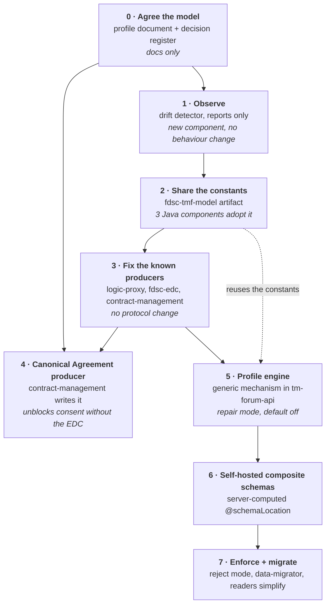

# Plan: from a described model to an enforced, agreed model

This document set describes what the TMForum model in the FIWARE Data Space Connector *is* today,
including the [divergences](./differences.md) between the components. This page is the plan to turn
that description into a **normative model that is agreed by the component owners and enforced by the
platform**.

It is deliberately sequenced so that value arrives before the expensive parts, and so that nothing
becomes enforcing until the deployments have been measured against it.

## The end state

1. One **normative profile document**, versioned in this repository, that says what a conformant
   FDSC TMForum entity looks like.
2. Every component **reads** tolerantly and **writes** canonically, sharing one artifact for the
   constants and accessors instead of duplicating string literals.
3. `tm-forum-api` carries a **generic, configuration-driven profile engine** that normalizes and
   (eventually) rejects on the write path, so conformance cannot be bypassed.
4. The existing entity backlog is **migrated**, after which readers can drop their fallback chains.

## Sequence

Phases 1–4 are achievable inside the existing repositories with no upstream design review. Phase 5 is
the one that needs `tmforum-api` maintainer buy-in, which is why the profile document (phase 0) and
the measured drift (phase 1) come first: they are the evidence that carries the proposal.

---

## Phase 0 — Agree the model

Nothing can be enforced before it is written down normatively. Today the model exists only as
behaviour spread over five code bases.

**Deliverable:** `doc/tmforum/profile/fdsc-tmf-profile-1.0.yaml` in this repository — machine-readable,
human-reviewable, referenced from [`MODLE.md`](./MODLE.md) — plus the decision register below,
resolved.

| | |
|---|---|
| **Components touched** | none (documentation only). `doc/tmforum/*` gains the profile and this plan. |
| **Owners who must sign off** | FIWARE (`tmforum-api`, `contract-management`), FIWARE-TMForum (`business-ecosystem-logic-proxy`), SEAMWARE (`fdsc-edc`), `wistefan` (`consent-facade`) |
| **What might break** | nothing technically. The risk is social: an unratified profile that one owner ignores is worse than no profile, because phases 2–7 all assume it. Get explicit written agreement per decision, not tacit approval. |

### Decision register

Each row is a decision that must be *made*, not discovered. The proposed column is my recommendation
with the rationale from [`differences.md`](./differences.md); it is a starting position, not a
conclusion.

| # | Decision | Proposed | Rationale / consequence |
|---|---|---|---|
| D1 | Authoritative characteristic discriminator | **`valueType`**; authors set `id` == `valueType` as well; readers fall back `valueType` → `id` → `name` | Two JSON schemas already pin `valueType` with `const`. Keeps every current reader working. |
| D2 | Data-space roles vs. marketplace roles | **Do not unify them.** `Provider`/`Consumer`/`Customer` are data-space roles; `Seller`/`Buyer`/`*Operator` are commercial roles. Both coexist on the same entity | `Seller ≠ Provider` semantically (an agent may sell on behalf of another party). Forcing one vocabulary loses information; requiring BAE to *additionally* stamp the data-space role costs nothing and fixes #2b. |
| D3 | Role matching | case-insensitive everywhere; readers accept a declared synonym set | Removes the `oauth.customerrole` landmine (#2a) permanently. |
| D4 | Canonical DID location | **`partyCharacteristic[name="did"]`**; `externalReference[externalReferenceType="idm_id"].name` is a read-only fallback | The only location all three readers can already handle if they widen. |
| D5 | DID uniqueness | one `Organization` per DID, enforced | Without this, phase 5 normalizes duplicates instead of preventing them (#4). |
| D6 | Canonical `Agreement` shape | the **standard-field** set only: `characteristic[policy\|asset-id\|provider-id\|consumer-id\|signing-date]`, `engagedParty[Provider\|Consumer]`, `status`, `agreementItem`. `externalId` / `negotiationId` are **DSP-only** and stay out of the canonical set (D12) | It is the shape `consent-facade` already reads, and everything in it is standard TMF651 — so a non-DSP producer needs **no `@schemaLocation` at all**. Note `agreement.json` currently declares `externalId` and `negotiationId` as `required`, so that schema must *not* be used for non-DSP agreements. |
| D7 | `Agreement` ownership | exactly one writer per agreement; `contract-management` writes only when no agreement references the order's quote | Two writers means duplicate contracts in every consent listing. |
| D8 | `isDefault` | exactly one value per characteristic carries `isDefault: true`; readers fall back to the first value | Removes the remaining unboxing hazard and the "which value wins" ambiguity. |
| D9 | Extension schema hosting | this repository, tag-pinned, mirrored by the chart | Two schemas currently resolve from feature branches (`edc-dsc@init`, `contract-management@policy-support`); a branch move silently changes validation everywhere (#9). |
| D10 | Profile versioning | semver, `major` = a rule became enforcing or a canonical location moved; the profile version is advertised by the API | Consumers need to know which rules they may rely on. |
| D11 | Rule action vocabulary | `observe` \| `repair` \| `reject`, per rule, set by deployment | Makes phases 5 and 7 the same code with different configuration. |
| D12 | DSP back-references are opt-in markers | `ProductSpecification.externalId`, `ProductOffering.externalId`, `Quote.externalId`, `QuoteItem.externalId`, `Agreement.externalId`/`negotiationId`, `Product.externalId` and `Usage.externalId` exist so the DSP world can find its own objects. They are **never globally required**; their presence is what *marks* an entity as DSP-relevant, and a consumer must **skip** entities that lack them rather than fail | This is already `fdsc-edc`'s behaviour (`assetFromProductSpec`, `fromProductOffer` and `getContractDefinitionTerm` all return `Optional.empty()` and log at debug/info). The decision exists to *protect* it: without it, the phase-5 engine would be the natural place for someone to make `externalId` mandatory, which would break every non-DSP offering in the catalog. |
| D13 | Rule scoping | every profile rule is scoped by a stated condition — an entity type plus, where relevant, a marker (`has externalId`, `has productOfferingTerm[edc:contractDefinition]`, `has characteristic[credentialsConfiguration]`). Unconditional `required` on an extension property is forbidden by construction | The mechanical consequence of D12. It is what keeps the FDSC profile from turning the general TMForum catalog into a DSP-only catalog. |

---

## Phase 1 — Observe

Measure the drift before changing anything. This is the cheapest phase and it de-risks every later
one, because it converts "these ten divergences exist in the code" into "these N violations exist in
your cluster".

| | |
|---|---|
| **Components touched** | **new:** `fdsc-model-linter` — (a) a batch mode that crawls the TMForum APIs and reports violations per rule, and (b) a live mode that subscribes to the entity hubs (`POST <apiBase>/hub`) and reports as writes happen. **Chart:** an optional deployment in `charts/data-space-connector`, off by default. Nothing else changes. |
| **Changes to agree on** | the report format (so it can be diffed across releases and asserted in CI); which entity hubs to subscribe to — `Agreement`, `Product`, `Usage` and `Organization` have no subscriber today, so these are new subscriptions; whether the linter runs in CI against the `it/` integration environment as a regression gate. |
| **What might break** | Very little by construction — it only reads and reports. Two real costs: each hub subscription is state in `tm-forum-api` that survives restarts and can duplicate (the existing subscriber treats `409 Conflict` as success — the linter must too), and the batch crawl is O(all entities), so it needs paging and a schedule, not a hot loop. |

Suggested first metrics: violations per rule, per writer (derivable from `relatedParty`/`@schemaLocation`
fingerprints), and per entity type. That table is what you take to the `tmforum-api` maintainers in
phase 5.

---

## Phase 2 — Share the constants

`credentialsConfiguration` is currently a string literal in five repositories, and that single fact
is the root of divergence #1 and of the `valueType: "credentialsConfig"` defect in the DSP-enabled
logic-proxy branch.

| | |
|---|---|
| **Components touched** | **new:** `fdsc-tmf-model` (Java 21, Maven) — canonical constants plus *tolerant accessors*: `characteristic(spec, key)` trying `valueType` → `id` → `name`; `value(characteristic)` handling both the bare string and `{"value": …}` forms; `did(organization)` trying both locations; `role(party)` matching case-insensitively against a synonym set. **Adopters:** `contract-management` (`CredentialsConfigResolver`, `PolicyResolver`, `OrganizationResolver`), `fdsc-edc` (`TMFEdcMapper`, `ParticipantResolver`, the transfer provisioners), `consent-facade` (`CatalogMapper`, `OrganizationSelfDescriptionMapper`, `TMForumBackedRepository`). **BAE:** a small JS constants module — Node cannot consume the Java artifact, so the profile document is the shared source of truth and both are generated from it. |
| **Changes to agree on** | where the artifact lives and who releases it (it is consumed by three orgs, so a neutral home and a real release process matter more than the code); whether the constants are *generated* from the profile document (recommended — otherwise you have created a sixth place to drift); the synonym sets, i.e. D2/D3 must be settled first. |
| **What might break** | **This is the phase with the most surprising breakage, and it is not obvious.** Making the readers tolerant changes behaviour in both directions: · `contract-management` currently **NPEs** on a characteristic without `valueType`. After the fix it no longer crashes — and starts *finding* `credentialsConfiguration`/`authorizationPolicy` entries on specs where activation previously aborted. Credentials and ODRL policies that were silently never granted will begin to be granted. That is the correct behaviour, but it is a **live authorization change** and must be rolled out as one, with the phase-1 report used to enumerate the affected specs first. · `fdsc-edc` reading the DID from `externalReference` as well will start *finding* BAE-created organizations instead of creating duplicates — good, but existing duplicates do not disappear, and negotiations already referencing the duplicate keep referencing it. Needs a one-off reconciliation, not just a code change. · `consent-facade` becoming tolerant may surface agreements it previously skipped, changing what a participant sees in their consent list. |

---

## Phase 3 — Fix the known producers

Straightforward defect fixes, no protocol change, each independently shippable. These are the ones
already identified in the code.

| Component | Change | Divergence |
|---|---|---|
| `business-ecosystem-logic-proxy` (portal) | `valueType: "credentialsConfig"` → `"credentialsConfiguration"` in the DSP config form | new defect |
| `business-ecosystem-logic-proxy` (portal) | emit an `endpointDescription` characteristic; use stable `id`s for `endpointUrl` characteristics instead of a fresh UUID (fdsc-edc uses the `id` as the DSP `DataService` id) | new defect |
| `business-ecosystem-logic-proxy` (portal) | set `valueType` for `string`/`number`/`boolean`/`range` characteristics too | #8 |
| `business-ecosystem-logic-proxy` (portal) | do not let `dspCompatible` overwrite the blueprint `@schemaLocation` | #9 |
| `business-ecosystem-logic-proxy` (backend) | `attachOfferingParty`: set `@schemaLocation` only when the body has none | #3 |
| `business-ecosystem-logic-proxy` (backend) | `attachPartySpec`/`attachParty`: **preserve** non-commercial roles instead of replacing the whole list | #2, #3 |
| `business-ecosystem-logic-proxy` (backend) | `buildOrganization`: also write `partyCharacteristic[name="did"]` | #4 |
| `fdsc-edc` | resolve the DID from both locations; accept `upstreamAddress`/`targetSpecification`/`serviceConfiguration` by `valueType` as well as `id` | #1, #4 |
| `contract-management` | null-guard `valueType`; accept role synonyms | #2, #8 |
| `business-ecosystem-logic-proxy` (portal) | offer the **`purpose`** characteristic in the DSP form (name + description, optionally DPV purpose/legal basis) | producer gap |
| `doc/CONSENT_MANAGEMENT.md`, `doc/DSP_INTEGRATION.md` | document `purpose` as part of the DSP-capable specification, not only in the consent demo | producer gap |
| *verification task* | compare `fdsc-edc`'s `Product` with the one the **BAE charging backend** writes (`productSpecification` present? which `relatedParty` roles?) — the charging backend writes straight to `/tmf-api/productInventory/v4`, bypassing the proxy | producer gap |

| | |
|---|---|
| **Changes to agree on** | the interim workaround for #3 while the BAE fix is in review — the DSC can set `BAE_LP_OFFERING_SCHEMA` to a schema that declares both the DOME properties and `externalId` (the subchart already exposes `bizEcosystemLogicProxy.offeringSchema`), which unblocks DSP authoring without a code change; and whether the DSP-enabled fork is the integration target or upstream `master`. |
| **What might break** | **The `relatedParty` merge is a security-relevant change.** BAE's own authorization (`isOwner`, `hasPartyRole`) reads `relatedParty`, and the current replace-everything behaviour is what stops a client from injecting a `Seller` entry and claiming ownership. The fix must preserve BAE's authoritative injection of the commercial roles and only carry over *non-commercial* roles from the request. Merging naively opens a privilege-escalation path — do not let this one be reviewed as a cosmetic change. Beyond that: offering writes that are currently rejected will start succeeding (intended); stable `endpointUrl` characteristic ids change the DSP `DataService` ids, so a consumer that pinned one will need to re-read the catalog. |

---

## Phase 4 — Canonical `Agreement` producer

Consent management currently requires `fdsc-edc`, because it is the only component that writes an
`Agreement`. A marketplace-only data space activates credentials and policies but produces no
contract, so the consent-manager silently builds nothing (#5).

| | |
|---|---|
| **Components touched** | `contract-management`: a new `ProductOrderHandler` that writes the canonical `Agreement` (D6) when an order completes and no agreement references it. `consent-facade`: none, if D6 holds. `charts/data-space-connector`: a feature flag plus the agreement API URL (already configured). |
| **Changes to agree on** | D6, D7 and D12 (shape, single ownership, and that the DSP back-references stay out); the idempotency key — the order id is the natural one, but the EDC keys on the negotiation, so the guard must query both; whether `contract-management` derives `asset-id` from the offering's `productSpecification.externalId` (it can, when present) and `policy` from the offering's `contractPolicy` (it can, but see the breakage note below). |
| **What it does *not* need** | Two dependencies that look necessary and are not. **No `Product`:** `consent-facade` resolves the specification through *either* `agreementItem[].productOffering[]` *or* `agreementItem[].product[]`, so the offering reference alone is sufficient — `contract-management` must not become a third `Product` writer. **No `@schemaLocation`:** everything in the canonical set (D6) is a standard TMF651 field, so there are no unknown properties to validate and `agreement.json` (which requires the DSP back-references) must not be attached. |
| **What might break** | · `contract-management` stops being **read-only** towards TMForum. The TMForum API is OID4VP-protected in the DSC, so its credential now needs write scope on the agreement API and the ODRL-PAP policies guarding `tm-forum-api` need updating. This is an operational change in every deployment, not just a code change. · If the guard is wrong, both the EDC and contract-management write an agreement for the same contract and every participant sees duplicate contracts in their consent list. · A marketplace order has no negotiated policy, so the synthesized agreement's `policy` characteristic is the *offer's* contract policy, not a negotiated one. That is a semantic difference the consent projection will surface — agree explicitly that this is acceptable rather than discovering it in a receipt. |

---

## Phase 5 — Profile engine in `tm-forum-api`

The first phase that makes conformance unbypassable, and the only one that needs upstream agreement.

**Design constraint that decides whether it is accepted:** do not put FDSC semantics into
`tmforum-api`. Add a *generic* capability — "apply this declarative profile to entity type X on
write" — and keep the FDSC rules as a data file shipped by this chart. `tmforum-api` gains a reusable
conformance-profile engine; the DSC keeps ownership of its model.

| | |
|---|---|
| **Components touched** | `tmforum-api/common`: a new `profile` package hooked into `AbstractApiController.getCheckingMono(entity, referencedEntities)` — one seam that already runs before every `create` and `patch` in every API module, with `ReferenceValidationService` already injected beside it. Schema composition hooks into the existing `ValidatingDeserializer` / `BaseMapper`. A config flag (`PROFILE_ENABLED`, off by default) and a profile source (file/URL). `charts/data-space-connector`: mount the profile and set the flag. `charts/*/tests`: helm-unittest coverage for the wiring; `it/`: integration assertions per rule. |
| **Changes to agree on** | **the profile file format** — this is the real design review, and it needs to be expressive enough for the six rule classes (conditional requirements, key canonicalization, mirroring/derivation, cross-entity invariants, schema composition, per-rule action) without becoming a programming language; that **rule scoping is mandatory, not optional** (D13) — the format should make an unconditional `required` on an extension property inexpressible, so the DSP markers cannot leak into a global requirement; the flag name and default; the error contract (violations should surface through the existing `SchemaValidationExceptionHandler` so clients see one consistent 4xx shape, not a new one); whether `repair` mode returns a deprecation warning header. |
| **What might break** | · **CTK conformance.** The per-module TMForum conformance suites send standard payloads; a profile that rejects them breaks the conformance job. Hence default-off, and never enabled in the conformance profile. · **Write latency.** Cross-entity invariants mean broker reads inside the write path — D5 (DID uniqueness) adds a query to every `Organization` write. Needs a caching story (the `common/caching` package exists) and a measured budget. · **Blast radius.** `getCheckingMono` is on the write path of every entity in every module. A bug there breaks the whole TMForum surface, not one feature. This argues for the flag, for the phased action vocabulary (D11), and for the phase-1 linter staying deployed afterwards as an independent check. · **Repair changes payloads behind the client's back**, so a client that reads back its own write will see fields it did not send. Document it as part of the API contract, not as an implementation detail. |

---

## Phase 6 — Self-hosted composite schemas

Removes both the one-slot limitation (#9) and the branch-pinned schema dependency.

| | |
|---|---|
| **Components touched** | `tmforum-api`: serve the composite schema for a given set of extension properties, and compute `@schemaLocation` server-side from the payload's actual content. `fdsc-edc`: `tmfExtension.schemaBaseUri` points at the API instead of GitHub, and the `Extendable*VO` lazy `@schemaLocation` fill-in can be retired. `business-ecosystem-logic-proxy`: stop setting `@schemaLocation` at all. `charts/data-space-connector`: the schema base URL. `doc/tmforum/profile/`: schemas move here, tag-pinned (D9). |
| **Changes to agree on** | whether a client-supplied `@schemaLocation` is *ignored* or *merged* — ignoring it is the clean design and a behavioural break for anything relying on it; the URL and versioning scheme; how air-gapped deployments mirror it (this phase actually makes that easier, since the schemas become local). |
| **What might break** | Every entity already stored carries an old `@schemaLocation` URL, so anything comparing or dereferencing it must tolerate both — including the `BaseMapper` read path, which fetches the schema to reconstruct extension properties. A reader that resolves the old GitHub URL will keep working only as long as those branches exist; that is precisely the fragility being removed, so the migration in phase 7 should rewrite them. |

---

## Phase 7 — Enforce, migrate, simplify

| | |
|---|---|
| **Components touched** | `charts/data-space-connector`: flip rules from `repair` to `reject`, one at a time, guided by the phase-1 report reaching zero for that rule. `tmforum-api/data-migrator`: a profile mode that applies the canonical form to existing entities — the module already implements the read-from-A/write-to-B pattern with a minimum-downtime switchover, which is the right shape for this. Then, and only then: `contract-management`, `fdsc-edc`, `consent-facade` drop their fallback chains, and `consent-facade` gains real pagination and server-side party filtering (#10, enabled by the new query capability). |
| **Changes to agree on** | the order in which rules become enforcing (recommend: null-tolerance and `isDefault` first — they are pure repairs nobody depends on; DID uniqueness last, because it is the only one that can reject a previously legal write); the migration window and who runs it per deployment; a deprecation period per rule announced against the profile version (D10). |
| **What might break** | · Enforcing rejects **any** non-conformant writer still in the wild, including hand-written `curl` in demos and docs — `doc/DSP_INTEGRATION.md`, `doc/CENTRAL_MARKETPLACE.md` and `doc/flows/contract-management/tmf` all contain payloads that must be updated in lockstep. · Migration is a broker-level operation with a write-freeze window; the `data-migrator` pattern needs two brokers and a switchover, so it is a maintenance event, not a rolling upgrade. · Dropping reader fallbacks is irreversible in practice: any un-migrated entity becomes unreadable by that component. Keep the fallbacks until the migration is verified per deployment, and keep the linter running to prove it. |

---

## What this plan deliberately does not do

* **It does not make the profile engine derive policies.** Generating the ODRL-PAP access policy from
  an offering's contract policy (#6) is a semantic decision with real judgement in it — target
  refinement, credential constraints — and belongs in an authoring tool or in
  `contract-management`, not in a normalizer. The engine normalizes *encoding* (compacted ↔ expanded
  JSON-LD) and nothing more.
* **It does not relax BAE's own validators.** `billingAccount.id` and the `productOrderItem`
  requirements (#7) run upstream of `tm-forum-api`, so no facade can affect them. Making
  DSP-negotiated orders visible in the marketplace back-office is a separate BAE change: accept
  orders whose items are derivable from a `quote` reference.
* **It does not unify the role vocabularies.** D2 keeps commercial and data-space roles as distinct
  concepts that coexist. Collapsing them would be simpler to enforce and would lose information.
* **It does not make `contract-management` create `Product`s.** Inventory belongs to whoever *fulfils*
  an order — the BAE charging backend for a checkout, `fdsc-edc` for a DSP negotiation.
  `contract-management` is a reactor; a third writer would duplicate entitlements. See the
  [producer/consumer appendix](./differences.md#appendix-producer-and-consumer-gaps).
* **It does not require the DSP back-references from anyone but the DSP.** D12/D13 exist to make that
  impossible to do by accident once the engine is in place.
* **It does not put a standalone proxy in front of the API.** A facade that components can be
  configured around is not an enforcement point; the in-API engine of phase 5 is the same idea
  without the bypass, and it is the only place that can add the server-side query capability phase 7
  depends on.

## Effort and dependency summary

| Phase | Blocking dependency | Needs upstream agreement | Enforcing? |
|---|---|---|---|
| 0 · Agree the model | — | **yes** (all five owners) | no |
| 1 · Observe | 0 (draft is enough) | no | no |
| 2 · Share the constants | 0 (D1–D4, D8) | artifact home only | no |
| 3 · Fix the producers | 0, 2 | BAE PR review | no |
| 4 · Canonical `Agreement` | 0 (D6, D7), 3 | no | no |
| 5 · Profile engine | 0, 1, 2 | **yes** (`tmforum-api`) | repair only |
| 6 · Composite schemas | 5 | **yes** (`tmforum-api`) | no |
| 7 · Enforce + migrate | 5, 6 | per-deployment | **yes** |

The first three phases are worth doing even if phase 5 is never accepted upstream: they remove the
duplicated string literals, the NPE class, the duplicate-organization class and the offering-schema
rejection, which is most of the observed pain. Phases 5–7 are what make the model a guarantee rather
than a convention.
