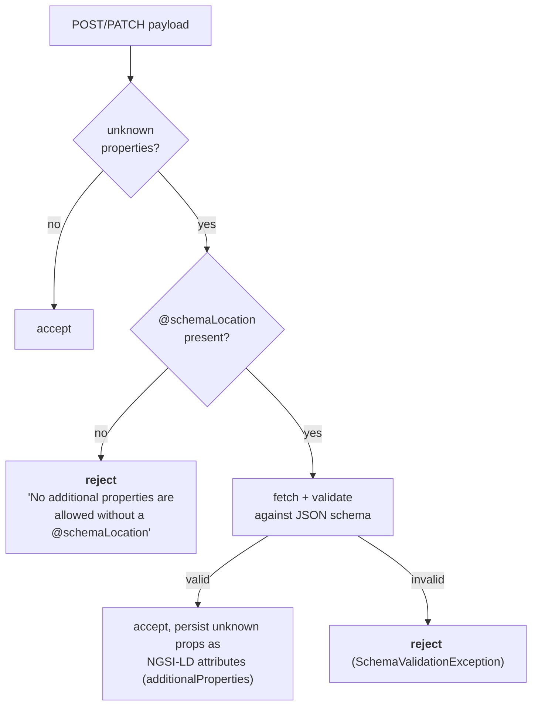

# The platform: what `tm-forum-api` actually allows

Everything documented in this set is constrained by the capabilities of
[FIWARE/tmforum-api](https://github.com/FIWARE/tmforum-api), the implementation the DSC deploys
(subchart `tm-forum-api`). This page collects the platform-level facts that the data model depends
on.

## API surface and versions

All APIs are **TMForum v4**. Base paths are fixed by the implementation (module `pom.xml`
`module.ctk.base-path`) and are what every component hard-codes:

| API | TMForum spec | Base path | Used for |
|---|---|---|---|
| Product Catalog | TMF620 | `/tmf-api/productCatalogManagement/v4` | `catalog`, `category`, `productSpecification`, `productOffering`, `productOfferingPrice` |
| Party | TMF632 | `/tmf-api/party/v4` | `organization`, `individual` |
| Quote | TMF648 | `/tmf-api/quote/v4` | `quote` |
| Product Ordering | TMF622 | `/tmf-api/productOrderingManagement/v4` | `productOrder` |
| Agreement | TMF651 | `/tmf-api/agreementManagement/v4` | `agreement` |
| Product Inventory | TMF637 | `/tmf-api/productInventory/v4` | `product` |
| Usage Management | TMF635 | `/tmf-api/usageManagement/v4` | `usage` |
| Account | TMF666 | `/tmf-api/account/v4` | `billingAccount` (BAE only) |
| Service / Resource Catalog | TMF633 / TMF634 | `/tmf-api/serviceCatalogManagement/v4`, `/tmf-api/resourceCatalog/v4` | referenced by BAE launch checks |
| Customer Bill | TMF678 | `/tmf-api/customerBillManagement/v4` | BAE billing |

The DSC deploys them either as one `all-in-one` pod or one deployment per API
(`tm-forum-api.allInOne.enabled`); the paths are the same in both cases, which is why every component
is configured with a single host plus a per-API path.

## Identifiers

`tm-forum-api` stores entities in an NGSI-LD broker and **mints NGSI-LD URNs as TMForum ids**:

```
urn:ngsi-ld:<entity-type>:<uuid>
```

(`common/src/main/java/org/fiware/tmforum/common/mapping/IdHelper.java`). Consequences that matter
for the data model:

* Ids are **assigned by the API**, not by the client. Any client-side identity (an EDC negotiation
  id, an EDC asset id, a DSP offer id) has to travel in a *separate* field — which is exactly why
  `externalId` exists on so many entities (see [`extensions.md`](./extensions.md)).
* Ids contain colons. Any component that builds composite identifiers out of TMForum ids has to pick
  a separator that is not `:` — the consent-facade uses `~`
  (`ProviderScopedId`, `providerKey~urn:ngsi-ld:agreement:…`).
* Ids are opaque to humans, so `name`, `externalId` and characteristics carry all the meaning.

## Extension with `@schemaLocation`

This is the mechanism the whole DSC model rests on. TMForum allows an entity to be extended with
additional properties, declaring the schema of those properties in `@schemaLocation`.

`tm-forum-api` enforces it strictly
(`common/src/main/java/org/fiware/tmforum/common/mapping/ValidatingDeserializer.java`):

1. Unknown JSON properties are collected (`UnknownPreservingBase`, `@JsonAnySetter`).
2. Properties that belong to a recognised sub-type (`@type`) are filtered out.
3. If `@schemaLocation` **is** set, the remaining unknown properties are validated against the
   fetched JSON schema. Validation failure ⇒ the write is rejected.
4. If `@schemaLocation` **is not** set and unknown properties remain, the write is rejected with
   `No additional properties are allowed without a @schemaLocation.`



Practical rules that follow:

* **The schema must be reachable from the `tm-forum-api` pod at write time.** All DSC schemas are
  hosted on `raw.githubusercontent.com`; an air-gapped or proxy-restricted deployment must mirror
  them and override the `@schemaLocation` values (fdsc-edc has
  `tmfExtension.schemaBaseUri` for exactly this, defaulting to
  `https://raw.githubusercontent.com/wistefan/edc-dsc/refs/heads/init/schemas/`).
* **`@schemaLocation` is per object, not per document.** `ProductOffering`,
  `ProductOfferingTerm`, `ProductSpecificationCharacteristic`, `QuoteItem` and `Agreement` each carry
  their own. That is why the DSC payloads sprinkle `@schemaLocation` on nested objects.
* **Only one schema per object.** An object that needs two independent extensions needs a schema that
  covers both — you cannot list two URLs. This is a real limitation when combining features (see
  [`differences.md`](./differences.md)).
* Allowed meta-schemas: `draft/2020-12`, `draft/2019-09`, `draft-07`, `draft-06`, `draft-04`.
* Setting `additionalProperties: false` in an extension schema requires the schema to redefine the
  *whole* base object, otherwise base-type properties are seen as additional and validation fails.

The feature must be switched on. The DSC sets it globally:

```yaml
# charts/data-space-connector/values.yaml
tm-forum-api:
  defaultConfig:
    additionalEnvVars:
      - name: API_EXTENSION_ENABLED
        value: "true"
```

### Extension properties are queryable

Extension properties are persisted as first-class NGSI-LD attributes
(`Entity.additionalProperties` → `UnmappedProperty`), and the query parser passes unrecognised query
paths through to the broker (`common/.../querying/QueryParser.java`). That is what makes the
lookups the components depend on work:

| Query | Used by |
|---|---|
| `GET /quote?externalId=<negotiationId>` | fdsc-edc `QuoteApiClient.findByNegotiationId` |
| `GET /quote?externalId=<id>&state=<a,b,c>` | fdsc-edc `findByNegotiationIdAndStates` |
| `GET /agreement?negotiationId=<id>` / `?externalId=<contractId>` | fdsc-edc `AgreementApiClient` |
| `GET /productSpecification?externalId=<assetId>` | fdsc-edc `TMFBackedAssetIndex` |
| `GET /productOffering?externalId=<offerId>` | fdsc-edc offer resolution |
| `GET /productOffering?productOfferingTerm.name=edc:contractDefinition` | fdsc-edc `getByPolicyId` |
| `GET /productOrder?quote.id=<quoteId>` | fdsc-edc `ProductOrderApiClient.findByQuoteId` |
| `GET /organization?partyCharacteristic.name=did` | fdsc-edc `OrganizationApiClient.getByDid` |
| `GET /individual?externalReference.name=<idmId>` | BAE `lib/auth.js` |

> ⚠️ Note the last-but-one: TMForum query syntax cannot express "the characteristic *named* `did`
> has *value* X" in one filter, so fdsc-edc filters by *name* server-side and pages through the
> result set filtering by value client-side. This is O(all participants) per lookup and is the reason
> `getByDid` contains an explicit paging loop.

The JSON-LD reserved keywords are re-mapped for queries, so `?@type=`, `?@baseType=`,
`?@schemaLocation=` and `?@id=` work.

## Events / notification hubs

Each API exposes a TMForum Hub. Subscription:

```
POST <apiBasePath>/hub
{ "callback": "http://<listener>/listener/event", "query": "eventType=<Entity><EventType>" }
```

Event type names are `<Entity><EventType>`, e.g. `ProductOrderCreateEvent`,
`ProductOrderStateChangeEvent`, `QuoteAttributeValueChangeEvent`, `ProductOfferingDeleteEvent`,
`CatalogStateChangeEvent`. The payload wraps the full entity under
`event.<entityName>` (`event.productOrder`, `event.quote`, …).

contract-management is the only event consumer. It subscribes at startup, retries on failure and
treats HTTP 409 as "already subscribed"
(`contract-management: src/main/java/org/fiware/iam/tmforum/notification/NotificationSubscriber.java`):

| Entity | Event types subscribed | API |
|---|---|---|
| `ProductOrder` | CREATE, STATE_CHANGE, DELETE | product-ordering |
| `ProductOffering` | CREATE, STATE_CHANGE, DELETE | product-catalog |
| `Catalog` | CREATE, STATE_CHANGE, DELETE | product-catalog |
| `Quote` | CREATE, STATE_CHANGE, DELETE, ATTRIBUTE_CHANGE | quote |

Two consequences worth internalising:

* **Every write to those entities — by anyone — notifies contract-management.** fdsc-edc's
  negotiation writes therefore generate a steady stream of `Quote` and `ProductOrder` events. Only
  the `ProductOrder` ones have handlers today; the `Quote`, `ProductOffering` and `Catalog`
  subscriptions dispatch to an empty handler list and are no-ops.
* There is **no event on `Agreement`, `Product`, `Usage`** in the DSC configuration, so nothing reacts
  to them; the consent-facade polls instead.

## NGSI-LD consequences

The TMForum objects are stored as NGSI-LD entities. Three side effects leak into the data model:

**1 · The `@context` decides whether ODRL lists stay lists.** The DSC points `tm-forum-api` at the
fdsc-edc ODRL context:

```yaml
# charts/data-space-connector/values.yaml
tm-forum-api:
  defaultConfig:
    contextUrl: https://raw.githubusercontent.com/SEAMWARE/fdsc-edc/refs/heads/main/schemas/odrl-context.jsonld
```

That context declares `permissions`, `prohibitions`, `obligations`, `constraints`, `duties`,
`profiles`, `credentials`, `claims`, `path`, `trustedIssuersLists`, `trustedParticipantsLists` and
`vct_values` as `@container: @set`. Without it, a single-element ODRL list round-trips as a plain
object and consumers that iterate it break. **Anyone adding a new list-valued extension property
must extend that context.**

**2 · Array updates on PATCH.** `general.replaceOnUpdate` controls whether array attributes
(`productOrderItem`, `quoteItem`, `characteristic`, …) are replaced or appended on PATCH. Scorpio
≥ 6.0.0 *appends* on `PATCH /attrs`, so `replaceOnUpdate: true` (read-merge-write via
`POST /entityOperations/upsert?options=replace`) is required there. Getting this wrong shows up as
duplicated `quoteItem`s or characteristics that never disappear.

**3 · Query operator encoding.** The DSC tunes the TMForum→NGSI-LD query translation:

```yaml
- name: GENERAL_NGSILDORQUERYVALUE
  value: ","
- name: GENERAL_NGSILDORQUERYKEY
  value: ","
- name: GENERAL_ENCLOSEQUERY
  value: "false"
```

This is what makes multi-value filters such as fdsc-edc's `?state=accepted,approved,inProgress`
behave as an OR.

## What the platform does *not* give you

Knowing the gaps explains most of the modelling choices in the rest of this document set:

* **No client-assigned ids** ⇒ `externalId` extensions everywhere.
* **No typed sub-entities for policies** ⇒ ODRL is stored as opaque JSON in extension properties and
  characteristic values.
* **No cross-entity transactions** ⇒ fdsc-edc implements a saga/compensation layer over the REST
  writes (`TMFTransactionContext`, `TRANSACTION_README.md`) because one negotiation step touches
  Quote + ProductOrder + Agreement + Product.
* **No optimistic locking** ⇒ fdsc-edc implements leases inside the `Quote.contractNegotiation`
  extension (`isLeased`, `leasedBy`, `leaseExpiry`) to keep multiple EDC state-machine threads from
  colliding.
* **No characteristic type system** ⇒ `valueType` is free text, which is why the DSC repurposed it as
  a semantic tag (see [`differences.md`](./differences.md#1-the-characteristic-discriminator)).
