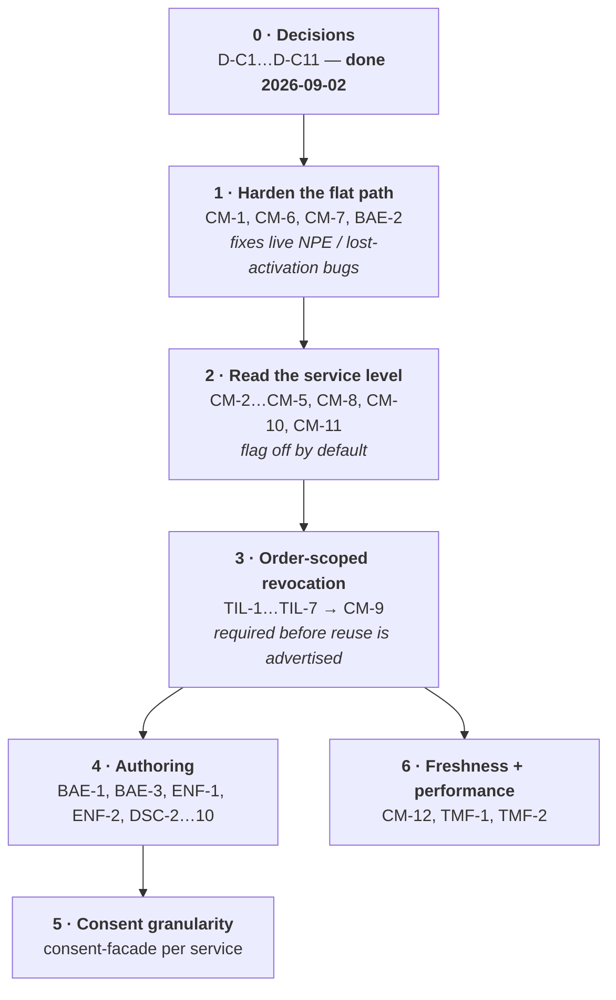
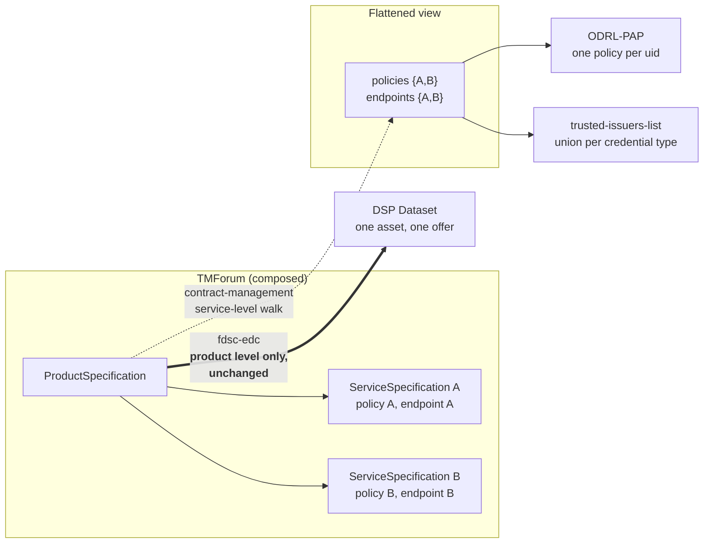

# Composed `ProductSpecification`s: policies below the product level

> Scope: what it takes for the FIWARE Data Space Connector to honour a **`ProductSpecification`
> composed of `ServiceSpecification`s** (and, in the model, `ResourceSpecification`s), where the
> policies and credential configuration live on the *composed parts* rather than on the product.
>
> Out of scope: `fdsc-edc` and every other DSP-facing projection. DSP/DCAT has no notion of a
> composed dataset, so the composition stops before them — see
> [The DSP boundary](#the-dsp-boundary).
>
> **Status (2026-09-03): phases 0-3 are implemented and released.** The decision register in
> [§4](#4-decisions-decided-2026-09-02) is decided; `ResourceSpecification` carries **no** DSC
> configuration (D-C1), the `fdsc-edc` integration characteristics stay on `ProductSpecification`
> (D-C2), and composition is a **single-provider** feature (D-C6).
>
> | Item | State |
> |---|---|
> | CM-1, CM-6, CM-7 - tolerant resolution | released, `contract-management 3.3.12` |
> | CM-2, CM-4, CM-10 - the service-level walk and its settings | released |
> | CM-5, CM-8 - union, `odrl:uid` de-duplication, single provider | released |
> | CM-9, TIL-1…TIL-7 - order-scoped grants | released, `trusted-issuers-list 0.9.1` |
> | DSC-2, DSC-7, DSC-8 - chart settings, model docs, 10.5.0 | this repository |
> | **open** | BAE-1/BAE-2 authoring UI, ENF-1/ENF-2 the `serviceSpecification` access policy, DSC-4 the integration test, CM-12 re-activation on change, consent granularity (§5.5) |
>
> Provider-facing authoring guide:
> [`doc/deployment-integration/roles/provider/COMPOSED_SPECIFICATIONS.md`](../deployment-integration/roles/provider/COMPOSED_SPECIFICATIONS.md).

The model used to be flat: one `ProductSpecification` carried
`productSpecCharacteristic[valueType="authorizationPolicy"]` and
`productSpecCharacteristic[valueType="credentialsConfiguration"]`, and `contract-management` read
exactly those two on exactly that entity
([`entities.md#productspecification`](./entities.md#productspecification)) - while TMForum, BAE and
`tm-forum-api` supported composition all along. The rest of this document is written from that
starting point, because it is the analysis the decisions were taken from; what is implemented today
is summarized in the status block above, and the flat behaviour is still what a deployment gets with
`enableSpecificationComposition` off.

## 1. What "composed" means

TMF620 offers four composition axes, and they are not interchangeable. **D-C1 admits only the
service axis** as a carrier of DSC configuration:

```mermaid
flowchart TB
    PO["ProductOffering"] -->|productSpecification| PS["<b>ProductSpecification</b><br/>productSpecCharacteristic[]"]
    PO -.->|bundledProductOffering (isBundle)| PO2["ProductOffering"]
    PS -.->|bundledProductSpecification (isBundle)| PS2["ProductSpecification"]
    PS -->|serviceSpecification[]| SS["<b>ServiceSpecification</b> (TMF633)<br/>specCharacteristic[]"]
    PS -->|resourceSpecification[]| RS["ResourceSpecification (TMF634)<br/><i>not traversed — D-C1</i>"]
    SS -->|resourceSpecification[]| RS
    SS -.->|serviceSpecRelationship| SS2["ServiceSpecification"]
    style RS stroke-dasharray: 5 5
```

| Axis | Field | Depth reachable | Status |
|---|---|---|---|
| **A · service composition** | `ProductSpecification.serviceSpecification[]` → `ServiceSpecification` | 1 | **in scope** — the feature |
| **B · resource composition** | `ProductSpecification.resourceSpecification[]` / `ServiceSpecification.resourceSpecification[]` → `ResourceSpecification` | 1–2 | **out of scope (D-C1)** — resource specs carry no policy and are not traversed |
| **C · product bundling** | `ProductSpecification.bundledProductSpecification[]` | unbounded (recursive) | covered — same resolver, currently also broken |
| **D · offering bundling** | `ProductOffering.bundledProductOffering[]` (`isBundle: true`, no `productSpecification`) | unbounded | covered — **breaks the resolver today**, see [3.2](#32-a-bundle-offering-kills-the-whole-order) |

Axis A is the feature. C and D are in scope because the same code path serves them and because a fix
that only handles A leaves two adjacent holes that look identical to a provider — D in particular is
an *active* defect today. B is excluded by decision: dropping it removes a client, a config value and
a traversal level for a level nothing consumes.

### The three characteristic shapes

The single most important mechanical fact: **the characteristic plane has a different field name and
a different value-list name on each entity.** Only the first two rows are consumed; the third is
listed because the field names are the trap, and because a future decision to revisit D-C1 lands
here.

| Entity | Characteristic list | Value list | Value field | Domain class |
|---|---|---|---|---|
| `ProductSpecification` | `productSpecCharacteristic[]` | `productSpecCharacteristicValue[]` | `value` | `product-shared-models/.../ProductSpecificationCharacteristic.java` |
| `ServiceSpecification` | **`specCharacteristic[]`** | **`characteristicValueSpecification[]`** | `value` | `service-shared-models/.../CharacteristicSpecification.java` |
| `ResourceSpecification` *(not consumed, D-C1)* | `resourceSpecCharacteristic[]` | `resourceSpecCharacteristicValue[]` | `value` | `resource-shared-models/.../ResourceSpecificationCharacteristic.java` |

All three carry `id`, `name` and `valueType`, and all three value entries carry `isDefault`, so the
DSC's discriminator conventions ([`extensions.md`](./extensions.md#2-productspeccharacteristic-registry))
transfer unchanged. Only the container names differ — which is exactly enough to make every existing
reader, every existing JSON schema and every existing payload example inapplicable.

---

## 2. What already works

Nothing on this list needs building. It is worth stating explicitly, because it shortens the work
considerably.

| Capability | Evidence |
|---|---|
| `ProductSpecification` **stores** `serviceSpecification[]` / `resourceSpecification[]` / `bundledProductSpecification[]` as NGSI-LD relationship lists | `tmforum-api: product-shared-models/src/main/java/org/fiware/tmforum/product/ProductSpecification.java` |
| Those references are **reference-validated on create and patch** — a dangling ref is rejected with `INVALID_RELATIONSHIP` | `tmforum-api: product-catalog/.../ProductSpecificationApiController.java#getCheckingMono` |
| The **Service Catalog (TMF633) and Resource Catalog (TMF634) APIs are deployed** by this chart, at `/tmf-api/serviceCatalogManagement/v4` and `/tmf-api/resourceCatalog/v4` | `charts/data-space-connector/values.yaml`, `tm-forum-api.apis[]` |
| The `@schemaLocation` **extension mechanism is entity-agnostic** — `modelBaseClass` is set once in the tmforum-api parent pom, so `ServiceSpecification` and its characteristics extend `UnknownPreservingBase` like every other VO | `tmforum-api: pom.xml`, `common/.../mapping/ValidatingDeserializer.java` |
| **Reverse lookup works**: `GET /productSpecification?serviceSpecification.id=<urn>` translates to an NGSI-LD relationship query | `tmforum-api: common/.../querying/QueryParser.java#isRelationship` / `#getQueryPart`; already used by `business-ecosystem-logic-proxy: controllers/tmf-apis/serviceCatalog.js#getServiceSpecs` |
| **BAE already proxies and governs** both APIs: ownership filtering, `relatedParty` injection, name/description validation, lifecycle transitions, and a retire-guard that refuses to retire a service spec still referenced by a live product spec | `business-ecosystem-logic-proxy: controllers/tmf-apis/serviceCatalog.js`, `controllers/tmf-apis/resource.js`, `lib/tmfUtils.js#attachPartySpec` |
| **BAE already enforces composition lifecycle**: a `ProductSpecification` may only go `Launched` when every referenced service and resource spec is `Launched` | `business-ecosystem-logic-proxy: controllers/tmf-apis/catalog.js:682-722` |
| The **service-catalog client is already generated** into `contract-management` and the HTTP service is already configured — it is simply unused by any Java code | `contract-management: pom.xml:504-519`, `src/main/resources/application.yaml` (`micronaut.http.services.service-catalog`) |
| The **chart already wires that URL** for contract-management, in both the umbrella values and the local k3s profile | `charts/data-space-connector/values.yaml` (`contract-management.services.service-catalog`), `k3s/provider.yaml` |
| The **TIL evaluates several credential configs of the same type as an OR** — so a union merge is meaningful rather than a conflict | `VCVerifier: verifier/trustedissuer.go#verifyForType` ("satisfied if at least one credential config matches") |

So the platform is ready and the authoring path is half ready. The gap is entirely in the
**consumers** of the model and in the **authoring UI**.

---

## 3. What breaks today

All references are to `contract-management` (branch `update-oid4vc`), which is the only component in
scope that reads policies and credential configuration.

### 3.1 The resolvers see only the product's own characteristics

`PolicyResolver.getAuthorizationPolicyFromOffer` and
`CredentialsConfigResolver.getCredentialsConfigFromOffer` walk
`ProductOffering → productSpecification → productSpecCharacteristic[]` and stop there:

```java
// PolicyResolver.java
.map(ProductOfferingVO::getProductSpecification)
.map(ProductSpecificationRefVO::getId)
.flatMap(specId -> productSpecificationApiClient.retrieveProductSpecification(specId, null))
.map(HttpResponse::body)
.flatMap(psvo -> { List<Map<String, Object>> policies =
        getAuthorizationPolicyFromPSC(psvo.getProductSpecCharacteristic()); … });
```

A composed specification therefore activates **nothing** from its parts: no ODRL-PAP policy, no
trusted-issuer entry. The order completes, the customer is charged, and no access is granted.

### 3.2 A bundle offering kills the whole order

`getProductSpecification()` is `null` on a bundle offering (`isBundle: true`, no
`productSpecification` — BAE explicitly requires that shape). `Mono.map` **rejects a null mapping
result**: verified against Reactor 3.7.7, it signals
`NullPointerException: The mapper … returned a null value.` rather than completing empty. That error
propagates through the surrounding `Mono.zip`, so **the whole order fails** — every other item in the
same order loses its activation too, the listener answers 5xx, and `tm-forum-api` redelivers the
notification.

The neighbouring case has the opposite failure shape: an item that legitimately contributes *no*
configuration yields an empty `Mono`, and `Mono.zip` with one empty element **completes empty**
(also verified), which the listener turns into a 404 — and again a redelivery loop. The code already
carries a comment about exactly that, one layer up:

```java
// PapProductOrderHandler.createPolicy
// An order without a local policy is not a failure - but zipping an empty
// list completes empty, the listener then answers 404 and the TM Forum API
// keeps redelivering the notification, re-running every order handler.
```

Any aggregation added for composition must therefore be **null-safe and empty-safe per node and per
level**, or a single part without characteristics turns into an infinite notification-redelivery
loop.

### 3.3 A composed specification usually has no characteristics at all — and that NPEs

`getAuthorizationPolicyFromPSC(pscList)` calls `pscList.stream()` with no null guard. A product
specification that delegates everything to its service specs has **no**
`productSpecCharacteristic` at all, so `tm-forum-api` returns the field absent → `null` → NPE →
HTTP 500 → notification redelivery.

This is the "clean" composed model failing in the hardest possible way. It is a one-line guard, but
it is on the critical path.

### 3.4 One characteristic per specification, `findFirst()`

Both resolvers take `.findFirst()` on the matching `valueType` and flatten only that entry's values
([`differences.md#10`](./differences.md#10-pagination-and-lookup-limits) notes the same).
Composition makes the aggregate list genuinely multi-valued: N service specs × their own policies.
The resolvers must switch from "first match on one entity" to "every match across the resolved
graph", which changes the shape of `PolicyConfig` / `CredentialConfig` from one-per-offering to
many-per-offering.

### 3.5 `valueType` null-tolerance stops being a theoretical bug

`psc.getValueType().equals(KEY)` NPEs on a characteristic without `valueType`
([`differences.md#8`](./differences.md#8-null-tolerance-what-crashes-on-a-well-formed-tmforum-object)).
On product specs this is survivable because the DSC's own examples always set it. Service and
resource specs will be authored by hand and by a UI that has never had to set it, so the first
composed specification in a real deployment is likely to carry a characteristic without a
`valueType` and take the whole order handler down. **Fixing #8 is a precondition, not a nicety.**

### 3.6 Provider resolution is product-scoped

Both resolvers derive the responsible contract-management from
`ProductSpecification.relatedParty[role=<general.organization.provider.role>]` and fall back to
`local`. A `ServiceSpecification` carries its own `relatedParty` (BAE writes `Seller` +
`SellerOperator` into it — `attachPartySpec`), which may name a *different* party than the product.
In the central-marketplace scenario that decides **which participant's contract-management receives
the order event**, i.e. who grants access. This needs an explicit rule (see D-C6), not a fallback.

### 3.7 Revocation has no reference counting

The whole point of composition is **reuse**: one `ServiceSpecification` referenced by many products.
That turns an existing single-writer assumption into a routine collision:

| Target | Grant | Revoke | Behaviour with a shared part |
|---|---|---|---|
| ODRL-PAP | `createPolicy` with uid `<odrl:uid>-<orderId>` (`PAPAdapter.ID_TEMPLATE`) | `deletePolicy` on that same composed id | **Safe** — the order id scopes it. But two parts carrying the *same* `odrl:uid` inside one order collide on one PAP id |
| trusted-issuers-list | `allowIssuer` merges the credential configs into the issuer's set (`new HashSet<>(existing)` + new) | `denyIssuer` calls `removeCredentialsItem` for each resolved config | **Unsafe** — the entry is keyed by content, not by order. Revoking order A removes a credential entry that order B, sharing the same service spec, still requires |

`TrustedIssuersListAdapter` is where this has to be solved (reference counting, or order-scoped
entries), and it is a *pre-existing* defect that composition promotes from "unlikely" to "default".

### 3.8 Cycles and unbounded fan-out

`bundledProductSpecification` and `serviceSpecRelationship` are not cycle-checked by `tm-forum-api`
— only *existence* is validated. A resolver that walks the graph needs a visited-set and a depth
limit, or a mutually-bundling pair of specs becomes an infinite request loop against the TMForum API
during order activation. Under D-C5 hitting either guard truncates and warns.

Fan-out also becomes a latency problem: one order item today is 2 GETs (offering + spec); under D-C1
a composed item is `2 + |serviceSpecification|` plus one per bundled product spec, all sequential per
level, inside a notification handler whose timeout drives redelivery.

---

## 4. Decisions (decided 2026-09-02)

Same convention as [`plan.md`](./plan.md#decision-register). These are **decided**, not proposed;
the *Decision* column is the ratified outcome and the ⚠ marker flags the four rows that differ from
the original recommendation. What still needs upstream sign-off is the *implementation* in the other
owners' repositories, not the model.

| # | Decision | Decided | Rationale / consequence |
|---|---|---|---|
| **D-C1** ⚠ | Which levels may carry DSC configuration | **`ProductSpecification` and `ServiceSpecification` only.** `ResourceSpecification` carries no policy and no credential configuration and is **not traversed**. Discriminator stays `valueType`, with `id` == `valueType` by convention | Narrower than proposed. Nothing in the DSC consumes a resource-level fact, so admitting the level would have bought a generated client, a config value and a traversal level for no consumer. Revisiting it later is additive: the shape is documented in [§1](#the-three-characteristic-shapes) and the resolver's level abstraction (CM-2/CM-4) is where it would plug in |
| **D-C2** ⚠ | Semantic home of each characteristic | see [the level table](#41-which-characteristic-belongs-on-which-level). **The `fdsc-edc` integration characteristics stay on `ProductSpecification`** | Changed from the proposal: `endpointUrl`, `endpointDescription`, `transferType`, `transferPath`, `upstreamAddress`, `serviceConfiguration` and `targetSpecification` exist for the `fdsc-edc` integration, and DSP has no combined product. Moving them to the service level would have produced configuration that is authored where it cannot be consumed — the worst of both models |
| **D-C3** | Merge semantics | **Union, no override.** The effective configuration of a product is the union over `{product} ∪ services ∪ resources ∪ bundled`. A part's configuration is never narrowed or replaced by another level | It is the only semantics that matches the enforcement points: the TIL ORs configs of the same type (`verifyForType`), and the PAP holds one policy per uid. **Consequence to accept explicitly: a permissive part widens a restrictive one.** Intersection is not implementable for ODRL without a policy algebra |
| **D-C4** | Merge key and duplicate handling | ODRL policies: `odrl:uid`. Credential configs: `(credentialsType, claims)` — the value already used for `HashSet` dedup in `TrustedIssuersListAdapter`. A duplicate is de-duplicated silently; **two different policies sharing one `odrl:uid` are a hard error** | `PAPAdapter` derives the PAP id from `odrl:uid` + order id, so a uid collision silently overwrites a policy. Failing the activation is better than installing one of two rules at random |
| **D-C5** ⚠ | Traversal | Depth-limited (default 2 under D-C1: product → service), cycle-guarded by a visited-set of entity ids, `bundledProductSpecification` recursion inside the same budget. Hitting the limit or a cycle **truncates**, and every truncation emits a `WARN` naming the specification, the omitted references and the limit; the limit and its effect are documented for providers | Softer than the proposed hard error, on the grounds that a truncated activation is recoverable while a failed order is not — but truncation is only acceptable *because* it is loud: an unlogged truncation is silently missing access control. The log line is part of the decision, not an implementation detail |
| **D-C6** ⚠ | Ownership of a part's configuration | **Single-provider only.** The `ProductSpecification`'s provider governs the whole aggregate: one order, one responsible contract-management. A part naming a *different* provider party makes the activation **fail loudly** — cross-provider composition is not supported and is not a deferred sub-case of this feature | Sharper than the proposal, which left the door open. Splitting one order's activation across two contract-managements has no rollback story: one side grants, the other does not, and nothing reconciles them. If resale/aggregation is wanted later it is its own design, not a relaxed check |
| **D-C7** | Activation is a snapshot | Effective configuration is resolved **at order completion** and not re-resolved when a part changes. Documented, not implied | Today the same is true of `ProductSpecification`, but reuse makes editing a shared part look like a bulk update. Optional follow-up: subscribe to the `ServiceSpecification` hub and re-activate affected orders (§6, P4) |
| **D-C8** | Revocation must be order-scoped | An order's revocation may only remove TIL credential entries that no other *active* order requires. **How to achieve that is answered in [§4.2](#42-d-c8-how-to-make-til-entries-order-scoped)**: the target is a scope field in the trusted-issuers-list, with client-side recomputation as the interim | Otherwise order A's cancellation silently de-authorises order B. See [3.7](#37-revocation-has-no-reference-counting) |
| **D-C9** | DSP projections stay flat | `fdsc-edc` keeps reading the **product level only**; under D-C2 everything it needs is authored there, so it needs no change at all. Rainbow is **out of scope entirely** — no work item, no flattening obligation | DSP/DCAT has one dataset per asset. Combined with D-C2 this makes the DSP path a non-participant in this feature rather than a consumer of a flattened view |
| **D-C10** | Empty is legal | A specification at either level with no characteristics, and a bundle offering with no `productSpecification`, contribute nothing and are **not** errors | This is the normal shape of a composed product. It is the case that NPEs and empty-zips today ([3.2](#32-a-bundle-offering-kills-the-whole-order), [3.3](#33-a-composed-specification-usually-has-no-characteristics-at-all--and-that-npes)) |
| **D-C11** | Schema hosting for the new shape | One new characteristic schema pair for the `ServiceSpecification` shape, hosted next to the existing ones, tag-pinned (`plan.md` D9) | `credentialConfigCharacteristic.json` and `policyCharacteristic.json` hard-require `productSpecCharacteristicValue` and cannot be reused for `specCharacteristic`/`characteristicValueSpecification`. **Note:** since `tm-forum-api` validates *only unknown* properties against `@schemaLocation` (`ValidatingDeserializer`, commit `a628d4e`), these schemas are documentation and linting input, not enforcement — verify against the deployed tag before relying on either behaviour |

### 4.1 Which characteristic belongs on which level

D-C2, as decided. Two rules decide the level: **who owns the thing the characteristic describes**
(an ODRL access policy protects an API, and an API is a `ServiceSpecification`), and **who consumes
it** — a characteristic only its DSP consumer reads must stay where that consumer looks.

| Characteristic | Level | Consumer | Why |
|---|---|---|---|
| `authorizationPolicy` | **ServiceSpecification** (product level still allowed for product-wide rules) | contract-management → ODRL-PAP | It protects one endpoint. This is the whole motivation for the feature |
| `purpose` (consent) | **ServiceSpecification** | consent-facade | One processing purpose per data service is finer and more truthful than one per product ([`components.md#consent-facade`](./components.md#consent-facade)) |
| `credentialsConfiguration` | **ProductSpecification**, additionally allowed per service | contract-management → trusted-issuers-list | It describes what the *customer's* issuer may assert — a commercial, product-level fact. Per-service entries are useful (different services, different roles) and safe under D-C3's union |
| `endpointUrl`, `endpointDescription`, `transferType`, `transferPath` | **ProductSpecification** — stays | fdsc-edc (DSP catalog) | One DSP `DataService`/distribution per entry, on the one dataset the DSP knows. DSP has no combined product, so a service-level entry would be authored where nothing reads it |
| `upstreamAddress`, `serviceConfiguration`, `targetSpecification` | **ProductSpecification** — stays | fdsc-transfer-extension | Transfer provisioning is keyed on the asset (`ProductSpecification.externalId`); same reasoning |
| `asset type`, `media type`, `location` | **ProductSpecification** | BAE | BAE's digital-product rule matches them by `name` on the product spec |
| anything on `ResourceSpecification` | **not used (D-C1)** | — | No DSC consumer reads the resource level |

The split is deliberate and worth saying out loud to providers: **the enforcement plane moves down to
the service, the DSP description plane stays at the product.** A provider composing a product out of
three services authors three policies and one set of endpoints.

### 4.2 D-C8: how to make TIL entries order-scoped

**Decided: scope the entries in the trusted-issuers-list itself** — the repository is under our
control, so the correct fix is available rather than merely desirable. The implementation is planned
as [§5.7](#57-trusted-issuers-list--order-scoped-credential-entries); this section records why that
shape and not another.

What the TIL looks like today (verified against `main`, `3d133f7`):

| Fact | Consequence |
|---|---|
| The management API is `GET/POST /issuer` and `GET/PUT/DELETE /issuer/{did}` (`api/trusted-issuers-list.yaml`), and `updateIssuer` **deletes every credential row and re-creates it** from the payload | Every grant and revocation is a whole-issuer read-modify-write, which is what `TrustedIssuersListAdapter` does. Besides having no scope, it is a **lost-update race**: two orders completing concurrently for the same customer can drop one of the grants |
| `Credentials` carries exactly `validFor`, `credentialsType`, `claims[]` — no id, no owner | There is nothing to hang an order id on, so entries are identified **by content**. That is precisely why `denyIssuer`'s `removeCredentialsItem` removes another order's identical entry |
| **Both** registry projections serialize that same `til.model.CredentialsVO`: v4 into `IssuerAttribute{hash, body}` (`TIRMapper.mapToAttribute`) and v5 into `Attribute{hash, body}` **plus the attribute id** (`TIRv5Mapper.computeAttributeId`, a SHA-256 over the same bytes) | A field added to `CredentialsVO` would leak order ids into a world-readable registry **and change every v5 attribute id**. The scope must therefore live on the entity and in the API's *parameters*, never in that VO |
| `issuerType`, `tao` and `rootTao` already exist on the `Credential` entity without being in the management API's `Credentials` schema | The precedent for exactly that split already exists in the code |
| The schema is Liquibase-managed (`db/migration/changelog.xml` + `v0/changelog-v0_0_*.xml`, latest tag `v0.0.5`) | The migration is one more changeset file, not a hand-written DDL step |
| The verifier ORs configs of one type, and inside a config skips a `path`-less claim whose `name` is absent from the subject (`VCVerifier: verifier/trustedissuer.go`) | This is what would make the "marker claim" hack below work — and what makes it a bad idea |

The three options that were on the table:

| Option | What it is | Verdict |
|---|---|---|
| **1 · Scope in the TIL** | A `scope` column on `Credential`, plus scope-addressed endpoints (`PUT`/`DELETE /issuer/{did}/credential?scope=<orderId>`). `CredentialsVO` and both TIR projections stay byte-identical | **Decided.** See [§5.7](#57-trusted-issuers-list--order-scoped-credential-entries). It is the only option that is correct *and* cheap at runtime, and the scope-addressed endpoints remove the lost-update race as a side effect |
| **2 · Client-side recomputation** | On revocation, contract-management recomputes the union over the customer's *other* still-active orders (`GET /productOrder?relatedParty.id=…&state=completed`, resolve each, union) and PUTs that | **Fallback only**, if the chart chain in TIL-7 is not through by the time P3 ships. Correct, but O(active orders × graph) reads per revocation and still racy |
| **3 · Marker claim** | Append a synthetic `path`-less claim carrying the order id, so content-based equality becomes per-order | **Rejected.** It works only because the verifier *skips* a claim absent from the subject — authorization correctness would depend on an undocumented skip rule, and any tightening there silently revokes everyone. It also publishes order ids in a world-readable registry |

The scoping key is the `ProductOrder` id — the same key `PAPAdapter` already uses for policies
(`<odrl:uid>-<orderId>`), which makes the two enforcement targets symmetric and a revocation
auditable across both.

---

## 5. Work items per component

Effort is a rough size for one developer familiar with the code base: **S** ≤ 1 day, **M** ≤ 1 week,
**L** > 1 week.

### 5.1 `contract-management` — the bulk of the work

| # | Change | Files | Effort |
|---|---|---|---|
| CM-1 | **Tolerant characteristic access.** Null-guard `productSpecCharacteristic` and `valueType`; accept the value as a single object *or* an array (both shapes exist in the wild — `ContractManagementIT.createProductSpecWithoutPolicy` writes a single object, the schema declares an array) | `tmforum/PolicyResolver.java`, `tmforum/CredentialsConfigResolver.java` | S |
| CM-2 | **One characteristic view over both shapes.** A small abstraction mapping `productSpecCharacteristic`/`productSpecCharacteristicValue` and `specCharacteristic`/`characteristicValueSpecification` onto one `(valueType, values[])` view, so the policy and credential extraction is written once. Keep it open for a third shape without adding one (D-C1) | new `tmforum/CharacteristicView.java` (or the shared `fdsc-tmf-model` artifact of [`plan.md` phase 2](./plan.md#phase-2--share-the-constants)) | S |
| CM-3 | **Nothing to generate.** The service-catalog client and its HTTP service already exist (`pom.xml:504`, `application.yaml`) and no resource-catalog client is needed under D-C1 — this item exists only to record that it was checked | — | — |
| CM-4 | **Specification graph resolver.** Resolve a `ProductSpecification` into `serviceSpecification[]` and, recursively, `bundledProductSpecification[]`. Visited-set, depth limit (default 2 + bundle budget), per-request memoisation, parallel fetch per level, empty-safe at every node, and a `WARN` on every truncation naming the spec, the omitted refs and the limit (D-C5, D-C10) | new `tmforum/SpecificationGraphResolver.java` | M |
| CM-5 | **Aggregate the two resolvers over the graph.** `PolicyConfig` / `CredentialConfig` become many-per-offering; de-duplicate by D-C4's merge keys; fail the activation on a duplicate `odrl:uid` with different content | `tmforum/PolicyResolver.java`, `tmforum/CredentialsConfigResolver.java` | M |
| CM-6 | **Empty-safe combination.** Replace the `Mono.zip(list)` combinators that complete empty on an empty or aborted element (`zipMonoList`, `zipMonoListPC`, `zipMonoListCC`) — a part without configuration must contribute an empty list, never abort the order | both resolvers | S |
| CM-7 | **Bundle offering handling.** An offering without `productSpecification` resolves to its `bundledProductOffering[]` (or contributes nothing), instead of aborting the order ([3.2](#32-a-bundle-offering-kills-the-whole-order)) | both resolvers | S |
| CM-8 | **Single-provider check.** Implement D-C6: the product spec's provider governs; a service spec naming a different provider party fails the activation with a message naming both parties | both resolvers, `tmforum/OrganizationResolver.java` | S |
| CM-9 | **Use the scope-addressed TIL endpoints** (TIL-3): grant becomes `PUT /issuer/{did}/credential?scope=<orderId>` with the resolved set, revocation becomes `DELETE …?scope=<orderId>`. This *removes* the read-modify-write, the `HashSet` merge, `removeCredentialsItem` and the create-or-update branch — the adapter gets smaller, not bigger. Regenerate the TIL client first (TIL-7) | `til/TrustedIssuersListAdapter.java`, `til/TilProductOrderHandler.java`, `pom.xml` (`til.api.url`) | M |
| CM-10 | **Feature flag.** `general.enableSpecificationComposition` (default **off**), so the graph walk and its latency cost can be enabled per deployment | `configuration/GeneralProperties.java` | S |
| CM-11 | **Tests.** Parameterized unit tests over the cases (product-only, service-only, mixed, bundled, cyclic, truncating, empty-at-every-level, duplicate `odrl:uid`, cross-provider rejection); extend `ContractManagementIT` with a composed specification, including a shared service spec revoked by one of two orders | `src/test/java/org/fiware/iam/tmforum/…`, `ContractManagementIT.java` | M |
| CM-12 | Optional: subscribe to the `ServiceSpecification` hub and re-activate affected orders (D-C7 follow-up) | `configuration/NotificationProperties.java`, new handler | M–L |

Two things are explicitly *not* in this list. **Rainbow** is out of scope by D-C9 — its handlers keep
reading the product level and gain nothing. **`fdsc-edc`** needs no change either, because D-C2
leaves every characteristic it consumes on the `ProductSpecification`.

### 5.2 `tm-forum-api` — nothing mandatory

| # | Change | Rationale | Effort |
|---|---|---|---|
| TMF-1 | *(optional, performance)* Reference expansion — return referenced service specs inline for a given `fields`/`depth` parameter | Removes the N+1 fan-out of CM-4 from the notification path. Needs upstream agreement, and is the same class of change as [`plan.md` phase 6](./plan.md#phase-6--self-hosted-composite-schemas) | M |
| TMF-2 | *(optional, robustness)* Cycle validation for `bundledProductSpecification` / `serviceSpecRelationship` on write | Cheaper than defending in every consumer, but consumers must defend anyway for pre-existing data | S |
| TMF-3 | *(optional)* A profile rule "a characteristic must carry `valueType`" | The [`plan.md` phase 5](./plan.md#phase-5--profile-engine-in-tm-forum-api) engine, scoped to `ProductSpecification` and `ServiceSpecification` | — |

Everything the composed model needs on the API side already exists: storage, reference validation,
hubs, relationship queries, and the `@schemaLocation` mechanism.

### 5.3 BAE — authoring

| # | Change | Where | Effort |
|---|---|---|---|
| BAE-1 | **Authoring UI for the DSC characteristics on a `ServiceSpecification`**: `authorizationPolicy` and `purpose` — and *only* those two, since D-C2 keeps the endpoint and transfer characteristics on the product spec form | `business-ecosystem-frontend` (separate repo; the built bundle in `portal/bae-frontend` already handles `specCharacteristic` + `characteristicValueSpecification`, and carries no credential/policy form yet) | M |
| BAE-2 | Set `valueType` on service-spec characteristics — the same defect as [`plan.md` phase 3](./plan.md#phase-3--fix-the-known-producers) has for product specs, and here it is load-bearing ([3.5](#35-valuetype-null-tolerance-stops-being-a-theoretical-bug)) | frontend + `controllers/tmf-apis/serviceCatalog.js` validation | S |
| BAE-3 | Verify the composed product survives the proxy end-to-end: `attachPartySpec` replaces `relatedParty` on service specs too, so a BAE-authored service spec carries `Seller`/`SellerOperator` and **no** `provider` role. Under D-C6 that is the *good* case (no conflicting provider, so the product governs) — but CM-8 must treat "no provider role on the part" as inherit, not as a mismatch | `lib/tmfUtils.js`, `controllers/tmf-apis/serviceCatalog.js` | S |
| BAE-4 | No change expected in the charging backend: it writes `Product` with a `productSpecification` reference and never reads the composition | `business-ecosystem-charging-backend` | — |

### 5.4 Enforcement and identity components

| # | Change | Where | Effort |
|---|---|---|---|
| ENF-1 | **Verify `tmf:resource` derivation** for `/tmf-api/serviceCatalogManagement/v4/serviceSpecification`. If the PDP derives the operand generically from the request path, nothing changes; if it uses an allowlist, extend it | ODRL-PAP / OPA (`wistefan/odrl-pap`) | S–M |
| ENF-2 | **Access policy for the new path** so a seller may create and read service specs through the OID4VP-protected API — the analogue of `allowProductSpec.json` | `it/src/test/resources/policies/allowServiceSpec.json`, plus whatever the deployment guides hand to operators | S |
| ENF-3 | Nothing to change at the **credentials-config-service**: the whole TMForum API is registered as one service (`tm-forum-api.registration.ccs.id: tmf-api`), so the new paths are already covered | — | — |
| ENF-4 | **trusted-issuers-list**: order-scoped credential entries — planned in detail in [§5.7](#57-trusted-issuers-list--order-scoped-credential-entries) | `trusted-issuers-list` | M |

### 5.5 `consent-facade` (deployed outside this chart)

`consent-facade` fixes granularity at **1 `ProductSpecification` = 1 `DataResource`** and reads
`productSpecCharacteristic[name="purpose"]` ([`components.md#consent-facade`](./components.md#consent-facade)).
Composition is an opportunity there rather than a problem: with D-C2 putting `purpose` on the
service level, the natural projection is **1 `ServiceSpecification` = 1 `DataResource` + 1
`SoftwareResource`(purpose)**, which is finally the granularity the consent-manager's per-resource
model wants. Until that is implemented, a composed product projects as one resource with the
product's own `purpose` (or its name) — degraded, not broken.

### 5.6 This repository

| # | Change | Where |
|---|---|---|
| DSC-1 | **No new service URL needed.** `contract-management.services.service-catalog` is already set in the umbrella values and in `k3s/provider.yaml`, and the DSP profiles inherit it; D-C1 removes the resource-catalog URL from the picture | — |
| DSC-2 | The composition feature flag from CM-10, documented helm-docs style | `charts/data-space-connector/values.yaml` |
| DSC-3 | `ServiceSpecification` hub subscription, **if** CM-12 is implemented — the entity list is hard-coded in the subchart template, so this is a `helm-charts` change, not a values change | `helm-charts/charts/contract-management/templates/configmap.yaml`, `values.yaml` |
| DSC-4 | Integration test: a composed specification bought through the marketplace, plus the shared-service-spec revocation case | `it/src/test/resources/it/local_marketplace.feature` (or a new `composed_specification.feature`), `it/src/test/java/.../StandardStepDefinitions.java` — mirror `createProductSpecWithPolicy` for service specs |
| DSC-5 | New PAP policies for the IT (ENF-2) | `it/src/test/resources/policies/` |
| DSC-6 | Authoring documentation: a composed example next to the flat one | `doc/deployment-integration/local-deployment/LOCAL.MD`, `doc/CENTRAL_MARKETPLACE.md`, `doc/deployment-integration/roles/provider/` |
| DSC-7 | Model documentation: new characteristic planes and the aggregation rules | `doc/tmforum/entities.md`, `extensions.md`, `components.md`, `lifecycles.md`, `differences.md`, and this file |
| DSC-8 | Chart version bump + release note | `charts/data-space-connector/Chart.yaml` (currently `10.4.12`), `doc/release-notes/10-x.md` |
| DSC-9 | New characteristic schemas (D-C11) for the `specCharacteristic` shape, tag-pinned — note two existing schemas still resolve from feature branches (`contract-management@policy-support`), which this work should not extend | `contract-management/schemas/`, referenced from payloads |
| DSC-10 | TIL image bump once TIL-7 is released — either through the chart chain or, for testing, by pinning `decentralizedIam.vcAuthentication.trusted-issuers-list.image.tag` | `charts/data-space-connector/values.yaml`, `Chart.yaml` |

### 5.7 `trusted-issuers-list` — order-scoped credential entries

The implementation of D-C8, option 1. File paths are relative to
[`FIWARE/trusted-issuers-list`](https://github.com/FIWARE/trusted-issuers-list), verified against
`main` at `3d133f7` (TIR v5 API, Liquibase migrations, `issuerType`/`tao`/`rootTao` on the entity).

**The shape, in one paragraph.** `Credential` gains a nullable `scope` column holding the
`ProductOrder` id. Grants and revocations are addressed *by scope* through two new endpoints, so the
scope never appears in a request or response **body** — which is what keeps `til.model.CredentialsVO`,
the v4 attribute bodies and hashes, and the v5 attribute ids byte-identical to today. A `null` scope
marks a manually managed entry that automated revocation must never touch.

| # | Change | Files | Effort |
|---|---|---|---|
| TIL-1 | **Entity + migration.** `@Nullable private String scope;` on `Credential`, and a new `changelog-v0_0_6.xml` mirroring `v0_0_5`: `addColumn` `scope VARCHAR(255)` nullable, an index on `(trusted_issuer_id, scope)` for the delete path, and `tagDatabase v0.0.6`. `includeAll path="v0"` picks the file up with no changelog edit | `repository/Credential.java`, `resources/db/migration/v0/changelog-v0_0_6.xml` | S |
| TIL-2 | **Repository queries.** `findByTrustedIssuerDidAndScope` and `deleteByTrustedIssuerDidAndScope` on the **base** `CredentialRepository` interface, so all three dialect repositories inherit them (an explicit `@Query` if the derived name does not resolve the association id) | `repository/CredentialRepository.java` | S |
| TIL-3 | **API.** Two paths in the spec, both taking `scope` as a **required query parameter** and reusing the *unchanged* `Credentials` schema: `PUT /issuer/{did}/credential?scope=<id>` with an array body — "these are the credentials granted by this scope", replace-by-scope, and therefore **idempotent under notification redelivery** — and `DELETE /issuer/{did}/credential?scope=<id>`. Optionally `GET /issuer/{did}/credential?scope=<id>` for auditing. No new object schema, so nothing the registry serializes changes | `api/trusted-issuers-list.yaml` | S |
| TIL-4 | **Controller.** Implement both on `TrustedIssuersListController` (`@Transactional`, as `updateIssuer` already is). `PUT` **upserts the issuer** when the DID is unknown — that removes contract-management's create-or-update branch and its race. `DELETE` removes only the rows for that `(did, scope)` and **leaves the issuer row in place even when empty**, which is behaviourally identical to today's "PUT an empty credential list" and avoids deleting an issuer someone else manages. `PUT /issuer/{did}` keeps its destructive replace-everything semantics as an admin operation | `rest/TrustedIssuersListController.java` | M |
| TIL-5 | **Keep the registry projections invariant, and de-duplicate them.** Two orders granting an identical configuration now produce two rows, which the v4 listing would show as two identical attributes and v5 as two attributes with the *same* id (breaking `findCredentialByAttributeId` and the attribute count). Both projections must therefore de-duplicate by hash / attribute id | `TIRMapper.java` (`map(TrustedIssuer)`), `rest/TrustedIssuerRegistryV5Controller.java` (attribute listing + count) | M |
| TIL-6 | **Tests.** Scope round-trip; `PUT` twice with the same scope is idempotent; two scopes with an identical configuration expose **one** attribute in v4 and v5; deleting one scope leaves the other's grant intact; a `null`-scope row survives every scoped delete; `PUT /issuer/{did}` still replaces everything. Plus a **regression test asserting the v4 `body`/`hash` and the v5 attribute id are unchanged when a scope is set** — that assertion is the guard rail for the whole design | `rest/TrustedIssuersListControllerTest.java`, `rest/TrustedIssuerRegistryControllerTest.java`, `rest/TrustedIssuerRegistryV5ControllerTest.java` | M |
| TIL-7 | **Release and roll out.** Tag the TIL, publish the image, then walk the chart chain: `helm-charts/charts/trusted-issuers-list` `appVersion` (currently **0.8.1**) → `vc-authentication` dependency (currently `trusted-issuers-list 0.18.4`) → `decentralized-iam` (currently `vc-authentication 1.3.5`) → this chart's `Chart.yaml` (`decentralized-iam 2.1.19`). Contract-management's client is generated from `https://raw.githubusercontent.com/FIWARE/trusted-issuers-list/main/api/…` (`pom.xml` `til.api.url`), so the spec must be **on `main` before** CM-9 builds — or pin the URL to a tag | `trusted-issuers-list`, `helm-charts`, `contract-management/pom.xml`, this chart | M |

**Why replace-by-scope rather than append.** Contract-management always resolves the *complete* set
of credential configurations for an order, and TMForum notifications are redelivered on any non-2xx
answer ([3.2](#32-a-bundle-offering-kills-the-whole-order)). A `PUT` that replaces the set for one
scope is idempotent under redelivery by construction; a `POST` that appends would accumulate
duplicate rows on every retry and rely on TIL-5's de-duplication to stay invisible.

**What this does not fix.** Cross-participant revocation in the central-marketplace scenario still
goes through a *remote* contract-management, which does its own grant against its own TIL — the scope
is local to each participant. That is correct (each participant owns its own trust decisions) but it
means an order id appears as a scope in more than one TIL, and nothing reconciles them.

---

## 6. Suggested sequence



Phase 1 is worth doing on its own merit: it removes three ways a *flat* order can already fail
(NPE on a characteristic-less spec, a bundle offering aborting an entire order, and the
empty-zip 404 redelivery loop). Phase 2 without phase 3 is a security regression waiting to
happen — a shared service spec is only safe once revocation is order-scoped, so **do not advertise
reuse before P3 ships**.

Phase 3 has its own internal order, and TIL-7's chart chain is the long pole: the TIL spec has to be
on `main` before contract-management regenerates its client, and the image has to reach the cluster
through four charts before an integration test can prove any of it. Start TIL-1…TIL-6 in parallel
with phase 2 rather than after it, and keep option 2 of
[§4.2](#42-d-c8-how-to-make-til-entries-order-scoped) as the fallback **only** if the chain is not
through when phase 2 lands.

---

## 7. Risks and open questions

| Risk | Detail |
|---|---|
| **Union semantics widen access** | Under D-C3 a permissive part relaxes a restrictive one, and the TIL's OR evaluation makes that the enforcement behaviour, not just the model's. A provider composing a "small" product out of a service spec that another "full" product also uses gets the full product's credential latitude. This must be stated in the authoring documentation, or providers will assume intersection |
| **Silent non-activation is the current failure mode** | Today a composed spec activates nothing and the order still completes. That is worse than an error: the customer is charged and access is denied. Consider rejecting an order whose resolved configuration is empty *while* a part carries configuration the resolver refused to read |
| **Latency inside a notification handler** | CM-4 adds one read per service spec per order item. The handler's response drives redelivery, so a slow walk turns into duplicate activations. Needs a measured budget, per-request memoisation, and ideally TMF-1 |
| **Truncation is now a normal outcome** | D-C5 chose truncate-and-warn over hard failure, so an over-deep or cyclic composition yields a *partial* grant. The `WARN` is the only signal — it must name the specification, the omitted references and the limit, and operators need to know it exists. Consider a metric alongside the log so truncations are alertable, not just greppable |
| **Cycles in pre-existing data** | `tm-forum-api` does not prevent them today, so the resolver must defend even if TMF-2 lands |
| **Duplicate `odrl:uid` across parts** | `PAPAdapter` composes the PAP id as `<odrl:uid>-<orderId>`; two parts sharing a uid silently overwrite each other. D-C4 makes this a hard error — verify how the PAP itself answers a `POST` for an existing uid (overwrite vs. 409) before relying on either | 
| **`@schemaLocation` enforcement is version-dependent** | Since `a628d4e` only *unknown* properties are validated against the linked schema, so `policyCharacteristic.json`'s `valueType` const no longer rejects a wrong discriminator. Confirm against the deployed `tm-forum-api` (chart `0.17.15`, appVersion `1.18.0`) before treating the schemas as a guard rail |
| **The TIL rollout crosses four charts** | TIL-7 walks `trusted-issuers-list` → `vc-authentication` → `decentralized-iam` → this chart, and contract-management's client is generated from the spec on `main`. Two failure shapes: CM-9 built against an unmerged spec, and a cluster running an image older than the client expects (the scoped endpoints 404, and revocation silently does nothing). Pin `decentralizedIam.vcAuthentication.trusted-issuers-list.image.tag` for testing, and have CM-9 fail loudly on a 404 from the scoped endpoints rather than falling back to the whole-issuer PUT |
| **`PUT /issuer/{did}` still replaces everything** | The whole-issuer endpoint keeps its destructive semantics (TIL-4), and it does not know about scopes: one admin PUT, or one component still using the old adapter, wipes every scoped grant for that issuer. Worth a warning in the API description, and a reason to land CM-9 in the same release rather than leaving two writers with different models |
| **Cross-provider composition is rejected, not queued** | D-C6 makes it unsupported. A product composed of another participant's service spec is a genuine data-space use case (resale, aggregation), and the failure must be legible: the message has to name both parties, and the authoring docs have to say it upfront — otherwise it reads as a bug |
| **Two authoring slots, now two levels on one side** | [`differences.md#6`](./differences.md#6-odrl-one-rule-two-authoring-slots-two-encodings) already notes that the PAP policy and the DSP offering term are authored twice and never reconciled. D-C2 widens that gap on purpose: the PAP policy may now live on the service spec while the DSP offering term stays on the offering, so the same logical rule is authored at two different *levels* as well as in two slots. Worth a lint rule (`plan.md` phase 1) rather than a code change |

## The DSP boundary

`fdsc-edc` projects the catalog into DSP/DCAT, where a `Dataset` has one asset id, one policy set and
a flat list of distributions. Under D-C2 and D-C9 the boundary is drawn so that **the DSP path never
sees a composition at all**: everything it reads stays on the `ProductSpecification`.



Two consequences of drawing it there:

* **`fdsc-edc` needs no change.** It keeps reading `externalId`, the endpoint characteristics and the
  transfer characteristics off the `ProductSpecification`, which D-C2 keeps in place. Rainbow is out
  of scope entirely (D-C9).
* **The composition is invisible to DSP consumers**, and that is accepted. A DSP consumer negotiates
  one dataset under one offer; the fact that access is enforced by three service-level policies is a
  provider-side implementation detail. The description plane and the enforcement plane deliberately
  disagree about granularity — document that for providers rather than trying to reconcile it.

## Explicitly not covered

* **`fdsc-edc` and the DSP model** — excluded by scope, and unaffected by D-C2. See
  [The DSP boundary](#the-dsp-boundary). **Rainbow** is out of scope entirely (D-C9).
* **Configuration on `ResourceSpecification`** — excluded by D-C1. The field shapes are recorded in
  [§1](#the-three-characteristic-shapes) so the decision can be revisited additively.
* **Cross-provider composition** — excluded by D-C6, and rejected at activation rather than deferred.
* **Service and resource *inventory*** (TMF638 / TMF639): instantiating a `Service` per order.
  The DSC has no service-instance concept today; entitlement is `Product` ([`entities.md#product`](./entities.md#product)).
* **Service ordering** (TMF641) as a second activation trigger. `ProductOrder.state == completed`
  stays the single trigger.
* **Characteristic *relationships*** (`charSpecRelationship`, `resourceSpecCharRelationship`) as a
  configuration mechanism. They are validated by `tm-forum-api` but carry no DSC semantics, and
  giving them any would be a fourth extension plane.
* **A policy algebra.** D-C3 chooses union precisely to avoid needing one; intersecting two ODRL
  policies is a research problem, not a work item.
